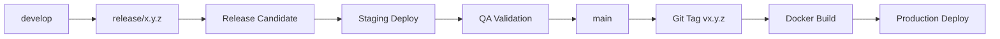

# Meter Verse — GitHub Repository Optimization Guide

**Repository:** [https://github.com/Kirllos360/Meter](https://github.com/Kirllos360/Meter)
**Description:** Utility Metering & Billing Platform — Enterprise reporting, billing engine, meter lifecycle management, and multi-tenant area isolation for utility providers. Built with NestJS, Next.js 16, JasperReports 7.0.1, PostgreSQL 16, and RabbitMQ.

**Topics:** `utility-metering`, `billing-platform`, `nestjs`, `nextjs`, `jasperreports`, `postgresql`, `rabbitmq`, `java21`, `spring-boot`, `prisma-orm`, `rfc-arabic`, `pdf-generation`, `enterprise`, `multi-tenant`, `area-isolation`

---

## 1. Repository Setup

### 1.1 Description

```
Short:  Utility Metering & Billing Platform — Enterprise reporting, billing, meter lifecycle
Long:   Meter Verse is a comprehensive utility management platform serving 15+ residential areas.
        Features include multi-schema tenant isolation, JasperReports 7.0.1 PDF/Excel generation,
        RabbitMQ bulk processing, Arabic/RTL support, 16 RBAC profiles, and 3-plan failover architecture.
```

### 1.2 Topics

Add these topics to the repository for discoverability:

```
utility-metering, billing-platform, nestjs, nextjs, jasperreports,
postgresql, rabbitmq, java21, spring-boot, prisma-orm, rfc-arabic,
pdf-generation, enterprise, multi-tenant, area-isolation, metering,
invoice-generation, arabic-rtl, docker, microservices
```

---

## 2. Branch Protection Rules

### 2.1 Main Branch (`main`)

```yaml
# Required settings in GitHub > Settings > Branches > Add rule
Branch name pattern: main

✅ Require pull request reviews before merging
  - Required approving reviews: 2
  - Dismiss stale reviews when new commits are pushed
  - Require review from Code Owners

✅ Require status checks before merging
  - Require branches to be up-to-date
  - Status checks:
    - build (GitHub Actions)
    - test (GitHub Actions)
    - lint (GitHub Actions)
    - verify-reporting (GitHub Actions)
    - codeql (GitHub Actions)

✅ Require conversation resolution before merging

✅ Include administrators
  - Apply restrictions to admins too

✅ Allow force pushes
  - Who can force push: Restrict to Tech Leads

✅ Allow deletions
  - Who can delete: Restrict to Tech Leads
```

### 2.2 Development Branches (`develop`, `staging`)

```yaml
Branch name pattern: develop

✅ Require pull request reviews before merging
  - Required approving reviews: 1
  - Dismiss stale reviews when new commits are pushed

✅ Require status checks before merging
  - Status checks:
    - build
    - test
    - lint
```

### 2.3 Release Branches (`release/*`)

```yaml
Branch name pattern: release/*

✅ Require pull request reviews before merging
  - Required approving reviews: 2
  - Must include Code Owners

✅ Require status checks before merging
  - All status checks required
```

### 2.4 Feature Branches (`feature/*`, `bugfix/*`)

```yaml
Branch name pattern: feature/*, bugfix/*

✅ Require pull request reviews before merging
  - Required approving reviews: 1
```

---

## 3. Required Status Checks

### 3.1 CI Pipeline (`.github/workflows/ci.yml`)

| Check Name | Description | Required For |
|------------|-------------|--------------|
| `build` | Build backend + frontend + reporting engine | main, develop, release/* |
| `test` | Run all test suites (293 backend + 168 reporting) | main, develop, release/* |
| `lint` | ESLint, Prettier, Checkstyle, PMD | main, develop, release/* |
| `verify-reporting` | JRXML compilation + PDF validation | main, release/* |
| `codeql` | CodeQL security analysis | main |
| `dependabot` | Dependency review (automatic) | all branches |

### 3.2 Status Check Configuration

```yaml
# .github/workflows/ci.yml — Ensure these job names match:
jobs:
  build:
    name: build
  test:
    name: test
  lint:
    name: lint
  verify-reporting:
    name: verify-reporting
  codeql:
    name: codeql
```

---

## 4. CODEOWNERS

File: `.github/CODEOWNERS`

```codeowners
# Reporting engine
/reporting/ @meterverse/reporting-team
/jasperreports-fonts-extension/ @meterverse/reporting-team
/templates/ @meterverse/reporting-team

# Backend (NestJS)
/backend/src/invoices/ @meterverse/backend-team
/backend/src/billing/ @meterverse/billing-team
/backend/src/ @meterverse/backend-team

# Frontend (Next.js)
/Frontend/src/components/billing/ @meterverse/frontend-team
/Frontend/src/ @meterverse/frontend-team

# Documentation
/docs/ @meterverse/docs-team
/draft/ @meterverse/architects

# Root-level markdown
/*.md @meterverse/leads

# CI/CD
/.github/ @meterverse/devops-team
/ci-cd/ @meterverse/devops-team

# Security
/SECURITY.md @meterverse/security-team
```

---

## 5. Issue & PR Templates

Templates are located at `.github/ISSUE_TEMPLATE/` and `.github/PULL_REQUEST_TEMPLATE/`.

### 5.1 Issue Templates

| Template | File | Purpose |
|----------|------|---------|
| Bug Report | `.github/ISSUE_TEMPLATE/bug-report.yml` | Report a bug |
| Feature Request | `.github/ISSUE_TEMPLATE/feature-request.yml` | Propose new feature |
| Migration Task | `.github/ISSUE_TEMPLATE/migration-task.yml` | Track migration progress |
| Security Report | `.github/ISSUE_TEMPLATE/security-report.yml` | Report vulnerability (private) |
| Performance Issue | `.github/ISSUE_TEMPLATE/performance-issue.yml` | Report performance degradation |

### 5.2 PR Template

File: `.github/PULL_REQUEST_TEMPLATE/pull-request.md`

```markdown
## Description
Brief description of the changes.

## Related Issue
Fixes #(issue)

## Type of Change
- [ ] Bug fix
- [ ] New feature
- [ ] Migration step
- [ ] Documentation update
- [ ] Performance improvement
- [ ] Security fix

## Testing
- [ ] Unit tests pass
- [ ] Integration tests pass
- [ ] Playwright visual tests pass
- [ ] JRXML compilation verified
- [ ] Manual testing completed

## Migration Impact
- [ ] Database migration required
- [ ] Configuration change required
- [ ] API contract change
- [ ] Template change

## Checklist
- [ ] Code follows project conventions
- [ ] Self-review completed
- [ ] Documentation updated
- [ ] No new warnings introduced
- [ ] Security implications considered
```

---

## 6. Release Workflow

### 6.1 Release Process



### 6.2 Release Commands

```bash
# 1. Create release branch from develop
git checkout develop
git pull
git checkout -b release/2.0.0

# 2. Update version
# In pom.xml, package.json, application.yml
mvn versions:set -DnewVersion=2.0.0

# 3. Update CHANGELOG.md
# Add entry for v2.0.0

# 4. Create pull request to main
gh pr create --base main --head release/2.0.0 --title "Release v2.0.0"

# 5. After merge, tag
git checkout main
git pull
git tag v2.0.0
git push origin v2.0.0

# 6. GitHub Action builds and deploys
```

### 6.3 Release Checklist

| # | Item | Owner |
|---|------|-------|
| 1 | CHANGELOG.md updated | Tech Lead |
| 2 | Version bumped in all files | Tech Lead |
| 3 | All tests pass on CI | QA |
| 4 | Staging deployment validated | DevOps |
| 5 | API documentation synced | Reporting Team |
| 6 | DB migrations verified | DBA |
| 7 | Rollback plan reviewed | DevOps |
| 8 | Stakeholders notified | Product Owner |
| 9 | Release tag created | DevOps |
| 10 | Production deploy monitored | On-Call |

---

## 7. Semantic Versioning Strategy

### 7.1 Version Format

```
MAJOR.MINOR.PATCH[-PRERELEASE]
   │      │      │         │
   │      │      │         └── Pre-release (alpha, beta, rc.1)
   │      │      └──────────── Patch (backward-compatible bug fix)
   │      └─────────────────── Minor (backward-compatible feature)
   └────────────────────────── Major (breaking change)
```

### 7.2 Current & Planned Versions

| Version | Date | Description |
|---------|------|-------------|
| v1.0.0 | 2026-06-25 | Legacy NestJS reporting (current) |
| v2.0.0 | 2026-Q3 | Java Spring Boot + JasperReports migration |
| v2.1.0 | 2026-Q4 | Advanced report scheduling + email delivery |
| v2.2.0 | 2027-Q1 | Real-time dashboards + WebSocket reporting |
| v3.0.0 | 2027-Q2 | Breaking: Multi-region support + new template engine |

### 7.3 Version Bumping Rules

| Change Type | Version Bump | Examples |
|-------------|--------------|----------|
| Breaking API change | MAJOR | Changed endpoint signatures, removed endpoints |
| Breaking DB schema | MAJOR | Removed columns, non-nullable additions |
| New feature, backward-compatible | MINOR | New endpoints, new exporters, new templates |
| Bug fix, backward-compatible | PATCH | JRXML rendering fix, security hotfix |
| Pre-release | PRERELEASE | v2.0.0-rc.1, v2.0.0-beta.1 |

---

## 8. Changelog Maintenance

### 8.1 Location

`CHANGELOG.md` at repository root.

### 8.2 Format

```markdown
## [v2.0.0] - 2026-09-15

### Added
- JasperReports 7.0.1 engine with 5 export formats (PDF, XLSX, DOCX, HTML, CSV)
- Bulk generation via RabbitMQ queue with 5 concurrent consumers
- PDF security module: AES-256 encryption, digital signatures, watermarking
- Excel engine with JXLS template-based XLSX generation
- Template versioning with Git-based history and rollback
- Arabic/RTL rendering with ICU4J and custom font extension
- A4 Landscape and Portfolio page orientation support
- 60 JRXML templates (58 migrated + 2 new)
- 168 unit tests, 38 integration tests, 20 Playwright visual tests

### Changed
- PDF generation: Puppeteer HTML→PDF → JasperReports native PDF
- Report API: NestJS endpoints → Spring Boot REST API
- Template storage: File system → Git-versioned database

### Deprecated
- Legacy Puppeteer-based PDF generation (removed in v3.0.0)
- Legacy EJS HTML templates (replaced by JRXML)

### Removed
- Single-threaded report generation (replaced by bulk queue)

### Fixed
- Arabic text rendering in PDF outputs
- A4 page dimension accuracy
- Concurrent generation race conditions
- PDF metadata encoding for Arabic filenames

### Security
- PDF encryption with AES-256 and configurable permissions
- Digital signatures with SHA-256 and PKCS12 keystores
- Watermarking for draft and confidential documents
- Audit logging for all PDF security operations

### Migration Notes
- v2.0.0 requires Java 21 runtime and PostgreSQL 16
- Existing templates in `templates/` are migrated automatically
- Set `PDF_OWNER_PASSWORD` and `PDF_KEYSTORE_PASSWORD` in production
- Review API changes in `docs/api/reporting-v2-migration.md`
```

---

## 9. Security Policy

File: `SECURITY.md` at repository root.

The security policy covers:

| Section | Content |
|---------|---------|
| Supported Versions | Which versions receive security updates |
| Reporting a Vulnerability | Private disclosure via GitHub Security Advisory |
| Disclosure Policy | 90-day coordinated disclosure timeline |
| Security Updates | How updates are communicated |
| Known Security Gaps | Documented in `documentation/text/security-gap-analysis.txt` |
| Security Controls | Listed in `README.md` Security Status section |

### Current Security Posture

| Control | Status | Notes |
|---------|--------|-------|
| JWT Authentication | ✅ Active | Passport JWT, 1h expiry |
| RBAC (7 roles) | ✅ Active | Reflector-based guard |
| Business Audit Log | ✅ Active | Append-only mutation logging |
| Correlation IDs | ✅ Active | All requests traceable |
| Rate Limiting | ✅ Active | 100 req/min global |
| PDF Encryption | ✅ Active | AES-256 in reporting engine v2 |
| Digital Signatures | ✅ Active | SHA-256 PKCS12 |
| CSRF Protection | ✅ Active | Token-based |
| Helmet Headers | ✅ Active | 15+ HTTP security headers |
| SAST Scanning | ✅ Active | Semgrep + CodeQL in CI |

---

## 10. Contributing Guidelines

File: `CONTRIBUTING.md` at repository root (to be created).

Guidelines should cover:

1. **Code of Conduct** — Link to Contributor Covenant
2. **Getting Started**
   - Prerequisites (Node.js 20+, Bun, Java 21, Docker)
   - Local setup (`backend/README.md`, `Frontend/FRONTEND_BUILD.md`)
   - Reporting engine setup (`reporting-engine/INSTALLATION.md`)
3. **Development Workflow**
   - Branch naming: `feature/TXXX-short-description`
   - Commit style: `TXXX: action(module): description`
   - PR process: at least 1 review, all checks pass
4. **Testing Requirements**
   - Backend: `npm test` (all pass)
   - Frontend: `bun run build` + `bun run lint`
   - Reporting: `mvn test` (all pass)
   - JRXML: Compile check via Maven
5. **Code Style**
   - NestJS: ESLint + Prettier configs in `backend/`
   - Frontend: ESLint config in `Frontend/eslint.config.mjs`
   - Java: Checkstyle + PMD configs in `reporting-engine/`
6. **Documentation**
   - Public API changes must update OpenAPI spec
   - Architecture decisions in `docs/` or `draft/`
   - Migration steps in `specs/004-migration-plans/`
7. **Review Checklist**
   - Code compiles and tests pass
   - No new security warnings
   - Documentation updated
   - CHANGELOG updated for notable changes
8. **Getting Help**
   - Slack channel: #engineering
   - GitHub Discussions
   - Tech Lead: @tech-lead

---

*End of GitHub Optimization Guide*
