# Meter Verse Architecture & Dependency Graph

```mermaid
graph TD
    subgraph "Frontend (Next.js 16)"
        UI[AppShell / UI Components]
        PAGES[Pages: Billing, Meters, Customers, etc.]
        HOOKS[Custom Hooks: useInvoices, usePayments]
        API[API Client Layer]
    end

    subgraph "Backend (NestJS)"
        CONTROLLERS[35 Controllers]
        SERVICES[62 Services]
        GUARDS[Auth: JWT, RBAC, Area, Project]
        MODULES[30+ Feature Modules]
        PRISMA[Prisma ORM]
    end

    subgraph "Invoice Pipeline"
        INV_CTRL[InvoicesController]
        INV_TEMPLATE[InvoiceTemplateService]
        INV_RENDERER[InvoiceRendererService]
        INV_HTML[HTML Templates + CSS]
        PUPPETEER[Puppeteer PDF Generation]
    end

    subgraph "Billing Pipeline"
        BILL_CTRL[BillingController]
        CALC_ENG[CalculationEngineService]
        TARIFF_ENG[TariffEngineService]
        LEDGER[LedgerService]
    end

    subgraph "Payment Pipeline"
        PAY_CTRL[PaymentsController]
        PAY_SVC[PaymentsService]
        RECEIPT[PaymentReceiptService]
    end

    subgraph "Reporting Pipeline"
        REP_CTRL[ReportsController]
        REP_SVC[ReportsService]
        REP_GEN[ReportGenerationService]
    end

    subgraph "External Systems"
        SYMBIOT[Symbiot SQL Server]
        POSTGRES[PostgreSQL meter_pulse]
        SBILL[sBill Reference System]
    end

    subgraph "New Reporting Engine"
        JAVA_RE[Spring Boot / Java 21]
        JASPER[JasperReports 7.0.1]
        JXLS[JXLS Excel Engine]
        ITEXT[iText 9 PDF Security]
        RABBITMQ[RabbitMQ Bulk Queue]
    end

    %% Frontend -> Backend
    UI --> API
    API --> CONTROLLERS
    HOOKS --> API

    %% Backend Internal
    CONTROLLERS --> SERVICES
    SERVICES --> GUARDS
    SERVICES --> PRISMA
    PRISMA --> POSTGRES

    %% Invoice Pipeline
    INV_CTRL --> INV_TEMPLATE
    INV_CTRL --> INV_RENDERER
    INV_TEMPLATE --> INV_HTML
    INV_RENDERER --> PUPPETEER
    INV_TEMPLATE --> BILL_CTRL

    %% Billing Pipeline
    BILL_CTRL --> CALC_ENG
    BILL_CTRL --> TARIFF_ENG
    CALC_ENG --> LEDGER
    TARIFF_ENG --> PRISMA

    %% Payment Pipeline
    PAY_CTRL --> PAY_SVC
    PAY_SVC --> RECEIPT
    PAY_SVC --> LEDGER

    %% Reporting
    REP_CTRL --> REP_SVC
    REP_SVC --> REP_GEN
    REP_GEN --> PRISMA

    %% Sync
    SYNC_CTRL[SyncController] --> SYNC_ORCH[SyncOrchestratorService]
    SYNC_ORCH --> SYMBIOT
    SYNC_ORCH --> POSTGRES

    %% New Engine Integration
    JAVA_RE --> JASPER
    JAVA_RE --> JXLS
    JAVA_RE --> ITEXT
    JAVA_RE --> RABBITMQ
    JASPER --> POSTGRES
```

## Module Dependency Matrix

| Module | Depends On | Used By |
|--------|-----------|---------|
| Auth | Prisma, JWT | All Controllers |
| Invoices | Billing, Payments, Template Service | Frontend Billing Pages |
| Billing | Tariffs, Ledger, Prisma | Invoices, Payments |
| Payments | Ledger, Invoices, Prisma | Frontend Payments Pages |
| Meters | Prisma, Projects | Sync, Readings |
| Readings | Meters, Prisma | Water Balance, Solar |
| Sync | Symbiot, Meters, Projects | Admin Portal |
| Reports | Prisma, Invoices | Frontend Reports Page |
| Template Mgr | PostgreSQL | New Reporting Engine |
| Report Engine | JasperReports, PostgreSQL | All Reporting |
| Excel Engine | JXLS, POI | Excel Import/Export |
| PDF Security | iText, BouncyCastle | Report Export |
| Bulk Generation | RabbitMQ, All Above | Mass Invoice Generation |

## Legacy vs New Architecture

| Component | Legacy (NestJS) | New (Spring Boot) |
|-----------|----------------|-------------------|
| HTML Templates | Puppeteer HTML→PDF | JasperReports JRXML |
| Invoice Generation | invoice-template.service.ts | JasperReports + JXLS |
| PDF Export | Puppeteer/Chrome | JasperReports PDF |
| Excel Export | None | JXLS + Apache POI |
| PDF Security | None | iText 9 + BouncyCastle |
| Bulk Generation | None | RabbitMQ + Streaming |
| Template Versioning | None | Template Manager Module |
| Arabic Fonts | CSS @font-face | Identity-H PDF Encoding |
| RTL Support | dir="rtl" CSS | ICU4J + Jasper RTL |
