# v2.0.0 — Data Model

## Entity-Relationship Diagram

```mermaid
erDiagram
  %% Core Database
  User ||--o{ RoleAssignment : has
  Role ||--o{ RoleAssignment : has
  Role ||--o{ RolePermission : grants
  Permission ||--o{ RolePermission : assigned
  User ||--o{ AuditLog : creates
  Area ||--o{ Project : contains
  Project ||--o{ Building : contains
  Building ||--o{ Floor : contains
  Floor ||--o{ Unit : contains
  User ||--o{ NotificationQueue : owns
  PaymentCenter ||--o{ BankAccount : configured
  Area ||--o{ Holiday : observes

  %% Features Database
  Tariff ||--o{ TariffVersion : versions
  TariffVersion ||--o{ TariffCharge : includes
  TariffCharge ||--o{ TariffChargeDetail : breaks_down
  ReportJob ||--o{ ReportExport : produces
  User ||--o{ ScheduledJob : owns
  User ||--o{ RunningActivity : tracks
  User ||--o{ ContractualRequest : submits

  %% Area Database (template)
  Customer ||--o{ CustomerMeter : assigned
  CustomerMeter ||--o{ MeterReading : records
  Customer ||--o{ InvoiceDetail : bills
  Customer ||--o{ PaymentAllocation : receives
  Customer ||--o{ CustomerLedgerEntry : ledgers
  InvoiceDetail ||--o{ PaymentAllocation : settles
  Customer ||--o{ Alert : triggers
  Customer ||--o{ ChatMessage : participates
  Customer ||--o{ Task : assigned
  Customer ||--o{ TroubleTicket : opens
  Customer ||--o{ Attachment : owns
  CustomerMeter ||--o{ MeterStatusLog : logs
  MeterReading ||--o{ ReadingReview : reviews
  MeterReading ||--o{ ReadingThreshold : validates
  Customer ||--o{ WaterBalance : holds
  Customer ||--o{ SolarWalletTransaction : holds
  Customer ||--o{ ChilledWaterSettlement : holds
  Customer ||--o{ SIMCard : assigned
  SIMCard ||--o{ SIMAssignment : tracks
  Customer ||--o{ JournalEntry : records
  Customer ||--o{ Approval : requires
  TroubleTicket ||--o{ Approval : requires
  InvoiceDetail ||--o{ JournalEntry : references
```

---

## Core Database (15 Tables)

### `Core.User`
| Column | Type | Constraints | Description |
|--------|------|-------------|-------------|
| UserId | `UNIQUEIDENTIFIER` | PK DEFAULT NEWSEQUENTIALID() | Primary key |
| Username | `NVARCHAR(100)` | NOT NULL, UNIQUE | Login username |
| Email | `NVARCHAR(255)` | NOT NULL, UNIQUE | Email address |
| PasswordHash | `NVARCHAR(500)` | NOT NULL | bcrypt hash |
| IsMfaEnabled | `BIT` | NOT NULL DEFAULT 0 | MFA enabled flag |
| MfaSecret | `NVARCHAR(100)` | NULL | TOTP secret key |
| Status | `TINYINT` | NOT NULL DEFAULT 1 | 1=Active, 2=Suspended, 3=Locked |
| LastLoginAt | `DATETIME2` | NULL | Last successful login |
| PasswordChangedAt | `DATETIME2` | NOT NULL | Last password change |
| FailedLoginAttempts | `INT` | NOT NULL DEFAULT 0 | Consecutive failures |
| RefreshTokenHash | `NVARCHAR(500)` | NULL | Current refresh token hash |
| CreatedAt | `DATETIME2` | NOT NULL DEFAULT SYSUTCDATETIME() | Record created |
| UpdatedAt | `DATETIME2` | NOT NULL DEFAULT SYSUTCDATETIME() | Record updated |
| CreatedBy | `UNIQUEIDENTIFIER` | FK → Core.User | Who created |

**Indexes:** IX_User_Username (UNIQUE), IX_User_Email (UNIQUE), IX_User_Status

### `Core.Role`
| Column | Type | Constraints | Description |
|--------|------|-------------|-------------|
| RoleId | `UNIQUEIDENTIFIER` | PK | Primary key |
| RoleName | `NVARCHAR(100)` | NOT NULL, UNIQUE | Role display name |
| RoleCode | `NVARCHAR(50)` | NOT NULL, UNIQUE | System code (e.g., "BILL_OP") |
| Description | `NVARCHAR(500)` | NULL | Role description |
| IsSystem | `BIT` | NOT NULL DEFAULT 0 | System-protected role |
| CreatedAt | `DATETIME2` | NOT NULL | Record created |

### `Core.Permission`
| Column | Type | Constraints | Description |
|--------|------|-------------|-------------|
| PermissionId | `UNIQUEIDENTIFIER` | PK | Primary key |
| PermissionCode | `NVARCHAR(100)` | NOT NULL, UNIQUE | Code (e.g., "customer.view") |
| DisplayName | `NVARCHAR(200)` | NOT NULL | Human-readable name |
| Module | `NVARCHAR(50)` | NOT NULL | Module grouping |
| CreatedAt | `DATETIME2` | NOT NULL | Record created |

### `Core.RolePermission`
| Column | Type | Constraints | Description |
|--------|------|-------------|-------------|
| RoleId | `UNIQUEIDENTIFIER` | PK, FK → Core.Role | Role |
| PermissionId | `UNIQUEIDENTIFIER` | PK, FK → Core.Permission | Permission |

### `Core.RoleAssignment`
| Column | Type | Constraints | Description |
|--------|------|-------------|-------------|
| AssignmentId | `UNIQUEIDENTIFIER` | PK | Primary key |
| UserId | `UNIQUEIDENTIFIER` | FK → Core.User | User |
| RoleId | `UNIQUEIDENTIFIER` | FK → Core.Role | Role |
| AreaId | `UNIQUEIDENTIFIER` | FK → Area.Area (NULL = all areas) | Scope |
| AssignedAt | `DATETIME2` | NOT NULL | When assigned |
| AssignedBy | `UNIQUEIDENTIFIER` | FK → Core.User | Who assigned |

**Indexes:** IX_RoleAssignment_UserId, IX_RoleAssignment_RoleId

### `Core.Area`
| Column | Type | Constraints | Description |
|--------|------|-------------|-------------|
| AreaId | `UNIQUEIDENTIFIER` | PK | Primary key |
| AreaCode | `NVARCHAR(20)` | NOT NULL, UNIQUE | Short code (e.g., "PH") |
| AreaName | `NVARCHAR(200)` | NOT NULL | Display name |
| DatabaseName | `NVARCHAR(100)` | NOT NULL | Target area DB name |
| ConnectionString | `NVARCHAR(500)` | NOT NULL, ENCRYPTED | Encrypted connection string |
| IsActive | `BIT` | NOT NULL DEFAULT 1 | Active flag |
| CreatedAt | `DATETIME2` | NOT NULL | Record created |

### `Core.Project`
| Column | Type | Constraints | Description |
|--------|------|-------------|-------------|
| ProjectId | `UNIQUEIDENTIFIER` | PK | Primary key |
| AreaId | `UNIQUEIDENTIFIER` | FK → Core.Area | Parent area |
| ProjectCode | `NVARCHAR(50)` | NOT NULL | Project code |
| ProjectName | `NVARCHAR(200)` | NOT NULL | Project name |
| LocationJson | `NVARCHAR(MAX)` | NULL | GeoJSON coordinates |
| IsActive | `BIT` | NOT NULL DEFAULT 1 | Active flag |

### `Core.AuditLog`
| Column | Type | Constraints | Description |
|--------|------|-------------|-------------|
| AuditId | `BIGINT` | PK IDENTITY(1,1) | Primary key (sequential) |
| UserId | `UNIQUEIDENTIFIER` | FK → Core.User | Actor |
| ActionType | `NVARCHAR(50)` | NOT NULL | e.g., "INVOICE.ISSUE" |
| EntityType | `NVARCHAR(100)` | NOT NULL | e.g., "InvoiceDetail" |
| EntityId | `NVARCHAR(50)` | NOT NULL | Key of affected record |
| OldValues | `NVARCHAR(MAX)` | NULL | JSON of previous state |
| NewValues | `NVARCHAR(MAX)` | NULL | JSON of new state |
| IpAddress | `NVARCHAR(45)` | NULL | Client IP |
| UserAgent | `NVARCHAR(500)` | NULL | Browser/agent |
| AreaId | `UNIQUEIDENTIFIER` | NULL | Scoping area |
| CreatedAt | `DATETIME2` | NOT NULL DEFAULT SYSUTCDATETIME() | Timestamp |

**Indexes:** IX_AuditLog_CreatedAt, IX_AuditLog_EntityType_EntityId, IX_AuditLog_UserId, IX_AuditLog_ActionType

### `Core.SystemConfig`
| Column | Type | Constraints | Description |
|--------|------|-------------|-------------|
| ConfigId | `UNIQUEIDENTIFIER` | PK | Primary key |
| Module | `NVARCHAR(50)` | NOT NULL | Module key |
| ConfigKey | `NVARCHAR(200)` | NOT NULL | Setting key |
| ConfigValue | `NVARCHAR(MAX)` | NOT NULL | JSON value |
| DataType | `NVARCHAR(50)` | NOT NULL | int, decimal, string, bool, json |
| Description | `NVARCHAR(500)` | NULL | Human description |
| UpdatedAt | `DATETIME2` | NOT NULL | Last modified |
| UpdatedBy | `UNIQUEIDENTIFIER` | FK → Core.User | Who modified |

**Indexes:** IX_SystemConfig_Module_ConfigKey (UNIQUE)

### `Core.NotificationQueue`
| Column | Type | Constraints | Description |
|--------|------|-------------|-------------|
| NotificationId | `BIGINT` | PK IDENTITY(1,1) | Primary key |
| UserId | `UNIQUEIDENTIFIER` | FK → Core.User | Recipient |
| NotificationType | `NVARCHAR(50)` | NOT NULL | Type code |
| Title | `NVARCHAR(200)` | NOT NULL | Notification title |
| Body | `NVARCHAR(MAX)` | NULL | Body text/HTML |
| ReferenceType | `NVARCHAR(50)` | NULL | Entity type |
| ReferenceId | `NVARCHAR(50)` | NULL | Entity ID |
| IsRead | `BIT` | NOT NULL DEFAULT 0 | Read flag |
| SentAt | `DATETIME2` | NOT NULL DEFAULT SYSUTCDATETIME() | When sent |
| ReadAt | `DATETIME2` | NULL | When read |

**Indexes:** IX_NotificationQueue_UserId_IsRead, IX_NotificationQueue_SentAt

### `Core.BankAccount`
| Column | Type | Constraints | Description |
|--------|------|-------------|-------------|
| BankAccountId | `UNIQUEIDENTIFIER` | PK | Primary key |
| PaymentCenterId | `UNIQUEIDENTIFIER` | FK → Core.PaymentCenter | Payment center |
| AccountNumber | `NVARCHAR(50)` | NOT NULL, ENCRYPTED | AES-256 encrypted |
| BankName | `NVARCHAR(200)` | NOT NULL | Bank name |
| BranchName | `NVARCHAR(200)` | NULL | Branch |
| Iban | `NVARCHAR(50)` | NULL | IBAN |
| IsActive | `BIT` | NOT NULL DEFAULT 1 | Active flag |

### `Core.PaymentCenter`
| Column | Type | Constraints | Description |
|--------|------|-------------|-------------|
| PaymentCenterId | `UNIQUEIDENTIFIER` | PK | Primary key |
| CenterCode | `NVARCHAR(20)` | NOT NULL, UNIQUE | Short code |
| CenterName | `NVARCHAR(200)` | NOT NULL | Display name |
| Address | `NVARCHAR(500)` | NULL | Physical address |
| IsActive | `BIT` | NOT NULL DEFAULT 1 | Active flag |

### `Core.Holiday`
| Column | Type | Constraints | Description |
|--------|------|-------------|-------------|
| HolidayId | `UNIQUEIDENTIFIER` | PK | Primary key |
| AreaId | `UNIQUEIDENTIFIER` | FK → Core.Area | Area (NULL = global) |
| HolidayDate | `DATE` | NOT NULL | Date |
| Description | `NVARCHAR(200)` | NOT NULL | Holiday name |
| IsRecurring | `BIT` | NOT NULL DEFAULT 0 | Annual recurrence |

### `Core.LocationZone`
| Column | Type | Constraints | Description |
|--------|------|-------------|-------------|
| ZoneId | `UNIQUEIDENTIFIER` | PK | Primary key |
| ParentZoneId | `UNIQUEIDENTIFIER` | FK → Core.LocationZone, NULL | Self-referencing |
| ZoneCode | `NVARCHAR(50)` | NOT NULL | Zone code |
| ZoneName | `NVARCHAR(200)` | NOT NULL | Zone name |
| ZoneType | `NVARCHAR(50)` | NOT NULL | Project/Building/Floor/Unit |
| SortOrder | `INT` | NOT NULL DEFAULT 0 | Display order |

### `Core.UnitType`
| Column | Type | Constraints | Description |
|--------|------|-------------|-------------|
| UnitTypeId | `UNIQUEIDENTIFIER` | PK | Primary key |
| TypeCode | `NVARCHAR(20)` | NOT NULL, UNIQUE | Code |
| TypeName | `NVARCHAR(100)` | NOT NULL | e.g., "Apartment", "Villa" |
| MeterTypeDefault | `NVARCHAR(50)` | NULL | Default meter type |

### `Core.CustomerGroup`
| Column | Type | Constraints | Description |
|--------|------|-------------|-------------|
| GroupId | `UNIQUEIDENTIFIER` | PK | Primary key |
| GroupName | `NVARCHAR(100)` | NOT NULL | Group name |
| Description | `NVARCHAR(500)` | NULL | Description |

### `Core.Settlement`
| Column | Type | Constraints | Description |
|--------|------|-------------|-------------|
| SettlementId | `UNIQUEIDENTIFIER` | PK | Primary key |
| PeriodStart | `DATE` | NOT NULL | Start of settlement period |
| PeriodEnd | `DATE` | NOT NULL | End of settlement period |
| Status | `TINYINT` | NOT NULL DEFAULT 1 | 1=Pending, 2=InProgress, 3=Completed |
| TotalInvoiced | `DECIMAL(18,2)` | NULL | Total amount |
| TotalCollected | `DECIMAL(18,2)` | NULL | Total collected |
| Variance | `DECIMAL(18,2)` | NULL | Difference |
| SettledAt | `DATETIME2` | NULL | When settled |

---

## Features Database (10 Tables)

### `Features.Tariff`
| Column | Type | Constraints | Description |
|--------|------|-------------|-------------|
| TariffId | `UNIQUEIDENTIFIER` | PK | Primary key |
| TariffCode | `NVARCHAR(50)` | NOT NULL, UNIQUE | System code |
| TariffName | `NVARCHAR(200)` | NOT NULL | Display name |
| MeterType | `NVARCHAR(50)` | NOT NULL | Water/Electric/Gas/Steam/ChilledWater |
| Description | `NVARCHAR(MAX)` | NULL | Long description |
| IsActive | `BIT` | NOT NULL DEFAULT 1 | Active flag |
| CreatedAt | `DATETIME2` | NOT NULL | Record created |

### `Features.TariffVersion`
| Column | Type | Constraints | Description |
|--------|------|-------------|-------------|
| TariffVersionId | `UNIQUEIDENTIFIER` | PK | Primary key |
| TariffId | `UNIQUEIDENTIFIER` | FK → Features.Tariff | Parent tariff |
| VersionNumber | `INT` | NOT NULL | Sequential per tariff |
| EffectiveFrom | `DATE` | NOT NULL | Start date |
| EffectiveTo | `DATE` | NULL | End date (NULL = current) |
| Status | `TINYINT` | NOT NULL DEFAULT 1 | 1=Draft, 2=Pending, 3=Active, 4=Archived |
| ApprovedBy | `UNIQUEIDENTIFIER` | FK → Core.User, NULL | Approver |
| ApprovedAt | `DATETIME2` | NULL | Approval timestamp |
| CreatedAt | `DATETIME2` | NOT NULL | Record created |

**Indexes:** IX_TariffVersion_TariffId, IX_TariffVersion_Status

### `Features.TariffCharge`
| Column | Type | Constraints | Description |
|--------|------|-------------|-------------|
| TariffChargeId | `UNIQUEIDENTIFIER` | PK | Primary key |
| TariffVersionId | `UNIQUEIDENTIFIER` | FK → Features.TariffVersion | Version |
| ChargeCode | `NVARCHAR(50)` | NOT NULL | Code |
| ChargeName | `NVARCHAR(200)` | NOT NULL | Display name |
| ChargeType | `NVARCHAR(50)` | NOT NULL | Flat/Rate/Tiered |
| SortOrder | `INT` | NOT NULL DEFAULT 0 | Display order |

### `Features.TariffChargeDetail`
| Column | Type | Constraints | Description |
|--------|------|-------------|-------------|
| DetailId | `UNIQUEIDENTIFIER` | PK | Primary key |
| TariffChargeId | `UNIQUEIDENTIFIER` | FK → Features.TariffCharge | Parent charge |
| FromUnit | `DECIMAL(18,4)` | NOT NULL DEFAULT 0 | Range start |
| ToUnit | `DECIMAL(18,4)` | NULL | Range end (NULL = unlimited) |
| Rate | `DECIMAL(18,6)` | NOT NULL | Rate per unit |
| FixedAmount | `DECIMAL(18,2)` | NULL | Fixed fee |
| TaxPercent | `DECIMAL(5,2)` | NOT NULL DEFAULT 0 | Tax % |

### `Features.ReportJob`
| Column | Type | Constraints | Description |
|--------|------|-------------|-------------|
| ReportJobId | `UNIQUEIDENTIFIER` | PK | Primary key |
| ReportCode | `NVARCHAR(50)` | NOT NULL | Which report |
| Parameters | `NVARCHAR(MAX)` | NOT NULL | JSON parameters |
| Status | `TINYINT` | NOT NULL DEFAULT 1 | 1=Pending, 2=Running, 3=Completed, 4=Failed |
| RequestedBy | `UNIQUEIDENTIFIER` | FK → Core.User | Who requested |
| RequestedAt | `DATETIME2` | NOT NULL | When requested |
| CompletedAt | `DATETIME2` | NULL | When completed |
| ErrorMessage | `NVARCHAR(MAX)` | NULL | Error details |

### `Features.ReportExport`
| Column | Type | Constraints | Description |
|--------|------|-------------|-------------|
| ExportId | `UNIQUEIDENTIFIER` | PK | Primary key |
| ReportJobId | `UNIQUEIDENTIFIER` | FK → Features.ReportJob | Parent job |
| Format | `NVARCHAR(10)` | NOT NULL | XLSX/CSV/PDF/HTML |
| FilePath | `NVARCHAR(500)` | NOT NULL | Storage path |
| FileSizeBytes | `BIGINT` | NULL | File size |
| RowCount | `INT` | NULL | Rows exported |
| DownloadedAt | `DATETIME2` | NULL | Last download |
| ExpiresAt | `DATETIME2` | NOT NULL | Auto-delete after |

### `Features.ScheduledJob`
| Column | Type | Constraints | Description |
|--------|------|-------------|-------------|
| ScheduledJobId | `UNIQUEIDENTIFIER` | PK | Primary key |
| JobCode | `NVARCHAR(50)` | NOT NULL, UNIQUE | Job identifier |
| CronExpression | `NVARCHAR(100)` | NOT NULL | Cron schedule |
| Parameters | `NVARCHAR(MAX)` | NULL | JSON params |
| IsEnabled | `BIT` | NOT NULL DEFAULT 1 | Enabled flag |
| LastRunAt | `DATETIME2` | NULL | Last execution |
| NextRunAt | `DATETIME2` | NULL | Next scheduled run |
| CreatedBy | `UNIQUEIDENTIFIER` | FK → Core.User | Who created |

### `Features.ExportHistory`
| Column | Type | Constraints | Description |
|--------|------|-------------|-------------|
| ExportHistoryId | `BIGINT` | PK IDENTITY(1,1) | Primary key |
| UserId | `UNIQUEIDENTIFIER` | FK → Core.User | Who exported |
| ExportType | `NVARCHAR(50)` | NOT NULL | What was exported |
| RecordCount | `INT` | NOT NULL | Rows exported |
| FileSize | `BIGINT` | NULL | Size in bytes |
| ExportedAt | `DATETIME2` | NOT NULL DEFAULT SYSUTCDATETIME() | Timestamp |

### `Features.RunningActivity`
| Column | Type | Constraints | Description |
|--------|------|-------------|-------------|
| ActivityId | `UNIQUEIDENTIFIER` | PK | Primary key |
| ActivityType | `NVARCHAR(50)` | NOT NULL | Type code |
| ReferenceId | `NVARCHAR(50)` | NULL | Related entity |
| Status | `NVARCHAR(20)` | NOT NULL DEFAULT 'Running' | Running/Completed/Failed |
| ProgressPercent | `INT` | NOT NULL DEFAULT 0 | 0-100 |
| StartedBy | `UNIQUEIDENTIFIER` | FK → Core.User | Who started |
| StartedAt | `DATETIME2` | NOT NULL | Start time |
| CompletedAt | `DATETIME2` | NULL | End time |
| Result | `NVARCHAR(MAX)` | NULL | JSON result |

### `Features.ContractualRequest`
| Column | Type | Constraints | Description |
|--------|------|-------------|-------------|
| RequestId | `UNIQUEIDENTIFIER` | PK | Primary key |
| RequestType | `NVARCHAR(50)` | NOT NULL | New/Modify/Terminate |
| CustomerId | `UNIQUEIDENTIFIER` | NOT NULL | FK → Area.Customer |
| RequestData | `NVARCHAR(MAX)` | NOT NULL | JSON payload |
| Status | `TINYINT` | NOT NULL DEFAULT 1 | 1=Draft, 2=Submitted, 3=Approved, 4=Rejected |
| SubmittedBy | `UNIQUEIDENTIFIER` | FK → Core.User | Submitter |
| ApprovedBy | `UNIQUEIDENTIFIER` | NULL | Approver |
| SubmittedAt | `DATETIME2` | NOT NULL |
| ApprovedAt | `DATETIME2` | NULL |

---

## Area Database Template (45 Tables)

### `Area.Customer`
| Column | Type | Constraints | Description |
|--------|------|-------------|-------------|
| CustomerId | `UNIQUEIDENTIFIER` | PK DEFAULT NEWSEQUENTIALID() | Primary key |
| CustomerCode | `NVARCHAR(50)` | NOT NULL, UNIQUE | Account number |
| FullName | `NVARCHAR(200)` | NOT NULL | Customer name |
| PhoneNumber | `NVARCHAR(50)` | NULL, ENCRYPTED | AES-256 encrypted |
| Email | `NVARCHAR(255)` | NULL, ENCRYPTED | AES-256 encrypted |
| NationalId | `NVARCHAR(50)` | NULL, ENCRYPTED | AES-256 encrypted |
| Address | `NVARCHAR(500)` | NULL | Physical address |
| UnitId | `UNIQUEIDENTIFIER` | FK → Core.LocationZone, NULL | Linked unit |
| UnitTypeId | `UNIQUEIDENTIFIER` | FK → Core.UnitType, NULL | Unit type |
| GroupId | `UNIQUEIDENTIFIER` | FK → Core.CustomerGroup, NULL | Customer group |
| Status | `TINYINT` | NOT NULL DEFAULT 1 | 1=Active, 2=Suspended, 3=Closed |
| CurrentBalance | `DECIMAL(18,2)` | NOT NULL DEFAULT 0 | Real-time balance |
| CreditLimit | `DECIMAL(18,2)` | NOT NULL DEFAULT 0 | Credit limit |
| IsExemptFromLateFee | `BIT` | NOT NULL DEFAULT 0 | Late fee exemption |
| Notes | `NVARCHAR(MAX)` | NULL | Free text |
| CreatedAt | `DATETIME2` | NOT NULL DEFAULT SYSUTCDATETIME() | |

**Indexes:** IX_Customer_CustomerCode (UNIQUE), IX_Customer_Status, IX_Customer_UnitId, IX_Customer_CurrentBalance

### `Area.CustomerMeter`
| Column | Type | Constraints | Description |
|--------|------|-------------|-------------|
| CustomerMeterId | `UNIQUEIDENTIFIER` | PK | Primary key |
| CustomerId | `UNIQUEIDENTIFIER` | FK → Area.Customer | Customer |
| MeterNumber | `NVARCHAR(50)` | NOT NULL | Serial number |
| MeterType | `NVARCHAR(50)` | NOT NULL | Water/Electric/Gas/Steam/ChilledWater |
| Model | `NVARCHAR(100)` | NULL | Model name |
| Status | `NVARCHAR(20)` | NOT NULL DEFAULT 'Installed' | Lifecycle status |
| InstallationDate | `DATE` | NULL | Install date |
| LastReadingDate | `DATETIME2` | NULL | Latest reading |
| LastReadingValue | `DECIMAL(18,4)` | NULL | Latest value |
| Latitude | `DECIMAL(9,6)` | NULL | GPS latitude |
| Longitude | `DECIMAL(9,6)` | NULL | GPS longitude |
| IsSmartMeter | `BIT` | NOT NULL DEFAULT 0 | AMI capable |
| FirmwareVersion | `NVARCHAR(50)` | NULL | Current firmware |

**Indexes:** IX_CustomerMeter_CustomerId, IX_CustomerMeter_MeterNumber (UNIQUE), IX_CustomerMeter_Status

### `Area.MeterReading`
| Column | Type | Constraints | Description |
|--------|------|-------------|-------------|
| ReadingId | `BIGINT` | PK IDENTITY(1,1) | Primary key |
| CustomerMeterId | `UNIQUEIDENTIFIER` | FK → Area.CustomerMeter | Meter |
| ReadingValue | `DECIMAL(18,4)` | NOT NULL | Reading |
| Consumption | `DECIMAL(18,4)` | NULL | Calculated consumption |
| ReadingDate | `DATETIME2` | NOT NULL | When read |
| Source | `NVARCHAR(20)` | NOT NULL | Manual/AMI/Import |
| Status | `NVARCHAR(20)` | NOT NULL DEFAULT 'Pending' | Pending/Verified/Rejected |
| IsEstimated | `BIT` | NOT NULL DEFAULT 0 | Estimated flag |
| ReadBy | `UNIQUEIDENTIFIER` | FK → Core.User, NULL | Reader |
| Notes | `NVARCHAR(500)` | NULL | Reader notes |
| CreatedAt | `DATETIME2` | NOT NULL DEFAULT SYSUTCDATETIME() | |

**Indexes:** IX_MeterReading_CustomerMeterId, IX_MeterReading_ReadingDate, IX_MeterReading_Status, IX_MeterReading_Source

### `Area.InvoiceDetail`
| Column | Type | Constraints | Description |
|--------|------|-------------|-------------|
| InvoiceId | `UNIQUEIDENTIFIER` | PK | Primary key |
| InvoiceNumber | `NVARCHAR(50)` | NOT NULL, UNIQUE | Sequential number |
| CustomerId | `UNIQUEIDENTIFIER` | FK → Area.Customer | Customer |
| BillingPeriodStart | `DATE` | NOT NULL | Period start |
| BillingPeriodEnd | `DATE` | NOT NULL | Period end |
| IssueDate | `DATE` | NOT NULL | Issue date |
| DueDate | `DATE` | NOT NULL | Due date |
| TotalAmount | `DECIMAL(18,2)` | NOT NULL | Gross amount |
| VatAmount | `DECIMAL(18,2)` | NOT NULL | VAT |
| NetAmount | `DECIMAL(18,2)` | NOT NULL | Net amount |
| PaidAmount | `DECIMAL(18,2)` | NOT NULL DEFAULT 0 | Paid to date |
| BalanceDue | `DECIMAL(18,2)` | NOT NULL DEFAULT 0 | Remaining balance |
| Status | `NVARCHAR(20)` | NOT NULL DEFAULT 'Draft' | Draft/Issued/Paid/Overdue/Cancelled |
| IsImmutable | `BIT` | NOT NULL DEFAULT 0 | Set after issue (DB trigger) |
| SignedDocumentHash | `NVARCHAR(128)` | NULL | RSA signature hash |
| AdjustmentOfInvoiceId | `UNIQUEIDENTIFIER` | FK → Area.InvoiceDetail, NULL | If adjustment |
| AdjustmentType | `NVARCHAR(20)` | NULL | CreditNote/DebitNote |
| CreatedAt | `DATETIME2` | NOT NULL | |

**Indexes:** IX_InvoiceDetail_CustomerId, IX_InvoiceDetail_Status, IX_InvoiceDetail_DueDate, IX_InvoiceDetail_InvoiceNumber (UNIQUE)

### `Area.Transaction`
| Column | Type | Constraints | Description |
|--------|------|-------------|-------------|
| TransactionId | `BIGINT` | PK IDENTITY(1,1) | Primary key |
| CustomerId | `UNIQUEIDENTIFIER` | FK → Area.Customer | Customer |
| TransactionType | `NVARCHAR(30)` | NOT NULL | Invoice/Payment/Adjustment/Reversal |
| ReferenceNumber | `NVARCHAR(50)` | NOT NULL | Reference |
| Amount | `DECIMAL(18,2)` | NOT NULL | Signed amount |
| TransactionDate | `DATETIME2` | NOT NULL | Effective date |
| Description | `NVARCHAR(500)` | NULL |
| CreatedBy | `UNIQUEIDENTIFIER` | FK → Core.User | Who created |

### `Area.PaymentAllocation`
| Column | Type | Constraints | Description |
|--------|------|-------------|-------------|
| AllocationId | `UNIQUEIDENTIFIER` | PK | Primary key |
| PaymentId | `UNIQUEIDENTIFIER` | FK → Area.Transaction | Payment transaction |
| InvoiceId | `UNIQUEIDENTIFIER` | FK → Area.InvoiceDetail | Target invoice |
| AllocatedAmount | `DECIMAL(18,2)` | NOT NULL | Amount applied |
| AllocatedAt | `DATETIME2` | NOT NULL | |

### `Area.CustomerLedgerEntry`
| Column | Type | Constraints | Description |
|--------|------|-------------|-------------|
| LedgerEntryId | `BIGINT` | PK IDENTITY(1,1) | Primary key (append-only) |
| CustomerId | `UNIQUEIDENTIFIER` | FK → Area.Customer | Customer |
| TransactionId | `BIGINT` | FK → Area.Transaction | Transaction |
| EntryType | `NVARCHAR(20)` | NOT NULL | Debit/Credit |
| Amount | `DECIMAL(18,2)` | NOT NULL | Entry amount |
| RunningBalance | `DECIMAL(18,2)` | NOT NULL | Balance after entry |
| EntryDate | `DATETIME2` | NOT NULL DEFAULT SYSUTCDATETIME() | Immutable date |
| Description | `NVARCHAR(500)` | NULL |

**Indexes:** IX_CustomerLedgerEntry_CustomerId, IX_CustomerLedgerEntry_EntryDate

### `Area.Alert`
| Column | Type | Constraints | Description |
|--------|------|-------------|-------------|
| AlertId | `BIGINT` | PK IDENTITY(1,1) | Primary key |
| CustomerId | `UNIQUEIDENTIFIER` | FK → Area.Customer, NULL | Customer |
| AlertType | `NVARCHAR(50)` | NOT NULL | Type code |
| Severity | `TINYINT` | NOT NULL | 1=Info, 2=Warning, 3=Critical |
| Title | `NVARCHAR(200)` | NOT NULL | Short title |
| Message | `NVARCHAR(MAX)` | NOT NULL | Detail |
| IsResolved | `BIT` | NOT NULL DEFAULT 0 | Resolution flag |
| ResolvedAt | `DATETIME2` | NULL |
| CreatedAt | `DATETIME2` | NOT NULL DEFAULT SYSUTCDATETIME() | |

### `Area.ChatMessage`
| Column | Type | Constraints | Description |
|--------|------|-------------|-------------|
| MessageId | `BIGINT` | PK IDENTITY(1,1) | Primary key |
| CustomerId | `UNIQUEIDENTIFIER` | FK → Area.Customer | Customer |
| SenderUserId | `UNIQUEIDENTIFIER` | FK → Core.User | Sender |
| MessageType | `NVARCHAR(20)` | NOT NULL | Text/Image/System |
| Content | `NVARCHAR(MAX)` | NOT NULL | Message body |
| IsInternal | `BIT` | NOT NULL DEFAULT 0 | Staff only |
| SentAt | `DATETIME2` | NOT NULL |

### `Area.Task`
| Column | Type | Constraints | Description |
|--------|------|-------------|-------------|
| TaskId | `UNIQUEIDENTIFIER` | PK | Primary key |
| CustomerId | `UNIQUEIDENTIFIER` | FK → Area.Customer, NULL | Customer |
| AssignedTo | `UNIQUEIDENTIFIER` | FK → Core.User | Assignee |
| Title | `NVARCHAR(200)` | NOT NULL | Short description |
| Description | `NVARCHAR(MAX)` | NULL | Full detail |
| Priority | `TINYINT` | NOT NULL DEFAULT 2 | 1=Low, 2=Normal, 3=High, 4=Urgent |
| Status | `NVARCHAR(20)` | NOT NULL DEFAULT 'Open' | Open/InProgress/Pending/Resolved/Closed |
| DueDate | `DATETIME2` | NULL | Deadline |
| CompletedAt | `DATETIME2` | NULL |
| CreatedAt | `DATETIME2` | NOT NULL |

### `Area.Approval`
| Column | Type | Constraints | Description |
|--------|------|-------------|-------------|
| ApprovalId | `UNIQUEIDENTIFIER` | PK | Primary key |
| EntityType | `NVARCHAR(50)` | NOT NULL | What needs approval |
| EntityId | `NVARCHAR(50)` | NOT NULL | Entity ID |
| RequestedBy | `UNIQUEIDENTIFIER` | FK → Core.User | Requester |
| ApprovedBy | `UNIQUEIDENTIFIER` | NULL | Approver |
| Status | `NVARCHAR(20)` | NOT NULL DEFAULT 'Pending' | Pending/Approved/Rejected |
| Comment | `NVARCHAR(MAX)` | NULL | Approval comment |
| RequestedAt | `DATETIME2` | NOT NULL |
| DecidedAt | `DATETIME2` | NULL |

### `Area.Attachment`
| Column | Type | Constraints | Description |
|--------|------|-------------|-------------|
| AttachmentId | `UNIQUEIDENTIFIER` | PK | Primary key |
| EntityType | `NVARCHAR(50)` | NOT NULL | Customer/Invoice/etc. |
| EntityId | `NVARCHAR(50)` | NOT NULL | Entity ID |
| FileName | `NVARCHAR(255)` | NOT NULL | Original file name |
| FilePath | `NVARCHAR(500)` | NOT NULL | Storage path |
| ContentType | `NVARCHAR(100)` | NOT NULL | MIME type |
| FileSizeBytes | `INT` | NOT NULL | Size |
| UploadedBy | `UNIQUEIDENTIFIER` | FK → Core.User | Uploader |
| UploadedAt | `DATETIME2` | NOT NULL | |

### `Area.TroubleTicket`
| Column | Type | Constraints | Description |
|--------|------|-------------|-------------|
| TicketId | `UNIQUEIDENTIFIER` | PK | Primary key |
| TicketNumber | `NVARCHAR(50)` | NOT NULL, UNIQUE | Sequential |
| CustomerId | `UNIQUEIDENTIFIER` | FK → Area.Customer | Customer |
| Subject | `NVARCHAR(200)` | NOT NULL |
| Description | `NVARCHAR(MAX)` | NULL |
| Category | `NVARCHAR(50)` | NOT NULL | Billing/Meter/Technical/Other |
| Priority | `TINYINT` | NOT NULL DEFAULT 2 | 1=Low, 2=Normal, 3=High, 4=Critical |
| Status | `NVARCHAR(20)` | NOT NULL DEFAULT 'Open' | Kanban status |
| AssignedTo | `UNIQUEIDENTIFIER` | FK → Core.User, NULL | |
| SlaDeadline | `DATETIME2` | NULL | SLA target |
| ResolvedAt | `DATETIME2` | NULL |
| CreatedAt | `DATETIME2` | NOT NULL |

### `Area.WaterBalance`
| Column | Type | Constraints | Description |
|--------|------|-------------|-------------|
| WaterBalanceId | `UNIQUEIDENTIFIER` | PK | Primary key |
| CustomerId | `UNIQUEIDENTIFIER` | FK → Area.Customer | Customer |
| PeriodStart | `DATE` | NOT NULL |
| PeriodEnd | `DATE` | NOT NULL |
| OpeningBalance | `DECIMAL(18,2)` | NOT NULL |
| ConsumptionCharges | `DECIMAL(18,2)` | NOT NULL |
| PaymentsReceived | `DECIMAL(18,2)` | NOT NULL |
| Adjustments | `DECIMAL(18,2)` | NOT NULL DEFAULT 0 |
| ClosingBalance | `DECIMAL(18,2)` | NOT NULL |
| CalculatedAt | `DATETIME2` | NOT NULL |

### `Area.SolarWalletTransaction`
| Column | Type | Constraints | Description |
|--------|------|-------------|-------------|
| TransactionId | `UNIQUEIDENTIFIER` | PK | Primary key |
| CustomerId | `UNIQUEIDENTIFIER` | FK → Area.Customer | Customer |
| TransactionType | `NVARCHAR(30)` | NOT NULL | Credit/Debit/Transfer |
| Amount | `DECIMAL(18,2)` | NOT NULL |
| ReferenceType | `NVARCHAR(50)` | NULL |
| ReferenceId | `NVARCHAR(50)` | NULL |
| WalletBalanceBefore | `DECIMAL(18,2)` | NOT NULL |
| WalletBalanceAfter | `DECIMAL(18,2)` | NOT NULL |
| CreatedAt | `DATETIME2` | NOT NULL |

### `Area.ChilledWaterSettlement`
| Column | Type | Constraints | Description |
|--------|------|-------------|-------------|
| SettlementId | `UNIQUEIDENTIFIER` | PK | Primary key |
| CustomerId | `UNIQUEIDENTIFIER` | FK → Area.Customer | Customer |
| PeriodStart | `DATE` | NOT NULL |
| PeriodEnd | `DATE` | NOT NULL |
| TotalBTU | `DECIMAL(18,4)` | NOT NULL |
| RatePerBTU | `DECIMAL(18,6)` | NOT NULL |
| TotalAmount | `DECIMAL(18,2)` | NOT NULL |
| Status | `NVARCHAR(20)` | NOT NULL DEFAULT 'Pending' |

### `Area.SIMCard`
| Column | Type | Constraints | Description |
|--------|------|-------------|-------------|
| SimId | `UNIQUEIDENTIFIER` | PK | Primary key |
| Iccid | `NVARCHAR(30)` | NOT NULL, UNIQUE | SIM ICCID |
| PhoneNumber | `NVARCHAR(20)` | NULL |
| NetworkProvider | `NVARCHAR(50)` | NULL |
| Status | `NVARCHAR(20)` | NOT NULL DEFAULT 'Available' | Available/Assigned/Activated/Deactivated |

### `Area.SIMAssignment`
| Column | Type | Constraints | Description |
|--------|------|-------------|-------------|
| AssignmentId | `UNIQUEIDENTIFIER` | PK | Primary key |
| SimId | `UNIQUEIDENTIFIER` | FK → Area.SIMCard | SIM |
| CustomerMeterId | `UNIQUEIDENTIFIER` | FK → Area.CustomerMeter | Meter |
| AssignedAt | `DATETIME2` | NOT NULL |
| ReturnedAt | `DATETIME2` | NULL |

### `Area.MeterStatusLog`
| Column | Type | Constraints | Description |
|--------|------|-------------|-------------|
| LogId | `BIGINT` | PK IDENTITY(1,1) | Primary key |
| CustomerMeterId | `UNIQUEIDENTIFIER` | FK → Area.CustomerMeter | Meter |
| FromStatus | `NVARCHAR(20)` | NULL | Previous status |
| ToStatus | `NVARCHAR(20)` | NOT NULL | New status |
| ActionType | `NVARCHAR(50)` | NOT NULL | Action performed |
| ChangedBy | `UNIQUEIDENTIFIER` | FK → Core.User | Who changed |
| Notes | `NVARCHAR(500)` | NULL |
| ChangedAt | `DATETIME2` | NOT NULL DEFAULT SYSUTCDATETIME() | |

### `Area.ReadingReview`
| Column | Type | Constraints | Description |
|--------|------|-------------|-------------|
| ReviewId | `BIGINT` | PK IDENTITY(1,1) | Primary key |
| MeterReadingId | `BIGINT` | FK → Area.MeterReading | Reading |
| DeviationPercent | `DECIMAL(10,2)` | NOT NULL | % deviation |
| TriggeredByRule | `NVARCHAR(100)` | NOT NULL | Rule name |
| Status | `NVARCHAR(20)` | NOT NULL DEFAULT 'Pending' | Pending/Approved/Rejected |
| ReviewedBy | `UNIQUEIDENTIFIER` | FK → Core.User, NULL | Reviewer |
| ReviewComment | `NVARCHAR(500)` | NULL |
| ReviewedAt | `DATETIME2` | NULL |
| CreatedAt | `DATETIME2` | NOT NULL |

### `Area.ReadingThreshold`
| Column | Type | Constraints | Description |
|--------|------|-------------|-------------|
| ThresholdId | `UNIQUEIDENTIFIER` | PK | Primary key |
| MeterType | `NVARCHAR(50)` | NOT NULL | Water/Electric/etc. |
| RuleName | `NVARCHAR(100)` | NOT NULL | Rule identifier |
| ComparisonOperator | `NVARCHAR(10)` | NOT NULL | > / < / >= / <= / == |
| ThresholdValue | `DECIMAL(18,4)` | NOT NULL | Comparison value |
| Action | `NVARCHAR(20)` | NOT NULL | Warning/Flag/Reject |
| IsActive | `BIT` | NOT NULL DEFAULT 1 |

### `Area.JournalEntry` (and 20 more)

Additional tables following the same pattern:

| Table Name | Key Columns | Description |
|-----------|-------------|-------------|
| JournalEntry | JournalEntryId, CustomerId, InvoiceId, AccountCode, Debit, Credit, EntryDate | Double-entry accounting |
| WorkOrder | WorkOrderId, CustomerMeterId, Type, Status, AssignedTo, ScheduledDate, CompletedAt | Field work management |
| PaymentPlan | PlanId, CustomerId, TotalAmount, Installments, Frequency, Status, StartedAt | Installment plans |
| LateFee | LateFeeId, InvoiceId, CustomerId, FeeAmount, CalculatedDate, AppliedStatus | Late fee tracking |
| Deposit | DepositId, CustomerId, Amount, Type, Status, HeldAt, ReleasedAt | Customer deposits |
| Refund | RefundId, CustomerId, Amount, Reason, Status, ApprovedBy, ProcessedAt | Refund processing |
| Dispute | DisputeId, InvoiceId, CustomerId, Reason, Status, Resolution, OpenedAt, ClosedAt | Invoice disputes |
| Contract | ContractId, CustomerId, ContractNumber, StartDate, EndDate, Terms, Status | Service contracts |
| MeterCalibration | CalibrationId, CustomerMeterId, BeforeValue, AfterValue, CalibratedBy, CalibratedAt | Calibration records |
| MeterTransfer | TransferId, CustomerMeterId, FromCustomerId, ToCustomerId, TransferredAt, Reason | Meter reassignment |
| Subscription | SubscriptionId, CustomerId, ServiceType, StartDate, EndDate, Status | Recurring service subscriptions |
| CollectionAction | ActionId, CustomerId, ActionType, Status, TakenBy, TakenAt, Result | Collections actions log |
| PaymentGatewayLog | LogId, PaymentTransactionId, GatewayResponse, StatusCode, LoggedAt | Gateway integration log |
| UsageSummary | SummaryId, CustomerMeterId, PeriodStart, PeriodEnd, TotalConsumption, PeakUsage, AvgDaily | Aggregated usage data |
| OTPCode | OtpId, UserId, Code, Purpose, ExpiresAt, IsUsed, CreatedAt | One-time passwords |
| ApiKey | ApiKeyId, UserId, KeyHash, Name, ExpiresAt, LastUsedAt, IsActive | API key management |
| WebhookSubscription | WebhookId, Url, Events, SecretKey, IsActive, LastTriggeredAt | Webhook configuration |
| IntegrationLog | LogId, IntegrationName, Direction, Payload, Status, LoggedAt | Third-party integration audit |
| DataSyncTracker | SyncId, EntityType, LastSyncAt, Status, RecordsProcessed, ErrorCount | Cross-DB sync tracking |
| SchemaVersion | VersionId, VersionNumber, AppliedAt, ScriptName, Checksum | DB migration tracking |
| UserSession | SessionId, UserId, RefreshTokenHash, IpAddress, UserAgent, ExpiresAt, CreatedAt | Active session management |
