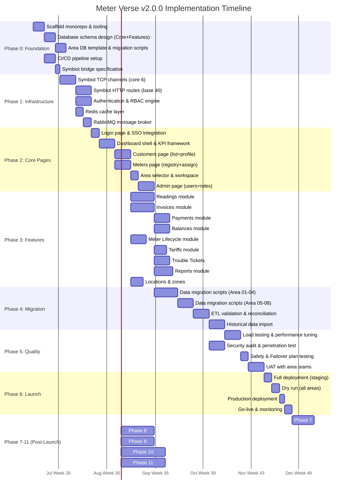
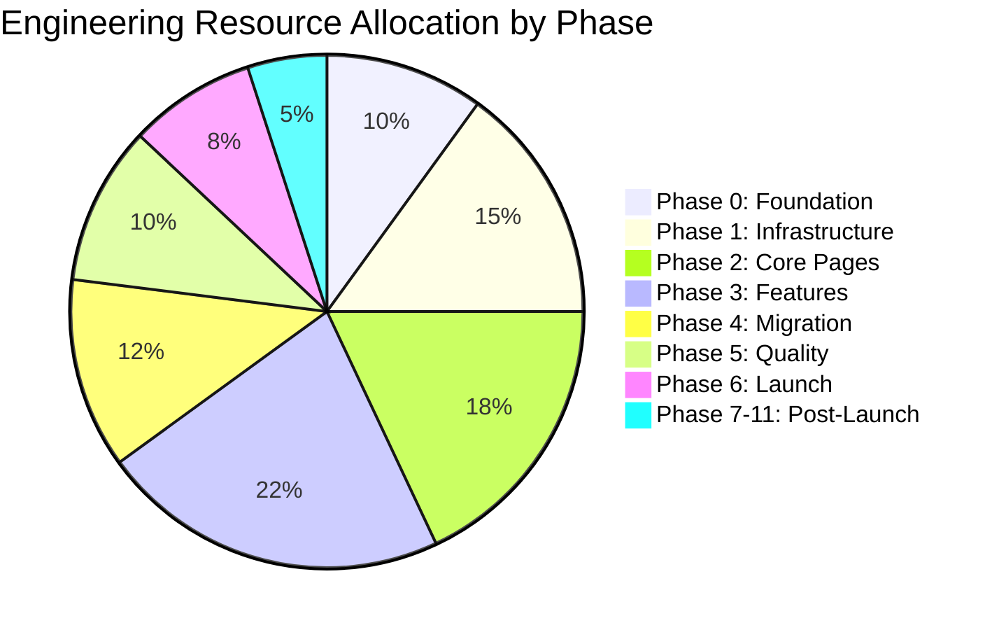

# Meter Verse v2.0.0 — Implementation Roadmap

## Overview

This roadmap defines 12 phases (Phase 0 through Phase 11) covering 28 weeks of active development plus post-launch support. The plan accounts for the 15+2 database architecture, Symbiot bridge, all 14 pages, 16 user profiles, and 3 availability plans.

**Total Duration**: 28 weeks active development + ongoing post-launch
**Target Launch**: Week 28
**Team Size**: 14 engineers (5 frontend, 5 backend, 2 QA, 2 DevOps)

---

## Phase Dependency Graph

```mermaid
graph LR
    P0[Phase 0: Foundation] --> P1[Phase 1: Infrastructure]
    P1 --> P2[Phase 2: Core Pages]
    P2 --> P3[Phase 3: Features]
    P3 --> P4[Phase 4: Migration]
    P4 --> P5[Phase 5: Quality]
    P5 --> P6[Phase 6: Launch]
    P6 --> P7[Phase 7: Hypercare]
    P7 --> P8[Phase 8: Optimization]
    P8 --> P9[Phase 9: Scale]
    P9 --> P10[Phase 10: Expand]
    P10 --> P11[Phase 11: Maturity]

    subgraph "Development"
        P0
        P1
        P2
        P3
    end

    subgraph "Stabilization"
        P4
        P5
    end

    subgraph "Launch"
        P6
        P7
    end

    subgraph "Post-Launch"
        P8
        P9
        P10
        P11
    end

    style P0 fill:#4a90d9,color:#fff
    style P6 fill:#27ae60,color:#fff
    style P7 fill:#e67e22,color:#fff
```

---

## Gantt Chart (Full Timeline)

---

## Phase Details

### Phase 0: Foundation (Weeks 1-4)

| Aspect | Detail |
|--------|--------|
| **Timeline** | Weeks 1-4 (Jun 15 - Jul 12) |
| **Total Tasks** | 10 (T086-T095) |
| **Team** | 2 frontend, 3 backend, 1 DevOps |
| **Risk** | Medium - Schema decisions are irreversible |

**Tasks:**
- Set up monorepo with Turborepo + pnpm workspaces
- Design Core DB schema (users, roles, permissions, organizations)
- Design Features DB schema (notifications, audit, billing_cycles)
- Create Area DB template with all 15 tables
- Set up CI/CD pipeline (GitHub Actions → Docker → K8s)
- Write Symbiot bridge detailed specification
- Establish coding standards and contribution guidelines
- Configure ESLint, Prettier, Husky, commitlint
- Initialize shared UI component library with Storybook
- Set up observability stack (Prometheus, Grafana, Loki)

**Dependencies:** None (project initiation)

**Deliverables:**
- Monorepo with all packages scaffolded
- Database migration scripts for Core + Features + Area template
- CI/CD pipeline with build, test, deploy stages
- Symbiot bridge API specification document
- Shared component library with 20+ base components

---

### Phase 1: Infrastructure (Weeks 5-6)

| Aspect | Detail |
|--------|--------|
| **Timeline** | Weeks 5-6 (Jul 13 - Jul 26) |
| **Total Tasks** | 6 (T096-T101) |
| **Team** | 1 frontend, 3 backend, 1 DevOps |
| **Risk** | High - Symbiot bridge is critical path |

**Tasks:**
- Implement Symbiot TCP channels 01-06 (auth, customer, meter, reading, invoice, payment)
- Implement Symbiot TCP channels 07-10 (notification, audit, cache, health)
- Build base HTTP route handler framework (40 routes)
- Implement authentication engine (JWT + session management)
- Implement RBAC engine with 16 profiles
- Set up Redis cache layer with invalidation patterns
- Configure RabbitMQ topics, queues, and dead-letter exchanges

**Dependencies:** Phase 0 (schema design complete, CI/CD ready)

**Deliverables:**
- Symbiot bridge running with 10 TCP channels
- 40 HTTP routes operational
- Authentication + RBAC with all 16 profiles
- Redis caching layer with area-based key isolation
- Message queue infrastructure for async operations

---

### Phase 2: Core Pages (Weeks 7-12)

| Aspect | Detail |
|--------|--------|
| **Timeline** | Weeks 7-12 (Jul 27 - Sep 6) |
| **Total Tasks** | 8 (T102-T109) |
| **Team** | 3 frontend, 2 backend |
| **Risk** | Medium - Page complexity, API alignment |

**Tasks:**
- Login page with SSO (Azure AD) and 2FA (TOTP)
- Dashboard shell with area selector, global navigation
- KPI framework: metric cards, trend sparklines, alert banners
- Customers page: infinite-scroll list, search, profile panel, contract timeline
- Meters page: registry table, assignment dialog, status badges, filter bar
- Admin page: user CRUD, role editor with permission matrix
- Workspace page: user preferences, recent items, pinned shortcuts
- Locations page: zone tree, hierarchy editor, geo-map integration

**Dependencies:** Phase 1 (auth, RBAC, bridge operational)

**Deliverables:**
- 7 functional pages (Login, Dashboard, Customers, Meters, Admin, Workspace, Locations)
- Shared UI component library extended to 50+ components
- API integration layer with area-parameterized requests
- Responsive layout with role-based menu filtering

---

### Phase 3: Features (Weeks 13-18)

| Aspect | Detail |
|--------|--------|
| **Timeline** | Weeks 13-18 (Sep 7 - Oct 18) |
| **Total Tasks** | 10 (T110-T119) |
| **Team** | 3 frontend, 3 backend |
| **Risk** | High - Most complex business logic |

**Tasks:**
- Readings: capture form, validation rules, approval workflow, history chart
- Invoices: generation engine, list/detail views, bulk actions, credit notes
- Payments: collection entry, allocation to invoices, receipt generation
- Balances: running balance calculation, aging schedule, adjustments
- Meter Lifecycle: status state machine, event timeline, action triggers
- Tariffs: rate structures, tiered pricing, effective date scheduling
- Trouble Tickets: create/assign/work/resolve flow with SLA tracking
- Reports: pre-built report templates, parameter forms, PDF/CSV export
- Consumption calculation engine (reading → threshold → tariff → line item)
- Water balance computation (main meter vs sub-meters variance)

**Dependencies:** Phase 2 (core pages operational)

**Deliverables:**
- 9 feature modules fully functional
- 5 core business engines (readings, invoices, payments, lifecycle, consumption)
- Report framework with 10+ pre-built templates
- Async processing pipeline for batch operations

---

### Phase 4: Migration (Weeks 19-22)

| Aspect | Detail |
|--------|--------|
| **Timeline** | Weeks 19-22 (Oct 19 - Nov 15) |
| **Total Tasks** | 6 (T120-T125) |
| **Team** | 2 backend, 2 DevOps |
| **Risk** | Critical - Data integrity is paramount |

**Tasks:**
- Write migration scripts for October data (largest area: 45K meters)
- Write migration scripts for New Cairo data (38K meters)
- Write migration scripts for Sodic areas (EDNC, Estates, Vye)
- Write migration scripts for Badya City, North Coast, Uvines Mall
- Build ETL validation framework: row counts, checksums, referential integrity
- Historical data import (12-24 months of readings, invoices, payments)

**Dependencies:** Phase 3 (all feature modules ready)

**Deliverables:**
- Migration scripts for all 8 active areas
- Validation reports showing 100% data integrity
- Rollback scripts for each migration batch
- Historical data loaded into all area databases

---

### Phase 5: Quality (Weeks 23-25)

| Aspect | Detail |
|--------|--------|
| **Timeline** | Weeks 23-25 (Nov 16 - Dec 6) |
| **Total Tasks** | 5 (T126-T130) |
| **Team** | All 14 engineers |
| **Risk** | Medium - Performance issues may require refactoring |

**Tasks:**
- Load testing: simulate 500 concurrent users across all areas
- Performance tuning: query optimization, index analysis, cache tuning
- Security audit: OWASP Top 10, dependency scanning, secret scanning
- Penetration testing: API fuzzing, auth bypass attempts, SQL injection
- Safety Plan testing: degrade gracefully at 70% load
- Failover Plan testing: area DB outage, replica promotion, recovery
- UAT sessions with area managers, team leaders, operators

**Dependencies:** Phase 4 (data migrated)

**Deliverables:**
- Load test report with P95/P99 latency metrics
- Security audit clearance report
- Availability plan validation (Full/Safety/Failover all verified)
- UAT sign-off from each area team

---

### Phase 6: Launch (Weeks 26-28)

| Aspect | Detail |
|--------|--------|
| **Timeline** | Weeks 26-28 (Dec 7 - Dec 27) |
| **Total Tasks** | 5 (T131-T135) |
| **Team** | All 14 engineers |
| **Risk** | High - Production cutover is irreversible |

**Tasks:**
- Deploy v2.0.0 to staging environment with production data
- Execute full dry run: all 8 areas, all 14 pages, all 16 roles
- Run parallel operations (old system + v2.0.0) for 3 days
- Resolve any discrepancies between old and new system
- Production deployment: DNS switch, database cutover
- Go-live monitoring: 24/7 watch for first 72 hours

**Dependencies:** Phase 5 (quality sign-off)

**Deliverables:**
- Production deployment of v2.0.0
- Post-deployment validation report
- Monitoring dashboards for all areas
- Rollback plan documented and tested

---

### Phase 7: Hypercare (Weeks 29-30)

| Aspect | Detail |
|--------|--------|
| **Timeline** | Weeks 29-30 |
| **Team** | 6 engineers (on rotation) |
| **Risk** | Medium - Production issues expected |

**Tasks:**
- 24/7 on-call rotation for critical issues
- Bug fix sprints (daily hotfixes, weekly patches)
- Performance monitoring and tuning
- User feedback collection and triage
- Documentation updates based on real-world usage

**Deliverables:**
- Bug fix release (v2.0.1)
- Known issues list with workarounds
- Updated runbooks and operations guide

---

### Phase 8: Optimization (Weeks 31-33)

| Aspect | Detail |
|--------|--------|
| **Timeline** | Weeks 31-33 |
| **Team** | 4 engineers |
| **Risk** | Low |

**Tasks:**
- Query performance optimization based on production metrics
- Frontend bundle size reduction and lazy loading
- Database index tuning and VACUUM strategy
- Cache hit ratio improvement
- CI/CD pipeline speed optimization

**Deliverables:**
- v2.1.0 performance release
- Lighthouse scores > 90 for all pages
- P95 API response < 200ms

---

### Phase 9: Scale (Weeks 34-36)

| Aspect | Detail |
|--------|--------|
| **Timeline** | Weeks 34-36 |
| **Team** | 4 engineers |
| **Risk** | Medium |

**Tasks:**
- Horizontal scaling of Symbiot bridge (multi-instance)
- Read replica setup for heavy-reporting areas
- Database connection pooling optimization
- Auto-scaling policies for K8s pods
- Load balancer tuning for area-based routing

**Deliverables:**
- v2.2.0 scalability release
- Auto-scaling verified under 2x normal load
- Zero-downtime deployment pipeline

---

### Phase 10: Expand (Weeks 37-40)

| Aspect | Detail |
|--------|--------|
| **Timeline** | Weeks 37-40 |
| **Team** | 3 engineers |
| **Risk** | Medium |

**Tasks:**
- Area onboarding template and automation
- Provision Area 09 and Area 10 databases
- Self-service area setup wizard
- Multi-language support framework
- Additional report templates

**Deliverables:**
- v2.3.0 expansion release
- Area 09 and Area 10 operational
- Area onboarding documentation

---

### Phase 11: Maturity (Weeks 41-44)

| Aspect | Detail |
|--------|--------|
| **Timeline** | Weeks 41-44 |
| **Team** | 2 engineers |
| **Risk** | Low |

**Tasks:**
- Technical debt reduction
- Automated test coverage improvement (> 90%)
- API versioning strategy for v3.0
- Architecture Decision Records (ADRs) for all major decisions
- Knowledge base and training material creation
- Community/contributor guidelines

**Deliverables:**
- v2.4.0 maturity release
- 90%+ test coverage
- Complete architecture documentation set
- Internal training program delivered

---

## Risk Register

| Phase | Risk | Likelihood | Impact | Mitigation |
|-------|------|-----------|--------|------------|
| 0 | Schema changes after development starts | Medium | High | Extensive design reviews, ADRs, schema-as-code |
| 1 | Symbiot bridge throughput below target | Medium | Critical | Prototype and benchmark TCP channels early |
| 2 | Page complexity exceeds estimates | Medium | Medium | Component reuse, strict scope management |
| 3 | Business logic edge cases | High | Medium | ATDD, scenario workshops with domain experts |
| 4 | Data corruption during migration | Low | Critical | Checksum validation, rollback scripts, dry runs |
| 5 | Performance below SLA | Medium | High | Continuous load testing from Phase 1 |
| 6 | Cutover issues | Medium | Critical | Comprehensive runbook, parallel run period |
| 7 | Post-launch defects | High | Medium | Severity-based triage, hotfix pipeline |

---

## Resource Allocation

