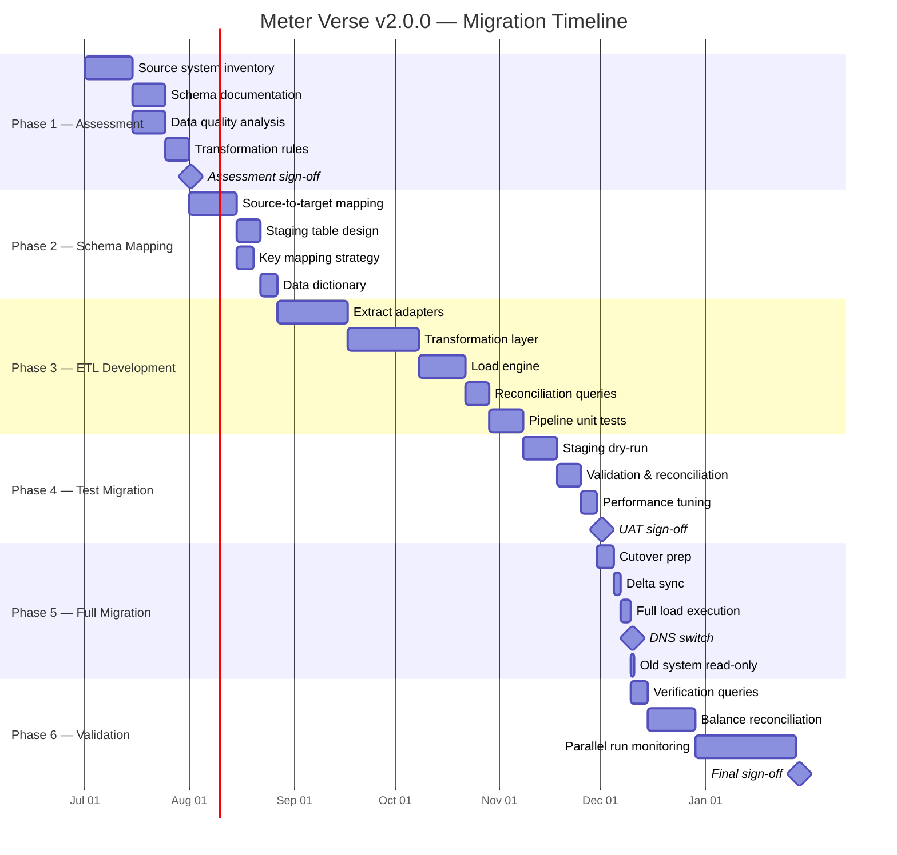

# v2.0.0 — Zero-Downtime Migration Plan

## Migration Pipeline Flow

```mermaid
flowchart TD
    subgraph "Phase 1: Assessment"
        A1[Inventory source systems] --> A2[Document schemas & volumes]
        A2 --> A3[Identify data quality issues]
        A3 --> A4[Define transformation rules]
        A4 --> A5[Sign-off on assessment report]
    end

    subgraph "Phase 2: Schema Mapping"
        B1[Map source → target fields] --> B2[Create transformation specs]
        B2 --> B3[Design staging tables]
        B3 --> B4[Define surrogate key mapping]
        B4 --> B5[Build data dictionary]
    end

    subgraph "Phase 3: ETL Development"
        C1[Build extract adapters] --> C2[Build transformation layer]
        C2 --> C3[Build load engine]
        C3 --> C4[Create reconciliation queries]
        C4 --> C5[Unit test each pipeline]
    end

    subgraph "Phase 4: Test Migration"
        D1[Dry-run full migration in staging] --> D2[Validate row counts]
        D2 --> D3[Validate balance integrity]
        D3 --> D4[Performance benchmark]
        D4 --> D5{UAT sign-off?}
        D5 -->|Fail| C1
        D5 -->|Pass| E1
    end

    subgraph "Phase 5: Full Migration"
        E1[Schedule cutover window] --> E2[Stop source writes (read-only mode)]
        E2 --> E3[Final delta sync]
        E3 --> E4[Execute full load]
        E4 --> E5[Enable target system]
        E5 --> E6[DNS switch to new system]
    end

    subgraph "Phase 6: Validation"
        F1[Verification queries] --> F2[Balance reconciliation]
        F2 --> F3[Parallel run monitoring]
        F3 --> F4{Discrepancy found?}
        F4 -->|Yes| F5[Alert & investigate]
        F5 --> F3
        F4 -->|No| F6[Sign-off & close old system]
    end

    A5 --> B1
    B5 --> C1
    C5 --> D1
    E6 --> F1
```

## Migration Timeline



---

## Source Systems Overview

| Source System | Type | Tables | Approx. Rows | Key Challenges |
|--------------|------|--------|-------------|----------------|
| **SBill Palm Hills** | SQL Server 2016 | 85 | 12M | Legacy schema, no foreign keys |
| **SBill Estates** | SQL Server 2016 | 72 | 8M | Custom fields, inconsistent codes |
| **Collection System Tracker** | SQL Server 2014 | 34 | 4M | Non-normalized, duplicate records |
| **Solar Wallet Legacy** | MySQL 5.7 | 18 | 1.2M | Different DB engine, charset issues |

---

## Phase Details

### Phase 1: Assessment (5 weeks)

**Activities:**
- Inventory all tables, columns, relationships in each source system
- Document approximate row counts and data volumes
- Profile data quality: nulls, duplicates, orphan records, invalid dates
- Identify PII columns that must be encrypted in target
- Map source business rules to target system rules

**Deliverables:**
- Source system inventory (Excel)
- Data quality report with issue count per table
- Transformation rule document
- Signed assessment report

---

### Phase 2: Schema Mapping (4 weeks)

**Activities:**
- Map each source table/column to target table/column
- Define type conversion rules (e.g., source `VARCHAR(50)` dates → target `DATE`)
- Design staging tables: `Staging.Customer`, `Staging.MeterReading`, etc.
- Define surrogate key mapping table: `Core.SourceKeyMapping(SourceSystem, SourceTable, SourceId, TargetTable, TargetId)`
- Handle multi-source consolidation (e.g., Customer data from SBill + Collection Tracker)

**Key Mapping Decisions:**
| Target Table | Primary Source | Secondary Source | Merge Strategy |
|-------------|---------------|-----------------|----------------|
| Area.Customer | SBill Palm Hills | Collection Tracker | Match on NationalId; prefer SBill |
| Area.CustomerMeter | SBill Palm Hills | Solar Wallet | Match on MeterNumber |
| Area.MeterReading | SBill Palm Hills (manual) | Solar Wallet (AMI) | Union; no overlap expected |
| Area.InvoiceDetail | SBill Palm Hills | — | Direct mapping |
| Area.PaymentAllocation | SBill Palm Hills | Collection Tracker | Match on InvoiceNumber + PaymentRef |
| Features.Tariff | SBill Estates | — | Manual curation |

---

### Phase 3: ETL Development (10 weeks)

**Extract Adapters (per source):**
- SBill Palm Hills: .NET Core console app using SqlBulkCopy, change tracking via CDC
- SBill Estates: Same pattern as Palm Hills
- Collection Tracker: Custom Python ETL with pandas
- Solar Wallet: JDBC connector to MySQL → staging tables

**Transformation Layer (shared C# library):**
- Null handling: configurable default values per column
- Date normalization: all to UTC
- ID mapping: lookup/write to `SourceKeyMapping`
- PII encryption: transparent at column level
- Business rules: balance recalculation, status normalization

**Load Engine:**
- Parallel load per area database using `DataSyncTracker` table
- Batch size: 5,000 rows per commit
- Checkpoint/restart capability per table
- Throttle: configurable rows/sec to avoid target DB overwhelm

**Reconciliation Queries:**
```sql
-- Per source system, per table: row count + checksum
SELECT COUNT(*), CHECKSUM_AGG(BINARY_CHECKSUM(*))
FROM SourceTable
WHERE LastModified >= @CutoverStart;
```

---

### Phase 4: Test Migration (3 weeks)

**Staging Environment:**
- Full copy of source databases restored to staging SQL Server
- Target databases provisioned (Core + Features + 15 Area DBs)
- ETL pipeline executes against staging data

**Validation Checklist:**
| Check | Method | Pass Criteria |
|-------|--------|---------------|
| Row count parity | COUNT(*) per table | 100% match |
| Checksum match | BINARY_CHECKSUM (sampled) | > 99.9% |
| Balance integrity | Sum(Invoice) - Sum(Payment) = Customer.CurrentBalance | 100% match |
| Aging report | Compare aging buckets source vs target | < 0.1% variance |
| Duplicate check | UNIQUE constraints enforced | Zero violations |
| FK integrity | All FK relationships valid | Zero orphans |
| PII encryption | Verify encrypted columns | Cannot read plaintext |
| Performance | Query response times | < 2× source system |

**Performance Benchmark:**
- Load test: 10 concurrent bill operators, 100 concurrent API calls
- Page load targets: Dashboard < 2s, List pages < 3s, Reports < 10s
- Invoice generation: 10,000 invoices < 5 minutes

---

### Phase 5: Full Migration (5 days + cutover weekend)

**Pre-Cutover (Tuesday–Friday):**
- Final full load of all historical data
- Incremental syncs every 4 hours for changed data
- Deploy target application to production slot
- Configure DNS TTL to 60 seconds

**Cutover Weekend Schedule:**

| Time (Sat) | Activity | Owner |
|-----------|----------|-------|
| 06:00 | Notify all users of maintenance window | Ops Lead |
| 06:30 | Set source systems to read-only | DBA |
| 07:00 | Final delta sync (since last incremental) | ETL Team |
| 08:00 | Checksum reconciliation of delta | QA Lead |
| 09:00 | Execute full load if delta failed | ETL Team |
| 10:00 | Run verification queries (top 20) | QA Lead |
| 11:00 | Enable target system user access | Dev Lead |
| 12:00 | Switch DNS to new system | Ops Lead |
| 12:30 | Monitor logs, error rates, response times | All |
| 14:00 | Declare cutover success (if no P1 issues) | PM |
| 18:00 | End of Day 1 — night batch runs | Ops |

**Day 2 (Sunday):**
- Nightly reconciliation batch runs
- Fix any data issues found
- Begin parallel run

---

### Phase 6: Validation & Parallel Run (30 days)

**Dual Run Strategy:**
- New system (Meter Verse) is primary
- Old systems remain read-only, accessible for comparison
- Nightly balance comparison job runs at 02:00

**Nightly Reconciliation:**
```sql
-- Compare daily balances
SELECT
    c.CustomerCode,
    c.CurrentBalance AS NewBalance,
    s.CurrentBalance AS OldBalance,
    (c.CurrentBalance - s.CurrentBalance) AS Variance
FROM Area.Customer c
JOIN Staging.CustomerSnapshot s ON c.CustomerCode = s.CustomerCode
WHERE ABS(c.CurrentBalance - s.CurrentBalance) > 0.01;
```

**Discrepancy Alerting:**
- Variance > 0.01 EGP → Warning (email to billing team)
- Variance > 100 EGP → Critical (SMS + email)
- 3 consecutive days of variance → Pause cutover, investigate
- Maximum acceptable variance ratio: 0.01%

**Parallel Run Exit Criteria:**
- 30 consecutive days with zero critical discrepancies
- 25 of 30 days with zero warnings
- All scheduled invoices generated correctly
- All payments reconciled
- Zero P1/P2 production incidents in final 7 days

---

## Rollback Procedures Per Phase

### Phase 1–2 (Assessment / Schema Mapping)
**Rollback:**
- Stop all work immediately
- No data has been migrated — pure documentation
- **Action:** Archive assessment documents, return to prior process

### Phase 3 (ETL Development)
**Rollback Trigger:** ETL pipeline fails > 50% of unit tests
**Rollback Steps:**
1. Git revert to last known-good commit: `git revert HEAD~1`
2. Remove any staging tables created in target databases
3. Clean up SourceKeyMapping entries if any
4. **Rollback Script:**
```sql
DROP TABLE IF EXISTS Staging.Customer;
DROP TABLE IF EXISTS Staging.CustomerMeter;
DROP TABLE IF EXISTS Staging.MeterReading;
-- Repeat for all staging tables
DELETE FROM Core.SourceKeyMapping WHERE SourceSystem IN ('SBillPH', 'SBillEstates', 'CollectionTracker', 'SolarWallet');
```

### Phase 4 (Test Migration)
**Rollback Trigger:** Checksum mismatch > 0.1% after 3 retries
**Rollback Steps:**
1. Stop pipeline execution
2. TRUNCATE all target area database tables loaded during test
3. Reset identity seeds: `DBCC CHECKIDENT ('Area.InvoiceDetail', RESEED, 0);`
4. Archive test results for root cause analysis
5. **Rollback Script:** `Invoke-Rollback.ps1 -Environment Staging -Phase TestMigration`

### Phase 5 (Full Migration)
**Rollback Trigger:** Any of the following during cutover weekend:
- DNS switch does not propagate within 30 minutes
- Invoice generation failure rate > 1%
- Payment recording latency > 5 seconds
- Data integrity violation found in verification queries

**Rollback Steps:**
1. **DNS Rollback:** Update DNS CNAME to point back to old system IP
2. **Disable New System:** Set maintenance page on new system load balancer
3. **Restore Source Writes:** Set source databases back to read-write
4. **Data Cleanup:** Run cleanup scripts on target databases
5. **Communication:** Notify all stakeholders of rollback
6. **Rollback Script:**
```powershell
# DnsRollback.ps1
$dnsZone = "meter.example.com"
Remove-DnsRecord -Zone $dnsZone -Name "@" -Type CNAME -Record "new-system-lb.meter.internal"
Add-DnsRecord -Zone $dnsZone -Name "@" -Type CNAME -Record "old-system-lb.meter.internal" -Ttl 300

# Set old databases to read-write
$sources = @("SBillPH", "SBillEstates", "CollectionTracker", "SolarWallet")
foreach ($src in $sources) {
    Invoke-Sqlcmd -Server $src -Query "ALTER DATABASE CURRENT SET READ_WRITE;"
}

# Cleanup target staging
Invoke-Sqlcmd -Server "MeterVerse-DB" -Query "EXEC CleanupFailedMigration @Environment='Production';"
```

### Phase 6 (Validation / Parallel Run)
**Rollback Trigger (within first 7 days of parallel run):**
- Critical data discrepancy affecting > 0.1% of customers
- Security incident (data leak, unauthorized access)
- Regulatory compliance issue found

**Rollback Steps:**
1. **Graceful Degradation:** Old system still has complete read-only data
2. **Switch Back to Old as Primary:**
   - Update DNS to old system (users see old system)
   - Export new system data collected during parallel run
   - Import collected data back to old system via batch
3. **New System Suspended:** Quarantine new system for forensic analysis
4. **Rollback Script:**
```sql
-- Export new transactions since cutover
SELECT * FROM Area.InvoiceDetail
WHERE CreatedAt >= '2026-08-01' AND Status != 'Draft'
ORDER BY CreatedAt;

-- Bulk import to old system (via linked server)
INSERT INTO [SBillPH].dbo.InvoiceBackup (...)
SELECT ... FROM [MeterVerse].Area.InvoiceDetail
WHERE CreatedAt >= @CutoverDate;
```

---

## Cutover Checklist

| # | Item | Owner | Status | Notes |
|---|------|-------|--------|-------|
| T-7d | Finalize cutover schedule | PM | ☐ | |
| T-7d | Confirm rollback procedures documented | Tech Lead | ☐ | |
| T-5d | All ETL pipelines tested end-to-end | ETL Lead | ☐ | |
| T-5d | Performance benchmark complete | QA Lead | ☐ | |
| T-3d | Notify all users of maintenance | PM | ☐ | |
| T-2d | Final full load (historical data) | ETL Team | ☐ | |
| T-1d | Set DNS TTL to 60s | Ops | ☐ | |
| T-1d | Deploy application to production slot | Dev | ☐ | |
| T-0:06:00 | Begin maintenance window | Ops Lead | ☐ | |
| T-0:06:30 | Set source systems to read-only | DBA | ☐ | |
| T-0:07:00 | Execute final delta sync | ETL Team | ☐ | |
| T-0:08:00 | Run verification queries | QA Lead | ☐ | |
| T-0:10:00 | Enable user access | Dev Lead | ☐ | |
| T-0:12:00 | Switch DNS | Ops Lead | ☐ | |
| T-0:12:30 | Monitor dashboards (error rate, latency) | All | ☐ | |
| T-0:14:00 | Declare cutover success/fail | PM | ☐ | |
| T+1d | Nightly reconciliation job confirmed | ETL Team | ☐ | |
| T+7d | Old system decommission approved | PM | ☐ | |
| T+30d | Parallel run complete | PM | ☐ | |
| T+37d | Old systems turned off | Ops | ☐ | |

---

## Old System Read-Only Activation

```sql
-- Set all source databases to READ_ONLY after cutover
ALTER DATABASE [SBillPalmHills] SET READ_ONLY WITH ROLLBACK IMMEDIATE;
ALTER DATABASE [SBillEstates] SET READ_ONLY WITH ROLLBACK IMMEDIATE;
ALTER DATABASE [CollectionTracker] SET READ_ONLY WITH ROLLBACK IMMEDIATE;
ALTER DATABASE [SolarWalletLegacy] SET READ_ONLY WITH ROLLBACK IMMEDIATE;

-- Revoke write access for application users
REVOKE INSERT, UPDATE, DELETE ON DATABASE::[SBillPalmHills] FROM [SBillAppUser];
REVOKE INSERT, UPDATE, DELETE ON DATABASE::[SBillEstates] FROM [SBillAppUser];
REVOKE INSERT, UPDATE, DELETE ON DATABASE::[CollectionTracker] FROM [CollAppUser];
REVOKE INSERT, UPDATE, DELETE ON DATABASE::[SolarWalletLegacy] FROM [SolarAppUser];
```

---

## Post-Migration Monitoring (Days 1–30)

| Metric | Alert Threshold | Action |
|--------|----------------|--------|
| Balance variance | > 0.01 EGP per customer | Investigate source discrepancy |
| API error rate | > 1% of requests | Rollback if sustained > 1 hour |
| Invoice generation time | > 10 min for 10k invoices | Scale worker pool |
| Payment processing latency | > 5 seconds | Investigate DB locks |
| Login failure rate | > 5% of attempts | Check auth service health |
| DB deadlocks | > 10 per hour | Tune indexing/queries |
| ETL reconciliation failure | > 0.01% variance | Re-run delta sync |

---

## Rollback Decision Matrix

| Condition | Within Cutover Window | Within 7 Days | Within 30 Days |
|-----------|----------------------|---------------|----------------|
| Balance discrepancy > 0.1% of customers | **Rollback immediately** | Rollback | Continue monitoring |
| API unavailable > 10 min | Rollback | Rollback | Rollback |
| Security breach | Rollback | Rollback | Rollback |
| Performance > 3× baseline | Complete migration first, then tune | Optimize | Optimize |
| Invoice data corruption | Rollback | Rollback | Manual fix |
| Payment data loss | Rollback | Rollback | Forensic recovery |
| Minor UI defects | Log as known issue to fix post-migration | Fix in sprint | Fix in sprint |
