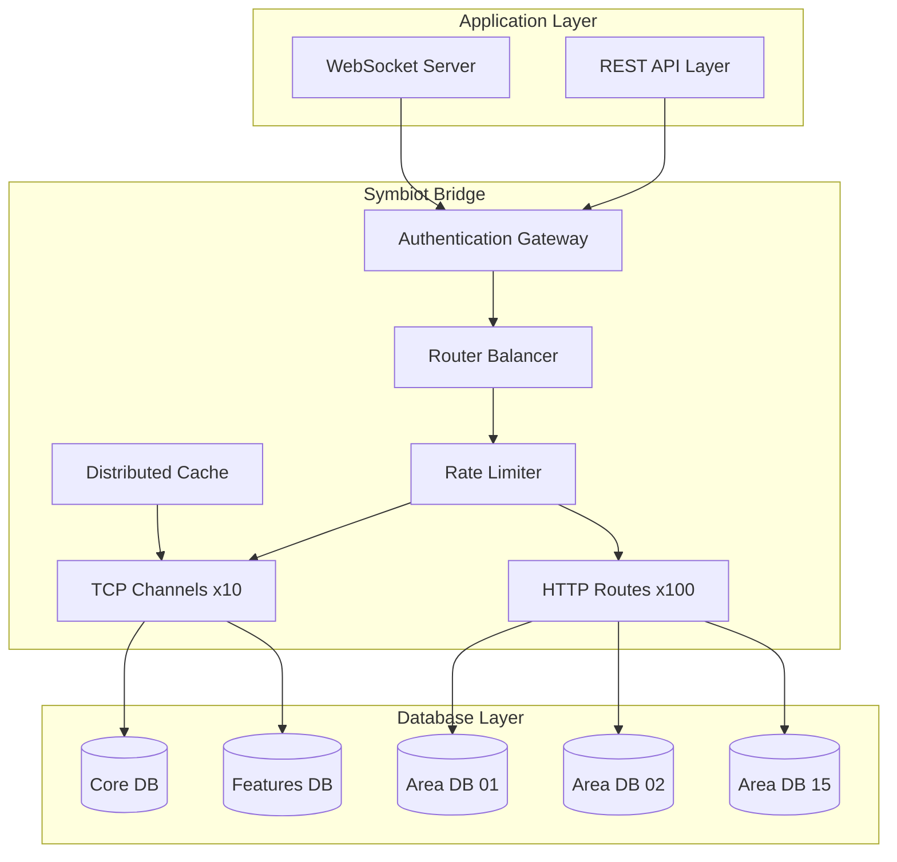
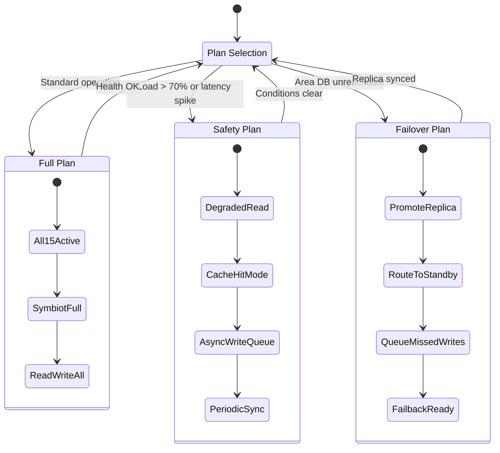
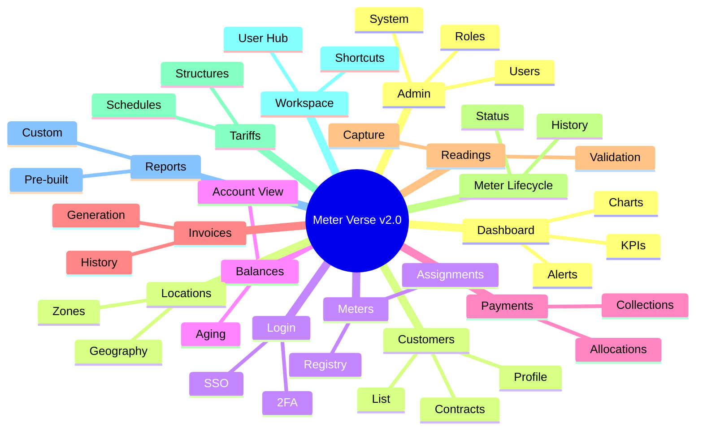
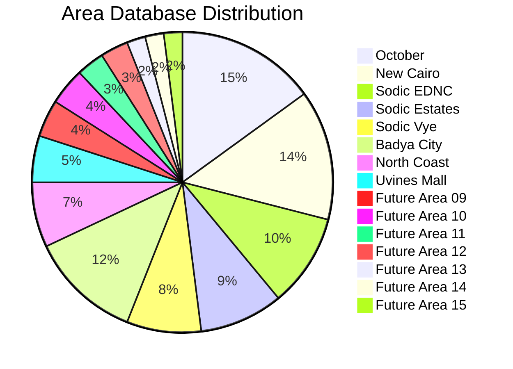

# Meter Verse v2.0.0 — Planning & Strategy

## 1. Executive Summary

Meter Verse v2.0.0 represents a ground-up re-architecture of the metering, billing, and collection platform. The system serves 15 operational areas (with capacity for 7 more) across water utility management, serving thousands of customers with meter-to-cash lifecycle management. The architecture follows a **15+2 Database Pattern**: 15 Area-specific databases, 1 Core shared database, and 1 Features shared database, connected via the **Symbiot bridge** — a high-throughput TCP/HTTP gateway layer.

---

## 2. 15+2 Database Architecture

```
┌─────────────────────────────────────────────────────────────────────┐
│                       15+2 DATABASE ARCHITECTURE                     │
│                                                                      │
│  ┌─────────────────────┐    ┌──────────────────────────────────┐    │
│  │   CORE DB (shared)  │    │   FEATURES DB (shared)           │    │
│  │  ├─ users           │    │  ├─ notifications                │    │
│  │  ├─ roles           │    │  ├─ reports_history              │    │
│  │  ├─ permissions     │    │  ├─ audit_log                   │    │
│  │  ├─ activity_log    │    │  ├─ billing_cycles              │    │
│  │  ├─ organizations   │    │  ├─ payment_gateway_logs        │    │
│  │  └─ settings        │    │  ├─ email_sms_queue             │    │
│  └─────────┬───────────┘    │  ├─ file_storage_refs           │    │
│            │                │  └─ scheduler_jobs              │    │
│            │                └──────────────────────────────────┘    │
│            │                        │                                │
│            └──────────┬─────────────┘                                │
│                       │                                              │
│  ┌────────────────────┴────────────────────────────────────────┐    │
│  │                  SYMBIOT BRIDGE LAYER                        │    │
│  │  10 TCP channels (persistent, low-latency)                   │    │
│  │  100 HTTP routes (RESTful, stateless)                        │    │
│  └────────────────────┬────────────────────────────────────────┘    │
│                       │                                              │
│  ┌────────────────────┴────────────────────────────────────────┐    │
│  │              AREA DATABASES (x15 + 7 future)                 │    │
│  │                                                              │    │
│  │  october        │  new_cairo       │  sodic_ednc            │    │
│  │  sodic_estates  │  sodic_vye       │  badya_city            │    │
│  │  north_coast    │  uvines_mall     │  area_09 (future)      │    │
│  │  area_10-15     │  (future)        │                        │    │
│  │                                                              │    │
│  │  Each Area DB contains:                                      │    │
│  │  ├─ customers, meters, readings                              │    │
│  │  ├─ invoices, payments, balances                             │    │
│  │  ├─ tariffs, meter_lifecycle, trouble_tickets                │    │
│  │  ├─ contracts, connections, zones                            │    │
│  │  └─ area_config, local_cache                                 │    │
│  └──────────────────────────────────────────────────────────────┘    │
└─────────────────────────────────────────────────────────────────────┘
```

### 2.1 Core DB Schema (Shared)

| Table | Description |
|-------|-------------|
| `users` | All platform users, referenced by area_id |
| `roles` | RBAC roles (16 profiles) |
| `permissions` | Granular permission definitions |
| `activity_log` | Cross-area activity tracking |
| `organizations` | Company/entity hierarchy |
| `settings` | Global platform settings |

### 2.2 Features DB Schema (Shared)

| Table | Description |
|-------|-------------|
| `notifications` | Cross-area notification queue |
| `billing_cycles` | Global billing cycle definitions |
| `payment_gateway_logs` | Aggregated payment transactions |
| `email_sms_queue` | Outbound communication queue |
| `audit_log` | System-wide audit trail |
| `reports_history` | Stored report snapshots |
| `file_storage_refs` | Document/image references |
| `scheduler_jobs` | Cron job definitions & state |

### 2.3 Area DB Schema (Per Area)

| Table | Description |
|-------|-------------|
| `customers` | Customer master data |
| `meters` | Meter registry & configuration |
| `readings` | Consumption readings |
| `invoices` | Billing documents |
| `payments` | Payment transactions |
| `balances` | Running account balance |
| `tariffs` | Rate structures |
| `meter_lifecycle` | Meter status history |
| `trouble_tickets` | Support tickets |
| `contracts` | Customer agreements |
| `connections` | Physical connection points |
| `zones` | Geographical/operational zones |
| `accounts_receivable` | Aging schedules |
| `area_config` | Area-specific settings |
| `local_cache` | Cached reference data |

---

## 3. Symbiot Bridge Architecture

The Symbiot bridge is the communication backbone between the shared databases and the area databases. It enforces tenant isolation, routes queries, and provides connection pooling.



### 3.1 TCP Channels (10 Persistent Connections)

| Channel | Purpose | Port Range |
|---------|---------|------------|
| TCP-01 | Authentication & session | 9001 |
| TCP-02 | Customer master sync | 9002 |
| TCP-03 | Meter registry sync | 9003 |
| TCP-04 | Reading ingestion | 9004 |
| TCP-05 | Invoice generation | 9005 |
| TCP-06 | Payment processing | 9006 |
| TCP-07 | Real-time notifications | 9007 |
| TCP-08 | Audit replication | 9008 |
| TCP-09 | Cache invalidation | 9009 |
| TCP-10 | Health monitoring | 9010 |

### 3.2 HTTP Routes (100 RESTful)

| Method Group | Route Prefix | Count |
|-------------|-------------|-------|
| `GET` | `/api/v2/customers/*` | 12 |
| `POST/PUT` | `/api/v2/customers/*` | 8 |
| `GET` | `/api/v2/meters/*` | 10 |
| `POST/PUT` | `/api/v2/meters/*` | 6 |
| `GET/POST` | `/api/v2/readings/*` | 8 |
| `GET/POST` | `/api/v2/invoices/*` | 10 |
| `GET/POST` | `/api/v2/payments/*` | 8 |
| `GET/POST` | `/api/v2/balances/*` | 6 |
| `GET/POST` | `/api/v2/tariffs/*` | 6 |
| `GET/POST` | `/api/v2/tickets/*` | 6 |
| `GET/POST` | `/api/v2/reports/*` | 8 |
| `GET/POST` | `/api/v2/admin/*` | 6 |
| `GET/POST` | `/api/v2/workspace/*` | 4 |
| `GET/POST` | `/api/v2/system/*` | 2 |

---

## 4. Availability Plans



### 4.1 Plan Comparison

| Aspect | Full Plan | Safety Plan | Failover Plan |
|--------|-----------|-------------|---------------|
| **DB Nodes** | All 17 active | 15 Area DBs read-only | Replica promoted |
| **TCP Channels** | 10/10 active | 8/10 (drop audit, cache) | 6/10 (core only) |
| **HTTP Routes** | 100/100 | 70/100 (reports/admin blocked) | 40/100 (read-only) |
| **Cache Strategy** | Look-aside | Write-through | Read-only |
| **Write Mode** | Synchronous | Async queue | Queue & replay |
| **RTO** | N/A | < 30s | < 120s |
| **RPO** | 0 | < 5s | < 60s |
| **Trigger** | Manual schedule | Auto at 70% load | Auto on health failure |

---

## 5. Page Inventory (14 Pages)



### 5.1 Page Details

| # | Page | Route | Key Components |
|---|------|-------|----------------|
| 1 | Dashboard | `/` | KPI cards, trend charts, alert feed, area selector |
| 2 | Customers | `/customers` | DataGrid, search, profile panel, contract history |
| 3 | Meters | `/meters` | Registry table, assignment dialog, status badges |
| 4 | Balances | `/balances` | Account summary, aging schedule, transaction log |
| 5 | Payments | `/payments` | Collection list, allocation form, receipt viewer |
| 6 | Invoices | `/invoices` | Invoice list, detail view, bulk actions |
| 7 | Readings | `/readings` | Capture form, validation queue, history chart |
| 8 | Meter Lifecycle | `/lifecycle` | Status timeline, event log, actions panel |
| 9 | Tariffs | `/tariffs` | Rate table, tier editor, effective dates |
| 10 | Workspace | `/workspace` | User preferences, recent items, shortcuts |
| 11 | Reports | `/reports` | Report list, parameter form, export actions |
| 12 | Admin | `/admin` | User manager, role editor, system config |
| 13 | Locations | `/locations` | Zone tree, map view, area hierarchy |
| 14 | Login | `/login` | SSO gateway, 2FA challenge, password reset |

---

## 6. User Profiles (16 Roles)

| # | Profile | Level | Areas | Description |
|---|---------|-------|-------|-------------|
| 1 | `super_admin` | Global | All | Full system access, cross-area operations |
| 2 | `system_admin` | Global | All | System configuration, performance management |
| 3 | `admin` | Area | 1+ | Area-level full access, user management |
| 4 | `area_manager` | Area | 1+ | Operational oversight, approvals, reports |
| 5 | `team_leader` | Area | 1+ | Team supervision, work order assignment |
| 6 | `operator` | Area | 1+ | Daily data entry, reading processing |
| 7 | `technician` | Area | 1+ | Field work, meter installation/repair |
| 8 | `finance` | Global | All | Financial reports, payment reconciliation |
| 9 | `support` | Area | 1+ | Ticket management, customer communication |
| 10 | `customer` | Self | 1 | Self-service: bills, payments, usage |
| 11 | `collector` | Area | 1+ | Payment collection, receipt issuance |
| 12 | `meter_reader` | Area | 1+ | Reading capture, field data entry |
| 13 | `inspector` | Area | 1+ | Meter inspection, quality checks |
| 14 | `supervisor` | Area | 1+ | Oversight, exception handling |
| 15 | `accountant` | Area | 1+ | Journal entries, adjustments, GL |
| 16 | `viewer` | Area | 1+ | Read-only reports, dashboards |

---

## 7. Area Distribution



### 7.1 Active Areas (8)

| # | Area Name | DB Prefix | Meter Count (est.) | Go-Live |
|---|-----------|-----------|-------------------|---------|
| 1 | October | `october` | 45,000 | v2.0.0 |
| 2 | New Cairo | `new_cairo` | 38,000 | v2.0.0 |
| 3 | Sodic EDNC | `sodic_ednc` | 12,500 | v2.0.0 |
| 4 | Sodic Estates | `sodic_estates` | 8,200 | v2.0.0 |
| 5 | Sodic Vye | `sodic_vye` | 6,800 | v2.0.0 |
| 6 | Badya City | `badya_city` | 22,000 | v2.0.0 |
| 7 | North Coast | `north_coast` | 4,500 | v2.0.0 |
| 8 | Uvines Mall | `uvines_mall` | 1,200 | v2.0.0 |

### 7.2 Future Areas (7)

| # | Area Name | DB Prefix | Target Go-Live |
|---|-----------|-----------|----------------|
| 9 | Area 09 (TBD) | `area_09` | v2.1.0 |
| 10 | Area 10 (TBD) | `area_10` | v2.1.0 |
| 11 | Area 11 (TBD) | `area_11` | v2.2.0 |
| 12 | Area 12 (TBD) | `area_12` | v2.2.0 |
| 13 | Area 13 (TBD) | `area_13` | v2.3.0 |
| 14 | Area 14 (TBD) | `area_14` | v2.3.0 |
| 15 | Area 15 (TBD) | `area_15` | v2.4.0 |

---

## 8. Technology Stack Summary

| Layer | Technology | Version |
|-------|-----------|---------|
| Frontend | React + TypeScript | 18.x / 5.x |
| Backend | Node.js + Express | 20 LTS |
| Database (Core/Features) | PostgreSQL | 16 |
| Database (Area) | PostgreSQL (sharded) | 16 |
| Cache | Redis | 7.x |
| Message Queue | RabbitMQ | 3.13 |
| API Gateway | Symbiot Bridge (custom) | 2.0 |
| Monitoring | Prometheus + Grafana | latest |
| Logging | ELK Stack | 8.x |
| Container | Docker + Kubernetes | 24.x / 1.28 |

---

## 9. Architectural Principles

1. **Tenant Isolation**: Each area's data is fully isolated in its own database. Cross-area queries go through the Symbiot bridge only.
2. **Single Source of Truth**: Core DB for users/auth, Features DB for cross-cutting concerns, Area DBs for operational data.
3. **Idempotent Operations**: All write operations are idempotent to support retry and replay during failover.
4. **Asynchronous First**: Non-critical writes are async via message queue. Only customer-facing transactions are synchronous.
5. **Graceful Degradation**: The Safety and Failover plans ensure the system never fully goes down.
6. **Observability**: Every component emits metrics, traces, and structured logs.
