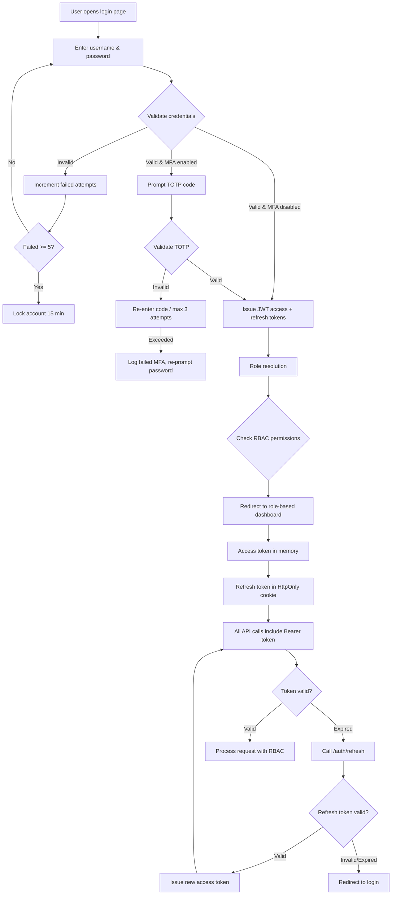
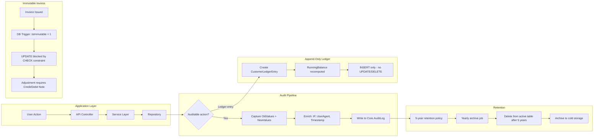

# v2.0.0 — Security Architecture

---

## Authentication Flow



---

## Audit Trail Data Flow



---

## RBAC — 16 Profiles × 27+ Permissions

| # | Permission \\ Profile | Super Admin | System Admin | Billing Manager | Billing Operator | Collections Officer | Cashier | Meter Manager | Meter Reader | Validation Officer | Support Agent | Reporting Analyst | Area Manager | Customer Service | Field Technician | Auditor | Viewer |
|---|----------------------|:-----------:|:------------:|:---------------:|:----------------:|:------------------:|:-------:|:-------------:|:------------:|:-----------------:|:-------------:|:----------------:|:------------:|:----------------:|:---------------:|:-------:|:------:|
| 1 | customer.view | ✓ | ✓ | ✓ | ✓ | ✓ | ✓ | ✓ | ✓ | ✓ | ✓ | ✓ | ✓ | ✓ | ✓ | ✓ | ✓ |
| 2 | customer.create | ✓ | ✓ | ✓ | ✓ | | | | | | | | | ✓ | | | |
| 3 | customer.edit | ✓ | ✓ | ✓ | ✓ | | | | | | | | | ✓ | | | |
| 4 | customer.delete | ✓ | | | | | | | | | | | | | | | |
| 5 | meter.view | ✓ | ✓ | ✓ | ✓ | | | ✓ | ✓ | ✓ | ✓ | | ✓ | ✓ | ✓ | ✓ | ✓ |
| 6 | meter.create | ✓ | ✓ | | | | | ✓ | | | | | | | | | |
| 7 | meter.edit | ✓ | ✓ | ✓ | ✓ | | | ✓ | | | | | | | | | |
| 8 | meter.delete | ✓ | | | | | | | | | | | | | | | |
| 9 | meter.relay | ✓ | ✓ | | | | | ✓ | | | | | | | ✓ | | |
| 10 | meter.lifecycle | ✓ | ✓ | ✓ | ✓ | | | ✓ | | | | | | | ✓ | | |
| 11 | invoice.view | ✓ | ✓ | ✓ | ✓ | ✓ | ✓ | | | | ✓ | ✓ | ✓ | ✓ | | ✓ | ✓ |
| 12 | invoice.create | ✓ | ✓ | ✓ | ✓ | | | | | | | | | | | | |
| 13 | invoice.adjust | ✓ | ✓ | ✓ | ✓ | | | | | | | | | | | | |
| 14 | invoice.cancel | ✓ | ✓ | ✓ | | | | | | | | | | | | | |
| 15 | invoice.sign | ✓ | ✓ | ✓ | | | | | | | | | | | | | |
| 16 | payment.view | ✓ | ✓ | ✓ | ✓ | ✓ | ✓ | | | | | ✓ | ✓ | ✓ | | ✓ | ✓ |
| 17 | payment.create | ✓ | ✓ | | | | ✓ | | | | | | | | | | |
| 18 | payment.reverse | ✓ | ✓ | | | | | | | | | | | | | | |
| 19 | payment.allocate | ✓ | ✓ | ✓ | | | ✓ | | | | | | | | | | |
| 20 | reading.view | ✓ | ✓ | ✓ | ✓ | | | ✓ | ✓ | ✓ | | | ✓ | | ✓ | ✓ | ✓ |
| 21 | reading.create | ✓ | ✓ | | | | | | ✓ | | | | | | ✓ | | |
| 22 | reading.approve | ✓ | ✓ | ✓ | | | | | | ✓ | | | | | | | |
| 23 | tariff.view | ✓ | ✓ | ✓ | ✓ | | | ✓ | | | | | ✓ | | | ✓ | ✓ |
| 24 | tariff.create | ✓ | ✓ | ✓ | | | | | | | | | | | | | |
| 25 | tariff.approve | ✓ | ✓ | | | | | | | | | | | | | | |
| 26 | report.run | ✓ | ✓ | ✓ | ✓ | ✓ | ✓ | ✓ | | | | ✓ | ✓ | ✓ | | ✓ | |
| 27 | admin.users | ✓ | ✓ | | | | | | | | | | | | | | |
| 28 | admin.config | ✓ | ✓ | | | | | | | | | | | | | | |
| 29 | audit.view | ✓ | ✓ | | | | | | | | | | | | | ✓ | |
| 30 | workspace.alerts | ✓ | ✓ | ✓ | ✓ | ✓ | ✓ | ✓ | ✓ | ✓ | ✓ | ✓ | ✓ | ✓ | ✓ | ✓ | ✓ |
| 31 | workspace.tickets | ✓ | ✓ | ✓ | | | | | | | ✓ | | | ✓ | | | |
| 32 | data.export | ✓ | ✓ | ✓ | ✓ | ✓ | ✓ | ✓ | ✓ | ✓ | ✓ | ✓ | ✓ | ✓ | ✓ | ✓ | |

---

## RSA 2048-bit Invoice Signing

```
Key Generation (one-time per environment):
  openssl genpkey -algorithm RSA -out invoice-signing-key.pem -pkeyopt rsa_keygen_bits:2048
  openssl rsa -pubout -in invoice-signing-key.pem -out invoice-signing-pub.pem

Signing Process:
  1. Compute SHA-256 hash of normalized invoice JSON fields
  2. Sign hash with RSA private key → 256-byte signature
  3. Store SignedDocumentHash in InvoiceDetail
  4. Embed signature in PDF metadata (visible signature line)
  5. Public key published at /api/public/invoice-signing-cert

Verification:
  GET /api/invoices/{id}/verify → returns { valid: true/false }
```

---

## JWT Token Management

| Parameter | Access Token | Refresh Token |
|-----------|-------------|---------------|
| **Expiry** | 1 hour | 24 hours |
| **Storage** | In-memory (JS variable) | HttpOnly, Secure, SameSite=Strict cookie |
| **Rotation** | Silent refresh at 45 min | Rotated on each use (old invalidated) |
| **Claims** | sub, roles[], permissions[], area[], iat, exp, jti | sub, jti, family (rotation group), exp |
| **Algorithm** | RS256 | RS256 |
| **Revocation** | Not possible (short-lived) | Token family blacklist on logout |

**Token Refresh Flow:**
1. Access token expires → 401 response
2. Client calls `POST /api/auth/refresh` (cookie sent automatically)
3. Server validates refresh token, checks family blacklist
4. Issues new access token + rotates refresh token (new jti, same family)
5. If refresh token is compromised (family reuse detected), entire family invalidated

---

## Append-Only Ledger

### `CustomerLedgerEntry`
- **No UPDATE or DELETE permitted** — enforced by DB trigger
- Each INSERT includes `RunningBalance` computed from previous entry
- Entries reference `Transaction` table for source documents
- Indexed on `(CustomerId, EntryDate)` for efficient balance queries
- Current balance is `SELECT TOP 1 RunningBalance ... ORDER BY EntryDate DESC`

### `AuditLog`
- **No DELETE or UPDATE** — enforced by application-level and DB-level restrictions
- `BIGINT IDENTITY(1,1)` primary key ensures sequential ordering
- Contains both `OldValues` and `NewValues` as JSON for full before/after capture
- Retention: 5 years rolling; archive job runs annually

---

## 5-Year Audit Retention Policy

| Data | Retention | Action at Expiry |
|------|-----------|------------------|
| AuditLog | 5 years | Archive to cold storage, delete from active table |
| CustomerLedgerEntry | Permanent | No deletion (legal/financial records) |
| InvoiceDetail | Permanent | No deletion (tax/compliance) |
| Transaction | 10 years | Archive after 10 years |
| MeterReading | 10 years | Aggregate to monthly summaries, delete detail |
| ChatMessage | 3 years | Delete after 3 years |
| NotificationQueue | 90 days | Hard delete |
| RunningActivity | 30 days | Hard delete |
| UserSession | 7 days | Hard delete after expiry |

---

## Immutable Invoices (DB Trigger)

```sql
-- Applied to Area.InvoiceDetail
CREATE TRIGGER TR_InvoiceDetail_MakeImmutable
ON Area.InvoiceDetail
AFTER UPDATE
AS
BEGIN
    SET NOCOUNT ON;
    IF EXISTS (
        SELECT 1 FROM inserted i
        JOIN deleted d ON i.InvoiceId = d.InvoiceId
        WHERE d.IsImmutable = 1
          AND (
                i.TotalAmount <> d.TotalAmount
            OR  i.NetAmount <> d.NetAmount
            OR  i.CustomerId <> d.CustomerId
            OR  i.Status <> d.Status  -- only allow Status changes (Paid/Overdue)
          )
    )
    BEGIN
        THROW 50001, 'Immutable invoice cannot be modified. Create an adjustment instead.', 1;
        ROLLBACK;
    END
END;
```

---

## MFA (TOTP)

- Standard TOTP (RFC 6238) — 30-second window, 6-digit codes
- Secret key generated on server: 160-bit random base32-encoded
- QR code rendered for Google Authenticator / Authy / any TOTP app
- Backup codes: 8 single-use codes provided at enrollment
- MFA enrollment required for: Super Admin, System Admin, Billing Manager
- Optional for all other profiles
- Rate limit: max 3 MFA attempts per login attempt; lockout after 5 failures

---

## Encryption at Rest

### AES-256 Encrypted Columns (Core DB and Area DB)

| Table | Columns Encrypted |
|-------|------------------|
| Core.User | PasswordHash (bcrypt — one-way, not AES) |
| Core.BankAccount | AccountNumber |
| Core.Area | ConnectionString |
| Area.Customer | PhoneNumber, Email, NationalId |

**Implementation:**
- SQL Server Always Encrypted (or equivalent column-level encryption)
- Master key stored in Azure Key Vault / HSM
- Column encryption key rotated every 90 days
- Application uses `ColumnEncryptionSetting=Enabled` in connection string for relevant queries

---

## Password Policy

| Parameter | Requirement |
|-----------|-------------|
| Minimum length | 12 characters |
| Complexity | Upper + Lower + Digit + Special character |
| Password history | Last 5 passwords blocked |
| Max age | 90 days |
| Account lockout | 5 failed attempts → 15-minute lockout |
| Reset link expiry | 1 hour |
| Hash algorithm | bcrypt, cost factor 12 |
| Change enforcement | First login forces password change |

---

## CORS, CSRF, Rate Limiting

### CORS Configuration
```json
{
  "AllowedOrigins": ["https://meter.example.com"],
  "AllowedMethods": ["GET", "POST", "PUT", "PATCH", "DELETE"],
  "AllowedHeaders": ["Authorization", "Content-Type", "X-CSRF-Token"],
  "ExposedHeaders": ["X-Request-Id"],
  "AllowCredentials": true,
  "MaxAge": 3600
}
```

### CSRF Protection
- Double-submit cookie pattern: random token in both cookie and `X-CSRF-Token` header
- Server validates both match for state-changing requests (POST, PUT, PATCH, DELETE)
- GET requests exempted
- Token generated per session

### Rate Limiting
| Endpoint Group | Limit | Window | Burst |
|---------------|-------|--------|-------|
| `/api/auth/*` | 5 req | 1 minute | 10 |
| `/api/*` (authenticated) | 100 req | 1 minute | 150 |
| `/api/invoices/generate` | 3 req | 5 minutes | 5 |
| `/api/payments/*` | 30 req | 1 minute | 50 |
| `/api/reports/*` | 10 req | 1 minute | 20 |
| Static assets | 1000 req | 1 minute | 2000 |
| Login endpoint | 5 req | 1 minute per IP | — |

Rate limit headers: `X-RateLimit-Limit`, `X-RateLimit-Remaining`, `X-RateLimit-Reset`
429 response includes `Retry-After` header.
