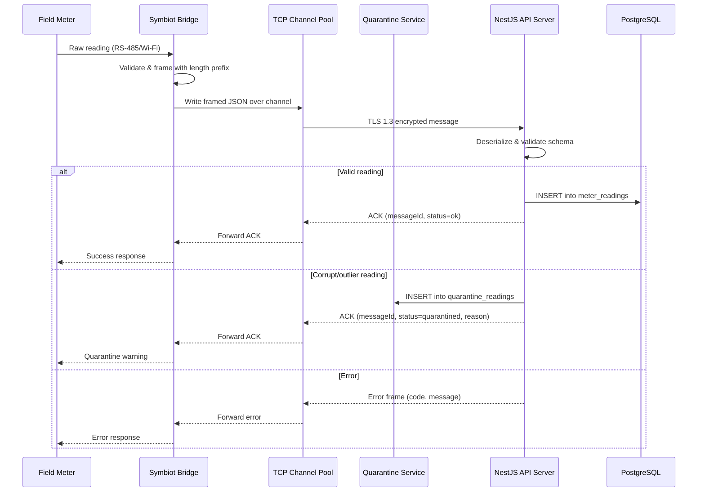
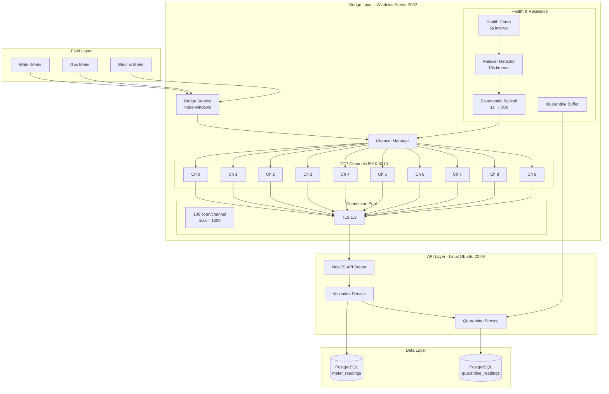

# Symbiot Bridge Integration — v2.0.0

## Architecture Overview

The Symbiot bridge connects field meter hardware to the NestJS API server via 10 dedicated TCP channels (ports 5010–5019). Each channel supports up to 100 concurrent HTTP connections, yielding a theoretical maximum of 1,000 concurrent meter connections.

## Bridge Models

| Model | Description | Use Case |
|-------|-------------|----------|
| **Per-Area** | One bridge instance per geographic area | Isolated deployments, WAN segmentation |
| **Centralized** | Single bridge managing all channels | Single-datacenter, low-latency LAN |

Both models are supported and configurable via `config/bridge.config.ts`.

## TCP Channel Specification

- **Port Range:** 5010 – 5019 (10 channels)
- **Connections per channel:** 100 max concurrent
- **Framing:** 4-byte big-endian length prefix + JSON payload
- **Protocol:** JSON-over-TCP with UTF-8 encoding
- **TLS:** TLS 1.3 mandatory between bridge and API server (mutual certificate auth optional)

## Health Check & Failover

- **Health check interval:** 5 seconds (not 30s — reduced for faster detection)
- **Dead channel detection:** 3 missed health checks = channel marked dead (~15s)
- **Auto-failover:** Traffic rerouted to healthy channels within 1 cycle
- **Reconnection backoff:**
  ```
  Attempt 1: 1s
  Attempt 2: 2s
  Attempt 3: 4s
  Attempt 4: 8s
  Attempt 5+: 30s (cap)
  ```

## Quarantine System

Readings outside acceptable thresholds are moved to a quarantine table instead of being dropped:

```
Meter Reading → Validation → [PASS] → MeterReadings (production)
                            → [FAIL] → QuarantineReadings (review)
```

Quarantined readings are flagged with a reason code and can be manually reviewed or auto-released after re-validation.

## Windows Service Management

The bridge runs as a Windows Service via `node-windows`:

| Command | Action |
|---------|--------|
| `npm run bridge:install` | Install Windows service |
| `npm run bridge:start` | Start the service |
| `npm run bridge:stop` | Stop the service |
| `npm run bridge:uninstall` | Remove the service |
| `npm run bridge:restart` | Restart the service |

Service name: `MeterSymbiotBridge`
Display name: `Meter Symbiot Bridge v2.0.0`

## Message Protocol

### Frame Structure

```
┌──────────────────────────────┐
│        4 bytes (uint32)      │  ← Payload length (big-endian)
├──────────────────────────────┤
│        N bytes (UTF-8)       │  ← JSON payload
└──────────────────────────────┘
```

### Message Envelope

```json
{
  "messageId": "uuid-v4",
  "type": "meter_reading | health_check | ack | error | config_sync",
  "timestamp": "2026-06-13T12:00:00.000Z",
  "channel": 0,
  "payload": { }
}
```

## Mermaid Diagrams

### Bridge Request Lifecycle (Sequence Diagram)



### Bridge Architecture Diagram



## Configuration (`config/bridge.config.ts`)

```typescript
export const bridgeConfig = {
  mode: 'centralized', // 'centralized' | 'per-area'
  channels: {
    startPort: 5010,
    count: 10,
    maxConnectionsPerChannel: 100,
  },
  healthCheck: {
    intervalMs: 5000,
    missedThreshold: 3,
    failoverEnabled: true,
  },
  reconnection: {
    initialDelayMs: 1000,
    maxDelayMs: 30000,
    multiplier: 2,
  },
  tls: {
    version: 'TLSv1.3',
    mutualAuth: false,
    certPath: './certs/bridge-cert.pem',
    keyPath: './certs/bridge-key.pem',
    caPath: './certs/ca-cert.pem',
  },
  quarantine: {
    enabled: true,
    autoReleaseAfterMs: 86400000, // 24h
  },
};
```
