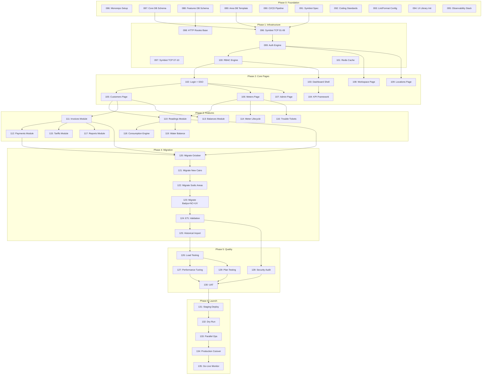

# Meter Verse v2.0.0 — Tasks (T086–T150)

## Task Dependency Graph

---

## Phase 0 — Foundation Tasks (T086–T095)

### T086: Monorepo Setup

| Field | Detail |
|-------|--------|
| **Description** | Initialize monorepo with Turborepo, pnpm workspaces, and package structure |
| **Dependencies** | None |
| **Acceptance Criteria** | `pnpm install` succeeds; all workspaces resolve; `pnpm build` produces artifacts |
| **Rollback** | `git checkout main && git branch -D feat/monorepo; rm -rf node_modules .turbo` |

### T087: Core DB Schema

| Field | Detail |
|-------|--------|
| **Description** | Design and create migration scripts for Core database: users, roles, permissions, organizations, activity_log, settings |
| **Dependencies** | T086 |
| **Acceptance Criteria** | Migrations run cleanly; all foreign keys, indexes, and constraints exist; seed data for 16 roles loads |
| **Rollback** | `npm run db:rollback -- --to 000` ; verify all Core tables dropped; restore from backup if data exists |

### T088: Features DB Schema

| Field | Detail |
|-------|--------|
| **Description** | Design and create migration scripts for Features database: notifications, audit_log, billing_cycles, payment_gateway_logs, email_sms_queue, file_storage_refs, scheduler_jobs, reports_history |
| **Dependencies** | T086 |
| **Acceptance Criteria** | All 8 tables created; indexes on foreign keys; audit_log has JSONB detail column |
| **Rollback** | `npm run db:rollback -- --to 000 --db features` ; truncate all data before rollback |

### T089: Area DB Template

| Field | Detail |
|-------|--------|
| **Description** | Create the 15-table template for area databases with all constraints, indexes, and partitioning strategy |
| **Dependencies** | T086 |
| **Acceptance Criteria** | Template script creates customers, meters, readings, invoices, payments, balances, tariffs, meter_lifecycle, trouble_tickets, contracts, connections, zones, accounts_receivable, area_config, local_cache |
| **Rollback** | Drop template schema: `DROP SCHEMA IF EXISTS area_template CASCADE` |

### T090: CI/CD Pipeline

| Field | Detail |
|-------|--------|
| **Description** | Configure GitHub Actions for build, lint, test, docker build, and deploy to K8s dev namespace |
| **Dependencies** | T086 |
| **Acceptance Criteria** | PR triggers CI; merge to main triggers CD; deployment to dev namespace completes in < 10 min |
| **Rollback** | Revert GitHub Actions workflow file; `kubectl rollout undo deployment/meter-verse -n dev` |

### T091: Symbiot Bridge Specification

| Field | Detail |
|-------|--------|
| **Description** | Write detailed API spec for Symbiot bridge: 10 TCP channels, 100 HTTP routes, message formats, error codes |
| **Dependencies** | T087, T088, T089 |
| **Acceptance Criteria** | Document covers all route definitions, request/response schemas, authentication flow, rate limiting strategy |
| **Rollback** | Revert spec document to previous commit |

### T092: Coding Standards

| Field | Detail |
|-------|--------|
| **Description** | Establish TypeScript coding standards, naming conventions, file structure, and architectural patterns |
| **Dependencies** | T086 |
| **Acceptance Criteria** | Document approved by team; eslint config enforces standards |
| **Rollback** | Revert eslint config and docs |

### T093: Lint/Format Configuration

| Field | Detail |
|-------|--------|
| **Description** | Configure ESLint, Prettier, Husky pre-commit hooks, and commitlint with conventional commits |
| **Dependencies** | T086 |
| **Acceptance Criteria** | `pnpm lint` passes on all files; `pnpm format` fixes formatting; commit message validation works |
| **Rollback** | Remove husky hooks: `npx husky uninstall` ; revert config files |

### T094: UI Library Initialization

| Field | Detail |
|-------|--------|
| **Description** | Initialize shared UI component library with Storybook, base components (Button, Input, Card, Table, Badge, Modal, FormField) |
| **Dependencies** | T086 |
| **Acceptance Criteria** | Storybook runs with 20+ base components; components are tree-shakeable; all pass a11y checks |
| **Rollback** | Remove package from workspace; revert package.json |

### T095: Observability Stack

| Field | Detail |
|-------|--------|
| **Description** | Deploy Prometheus, Grafana, Loki, Tempo to K8s; configure metrics export from Node.js services |
| **Dependencies** | T086 |
| **Acceptance Criteria** | Grafana dashboard shows service metrics; Loki ingests structured logs; traces visible in Tempo |
| **Rollback** | `helm uninstall observability -n monitoring` ; remove instrumentation code |

---

## Phase 1 — Infrastructure Tasks (T096–T101)

### T096: Symbiot TCP Channels 01-06

| Field | Detail |
|-------|--------|
| **Description** | Implement TCP channels for auth, customer sync, meter registry, reading ingestion, invoice generation, payment processing |
| **Dependencies** | T087, T089, T091 |
| **Acceptance Criteria** | All 6 channels establish persistent connections; message format validated; throughput > 1000 msg/s per channel |
| **Rollback** | Gracefully close TCP listeners; switch to HTTP fallback; restart bridge service |

### T097: Symbiot TCP Channels 07-10

| Field | Detail |
|-------|--------|
| **Description** | Implement TCP channels for notifications, audit replication, cache invalidation, health monitoring |
| **Dependencies** | T096 |
| **Acceptance Criteria** | Health channel reports status every 5s; audit channel replicates with < 1s delay |
| **Rollback** | Same as T096 |

### T098: HTTP Route Handler Framework

| Field | Detail |
|-------|--------|
| **Description** | Build the base HTTP route handler with area-aware routing, request validation, error handling, rate limiting |
| **Dependencies** | T087, T088 |
| **Acceptance Criteria** | 40 base routes operational; area_id header correctly routes to area DB; rate limiting returns 429 at threshold |
| **Rollback** | Revert route definitions; restore previous router config |

### T099: Authentication Engine

| Field | Detail |
|-------|--------|
| **Description** | Implement JWT-based authentication with refresh tokens, session management, and multi-tenant area scoping |
| **Dependencies** | T096 |
| **Acceptance Criteria** | Login returns access + refresh tokens; token validation checks expiry, signature, area access; refresh flow works |
| **Rollback** | Revoke all tokens: invalidate Redis session store; force re-login |

### T100: RBAC Engine

| Field | Detail |
|-------|--------|
| **Description** | Implement role-based access control with permission matrix covering all 16 profiles and 14 pages |
| **Dependencies** | T099 |
| **Acceptance Criteria** | Each role has correct permissions; middleware rejects unauthorized access; permission inheritance works |
| **Rollback** | Restore previous RBAC policy from backup; clear permission cache |

### T101: Redis Cache Layer

| Field | Detail |
|-------|--------|
| **Description** | Set up Redis with area-based key isolation, cache-aside pattern, and TTL-based invalidation |
| **Dependencies** | T096 |
| **Acceptance Criteria** | Cache hit ratio > 80% under load; invalidation propagates to all bridge instances within 500ms |
| **Rollback** | Flush Redis: `redis-cli FLUSHALL` ; disable cache at application level |

---

## Phase 2 — Core Pages Tasks (T102–T109)

### T102: Login Page + SSO

| Field | Detail |
|-------|--------|
| **Description** | Build login page with Azure AD SSO, TOTP 2FA, password reset flow, and session timeout handling |
| **Dependencies** | T099, T100 |
| **Acceptance Criteria** | SSO login completes in < 3s; 2FA enrollment works; password reset email sent; idle timeout redirects |
| **Rollback** | Feature flag toggle: `FF_NEW_LOGIN=false` ; revert to old login page |

### T103: Dashboard Shell

| Field | Detail |
|-------|--------|
| **Description** | Build dashboard layout with sidebar navigation, header (area selector, user menu, notifications), and content area |
| **Dependencies** | T100 |
| **Acceptance Criteria** | Sidebar shows role-filtered menu; area selector switches context; responsive design works at all breakpoints |
| **Rollback** | Revert layout changes; serve previous dashboard version |

### T104: KPI Framework

| Field | Detail |
|-------|--------|
| **Description** | Build metric card component with trend indicators, sparklines, and alert state; create KPI data API |
| **Dependencies** | T103 |
| **Acceptance Criteria** | 6 KPI cards render; data refreshes every 60s; sparklines show 30-day trend; alert state shows red banner |
| **Rollback** | Remove KPI feature flag; serve static placeholder cards |

### T105: Customers Page

| Field | Detail |
|-------|--------|
| **Description** | Build customers list with virtual scrolling, search/filter, profile panel, contract timeline, and bulk actions |
| **Dependencies** | T102 |
| **Acceptance Criteria** | Loads 10K rows in < 2s; search returns results in < 500ms; profile panel shows all tabs; contract timeline renders |
| **Rollback** | Route revert: serve previous customers page from old codebase |

### T106: Meters Page

| Field | Detail |
|-------|--------|
| **Description** | Build meters registry with status badges, assignment dialog, filter bar, and meter detail panel |
| **Dependencies** | T102 |
| **Acceptance Criteria** | Status badges show correct colors; assignment updates in real-time; filter bar supports 8 filter dimensions |
| **Rollback** | Route revert; feature flag toggle |

### T107: Admin Page

| Field | Detail |
|-------|--------|
| **Description** | Build user management with CRUD, role editor with permission matrix visualization, system configuration panel |
| **Dependencies** | T102 |
| **Acceptance Criteria** | User CRUD works; permission matrix shows all 16 roles × 14 pages; config changes take effect without restart |
| **Rollback** | Restore previous admin page; revert user/role changes from audit log |

### T108: Workspace Page

| Field | Detail |
|-------|--------|
| **Description** | Build user workspace with preferences panel, recent items list, pinned shortcuts, and activity feed |
| **Dependencies** | T099 |
| **Acceptance Criteria** | Preferences saved to DB; recent items show last 20 actions; shortcuts are configurable |
| **Rollback** | Reset user preferences to defaults; clear recent items cache |

### T109: Locations Page

| Field | Detail |
|-------|--------|
| **Description** | Build zone tree with drag-and-drop reordering, hierarchy editor, and geo-map integration (Leaflet/Mapbox) |
| **Dependencies** | T099 |
| **Acceptance Criteria** | Tree loads with 1000+ nodes; drag-drop updates hierarchy; map shows zone boundaries |
| **Rollback** | Revert location tree to previous version; restore zone hierarchy from backup |

---

## Phase 3 — Features Tasks (T110–T119)

### T110: Readings Module

| Field | Detail |
|-------|--------|
| **Description** | Build reading capture form, validation rules engine, approval workflow (pending → approved/rejected), history chart |
| **Dependencies** | T105, T106 |
| **Acceptance Criteria** | Capture form saves reading; validation flags out-of-range values; approval changes status; chart shows 12-month trend |
| **Rollback** | Soft-delete erroneous readings; revert to previous reading state |

### T111: Invoices Module

| Field | Detail |
|-------|--------|
| **Description** | Build invoice generation engine, list/detail views, bulk print/email, credit note workflow, invoice status state machine |
| **Dependencies** | T105 |
| **Acceptance Criteria** | Invoice generates with correct tariff application; status transitions follow state machine; credit note reverses balance |
| **Rollback** | Void generated invoices; delete invoice batch via admin function |

### T112: Payments Module

| Field | Detail |
|-------|--------|
| **Description** | Build payment collection entry, allocation to invoices (partial/full), receipt generation, and refund workflow |
| **Dependencies** | T111 |
| **Acceptance Criteria** | Payment entry allocates correctly; receipt PDF generates; refund reverses allocation and updates balance |
| **Rollback** | Reverse payment: create reversal transaction; regenerate receipt |

### T113: Balances Module

| Field | Detail |
|-------|--------|
| **Description** | Build running balance calculation, aging schedule (30/60/90/120+), adjustment journal entries, and statement view |
| **Dependencies** | T105, T111 |
| **Acceptance Criteria** | Balance calculation matches invoice - payment + adjustments; aging buckets correct; adjustment posts with audit trail |
| **Rollback** | Reverse adjustment entries; recalculate balance from transaction log |

### T114: Meter Lifecycle Module

| Field | Detail |
|-------|--------|
| **Description** | Build meter status state machine (available→assigned→active→offline→faulty→replaced→terminated→retired), event log, action triggers |
| **Dependencies** | T106 |
| **Acceptance Criteria** | All 8 status transitions enforced; event log timestamps every change; action triggers send notifications |
| **Rollback** | Revert meter to previous status; clear event log entries for erroneous transitions |

### T115: Tariffs Module

| Field | Detail |
|-------|--------|
| **Description** | Build rate table editor, tiered pricing (block tariffs), effective date scheduling, and tariff assignment to customer categories |
| **Dependencies** | T111 |
| **Acceptance Criteria** | Rate table supports 5 tiers; effective date scheduling works; tariff applied correctly during invoice generation |
| **Rollback** | Revert tariff to previous version; regenerate affected invoices |

### T116: Trouble Tickets Module

| Field | Detail |
|-------|--------|
| **Description** | Build ticket create/assign/work/resolve/close flow with SLA tracking, priority matrix, and customer communication log |
| **Dependencies** | T106 |
| **Acceptance Criteria** | Ticket status transitions follow workflow; SLA timer starts on assign; priority matrix determines response SLA |
| **Rollback** | Reopen closed tickets; reassign incorrectly assigned tickets |

### T117: Reports Module

| Field | Detail |
|-------|--------|
| **Description** | Build report framework with 10+ pre-built templates (collections, aging, consumption, exceptions), parameter forms, PDF/CSV export |
| **Dependencies** | T111 |
| **Acceptance Criteria** | All templates render correct data; parameter filtering works; PDF exports in < 10s for 1000 rows |
| **Rollback** | Remove generated reports; revert report template definitions |

### T118: Consumption Calculation Engine

| Field | Detail |
|-------|--------|
| **Description** | Build the consumption calculation pipeline: reading → threshold check → tariff lookup → charge calculation → line item generation |
| **Dependencies** | T110 |
| **Acceptance Criteria** | Calculation matches manual computation for 100 test cases; threshold flags anomalous readings; line items roll up correctly |
| **Rollback** | Recalculate consumption batch; regenerate affected invoice line items |

### T119: Water Balance Computation

| Field | Detail |
|-------|--------|
| **Description** | Build water balance engine: compare main meter consumption vs sum of sub-meters, calculate variance, flag discrepancies |
| **Dependencies** | T110 |
| **Acceptance Criteria** | Variance calculation matches within 1% tolerance; discrepancies > 5% flagged; balance report generates |
| **Rollback** | Recalculate balance period; clear temporary variance records |

---

## Phase 4 — Migration Tasks (T120–T125)

### T120: Migrate October Area

| Field | Detail |
|-------|--------|
| **Description** | Write and execute migration scripts for October area: 45K customers, 45K meters, 500K+ readings, invoice/payment history |
| **Dependencies** | T110, T111, T112 |
| **Acceptance Criteria** | All tables populated; row counts match source; foreign keys valid; checksums verified |
| **Rollback** | `npm run migrate:rollback -- --area october` ; truncate all area tables; restore from pre-migration backup |

### T121: Migrate New Cairo Area

| Field | Detail |
|-------|--------|
| **Description** | Migrate New Cairo area: 38K customers, 38K meters, 400K+ readings |
| **Dependencies** | T120 |
| **Acceptance Criteria** | Same as T120 |
| **Rollback** | `npm run migrate:rollback -- --area new_cairo` |

### T122: Migrate Sodic Areas

| Field | Detail |
|-------|--------|
| **Description** | Migrate Sodic EDNC (12.5K), Sodic Estates (8.2K), Sodic Vye (6.8K) areas |
| **Dependencies** | T121 |
| **Acceptance Criteria** | All 3 areas migrated; cross-area references (Sodic corporate customers) maintained |
| **Rollback** | `npm run migrate:rollback -- --area sodic_ednc,sodic_estates,sodic_vye` |

### T123: Migrate Badya + North Coast + Uvines Mall

| Field | Detail |
|-------|--------|
| **Description** | Migrate Badya City (22K), North Coast (4.5K), Uvines Mall (1.2K) areas |
| **Dependencies** | T122 |
| **Acceptance Criteria** | All 3 areas migrated; North Coast seasonal tariff structure preserved |
| **Rollback** | `npm run migrate:rollback -- --area badya_city,north_coast,uvines_mall` |

### T124: ETL Validation Framework

| Field | Detail |
|-------|--------|
| **Description** | Build ETL validation: row counts, column checksums, referential integrity checks, data-type conformance, duplicate detection |
| **Dependencies** | T123 |
| **Acceptance Criteria** | Validation report covers all tables; checksums match source 100%; zero orphans detected |
| **Rollback** | N/A — validation is read-only |

### T125: Historical Data Import

| Field | Detail |
|-------|--------|
| **Description** | Import 12-24 months of historical readings, invoices, payments, and balance snapshots for all 8 areas |
| **Dependencies** | T124 |
| **Acceptance Criteria** | Historical balances match source system; invoice sequence continuity maintained; audit trail complete |
| **Rollback** | Truncate imported history tables; re-import from source backup |

---

## Phase 5 — Quality Tasks (T126–T130)

### T126: Load Testing

| Field | Detail |
|-------|--------|
| **Description** | Execute load tests with k6 simulating 500 concurrent users across all areas; measure throughput, latency, error rates |
| **Dependencies** | T125 |
| **Acceptance Criteria** | P95 latency < 500ms for reads, < 2s for writes; zero errors at 500 concurrent users; CPU < 70% |
| **Rollback** | Scale down test infrastructure; analyze bottleneck, no system change |

### T127: Performance Tuning

| Field | Detail |
|-------|--------|
| **Description** | Optimize slow queries (add indexes, rewrite N+1 queries), tune cache TTLs, adjust connection pool sizes |
| **Dependencies** | T126 |
| **Acceptance Criteria** | All queries < 100ms after tuning; cache hit ratio > 85%; connection pool utilization < 60% |
| **Rollback** | Revert index changes: `DROP INDEX IF EXISTS <name>` ; restore previous pool config |

### T128: Security Audit

| Field | Detail |
|-------|--------|
| **Description** | Run OWASP ZAP scan, dependency audit (npm audit, Snyk), secret scanning (truffleHog), and manual penetration testing |
| **Dependencies** | T124 |
| **Acceptance Criteria** | Zero critical/high findings; medium findings documented with remediation plan; dependency licenses verified |
| **Rollback** | Patch vulnerable dependencies; revert insecure code; invalidate exposed secrets |

### T129: Availability Plan Testing

| Field | Detail |
|-------|--------|
| **Description** | Test Safety Plan (degraded at 70% load) and Failover Plan (area DB outage, replica promotion, recovery) |
| **Dependencies** | T126 |
| **Acceptance Criteria** | Safety Plan activates at threshold; degraded reads work; Failover completes in < 120s; data loss < 60s RPO |
| **Rollback** | Restore primary DB; disable failover mode; re-sync missed writes |

### T130: User Acceptance Testing

| Field | Detail |
|-------|--------|
| **Description** | Conduct UAT sessions with area managers, team leaders, operators from all 8 areas; collect sign-off |
| **Dependencies** | T127, T128, T129 |
| **Acceptance Criteria** | All 8 areas sign off; critical blockers resolved; known issues documented |
| **Rollback** | N/A — testing activity; no system changes |

---

## Phase 6 — Launch Tasks (T131–T135)

### T131: Staging Deployment

| Field | Detail |
|-------|--------|
| **Description** | Deploy v2.0.0 to staging environment with production-scale data; run full integration test suite |
| **Dependencies** | T130 |
| **Acceptance Criteria** | All smoke tests pass; staging mirrors production configuration; monitoring dashboards operational |
| **Rollback** | `kubectl rollout undo deployment/meter-verse -n staging` ; restore previous staging version |

### T132: Full Dry Run

| Field | Detail |
|-------|--------|
| **Description** | Execute complete dry run: all 8 areas, 14 pages, 16 roles, all 3 availability plans |
| **Dependencies** | T131 |
| **Acceptance Criteria** | Dry run checklist 100% complete; no data corruption; rollback scripts verified |
| **Rollback** | Restore staging from pre-dry-run snapshot |

### T133: Parallel Operations

| Field | Detail |
|-------|--------|
| **Description** | Run old system and v2.0.0 in parallel for 3 days; compare outputs (invoices, balances, readings) |
| **Dependencies** | T132 |
| **Acceptance Criteria** | 100% match on all compared outputs; discrepancies resolved before cutover |
| **Rollback** | Switch all traffic back to old system; flag v2.0.0 as read-only for analysis |

### T134: Production Cutover

| Field | Detail |
|-------|--------|
| **Description** | Execute production cutover: DNS switch, database cutover, enable write mode on v2.0.0 |
| **Dependencies** | T133 |
| **Acceptance Criteria** | Cutover completed in < 30min; all services healthy; first invoices generated successfully |
| **Rollback** | **CRITICAL**: Execute full rollback: switch DNS back, enable old system writes, run data sync from v2.0.0 → old system |

### T135: Go-Live Monitoring

| Field | Detail |
|-------|--------|
| **Description** | 24/7 monitoring for first 72 hours post-launch; track error rates, latency, throughput, business KPIs |
| **Dependencies** | T134 |
| **Acceptance Criteria** | Error rate < 0.1%; P95 latency within SLA; all business KPIs reporting correctly |
| **Rollback** | Execute T134 rollback if critical metrics breached for > 15min |

---

## Phase 7 — Hypercare (T136–T139)

### T136: On-Call Setup

| Field | Detail |
|-------|--------|
| **Description** | Establish 24/7 on-call rotation with escalation matrix; set up PagerDuty/Grafana OnCall integration |
| **Dependencies** | T135 |
| **Acceptance Criteria** | On-call schedule published; escalation paths defined; alert fatigue minimized |
| **Rollback** | Modify on-call schedule; adjust alert thresholds |

### T137: Bug Fix Sprint 1

| Field | Detail |
|-------|--------|
| **Description** | Triage and fix production defects; prioritize severity (S0/S1 within 4h, S2 within 24h, S3 within 72h) |
| **Dependencies** | T135 |
| **Acceptance Criteria** | All S0/S1 bugs fixed; S2 bugs have workaround; v2.0.1 released |
| **Rollback** | Revert hotfix; restore previous artifact from registry |

### T138: User Feedback Triage

| Field | Detail |
|-------|--------|
| **Description** | Collect and categorize user feedback from all 8 areas; prioritize for v2.1.0 |
| **Dependencies** | T135 |
| **Acceptance Criteria** | Feedback log maintained; top 10 items scheduled for next release |
| **Rollback** | N/A |

### T139: Documentation Updates

| Field | Detail |
|-------|--------|
| **Description** | Update runbooks, operations guide, user manual based on real-world production experience |
| **Dependencies** | T135 |
| **Acceptance Criteria** | All documents reviewed and published to internal wiki |
| **Rollback** | Revert to previous version in wiki history |

---

## Phase 8 — Optimization (T140–T142)

### T140: Query Performance Optimization

| Field | Detail |
|-------|--------|
| **Description** | Analyze slow query log; add composite indexes; rewrite ORM queries; implement query result caching |
| **Dependencies** | T137 |
| **Acceptance Criteria** | P99 query latency < 200ms; no sequential scans on tables > 10K rows |
| **Rollback** | Drop added indexes; revert query changes |

### T141: Frontend Bundle Optimization

| Field | Detail |
|-------|--------|
| **Description** | Implement code splitting, lazy loading, image optimization, and tree-shaking improvements |
| **Dependencies** | T137 |
| **Acceptance Criteria** | Lighthouse Performance score > 90; initial bundle < 200KB gzipped |
| **Rollback** | Revert webpack/vite config; serve previous bundle |

### T142: CI/CD Pipeline Optimization

| Field | Detail |
|-------|--------|
| **Description** | Optimize build caching, parallelize test stages, reduce Docker image size with multi-stage builds |
| **Dependencies** | T137 |
| **Acceptance Criteria** | CI pipeline < 10min; CD pipeline < 5min; Docker image < 200MB |
| **Rollback** | Revert CI/CD config; restore previous pipeline definition |

---

## Phase 9 — Scale (T143–T145)

### T143: Symbiot Horizontal Scaling

| Field | Detail |
|-------|--------|
| **Description** | Enable multi-instance Symbiot bridge with shared-nothing architecture; implement consistent hashing for TCP channels |
| **Dependencies** | T142 |
| **Acceptance Criteria** | 3 bridge instances handle 2x load; zero message loss during scale events |
| **Rollback** | Scale down to single instance; disable consistent hashing |

### T144: Read Replica Setup

| Field | Detail |
|-------|--------|
| **Description** | Deploy read replicas for high-volume area DBs; configure pgpool/pgbouncer for read/write splitting |
| **Dependencies** | T143 |
| **Acceptance Criteria** | Read queries routed to replicas; replica lag < 1s; failover automatic |
| **Rollback** | Remove replicas; reconfigure connection pooler for single endpoint |

### T145: Auto-scaling Policies

| Field | Detail |
|-------|--------|
| **Description** | Configure HPA for K8s pods based on CPU, memory, and custom metrics (request latency, queue depth) |
| **Dependencies** | T143 |
| **Acceptance Criteria** | Pods scale within 2min of load spike; scale-down respects cooldown period |
| **Rollback** | Remove HPA config; set fixed replica count |

---

## Phase 10 — Expand (T146–T147)

### T146: Area Onboarding Automation

| Field | Detail |
|-------|--------|
| **Description** | Build automated area provisioning: create area DB, run migrations, configure Symbiot routing, set up monitoring |
| **Dependencies** | T145 |
| **Acceptance Criteria** | New area provisioned in < 30min via single CLI command; all checks pass automatically |
| **Rollback** | Deprovision area: drop DB, remove routing config, clean monitoring |

### T147: Area 09 + Area 10 Onboarding

| Field | Detail |
|-------|--------|
| **Description** | Use automation to provision and onboard Area 09 and Area 10 into production |
| **Dependencies** | T146 |
| **Acceptance Criteria** | Both areas operational; data migrated; users active; first billing cycle completed |
| **Rollback** | Deprovision areas; restore customers to manual process |

---

## Phase 11 — Maturity (T148–T150)

### T148: Technical Debt Reduction

| Field | Detail |
|-------|--------|
| **Description** | Refactor legacy code, improve type coverage, remove dead code, consolidate duplicate utilities |
| **Dependencies** | T147 |
| **Acceptance Criteria** | TypeScript strict mode passes; no `any` types; 0 dead code paths |
| **Rollback** | Revert refactored modules individually; each refactor is atomic |

### T149: Test Coverage Enhancement

| Field | Detail |
|-------|--------|
| **Description** | Increase unit test coverage to 90%+, add integration tests for all API routes, E2E tests for critical paths |
| **Dependencies** | T148 |
| **Acceptance Criteria** | Coverage >= 90%; all API routes have integration tests; 5 E2E scenarios pass |
| **Rollback** | Revert test changes; coverage threshold is advisory |

### T150: Architecture Documentation

| Field | Detail |
|-------|--------|
| **Description** | Write Architecture Decision Records (ADRs) for all major decisions; create system context diagrams; document deployment architecture |
| **Dependencies** | T148 |
| **Acceptance Criteria** | 15+ ADRs approved; C4 diagrams for all levels; deployment topology documented |
| **Rollback** | Revert ADR documents; restore previous documentation version |

---

## Reserved Tasks

These tasks are reserved for future scope and are not part of the initial v2.0.0 release. They will be prioritized in post-launch phases.

| ID | Description | Target Phase |
|----|-------------|--------------|
| T151 | Multi-language i18n framework | Phase 9 |
| T152| Mobile app (React Native) | Phase 10 |
| T153 | Advanced analytics / ML predictions | Phase 11 |
| T154 | Payment gateway integration (e.g., Fawry, Vodafone Cash) | Phase 8 |
| T155 | WhatsApp/chatbot notifications | Phase 9 |
| T156 | Self-service customer portal (extended) | Phase 10 |
| T157 | Automated meter reading (AMR) integration | Phase 11 |
| T158 | GIS integration with real-time mapping | Phase 10 |
| T159 | Multi-currency support | Phase 11 |
| T160 | Regulatory compliance reporting | Phase 9 |
