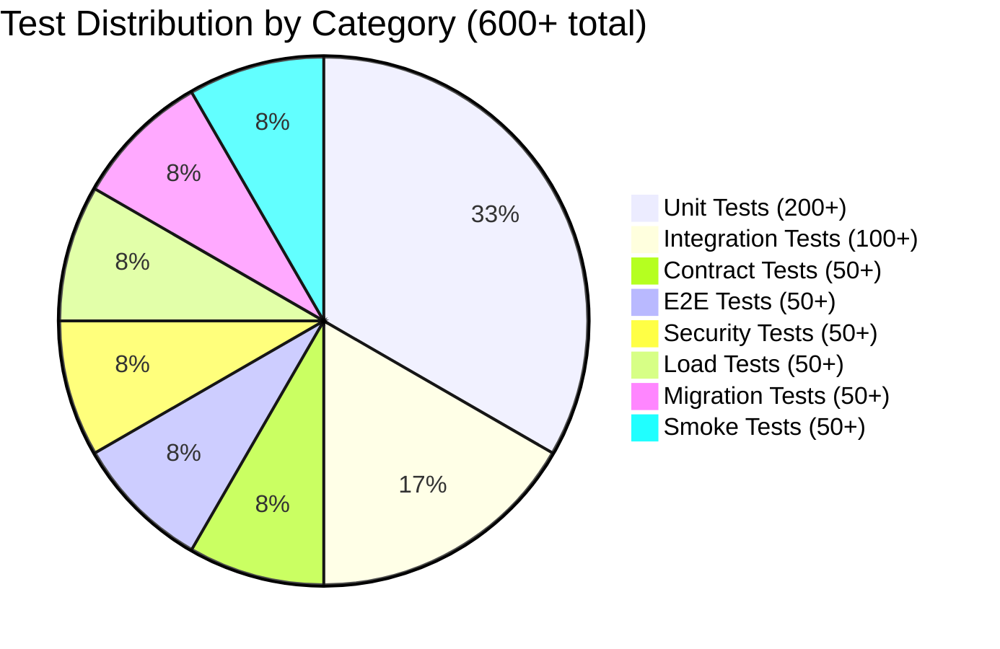
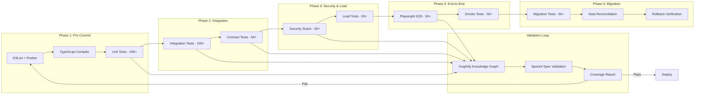

# Test Plan — v2.0.0

## Target: 600+ Total Tests

| Category | Count | Tools | Focus |
|----------|-------|-------|-------|
| Unit | 200+ | Jest, ts-jest | Services, guards, decorators, utilities, pipes, interceptors |
| Integration | 100+ | Jest, supertest | DB operations (TypeORM), module interactions, middleware chains |
| Contract | 50+ | OpenAPI validator, Zod | API schema validation, request/response shape enforcement |
| E2E | 50+ | Playwright | Critical user journeys: login, meter reading, dashboard, admin |
| Security | 50+ | OWASP ZAP, Helmet tests | Auth bypass, CSRF, XSS, SQL injection, JWT manipulation |
| Load | 50+ | k6, Artillery | 20 concurrent users, sustained throughput, ramp-up scenarios |
| Migration | 50+ | Custom test runner | Data reconciliation, rollback verification, seed data integrity |
| Smoke | 50+ | Jest, ESLint, build pipeline | Build passes, lint clean, server starts, health endpoint responds |

## Coverage Requirements

- **Line coverage:** >80% across all source files
- **Branch coverage:** >70%
- **Critical path coverage:** 100% (auth, payment, meter reading ingestion, bridge communication)
- **Coverage enforcement:** CI pipeline fails if thresholds not met

## Test Distribution



## Test Pipeline



## Critical User Journeys (E2E)

| Journey | Steps | Validates |
|---------|-------|-----------|
| User Login | Navigate → Fill credentials → Submit → Dashboard loads | Auth flow, session, redirects |
| Meter Reading Entry | Navigate to meter → Enter reading → Save → Confirmation | Form validation, API call, DB write |
| Dashboard Load | Login → Dashboard page → Charts render | Data aggregation, API response |
| Admin User Management | Login as admin → User list → Create user → Edit → Delete | RBAC, CRUD operations |
| Bridge Health View | Login → Bridge status page → Channel status visible | Real-time status, WebSocket |
| Report Generation | Navigate to reports → Select date range → Generate → Download | Background job, file generation |
| Password Reset | Request reset → Email link → New password → Login | Email service, token expiry |
| Role Switching | Login as operator → Switch to admin view → Restrictions applied | Permission boundaries |

## Load Test Scenarios (k6)

```javascript
// Key scenarios executed during load tests
export const scenarios = {
  typical_load: {
    executor: 'ramping-vus',
    stages: [
      { duration: '2m', target: 20 },  // Ramp up to 20 users
      { duration: '5m', target: 20 },  // Stay at 20
      { duration: '2m', target: 0 },   // Ramp down
    ],
  },
  stress_test: {
    executor: 'ramping-vus',
    stages: [
      { duration: '2m', target: 50 },
      { duration: '3m', target: 100 },
      { duration: '2m', target: 0 },
    ],
    thresholds: {
      http_req_failed: ['rate<0.01'],   // <1% errors
      http_req_duration: ['p(95)<2000'], // 95% under 2s
    },
  },
  spike_test: {
    executor: 'ramping-vus',
    stages: [
      { duration: '30s', target: 200 },
      { duration: '1m', target: 200 },
      { duration: '30s', target: 0 },
    ],
  },
};
```

## Graphify + SpeckIt Loop

After each test phase completes, the Graphify tool generates a knowledge graph of the codebase and SpeckIt validates the output against the OpenAPI specification:

1. Run test phase
2. `npx graphify generate` — produce knowledge graph with god nodes
3. `npx speckit validate` — validate graph against spec
4. If validation fails, block pipeline and report diff
5. If validation passes, proceed to next phase

This ensures that implementation always stays aligned with the specification and that architectural decisions are traceable through the graph.
