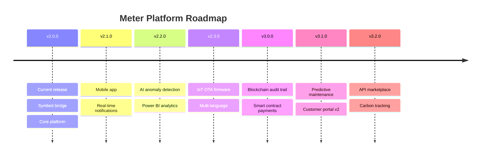

# Upcoming Updates — Beyond v2.0.0

This file tracks features reserved for future releases. No implementation details are committed — this is a lightweight placeholder for roadmap items.

## Future Feature Backlog

| Feature | Description | Target |
|---------|-------------|--------|
| Mobile App | React Native app for field technicians | v2.1.0 |
| Real-time Notifications | WebSocket-based push alerts for anomalies | v2.1.0 |
| AI Anomaly Detection | ML models to detect consumption outliers | v2.2.0 |
| Advanced Analytics | Power BI dashboard integration | v2.2.0 |
| IoT Device Management | Firmware OTA updates for field meters | v2.3.0 |
| Multi-language Expansion | Support for additional locales beyond AR/EN | v2.3.0 |
| Blockchain Audit Trail | Immutable ledger for meter readings | v3.0.0 |
| Smart Contract Payments | On-chain billing and payment settlement | v3.0.0 |
| Predictive Maintenance | ML-based meter failure prediction | v3.1.0 |
| Customer Portal v2 | Self-service account management | v3.1.0 |
| API Marketplace | Third-party integrator API catalog | v3.2.0 |
| Carbon Footprint Tracking | Per-meter CO2e emission reports | v3.2.0 |

## Mermaid Timeline

This file will be updated as each release is planned and scoped.
