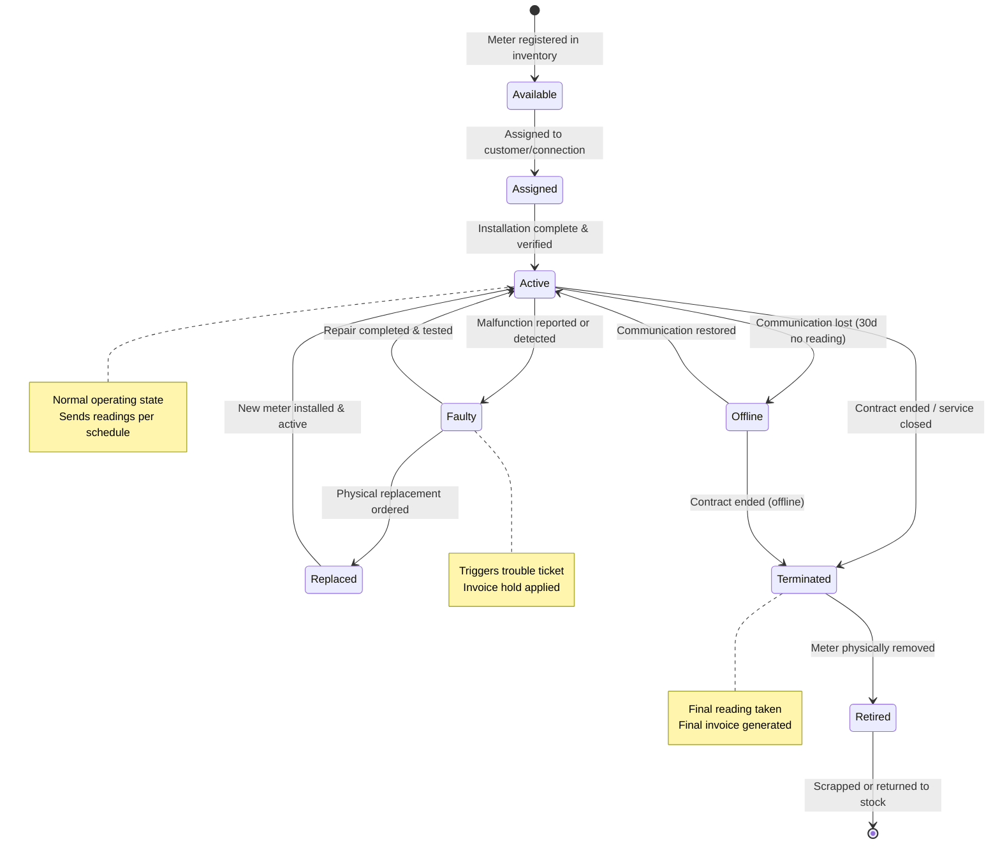
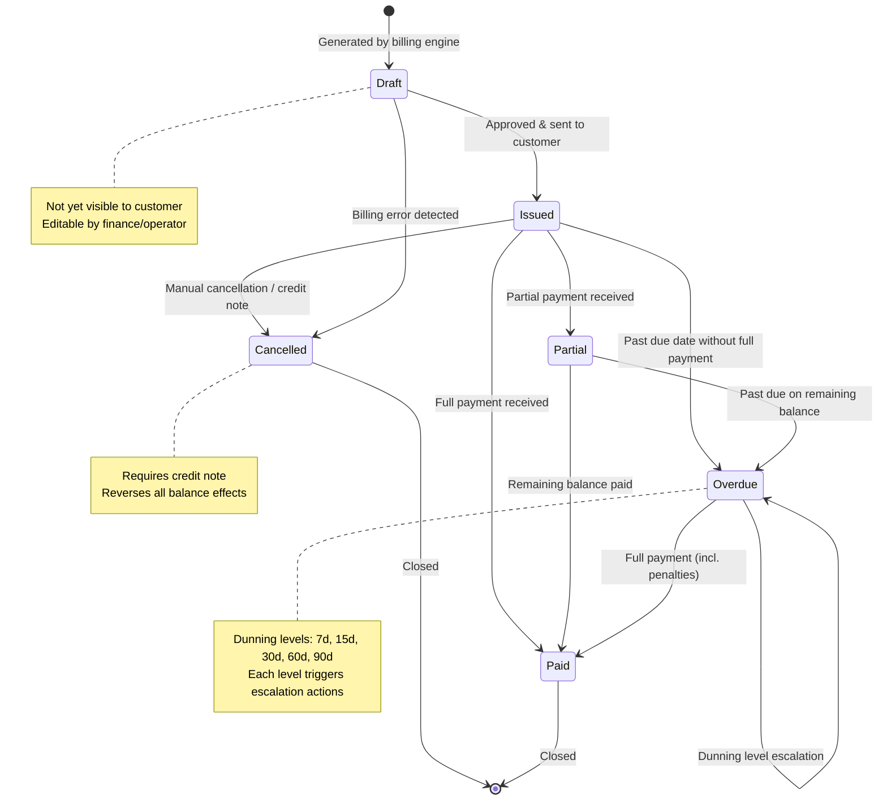
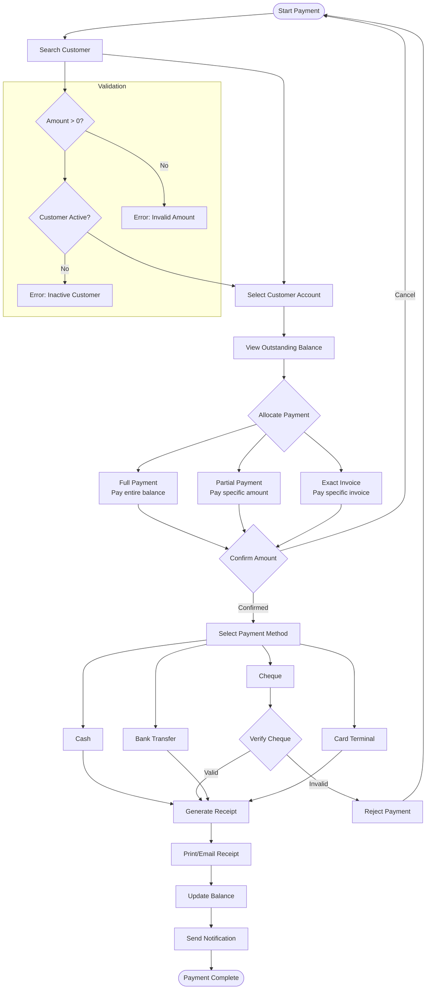
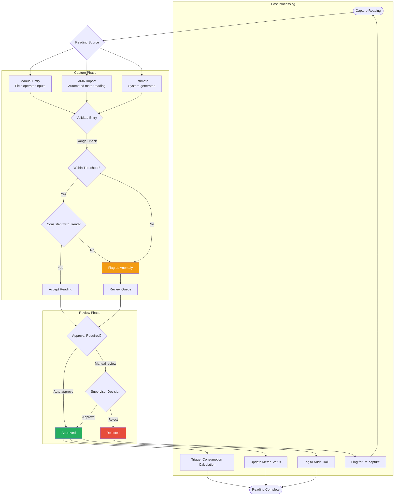
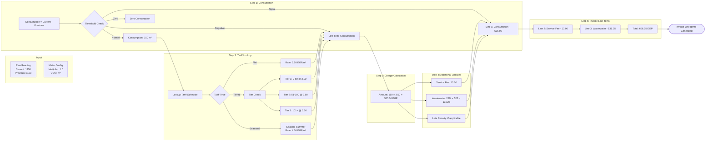
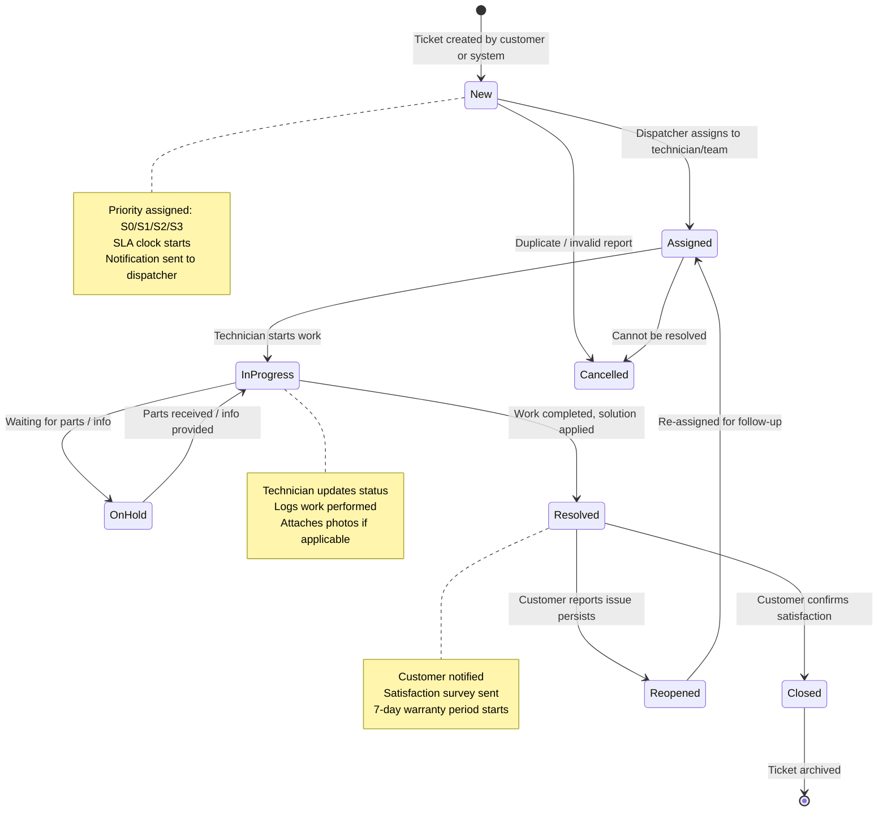
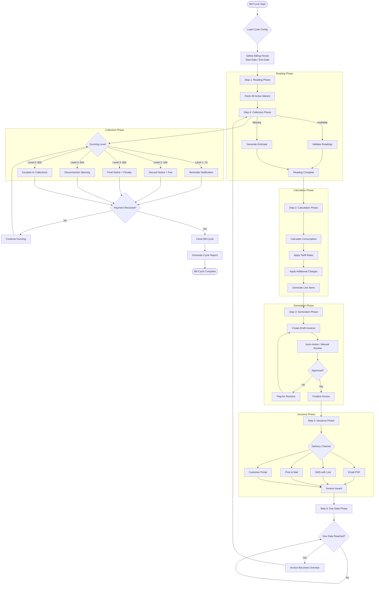
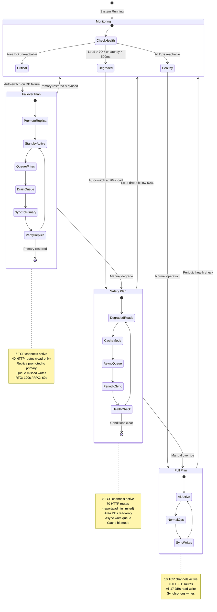

# Meter Verse v2.0.0 — Workflows & State Machines

This document defines 9 core business workflows as Mermaid state diagrams and flowcharts. Each diagram represents a complete, production-grade state machine or process flow.

---

## 1. Meter Lifecycle State Machine (8 Statuses)

The meter lifecycle tracks every meter from inventory through installation, operation, and eventual retirement. Each status transition is audited and may trigger downstream actions (invoice holds, notifications, etc.).



### Status Definitions

| Status | Description | Duration |
|--------|-------------|----------|
| `Available` | In inventory, not yet assigned | Indefinite |
| `Assigned` | Allocated to a customer/connection | 1-14 days |
| `Active` | Installed and reporting readings | Months-years |
| `Offline` | No communication for 30+ days | Variable |
| `Faulty` | Malfunction reported, repair pending | 1-30 days |
| `Replaced` | Old meter removed, new one installed | 1-7 days |
| `Terminated` | Service ended, awaiting removal | 1-90 days |
| `Retired` | Physically removed, end of life | Final |

### Transition Table

| From | To | Trigger | System Action |
|------|----|---------|---------------|
| Available | Assigned | Contract activation | Create assignment record |
| Assigned | Active | Installation confirmation | Start reading schedule |
| Active | Offline | 30d no reading received | Set flag, notify team |
| Active | Faulty | Customer report / diagnostic | Create trouble ticket, hold invoices |
| Offline | Active | Reading received | Clear flag, resume billing |
| Faulty | Active | Repair verification | Close ticket, release invoice hold |
| Faulty | Replaced | Replacement order | Create work order |
| Replaced | Active | New meter installed | Link new meter, close old |
| Active | Terminated | Contract closure | Generate final reading/invoice |
| Offline | Terminated | Service closure | Generate final invoice (estimated) |
| Terminated | Retired | Physical removal | Update inventory, archive records |

---

## 2. Invoice Lifecycle State Machine



### Invoice States

| State | Description | Customer Visible |
|-------|-------------|------------------|
| `Draft` | Generated, pending review | No |
| `Issued` | Approved and delivered | Yes |
| `Partial` | Partially paid | Yes |
| `Paid` | Fully paid, settled | Yes |
| `Overdue` | Past due date | Yes |
| `Cancelled` | Voided via credit note | No (hidden) |

---

## 3. Payment Flow



### Payment Allocation Rules

| Allocation Type | Behavior |
|----------------|----------|
| Full Payment | Pays entire outstanding balance across all invoices (oldest first) |
| Partial Payment | Pays a specified amount applied to oldest invoices first |
| Exact Invoice | Pays one specific invoice in full or partial |
| Prepayment | Credits balance before invoice generation |

---

## 4. Reading Flow



### Reading Validation Rules

| Rule | Description | Action on Failure |
|------|-------------|-------------------|
| Range Check | Reading must be between 0 and meter max capacity | Flag as anomaly, require review |
| Trend Check | Reading must not deviate > 50% from 3-month rolling average | Flag as anomaly, require review |
| Minimum Check | Reading must be >= last reading (non-decreasing) | Flag for zero/negative consumption review |
| Duplicate Check | No two readings within 24h for same meter | Reject duplicate |
| Bounds Check | Commercial meters max 10,000; residential max 1,000 | Flag if exceeded |

---

## 5. Water Balance Computation

The water balance compares the main (parent) meter's consumption against the sum of all sub-meters (children) to calculate distribution variance.

```mermaid
flowchart TD
    START([Water Balance Calculation]) --> PERIOD[Select Billing Period]
    PERIOD --> MAIN[Get Main Meter Reading]
    MAIN --> SUBS[Get All Sub-Meter Readings]

    SUBS --> SUM[Calculate Total Sub-Meter Consumption]
    SUM --> GROSS[Calculate Main Meter Consumption]
    
    GROSS --> VARIANCE[Variance = Main - Sum(Subs)]
    VARIANCE --> CHECK{Check Variance}
    
    CHECK -->|Variance < 1%| NORMAL[✅ Normal Balance]
    CHECK -->|Variance 1-5%| ACCEPTABLE[⚠ Acceptable Loss]
    CHECK -->|Variance 5-10%| INVESTIGATE[🔍 Flag for Investigation]
    CHECK -->|Variance > 10%| ALERT[🚨 Critical Alert]

    NORMAL --> REPORT[Generate Balance Report]
    ACCEPTABLE --> REPORT
    INVESTIGATE --> CREATE_TICKET[Create Trouble Ticket]
    ALERT --> CREATE_TICKET
    CREATE_TICKET --> REPORT
    
    REPORT --> DISTRIBUTION{Distribution Type}
    DISTRIBUTION --> PROPORTIONAL[Proportional: Distribute variance by consumption ratio]
    DISTRIBUTION --> SEQUENTIAL[Sequential: Assign to last sub-meter]
    DISTRIBUTION --> MANUAL[Manual: Supervisor adjusts allocation]
    
    PROPORTIONAL --> FINALIZE[Finalize Balance]
    SEQUENTIAL --> FINALIZE
    MANUAL --> FINALIZE
    
    FINALIZE --> END([Balance Complete])

    subgraph "Variance Components"
        LOSS[Physical Loss: Leaks, theft]
        ERROR[Meter Error: Calibration drift]
        TIMING[Timing: Different reading dates]
    end
```

### Variance Thresholds

| Threshold | Level | Action |
|-----------|-------|--------|
| < 1% | Normal | Auto-approve, no action |
| 1-5% | Acceptable | Note in report, monitor trend |
| 5-10% | Investigation Required | Create trouble ticket, assign to inspector |
| > 10% | Critical | Immediate supervisor alert, possible shut-off |

---

## 6. Consumption Calculation Pipeline



### Calculation Formula

```
Consumption = (Current Reading - Previous Reading) × Meter Multiplier

If Consumption < 0:     Flag as negative, require manual review
If Consumption = 0:     Flag as zero consumption, check for fault
If Consumption > 2×Avg: Flag as spike, check for leak or error

For each consumption block:
  Block Amount = Block Volume × Block Rate

Total Charge = Σ(Block Amounts) + Service Fee + Wastewater Fee + Penalties
Wastewater Fee = Consumption Charge × Wastewater Rate (25%)
```

---

## 7. Trouble Ticket Flow



### Ticket Priority Matrix

| Priority | Response SLA | Resolution SLA | Example |
|----------|-------------|----------------|---------|
| S0 - Critical | 15 min | 4 hours | No water, major leak, fire |
| S1 - High | 1 hour | 24 hours | Meter burst, no billing |
| S2 - Medium | 4 hours | 72 hours | Faulty meter, billing error |
| S3 - Low | 24 hours | 7 days | General inquiry, cosmetic issue |

---

## 8. Bill Cycle Flow



### Bill Cycle Timeline

| Day | Phase | Activity |
|-----|-------|----------|
| 1 | Reading | Start collecting readings |
| 7 | Reading | Reading phase ends, estimates for missing |
| 8 | Calculation | Run consumption & tariff engine |
| 10 | Generation | Draft invoices created |
| 12 | Review | Approval or revision |
| 15 | Issuance | Invoices sent to customers |
| 45 | Due Date | Payment due (30 days from issuance) |
| 52 | Overdue L1 | 7d reminder sent |
| 60 | Overdue L2 | 15d notice + late fee |
| 75 | Overdue L3 | 30d final notice + penalty |
| 105 | Overdue L4 | 60d disconnection warning |
| 135 | Overdue L5 | 90d collections escalation |

---

## 9. Availability Plans — Switching Logic



### Switching Logic (Pseudocode)

```
monitor():
  every 5s:
    for each area_db:
      latency = ping(area_db)
      load = get_cpu_load()
      
      if latency > 1000ms or not reachable:
        trigger(FAILOVER, area_db)
      elif load > 70% or latency > 500ms:
        trigger(SAFETY)
      else:
        if current_plan != FULL and conditions_clear_for(300s):
          trigger(FULL)

trigger(FULL):
  enable_all_tcp_channels()
  enable_all_http_routes()
  set_all_dbs_read_write()
  flush_async_queue()
  log("Switched to Full Plan")

trigger(SAFETY):
  disable_tcp_channels([07, 08, 09, 10])
  disable_http_routes([/reports/*, /admin/*])
  set_area_dbs_read_only()
  enable_async_write_queue()
  enable_cache_hit_mode()
  log("Switched to Safety Plan")

trigger(FAILOVER, area):
  promote_replica(area)
  update_routing_table(area, replica_endpoint)
  disable_tcp_channels([04, 05, 06, 07, 08, 09])
  disable_http_routes([/payments/*, /invoices/*, /readings/*])
  start_write_queue(area)
  notify_ops_team(area)
  log("Switched to Failover Plan for", area)
```

---

## Summary: Workflow Matrix

| # | Workflow | Type | States/Nodes | Triggers | SLA |
|---|----------|------|-------------|----------|-----|
| 1 | Meter Lifecycle | State Machine | 8 states, 12 transitions | Contract, reading, report | N/A |
| 2 | Invoice Lifecycle | State Machine | 6 states, 9 transitions | Payment, date, cancel | N/A |
| 3 | Payment Flow | Flowchart | 20+ nodes | Customer action | < 30s |
| 4 | Reading Flow | Flowchart | 15+ nodes | Reading event | < 5s |
| 5 | Water Balance | Flowchart | 18 nodes | Billing period | < 60s |
| 6 | Consumption Calculation | Pipeline | 15 nodes | Reading approved | < 3s |
| 7 | Trouble Ticket | State Machine | 7 states, 9 transitions | Customer/system | Per priority |
| 8 | Bill Cycle | Flowchart | 25+ nodes | Schedule | 15 days |
| 9 | Availability Plans | State Machine | 3 plans, 6 transitions | Health check | 5s detection |
