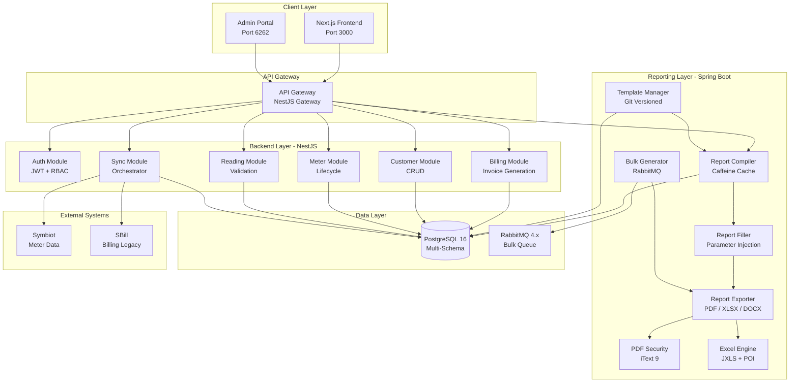
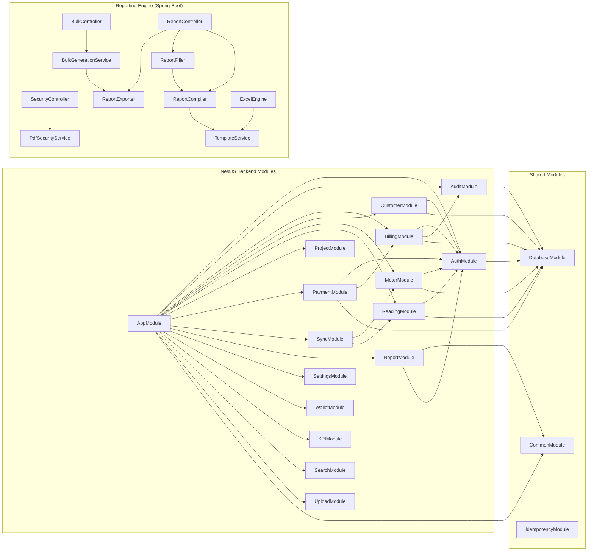
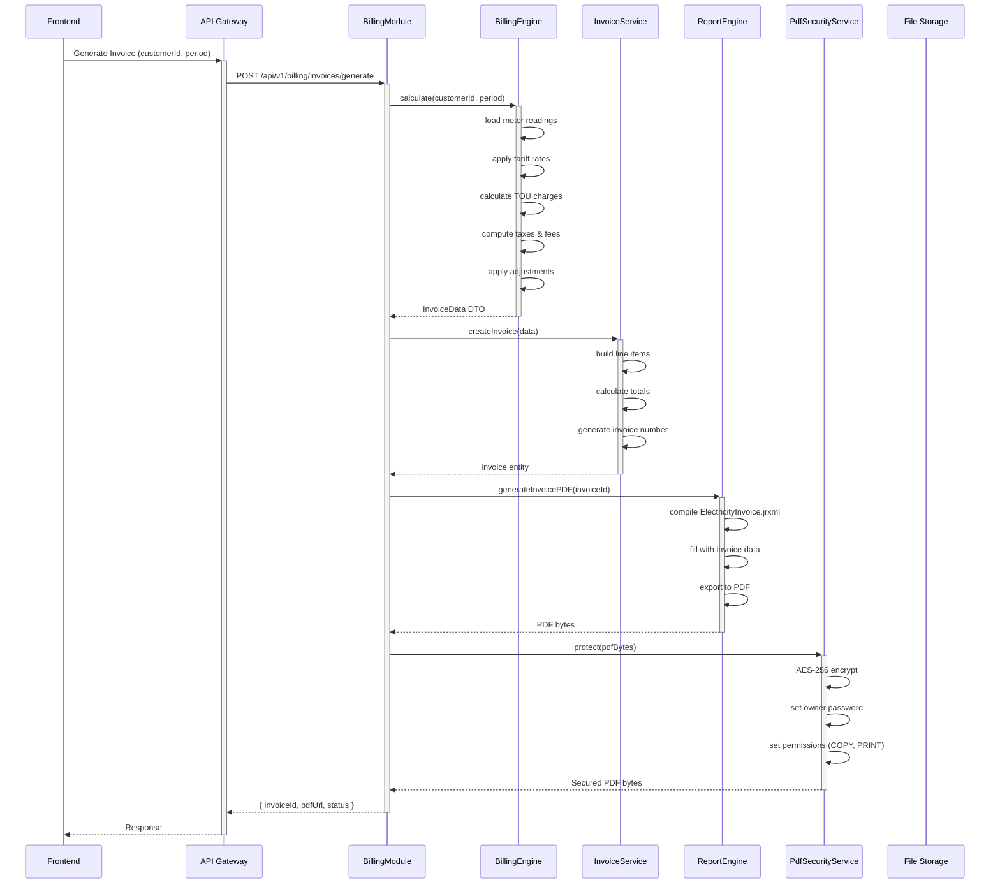
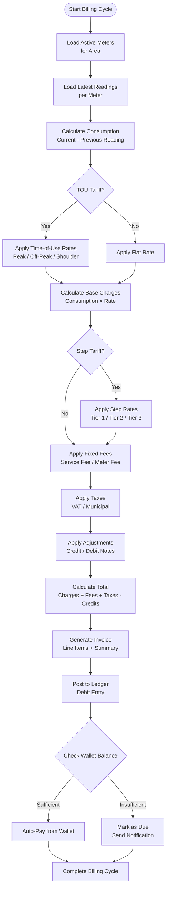
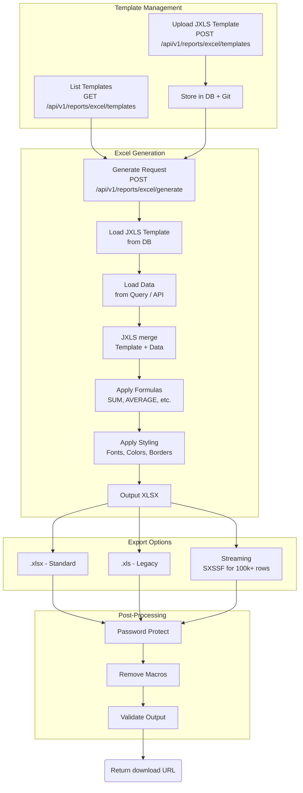
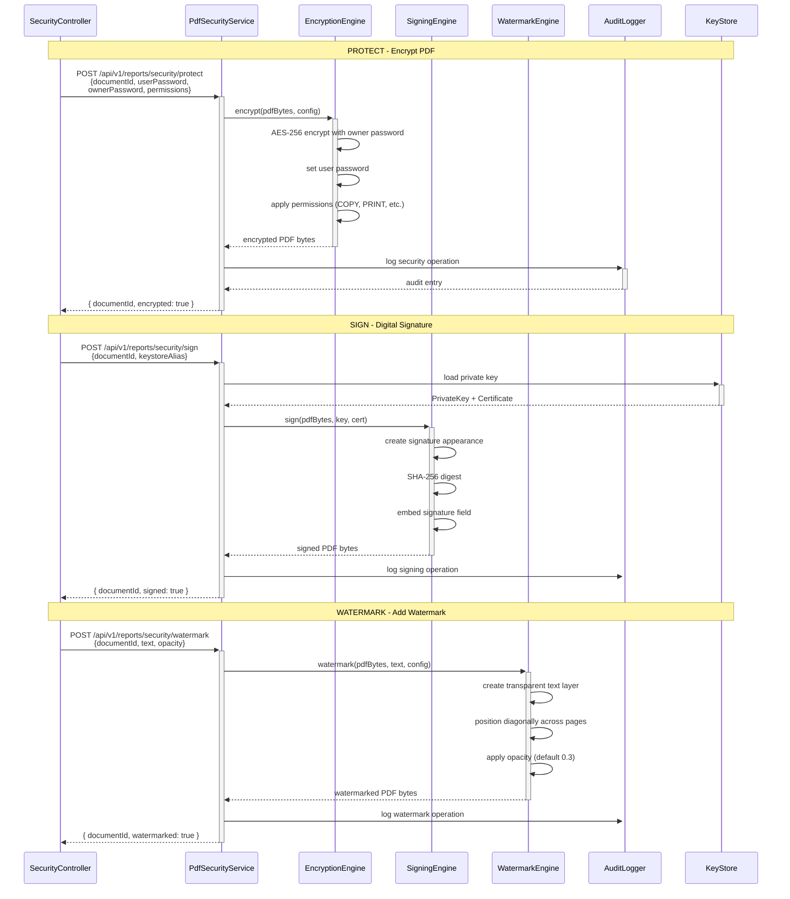
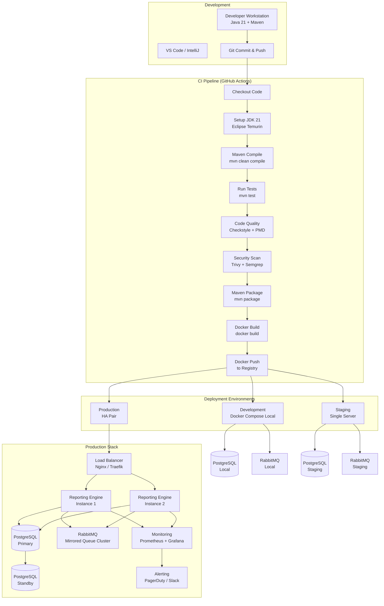
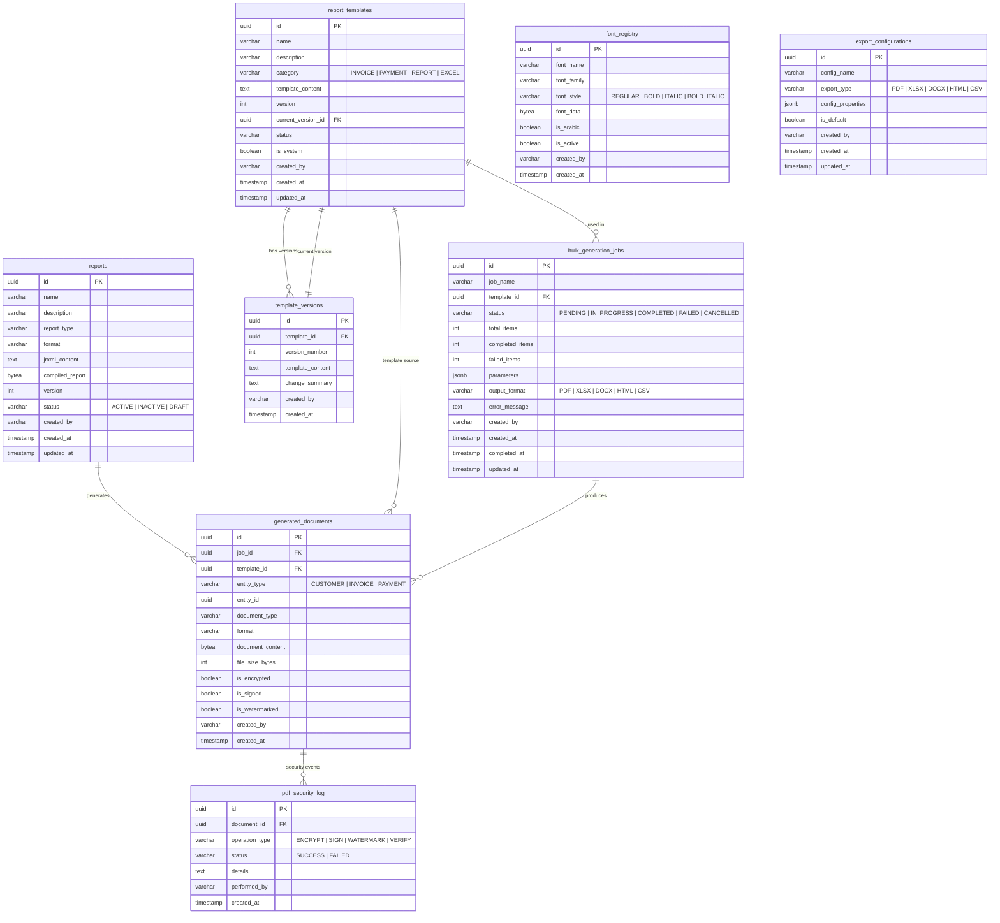

# Meter Verse — Architecture Diagrams

**Version:** 2.0.0
**Date:** 2026-06-27
**Author:** Architecture Team

---

## Table of Contents

1. [Project Architecture Overview](#1-project-architecture-overview)
2. [Module Dependency Graph](#2-module-dependency-graph)
3. [Report Pipeline Flow](#3-report-pipeline-flow)
4. [Invoice Pipeline Flow](#4-invoice-pipeline-flow)
5. [Billing Calculation Flow](#5-billing-calculation-flow)
6. [Bulk Generation Flow](#6-bulk-generation-flow)
7. [Excel Engine Flow](#7-excel-engine-flow)
8. [PDF Security Flow](#8-pdf-security-flow)
9. [Deployment Flow](#9-deployment-flow)
10. [Database Relationship Diagram](#10-database-relationship-diagram)

---

## 1. Project Architecture Overview



---

## 2. Module Dependency Graph



---

## 3. Report Pipeline Flow

```mermaid
sequenceDiagram
    participant Client as Frontend / API Client
    participant Ctrl as ReportController
    participant Comp as ReportCompiler
    participant Fill as ReportFiller
    participant Exp as ReportExporter
    participant Cache as Caffeine Cache
    participant DB as PostgreSQL
    participant FS as File System

    Client->>+Ctrl: POST /api/v1/reports/generate<br/>{templateId, params, format}
    Ctrl->>+Comp: compileReport(templateId)

    Comp->>+DB: load JRXML content
    DB-->>-Comp: JRXML bytes

    Comp->>+Cache: get(templateId)
    alt Cache Hit
        Cache-->>Comp: Cached JasperReport
    else Cache Miss
        Comp->>Comp: JasperCompileManager.compile()
        Comp->>-Cache: put(templateId, compiled)
        Cache-->>Comp: JasperReport
    end
    Comp-->>-Ctrl: JasperReport object

    Ctrl->>+Fill: fillReport(report, params)
    Fill->>Fill: setReportParameters(params)
    Fill->>Fill: setLocale(locale)
    Fill->>Fill: applyRTLConfig()
    Fill->>+DB: execute query datasource
    DB-->>-Fill: ResultSet data
    Fill->>Fill: JasperFillManager.fill()
    Fill-->>-Ctrl: JasperPrint object

    Ctrl->>+Exp: exportReport(print, format)
    alt PDF
        Exp->>Exp: JasperExportManager.exportToPdf()
    else XLSX
        Exp->>Exp: JRXlsxExporter.export()
    else DOCX
        Exp->>Exp: JRRtfExporter.export()
    else HTML
        Exp->>Exp: JRHtmlExporter.export()
    else CSV
        Exp->>Exp: JRCsvExporter.export()
    end
    Exp-->>-Ctrl: byte[] output

    Ctrl->>Ctrl: store document record in DB
    Ctrl-->>-Client: { documentId, format, size, url }
```

---

## 4. Invoice Pipeline Flow



---

## 5. Billing Calculation Flow



---

## 6. Bulk Generation Flow

```mermaid
sequenceDiagram
    participant UI as Frontend / Admin
    participant API as BulkController
    participant SVC as BulkGenerationService
    participant QUEUE as RabbitMQ Queue
    participant CONSUMER as BulkConsumer (x5)
    participant ENGINE as ReportEngine
    participant DB as PostgreSQL
    participant STORE as Document Store

    UI->>+API: POST /api/v1/reports/bulk<br/>{templateId, customerIds[], format}
    API->>+SVC: createBulkJob(request)
    SVC->>SVC: validate request
    SVC->>SVC: generate jobId
    SVC->>+DB: INSERT bulk_generation_jobs
    SVC-->>-API: { jobId, status: PENDING }

    loop For each customer (batched)
        SVC->>QUEUE: send batch message
        QUEUE-->>SVC: ack
    end

    SVC-->>-UI: { jobId, totalItems, status }

    par Consumer 1 (parallel)
        CONSUMER->>+QUEUE: dequeue message
        QUEUE-->>-CONSUMER: batch payload
        CONSUMER->>+ENGINE: generateReport(customerId)
        ENGINE-->>-CONSUMER: PDF bytes
        CONSUMER->>+STORE: store document
        CONSUMER->>+DB: UPDATE generated_documents
        CONSUMER->>+DB: UPDATE job progress
    and Consumer 2
        CONSUMER->>+QUEUE: dequeue message
        QUEUE-->>-CONSUMER: batch payload
        CONSUMER->>+ENGINE: generateReport(customerId)
        ENGINE-->>-CONSUMER: PDF bytes
        CONSUMER->>+STORE: store document
        CONSUMER->>+DB: UPDATE generated_documents
        CONSUMER->>+DB: UPDATE job progress
    end

    UI->>+API: GET /api/v1/reports/bulk/{jobId}/status
    API->>+DB: SELECT progress, total, status
    DB-->>-API: { progress: 450/1000, status: IN_PROGRESS }
    API-->>-UI: Status update

    Note over CONSUMER: After all items processed
    CONSUMER->>+DB: UPDATE job status = COMPLETED

    UI->>+API: GET /api/v1/reports/bulk/{jobId}/status
    API->>+DB: SELECT status
    DB-->>-API: { status: COMPLETED, downloadUrl: ... }
    API-->>-UI: Final status
```

---

## 7. Excel Engine Flow



---

## 8. PDF Security Flow



---

## 9. Deployment Flow



---

## 10. Database Relationship Diagram



---

*End of Architecture Diagrams*
