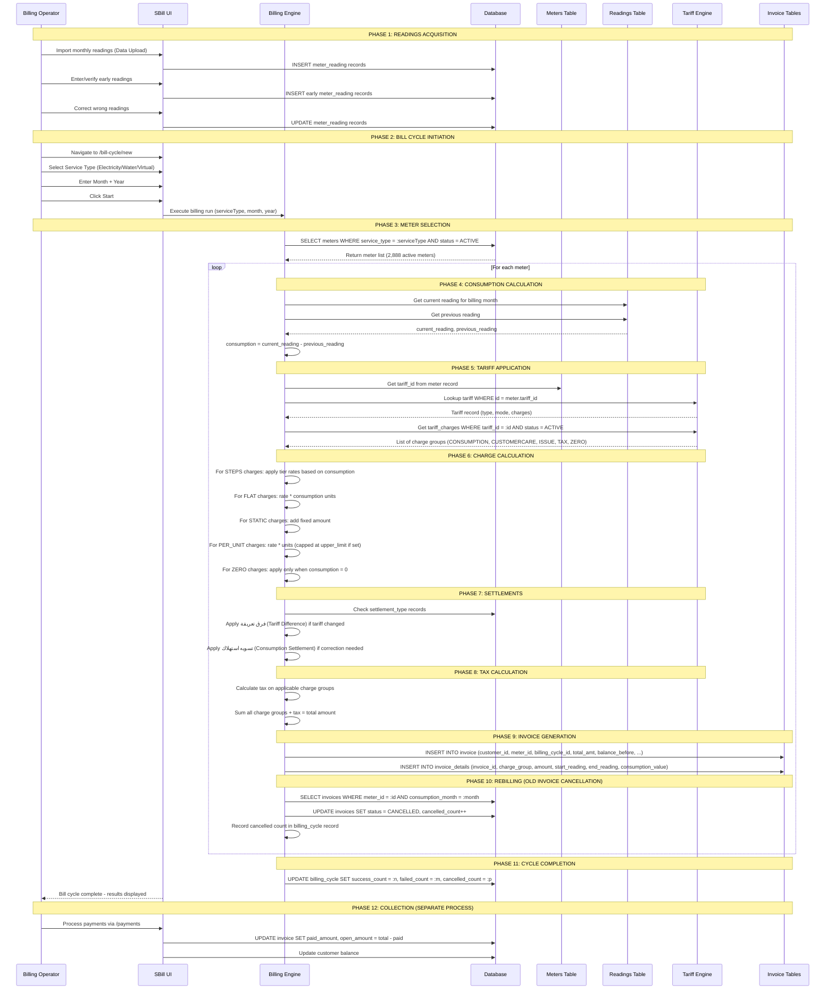

# B2: Complete Billing Workflow Map

## Overview

The billing workflow in SBill is a **batch processing pipeline** that starts with meter readings and ends with posted invoices and updated customer balances. Each run is scoped to a specific **utility type** (Electricity, Water, or Virtual variants) and **billing period** (Month + Year).

---

## Mermaid Sequence Diagram

---

## Detailed Phase Breakdown

### Phase 1: Readings Acquisition
- **Monthly readings**: Bulk-imported via **Data Upload** screen (CSV/Excel files from field meter readers)
- **Early readings**: Manually entered via **Early Readings** screen for meters read ahead of schedule
- **Validation**: Operator reviews readings for anomalies, corrects wrong values

### Phase 2: Bill Cycle Initiation
- Operator navigates to **Run Bill Cycle** under Settings
- Chooses **Service Type** (Electricity, Water, Electricity Virtual, Water Virtual)
- Enters **Month** and **Year**
- System validates form fields, enables **Start** button
- On Start, the backend **Billing Engine** is invoked

### Phase 3: Meter Selection
- System queries all meters matching the selected service type
- Only **ACTIVE** meters are included (2,888 of 2,913 total)
- Excluded: INACTIVE (2), NEW (23 — not yet commissioned)

### Phase 4: Consumption Calculation
- For each meter: `consumption = current_reading_value - previous_reading_value`
- Current reading = reading for the billing month
- Previous reading = last recorded reading before billing month
- Units: kWh for Electricity, m³ for Water

### Phase 5: Tariff Application
- Each meter has a `tariff_id` foreign key
- System looks up the tariff table for an **ACTIVE** tariff whose `start_date`/`end_date` covers the billing month
- Tariff defines the pricing structure (type, mode, charge groups)

### Phase 6: Charge Calculation
Charges are categorized by `charge_group`:

| Charge Group | Description | Calculation |
|---|---|---|
| CONSUMPTION | Usage-based charges | STEPS (tiered) or FLAT rate |
| CUSTOMERCARE | Fixed service fees | STATIC amount |
| ISSUE | Invoice issuance fee | STATIC or PER_UNIT |
| TAX | Government taxes | Percentage of subtotal |
| ZERO | Applied when consumption = 0 | STATIC amount |

Charge types:
- **STEPS**: Tiered rates — sort `tariff_charges_details` by `from_usage` ascending, apply each tier's `rate_value` to consumption in that range
- **FLAT**: `rate_value * consumption_units`
- **STATIC**: Fixed `flat_amount` added regardless of consumption
- **PER_UNIT**: `rate_value * units` with optional `upper_limit` cap
- **ZERO**: Triggered only when consumption = 0 (minimum charge)

### Phase 7: Settlements
- **فرق تعريفة (Tariff Difference)**: Applied when a tariff change mid-period causes rate differences — system calculates the delta
- **تسويه استهلاك (Consumption Settlement)**: Applied when previously estimated readings are replaced with actual readings
- Both limited to **1 month** lookback (Allowed Months = 1)

### Phase 8: Tax Calculation
- Tax charges are computed as a percentage of the taxable subtotal
- Added as a separate `invoice_details` row with `charge_group = 'TAX'`

### Phase 9: Invoice Generation
- One invoice record per meter per billing cycle
- `invoice_details` records store each line item (charge group breakdown)
- Fields: `start_reading`, `end_reading`, `consumption_value`, `amount`

### Phase 10: Rebilling (Old Invoice Cancellation)
- If this is a rebill (same period, same meter), the system cancels previous invoices
- Old invoices get `status = CANCELLED`
- The cancelled count increments in the `billing_cycle` record
- **Evidence**: Cycle 1 shows -21,882 success + 21,882 cancelled = 0 net (full rebill migration)

### Phase 11: Cycle Completion
- System updates the billing_cycle record with final counts
- UI displays the results (success, failed, cancelled counts)

### Phase 12: Collection (Separate Process)
- Payment collection is a **separate workflow** via the Payments screen
- Each payment updates `invoice.paid_amount` and `invoice.open_amount`
- Customer balance is updated accordingly

---

## Key Business Rules

1. **Billing is per utility type** — Electricity and Water are always separate cycles
2. **ACTIVE meters only** — Only meters in Active status are billed
3. **Rebilling cancels old** — Previous invoices for the same meter/period are cancelled, not deleted
4. **Negative success = net cancellation** — When more old invoices are cancelled than new ones generated
5. **Settlements are limited** — Both settlement types allow only 1 month adjustment window
