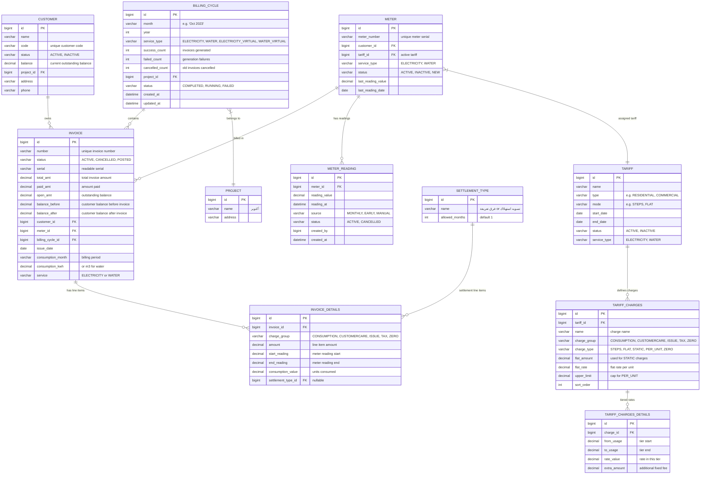

# B3: Billing Cycle ERD

## Entity-Relationship Diagram



---

## Table Descriptions

### `billing_cycle`
Central orchestrating table. Each row is a single billing run.

| Field | Source Evidence |
|---|---|
| `month` | From Bill Cycle page: "Jan 2000", "Oct 2023" |
| `service_type` | From page: ELECTRICITY, WATER |
| `success_count` | Live data shows 860, 887, -21882 (can be negative for rebills) |
| `cancelled_count` | Live data shows 611, 618, 21882 |
| `project_id` | FK to project (single project: ID=1 "أكتوبر") |

### `invoice`
Core billing record. Links customer, meter, and billing cycle.

| Field | Source Evidence |
|---|---|
| `number` | Invoice 33620: "2018-11-UUUUUUU1" format |
| `status` | ACTIVE, CANCELLED |
| `consumption_kwh` | Invoice 33620: 1480.711 kWh |
| `total_amt` | Invoice 33620: 2,214.13 EGP |
| `paid_amt` / `open_amt` | 90% paid rate from dashboard: 147,860,893 paid / 163,626,755 total |
| `balance_before` / `balance_after` | Tracks customer balance impact |
| `service` | Matches billing_cycle.service_type |

### `invoice_details`
Line items for each invoice, one per charge group.

| Field | Source Evidence |
|---|---|
| `charge_group` | CONSUMPTION, CUSTOMERCARE, ISSUE, TAX, ZERO |
| `start_reading` / `end_reading` | Meter reading values at invoice time |
| `consumption_value` | Units consumed for this line item |
| `settlement_type_id` | FK to settlement_type when applicable |

### `meter_reading`
Raw meter readings from various sources.

| Field | Source Evidence |
|---|---|
| `source` | MONTHLY (bulk upload), EARLY (manual entry), MANUAL (corrections) |
| `reading_value` | The actual meter reading |
| `reading_at` | Timestamp of reading |

### `tariff`
Pricing structure definition.

| Field | Source Evidence |
|---|---|
| `status` | Must be ACTIVE to be used in billing |
| `start_date` / `end_date` | Must encompass billing month |
| `type` / `mode` | Controls charge calculation behavior |

### `tariff_charges`
Individual charge components within a tariff.

| Field | Source Evidence |
|---|---|
| `charge_group` | Groups charges for display on invoice |
| `charge_type` | STEPS (tiered), FLAT (rate*units), STATIC (fixed), PER_UNIT (per-unit with cap), ZERO (zero-consumption) |
| `flat_amount` | Used for STATIC charges |
| `flat_rate` | Rate multiplier |
| `upper_limit` | Cap for PER_UNIT charges |

### `tariff_charges_details`
Tiered rate definitions for STEPS-type charges.

| Field | Source Evidence |
|---|---|
| `from_usage` / `to_usage` | Range boundaries for each tier |
| `rate_value` | Rate applied within tier |
| `extra_amount` | Additional fixed fee per tier |

---

## Entity Lifecycle

### Invoice Lifecycle
```
CREATED (draft) → ACTIVE (posted) → CANCELLED (rebilled)
                                    → PAID (collected)
```

### Billing Cycle Lifecycle
```
PENDING (form filled) → RUNNING (processing) → COMPLETED (results recorded)
                                                → FAILED (error during run)
```

### Meter Reading Lifecycle
```
RECORDED (uploaded) → VALIDATED (reviewed) → USED (consumption calc)
                                              → SUPERSEDED (new reading replaces)
```

---

## Key Relationships

1. **BILLING_CYCLE → INVOICE**: One-to-many — a cycle generates many invoices
2. **INVOICE → INVOICE_DETAILS**: One-to-many — each invoice has multiple line items
3. **METER → INVOICE**: One-to-many — a meter is billed in many cycles
4. **CUSTOMER → INVOICE**: One-to-many — a customer receives many invoices
5. **METER → TARIFF**: Many-to-one — meters share tariffs
6. **TARIFF → TARIFF_CHARGES**: One-to-many — a tariff defines multiple charges
7. **TARIFF_CHARGES → TARIFF_CHARGES_DETAILS**: One-to-many — step charges have tier details
8. **METER → METER_READING**: One-to-many — meters accumulate readings over time

## Invoice Balance Tracking

The invoice table tracks customer balance impact:
```
balance_after = balance_before + total_amt
```

This allows the system to maintain a running ledger of customer balances without a separate ledger table. The dashboard shows:
- Total invoiced: 163,626,755 EGP
- Total paid: 147,860,893 EGP (90%)
- Total open: 15,765,862 EGP (9.64%)
