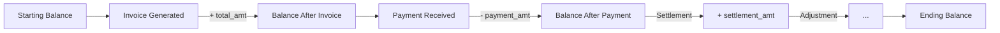
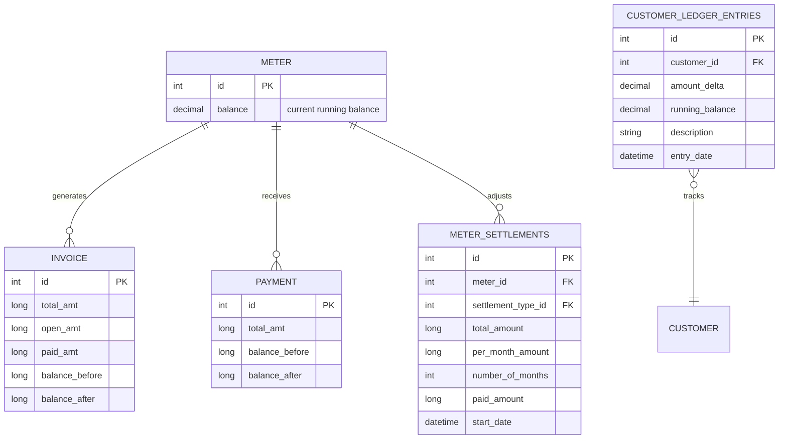

# Balance Engine — Phase 8 Investigation

> **Status**: INVESTIGATION / PLANNING ONLY — no code changes, no database writes.

## 1. Core Balance Formula

From `invoice_elec.jrxml` (SBill reference), the balance formula displayed on every invoice:

```
balance_after = (balance_before + total_amt) / 1000
```

On the invoice, amounts are stored in **piastres** (integer) and divided by 1000 for display:
```java
$F{total_amt}.doubleValue() / 1000
$F{balance_before}.doubleValue() / 1000   // Not explicitly displayed but stored
```

The actual stored formula from the invoice query:
```sql
i.total_amt,      // Total invoice amount in piastres
i.open_amt,       // Remaining unpaid amount in piastres
i.balance_before, // Customer/meter balance before this invoice
i.balance_after   // Customer/meter balance after this invoice
```

**Balance relationship**: `balance_before + total_amt = balance_after`

## 2. Open Amount

```sql
i.open_amt  // open amount in piastres
```

- `open_amt = total_amt - paid_amt`
- When invoice is generated: `open_amt = total_amt`
- When fully paid: `open_amt = 0`
- When partially paid: `open_amt = total_amt - paid_amt`
- On invoice display: `$F{open_amt}` is stored but may show as zero if paid

From `invoices.jrxml`:
```sql
CAST(i.total_amt / 1000.00 AS MONEY) AS amount,
CAST(i.paid_amt / 1000.00 AS MONEY) AS paid_amt,
CAST(i.open_amt / 1000.00 AS MONEY) AS open_amt
```

## 3. Balance Calculation: Per-Meter vs Per-Customer

From `meters_details.jrxml`:
```sql
ISNULL(m.balance, 0) AS 'balance',
(SELECT ISNULL(SUM(mr.total_amount), 0) FROM monthly_reading mr
 WHERE mr.meter_id = m.id AND mr.invoice_id IS NULL AND mr.status <> 'NEW') AS 'not_invoiced',
(SELECT ISNULL(SUM(i.open_amt), 0) FROM invoice i
 WHERE i.meter_id = m.id AND i.status = 'ACTIVE') AS 'open_invoices'
```

Balance is calculated **per meter**:
```java
meter_balance = meter.balance - not_invoiced_readings - open_invoice_amounts
```

From `customer_current_balance.jrxml`:
```sql
ISNULL(meter.balance, 0) -
  (SELECT ISNULL(SUM(invoice.open_amt), 0) FROM invoice
   WHERE invoice.status != 'DELETED' AND invoice.meter_id = meter.id) -
  (SELECT ISNULL(SUM(monthly_reading.total_amount), 0) FROM monthly_reading
   WHERE monthly_reading.meter_id = meter.id
     AND monthly_reading.invoice_id IS NULL
     AND monthly_reading.status <> 'NEW') AS current_balance
```

This shows the 3-component balance:
```
current_balance = meter.balance - open_invoices - not_invoiced_readings
```

## 4. Balance Adjustments

Adjustments change customer balance without generating an invoice:

From the settlement model (`settlements.jrxml`):
```sql
FROM meter m, customer c, meter_settlements ms, settlement_type st, unit u
WHERE ms.meter_id = m.id
  AND m.unit_id = u.id
  AND m.customer_id = c.id
  AND ms.settlement_type_id = st.id
```

**Settlement fields:**
- `total_amount` — total settlement amount
- `per_month_amount` — monthly installment amount
- `number_of_months` — installment period
- `paid_amount` — amount already paid
- `remaining_amount` = total_amount - paid_amount

## 5. Settlements (from `settlements.jrxml`)

Settlements are balance adjustments with a reason/category:
```sql
SELECT st.name AS settlement_type_name,
       ms.total_amount, ms.per_month_amount,
       ms.number_of_months, ms.paid_amount,
       (ms.total_amount - ms.paid_amount) AS remaining_amount
FROM meter_settlements ms, settlement_type st
WHERE ms.settlement_type_id = st.id
```

A settlement can be:
- **Installment plan** — spread balance over multiple months
- **One-time adjustment** — immediate balance correction
- **Waiver** — write off portion of balance

## 6. Running Balance Tracking

The running balance can be calculated from two sources:

**A) From `customer_statement_view` (derived view from T019):**
```sql
CREATE VIEW customer_statement_view AS
SELECT
  customer_id, entry_date, description,
  CASE WHEN amount_delta > 0 THEN amount_delta ELSE 0 END AS debit,
  CASE WHEN amount_delta < 0 THEN ABS(amount_delta) ELSE 0 END AS credit,
  running_balance
FROM customer_ledger_entries
ORDER BY customer_id, entry_date
```

**B) From invoices + payments (financial_audit.jrxml):**
```sql
SELECT 'Invoice' AS action, i.counsumption_month AS action_date,
       i.number, i.total_amt AS amount, i.meter_id
UNION ALL
SELECT 'Payment' AS action, p.payment_date AS action_date,
       p.receipt_no, p.total_amt * -1 AS amount, p.meter_id
```
Payments are negative amounts, invoices are positive — creating a running balance.

## 7. Balance Flow Diagram



## 8. Balance on Payment Receipt

From `xx_payment_receipt.jrxml`:
```sql
SELECT p.balance_before, p.balance_after
FROM payment p
WHERE p.id = $P{paymentId}
```

Each payment records the balance before and after:
```
balance_after = balance_before - payment_amount
```

This is per-customer balance recorded at time of payment.

## 9. Negative Balances

Negative balance means the customer has **credit** (paid more than consumed):
- Displayed as a positive number in reports (absolute value)
- Applied to future invoices automatically
- Visible in `customer_current_balance` reports

## 10. Key Balance Tables


