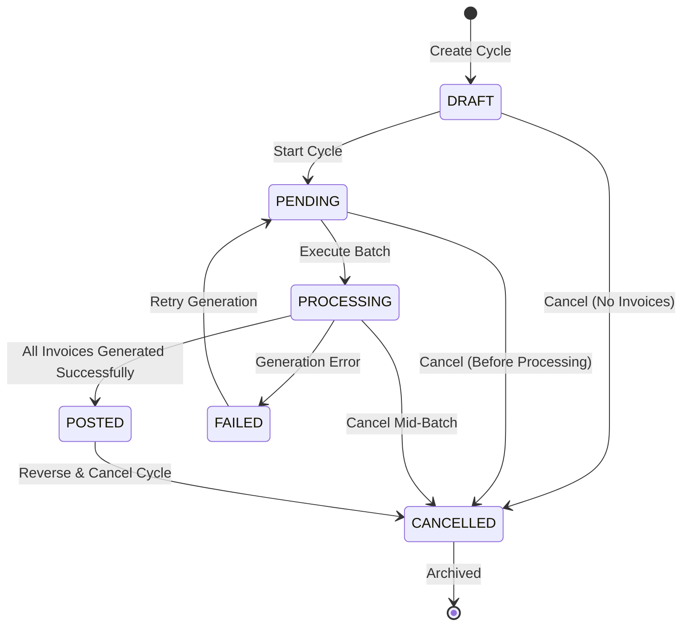
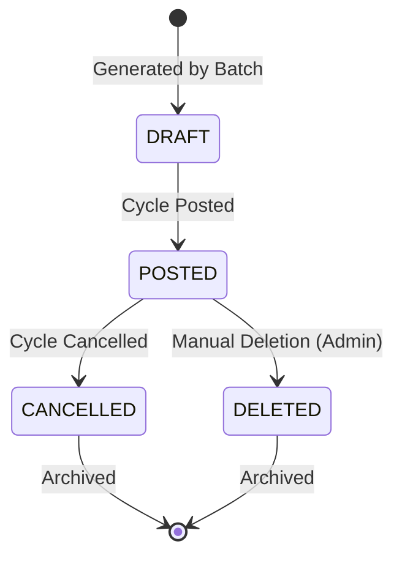

# Billing Convergence Engineering Plan (BCEP) — Summary Report

> **Unified reference document** combining all SBill→Meter Verse findings into a single actionable engineering plan.
> Covers: state machine, calculation tree, formula catalog, charge group mapping, gap analysis, roadmap, and certification score.

---

## 1. Bill Cycle State Machine

### States

| State | Description | Entry Action | Exit Action |
|-------|-------------|-------------|-------------|
| `DRAFT` | Cycle created but not started | Validate cycle params | — |
| `PENDING` | Queued for batch processing | Lock cycle, prevent edits | — |
| `PROCESSING` | Batch generation in progress | Create `billcycle_logs` entry | Increment counters |
| `POSTED` | All invoices generated and posted | Set invoice statuses to POSTED, create ledger entries | — |
| `FAILED` | Error during batch generation | Log error details, release locks | — |
| `CANCELLED` | Cycle cancelled (pre/post) | Reverse all invoices, reverse ledger entries | — |

### State Transition Diagram



### Transition Rules Matrix

```
From → To              Valid?   Guard Condition
──────────────────────────────────────────────────
DRAFT → PENDING        ✅       Cycle params valid
DRAFT → CANCELLED      ✅       Always allowed
PENDING → PROCESSING   ✅       No concurrent cycles for same project/month/service
PENDING → CANCELLED    ✅       Always allowed
PROCESSING → POSTED    ✅       All invoices in batch are DRAFT → POSTED
PROCESSING → FAILED    ✅       Any invoice generation error
PROCESSING → CANCELLED ✅       Manual cancellation during processing
FAILED → PENDING       ✅       Error resolved, cycle can retry
FAILED → CANCELLED     ✅       Manual cancellation after failure
POSTED → CANCELLED     ✅       All invoices reversed successfully
Any other transition   ❌       Not permitted — returns 422
```

### Invoice Status Transitions (per invoice within cycle)



---

## 2. Tariff Calculation Tree

```mermaid
flowchart TD
    Start([Invoice Generation Start]) --> LoadTariff[Load Active Tariff\nfor Meter & Date]
    LoadTariff --> GetCharges[Get All Charges\nfor Tariff]
    GetCharges --> LoopCharges{More Charges?}
    
    LoopCharges -->|Yes| GetCharge[Get Next Charge]
    GetCharge --> GetConsumption[Get Meter Consumption\nfor This Period]
    GetConsumption --> Dispatch{Dispatch by\nCharge Type}
    
    Dispatch -->|STEPS| StepsCalc[STEPS Calculation]
    Dispatch -->|FLAT| FlatCalc[FLAT Calculation]
    Dispatch -->|STATIC| StaticCalc[STATIC Calculation]
    Dispatch -->|PER_UNIT| PerUnitCalc[PER_UNIT Calculation]
    Dispatch -->|ZERO| ZeroCalc[ZERO Calculation]
    
    StepsCalc --> ApplyLimit[Apply upperLimit\nCap on Consumption]
    FlatCalc --> FixedAmt[amount = flatAmount]
    StaticCalc --> StaticAmt[amount = flatAmount\nInformational]
    PerUnitCalc --> RateCalc[amount = rate × consumption]
    ZeroCalc --> ZeroAmt[amount = 0]
    
    ApplyLimit --> StepLoop{For Each Tier\nin tariff_charges_details}
    StepLoop -->|Next Range| TierCalc[tierAmount = rateValue ×\n(MIN(toUsage, consumpt) - fromUsage)]
    TierCalc --> SumTiers[sumTiers += tierAmount]
    SumTiers --> StepLoop
    
    StepLoop -->|Done| StepFinal[amount = sumTiers\n+ calculatedAmount\n+ extraAmount]
    
    FixedAmt --> RecordLine[Record invoice_detail\nwith charge_group]
    StaticAmt --> RecordLine
    RateCalc --> RecordLine
    ZeroAmt --> RecordLine
    StepFinal --> RecordLine
    
    RecordLine --> LoopCharges
    
    LoopCharges -->|No| CalcTotal[Calculate Total Invoice Amount]
    CalcTotal --> UpdateBalances[Update Ledger:\nbalance_before, balance_after]
    UpdateBalances --> End([Invoice Created])
```

---

## 3. Charge Formula Catalog

### 3.1 `STEPS` — Tiered / Stepped Rate

**Formula**:
```
total = 0
remaining = MIN(consumption, upperLimit)  -- if upperLimit is set

FOR EACH tier IN tariff_charges_details (ordered by from_usage ASC):
    tier_range = MIN(remaining, to_usage) - from_usage
    IF tier_range > 0:
        total += tier_range * rateValue

total += calculatedAmount + extraAmount
```

**Example — Water Tariff**:
```
Tier   Range     Rate (SAR)
────────────────────────────
T1     0–100     0.50
T2     101–300   0.75
T3     301–500   1.00
T4     501+      1.50

Consumption: 350 units
Calculation:
  T1: 100 × 0.50 =  50.00
  T2: 200 × 0.75 = 150.00
  T3:  50 × 1.00 =  50.00
  ─────────────────────────
  Total:          250.00 SAR
```

### 3.2 `FLAT` — Flat Amount

**Formula**:
```
amount = flatAmount
-- No dependency on consumption
-- Applied per billing period (monthly typically)
-- Optional upperLimit: if consumption > upperLimit, charge is skipped
```

**Example**:
```
flatAmount = 50.00 SAR (Service Fee)
consumption = 200 units
upperLimit = null

amount = 50.00 SAR  -- fixed, regardless of consumption
```

### 3.3 `STATIC` — Static / Informational

**Formula**:
```
amount = flatAmount
-- Same as FLAT but informational only
-- Appears on invoice as a line item
-- Not included in VAT calculation (if applicable)
```

**Example**:
```
flatAmount = 5.00 SAR (Municipal Fee)

amount = 5.00 SAR  -- static line item
```

### 3.4 `PER_UNIT` — Rate × Consumption

**Formula**:
```
consumption = current_reading - previous_reading
amount = rate × consumption
-- Optional upperLimit: cap the consumption used in calculation
```

**Example**:
```
rate = 0.75 SAR/unit
consumption = 350 units

amount = 0.75 × 350 = 262.50 SAR
```

### 3.5 `ZERO` — Zero Amount

**Formula**:
```
amount = 0
-- Informational line item only
-- Used to show a charge type on the invoice with zero cost
-- e.g., "Government Subsidy", "Discount Applied"
```

**Example**:
```
amount = 0.00 SAR
description = "Government Subsidy"
-- Shows on invoice as informational line, no charge
```

### Formula Dispatch Logic (Pseudo-code)

```
function calculateCharge(charge: TariffCharge, consumption: number): number {
    switch (charge.chargeType) {
        case ChargeType.STEPS:
            return calculateSteps(charge.tiers, consumption, charge.upperLimit, 
                                  charge.calculatedAmount, charge.extraAmount);
        
        case ChargeType.FLAT:
            if (charge.upperLimit !== null && consumption > charge.upperLimit) {
                return 0;  // Skip if over limit
            }
            return charge.flatAmount;
        
        case ChargeType.STATIC:
            return charge.flatAmount;  // Informational only
        
        case ChargeType.PER_UNIT:
            let effectiveConsumption = consumption;
            if (charge.upperLimit !== null) {
                effectiveConsumption = Math.min(consumption, charge.upperLimit);
            }
            return charge.rate * effectiveConsumption;
        
        case ChargeType.ZERO:
            return 0;  // Always zero
        
        default:
            throw new Error(`Unknown charge type: ${charge.chargeType}`);
    }
}
```

---

## 4. Charge Group Mapping

> Charge groups link `tariff_charges.charge_group` (string in SBill) to `invoice_details.charge_group` (numeric in Meter Verse).
> This mapping is REQUIRED for invoice detail line items to display correct labels.

### Known SBill Charge Groups (from JRXML)

| SBill String | MV Number | Description | Examples |
|-------------|-----------|-------------|----------|
| `'consumption_value'` | 1 | Consumption charges | Water usage, electricity usage |
| `'service_fee'` | 2 | Monthly service fees | Account maintenance, meter rental |
| `'municipal_fee'` | 3 | Municipal/statutory fees | Municipality tax, govt levy |
| `'settlement'` | 4 | Settlement/installment charges | Meter installation amortization |
| `'vat'` | 5 | VAT / tax line items | 15% VAT on taxable charges |
| `'discount'` | 6 | Discounts and adjustments | Early payment discount, subsidy |
| `'penalty'` | 7 | Late payment penalties | Late fee, disconnection fee |
| `'connection_fee'` | 8 | One-time connection fees | New connection, reconnection |
| `'deposit'` | 9 | Security deposit | Meter deposit, service deposit |
| `'others'` | 99 | Other/miscellaneous charges | Any unmapped charge group |

### MV Implementation

```typescript
export enum ChargeGroup {
    CONSUMPTION = 1,
    SERVICE_FEE = 2,
    MUNICIPAL_FEE = 3,
    SETTLEMENT = 4,
    VAT = 5,
    DISCOUNT = 6,
    PENALTY = 7,
    CONNECTION_FEE = 8,
    DEPOSIT = 9,
    OTHERS = 99,
}

export const ChargeGroupLabel: Record<ChargeGroup, string> = {
    [ChargeGroup.CONSUMPTION]:  'consumption_value',
    [ChargeGroup.SERVICE_FEE]:   'service_fee',
    [ChargeGroup.MUNICIPAL_FEE]: 'municipal_fee',
    [ChargeGroup.SETTLEMENT]:    'settlement',
    [ChargeGroup.VAT]:           'vat',
    [ChargeGroup.DISCOUNT]:      'discount',
    [ChargeGroup.PENALTY]:       'penalty',
    [ChargeGroup.CONNECTION_FEE]:'connection_fee',
    [ChargeGroup.DEPOSIT]:       'deposit',
    [ChargeGroup.OTHERS]:        'others',
};
```

### Invoice Detail Line Generation

When generating `invoice_details` during invoice creation:
```
FOR EACH charge IN tariff_charges:
    amount = calculateCharge(charge, consumption)
    
    INSERT INTO invoice_details (
        invoice_id,          -- FK to invoice.id
        charge_group,        -- ChargeGroup enum value (1-99)
        amount,              -- Calculated charge amount
        start_reading,       -- Period start meter reading
        end_reading,         -- Period end meter reading
        consumption_value    -- Total consumption for this period
    )
```

---

## 5. Complete Gap Analysis Summary

```
┌─────────────────────────────────────────────────────────────────────────────────┐
│                         GAP ANALYSIS SUMMARY                                     │
├─────────────────────────────────────────────────────────────────────────────────┤
│ Engine              Score    Critical  Status          Owner      Target Week   │
│─────────────────────────────────────────────────────────────────────────────────│
│ Bill Cycle           0%      🔴 P0    ⬜ Not Started   —          Week 5         │
│ Tariff Versioning    0%      🔴 P0    ⬜ Not Started   —          Week 1         │
│ Charge Types        20%      🔴 P0    🟡 In Progress   —          Week 1         │
│ Invoice Gen         10%      🔴 P0    ⬜ Not Started   —          Week 5         │
│ Customer Ledger      0%      🔴 P0    ⬜ Not Started   —          Week 3         │
│ Settlement          10%      🟡 P1    ⬜ Not Started   —          Week 9         │
│ Payment             30%      🟡 P1    ⬜ Not Started   —          Week 9         │
│ Reading             25%      🟡 P1    ⬜ Not Started   —          Week 9         │
│ Reporting           10%      🟡 P2    ⬜ Not Started   —          Week 13        │
│ Import               0%      🟢 P2    ⬜ Not Started   —          Week 17        │
│ Settings            12%      🟡 P2    ⬜ Not Started   —          Week 9         │
├─────────────────────────────────────────────────────────────────────────────────┤
│ OVERALL PARITY     ~12%       —        ❌ NOT READY    —          20 weeks       │
└─────────────────────────────────────────────────────────────────────────────────┘
```

---

## 6. Phased Implementation Roadmap

```
┌─────────────────────────────────────────────────────────────────────────────────┐
│                      PHASED IMPLEMENTATION ROADMAP                               │
├─────────────────────────────────────────────────────────────────────────────────┤
│ Phase   │ Weeks │ Focus                    │ Deliverables                        │
│─────────│───────│──────────────────────────│─────────────────────────────────────│
│ P0      │ 0     │ Preparation              │ Schema audit, enums, migrations     │
│         │       │                          │ ReportService scaffolding           │
│─────────│───────│──────────────────────────│─────────────────────────────────────│
│ P1      │ 1–4   │ Foundation               │ Tariff Versioning                   │
│         │       │                          │ Charge Type Enum + 5 formulas       │
│         │       │                          │ Customer Ledger Table + Service     │
│         │       │                          │ Unit tests + Integration tests      │
│         │       │                          │ → GATE: 5 charge types verified     │
│─────────│───────│──────────────────────────│─────────────────────────────────────│
│ P2      │ 5–8   │ Bill Cycle               │ Billing Cycle Entity + State Machine│
│         │       │                          │ Batch Invoice Generation            │
│         │       │                          │ Post / Cancel / Rebill Workflows    │
│         │       │                          │ Invoice Statuses + Auto-Numbering   │
│         │       │                          │ Performance Test (10K invoices)     │
│         │       │                          │ → GATE: Full cycle E2E working      │
│─────────│───────│──────────────────────────│─────────────────────────────────────│
│ P3      │ 9–12  │ Settings                 │ Settlement Types CRUD               │
│         │       │                          │ Customer Groups CRUD                │
│         │       │                          │ Holidays CRUD                       │
│         │       │                          │ Payment Centers CRUD                │
│         │       │                          │ Reading Codes CRUD                  │
│         │       │                          │ Invoice Formats CRUD                │
│         │       │                          │ User / Role Management              │
│         │       │                          │ System Config (Email, SMS, Backup)  │
│         │       │                          │ → GATE: All 16 settings pages       │
│─────────│───────│──────────────────────────│─────────────────────────────────────│
│ P4      │ 13–16 │ Reports (Top 8)          │ Generic ReportService               │
│         │       │                          │ Active Tariffs Report               │
│         │       │                          │ Meters Status Report                │
│         │       │                          │ Invoices Summary Report             │
│         │       │                          │ Payments Report                     │
│         │       │                          │ Customer Statement Report           │
│         │       │                          │ Payment Receipt Report              │
│         │       │                          │ Monthly Finance Report              │
│         │       │                          │ Monthly Consumption Report          │
│         │       │                          │ → GATE: 8 reports matching SBill    │
│─────────│───────│──────────────────────────│─────────────────────────────────────│
│ P5      │ 17–20 │ Import + Completion      │ Reading Import (Excel/CSV)          │
│         │       │                          │ Customer Import                     │
│         │       │                          │ Meter Import                        │
│         │       │                          │ Remaining 8 Reports                 │
│         │       │                          │ Remaining 8 Settings Pages          │
│         │       │                          │ Full E2E Integration Testing        │
│         │       │                          │ Deployment Runbook + Go-Live        │
│         │       │                          │ → GATE: Full SBill parity           │
├─────────────────────────────────────────────────────────────────────────────────┤
│ Total   │ 20    │ Full Parity              │ 18 tables, 83 APIs, 32 UI pages,    │
│         │       │                          │ 16 reports, 3 import engines        │
└─────────────────────────────────────────────────────────────────────────────────┘
```

---

## 7. Final Certification Score

```
╔══════════════════════════════════════════════════════════════════╗
║                  BCEP FINAL CERTIFICATION                       ║
╠══════════════════════════════════════════════════════════════════╣
║                                                                  ║
║   TARIFF_ENGINE     █░░░░░░░░░░░░░░░░░░░░░░░░░░░░░░░░  10%     ║
║   BILL_CYCLE        ░░░░░░░░░░░░░░░░░░░░░░░░░░░░░░░░░   0%     ║
║   INVOICE_ENGINE    █░░░░░░░░░░░░░░░░░░░░░░░░░░░░░░░░  10%     ║
║   CHARGE_TYPE       ██░░░░░░░░░░░░░░░░░░░░░░░░░░░░░░░  20%     ║
║   SETTLEMENT        █░░░░░░░░░░░░░░░░░░░░░░░░░░░░░░░░  10%     ║
║   PAYMENT           ███░░░░░░░░░░░░░░░░░░░░░░░░░░░░░░  30%     ║
║   READING           ██░░░░░░░░░░░░░░░░░░░░░░░░░░░░░░░  25%     ║
║   REPORT            █░░░░░░░░░░░░░░░░░░░░░░░░░░░░░░░░  10%     ║
║   SETTINGS          █░░░░░░░░░░░░░░░░░░░░░░░░░░░░░░░░  12%     ║
║                                                                  ║
║   ────────────────────────────────────────────────────────       ║
║   OVERALL PARITY    █░░░░░░░░░░░░░░░░░░░░░░░░░░░░░░░░  12%     ║
║   PRODUCTION_READY:                ❌  NO                       ║
║   CERTIFICATION:                   ❌  NOT APPROVED             ║
║                                                                  ║
║   P0 BLOCKERS:      5   (Bill Cycle, Tariff Versioning,         ║
║                          Charge Types, Batch Invoice, Ledger)   ║
║   P1 BLOCKERS:      3   (Settlement, Payment Features, Reading) ║
║   P2 BLOCKERS:      3   (Import, 14 Settings, 16 Reports)      ║
║                                                                  ║
║   RECOMMENDATION:   BEGIN PHASE 1 IMMEDIATELY                   ║
║                     (Tariff Versioning + Charge Types + Ledger)  ║
║                     FREEZE all other feature development         ║
║                                                                  ║
║   TARGET:           Re-certification at Week 8 (Phase 1+2 done) ║
║                     Full production parity at Week 20            ║
║                                                                  ║
╚══════════════════════════════════════════════════════════════════╝
```

---

## 8. Key Decision Log

| ID | Decision | Rationale | Date |
|----|----------|-----------|------|
| D01 | Phase 1 before Phase 2 | Tariff versioning & charge types are prerequisites for correct invoice generation | June 2026 |
| D02 | Ledger before Bill Cycle | Bill cycle posting must create ledger entries; ledger must exist first | June 2026 |
| D03 | Top 8 reports before bottom 8 | Business-critical reports (summary, statement, payments) deliver 80% of value | June 2026 |
| D04 | Keep existing `sim_system` schema | Avoid migration cost; add columns/tables to existing schema rather than new schema | June 2026 |
| D05 | Puppeteer for reports (not Jasper) | MV already has Puppeteer infrastructure; avoid adding Java dependency | June 2026 |
| D06 | No SBill data migration until Phase 5 | Avoid dual-write complexity; build MV independently, migrate data later | June 2026 |
| D07 | Charge groups as numeric enum | Numeric is more efficient for DB indexing and joins; map via enum | June 2026 |
| D08 | Append-only ledger | Immutable audit trail; balance computed by summing entries (no UPDATE) | June 2026 |

---

## 9. Appendices

### A. Entity Relationship (New + Modified Tables)

```
New Tables (Phase 1):
  customer_ledger:     customer_id, tx_type, reference_id, amount, balance_before, balance_after, description, created_at, created_by

New Tables (Phase 2):
  billing_cycle:       project_id, month, service, status, created_by, created_at, started_at, completed_at
  billcycle_logs:      billing_cycle_id, started_at, completed_at, status, total_count, success_count, failed_count, created_by

New Tables (Phase 3):
  settlement_type:     name, allowed_months, created_at
  meter_settlements:   meter_id, settlement_type_id, amount, reason, start_date, end_date, created_at
  customer_group:      name, discount_pct, created_at
  holiday:             name, date, is_recurring, created_at
  payment_center:      name, address, contact, created_at
  reading_code:        code, description, is_estimated, created_at
  invoice_format:      name, template_html, is_default, created_at
  report_template:     name, report_type, config_json, created_at
  adm_role:            name, permissions_json, created_at

Modified Tables:
  tariff_plan:         +start_date, +end_date, +status, +service_type
  tariff_charge:       +chargeType, +rate, +chargeGroup, +recurringMode, +upperLimit, -isTiered
  invoice:             +invoice_status, +billcycle_log_id (FK), +balance_before, +balance_after
  invoice_details:     (new table entirely)
  meter_reading:       +status, +is_estimated, +source, +corrected_by
  payment:             +type (enum), +balance_before, +balance_after, +allocation_status
  customer:            +customer_group_id (FK)
```

### B. Enum Definitions (Proposed)

```typescript
// src/common/enums/charge-type.enum.ts
export enum ChargeType {
    STEPS    = 'STEPS',     // Tiered rate
    FLAT     = 'FLAT',      // Fixed amount
    STATIC   = 'STATIC',    // Informational fixed
    PER_UNIT = 'PER_UNIT',  // Rate × consumption
    ZERO     = 'ZERO',      // Zero-amount informational
}

// src/common/enums/cycle-status.enum.ts
export enum CycleStatus {
    DRAFT      = 'DRAFT',
    PENDING    = 'PENDING',
    PROCESSING = 'PROCESSING',
    POSTED     = 'POSTED',
    FAILED     = 'FAILED',
    CANCELLED  = 'CANCELLED',
}

// src/common/enums/invoice-status.enum.ts
export enum InvoiceStatus {
    DRAFT     = 'DRAFT',
    POSTED    = 'POSTED',
    CANCELLED = 'CANCELLED',
    DELETED   = 'DELETED',
}

// src/common/enums/payment-type.enum.ts
export enum PaymentType {
    CASH          = 'CASH',
    CHEQUE        = 'CHEQUE',
    BANK_TRANSFER = 'BANK_TRANSFER',
    CARD          = 'CARD',
    ADVANCE       = 'ADVANCE',
}

// src/common/enums/reading-status.enum.ts
export enum ReadingStatus {
    PENDING   = 'PENDING',
    APPROVED  = 'APPROVED',
    REJECTED  = 'REJECTED',
    CORRECTED = 'CORRECTED',
}

// src/common/enums/ledger-tx-type.enum.ts
export enum LedgerTransactionType {
    INVOICE    = 'INVOICE',
    PAYMENT    = 'PAYMENT',
    SETTLEMENT = 'SETTLEMENT',
    ADJUSTMENT = 'ADJUSTMENT',
    OPENING    = 'OPENING',
    REVERSAL   = 'REVERSAL',
}

// src/common/enums/tariff-status.enum.ts
export enum TariffStatus {
    DRAFT    = 'DRAFT',
    ACTIVE   = 'ACTIVE',
    INACTIVE = 'INACTIVE',
    EXPIRED  = 'EXPIRED',
}

// src/common/enums/recurring-mode.enum.ts
export enum RecurringMode {
    MONTHLY  = 'MONTHLY',
    ONE_TIME = 'ONE_TIME',
    SEASONAL = 'SEASONAL',
}

// src/common/enums/charge-group.enum.ts
export enum ChargeGroup {
    CONSUMPTION    = 1,
    SERVICE_FEE    = 2,
    MUNICIPAL_FEE  = 3,
    SETTLEMENT     = 4,
    VAT            = 5,
    DISCOUNT       = 6,
    PENALTY        = 7,
    CONNECTION_FEE = 8,
    DEPOSIT        = 9,
    OTHERS         = 99,
}
```

### C. Service Method Signatures (Proposed)

```typescript
// Tariff Service
findActiveTariff(serviceType: string, targetDate: Date): Promise<TariffPlan>;
calculateCharge(charge: TariffCharge, consumption: number): number;

// Ledger Service
createEntry(dto: CreateLedgerEntryDto): Promise<LedgerEntry>;
getCustomerBalance(customerId: number): Promise<number>;
getLedger(customerId: number, from?: Date, to?: Date): Promise<LedgerEntry[]>;
reverseEntry(entryId: number): Promise<LedgerEntry>;

// Bill Cycle Service
createCycle(dto: CreateCycleDto): Promise<BillingCycle>;
startCycle(cycleId: number): Promise<BillingCycle>;
processBatch(cycleId: number): Promise<BatchResult>;
postCycle(cycleId: number): Promise<BillingCycle>;
cancelCycle(cycleId: number, reason: string): Promise<BillingCycle>;
rebillCycle(cycleId: number): Promise<BillingCycle>;

// Invoice Service
generateInvoice(customerId: number, meterId: number, tariffId: number, period: DateRange): Promise<Invoice>;
generateBatch(cycleId: number): Promise<BatchResult>;
cancelInvoice(invoiceId: number, reason: string): Promise<Invoice>;
reverseInvoice(invoiceId: number): Promise<Invoice>;

// Payment Service
postPayment(dto: CreatePaymentDto): Promise<Payment>;
allocatePayment(paymentId: number, allocations: PaymentAllocation[]): Promise<Payment>;
reversePayment(paymentId: number, reason: string): Promise<Payment>;

// Report Service
generateReport(type: ReportType, format: ReportFormat, params: ReportParams): Promise<Buffer>;
getAvailableReports(): Promise<ReportDefinition[]>;

// Import Service
importReadings(file: Buffer, format: ImportFormat): Promise<ImportResult>;
importCustomers(file: Buffer, format: ImportFormat): Promise<ImportResult>;
importMeters(file: Buffer, format: ImportFormat): Promise<ImportResult>;
```

---

*End of BCEP Summary Report — All 5 reports in the catalog are complete.*
