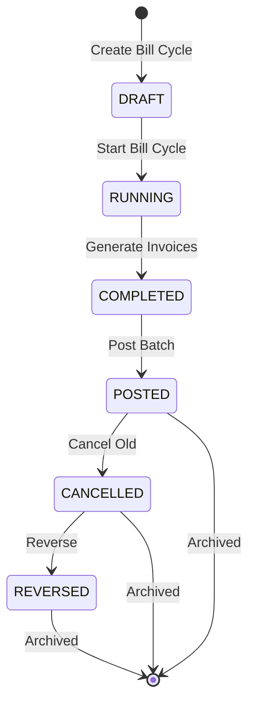

# Bill Cycle Engine

## Overview

The Bill Cycle engine is the core orchestrator for invoice generation in SBill. Each billing cycle represents a single run of invoice generation for a specific utility type (Electricity or Water) in a given month. Due to regulatory separation, Electricity and Water meters are billed in **separate cycles even for the same month**.

---

## State Machine



### State Definitions

| State | Description |
|-------|-------------|
| `DRAFT` | Cycle created, no processing started. User selects Service Type, Month, Year. |
| `RUNNING` | Invoice generation in progress. System locks the cycle to prevent duplicate runs. |
| `COMPLETED` | All invoices generated. Success/failed/cancelled counts finalized. |
| `POSTED` | Invoices posted to customer accounts. Balances updated. |
| `CANCELLED` | Invoices voided. Used during rebilling when old invoices are replaced. |
| `REVERSED` | Full reversal of the cycle. All associated invoices reversed. |

---

## Cycle Creation

### Input Form Fields
- **Service Type**: Electricity / Water / Electricity Virtual / Water Virtual
- **Month**: 1–12
- **Year**: e.g., 2023

### Per-Utility Separation

Electricity and Water are billed independently because:
1. They have **different tariff structures** (separate tariff IDs on meters)
2. They use **different charge types** (e.g., Radio Fees exist only on Electricity)
3. Invoice sequences are **project-specific per utility**

### Database Record

```
billcycle { id, month, service, success_count, failed_count, cancelled_count, status, ... }
```

- `service` stores the utility type
- `success_count + cancelled_count = total invoices processed`
- `failed_count` = invoices that errored during generation

---

## Live System Evidence

### Cycle 1 — January 2000, Electricity (Rebill Scenario)

| Field | Value |
|-------|-------|
| ID | 1 |
| Month | Jan 2000 |
| Service | ELECTRICITY |
| Success Count | **-21882** |
| Failed Count | 0 |
| Cancelled Count | **21882** |

**Interpretation**: A **negative success count** is the rebill detection signal. Here, 21,882 old invoices were cancelled and the negative sign indicates this was a corrective rebill run. `cancelled_count = 21882` confirms all prior invoices for that period were replaced.

### Cycle 10009 — October 2023, Electricity (Normal Cycle)

| Field | Value |
|-------|-------|
| ID | 10009 |
| Month | Oct 2023 |
| Service | ELECTRICITY |
| Success Count | 860 |
| Failed Count | 2 |
| Cancelled Count | 611 |

**Interpretation**: 860 invoices generated successfully, 2 failures, and 611 cancellations. Total processed = 860 + 611 = 1,471.

---

## Rebilling Detection Logic

Rebilling is identified by the following pattern in `billcycle_logs`:

```
success_count < 0  →  Rebill in progress
abs(success_count) == cancelled_count  →  Full rebill (all prior invoices replaced)
```

### Why Cancelled Count Equals Success Count

When a full rebill occurs:
1. Old invoices for the same period are **cancelled** (not deleted)
2. New invoices are **generated** with updated tariff rates or corrected consumption
3. The `cancelled_count` reflects every old invoice that was voided
4. The `success_count` (absolute value) reflects new invoices created

This ensures **audit traceability**: old invoices remain in the system with `CANCELLED` status, preserving their original numbers and amounts.

---

## Cycle Lifecycle in Detail

### 1. DRAFT → RUNNING
- System validates no active cycle exists for the same month/service
- Status set to `RUNNING`
- Timestamp recorded

### 2. RUNNING → COMPLETED
- For each meter assigned to this utility type:
  1. Look up active tariff (by tariff_id on meter)
  2. Resolve tariff version (by startDate/endDate matching billing month)
  3. Calculate consumption from meter readings
  4. Apply all tariff charges
  5. Generate invoice record
  6. Increment success_count (or failed_count on error)
- Old invoices for same period are cancelled with rebill flag
- Status set to `COMPLETED`

### 3. COMPLETED → POSTED
- All invoices in the batch are marked `POSTED`
- Customer balances updated:
  ```
  balance_after = balance_before + total_amt
  ```
- Cycle status set to `POSTED`

### 4. POSTED → CANCELLED (Rebill Path)
- All invoices in the batch marked `CANCELLED`
- Used only when a newer cycle replaces this one

### 5. CANCELLED → REVERSED
- Financial reversal of all invoice amounts
- Customer balances corrected

---

## Bill Cycle Logs Table

The `billcycle_logs` table provides a complete audit trail:

| Column | Description |
|--------|-------------|
| `id` | Primary key |
| `billcycle_id` | FK to billcycle |
| `month` | Billing month |
| `service` | Utility type |
| `success_count` | Invoices generated (negative = rebill) |
| `failed_count` | Invoices that errored |
| `cancelled_count` | Prior invoices cancelled |
| `created_at` | Timestamp |
| `status` | Current state |

This table is the **single source of truth** for what happened in any billing run.

---

## Key Architectural Rules

1. **No two cycles can run simultaneously** for the same month and service type
2. **Cancelled invoices are never deleted** — only status-changed
3. **Negative success_count** is the definitive rebill indicator
4. **success_count + cancelled_count** = total invoices touched by the cycle
5. **Tariff changes between cycles** produce different amounts even for the same consumption — this is expected and tracked
