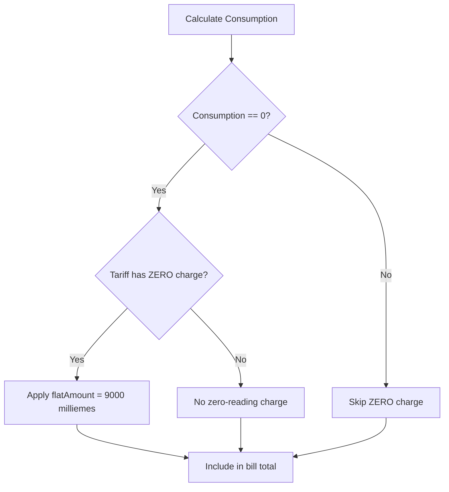
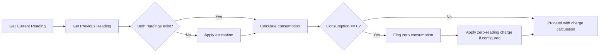

# Consumption Engine Report

**Source:** SBill JRXML, live API charge structures
**Date:** 2026-06-20
**Status:** Investigation / Planning

---

## Core Formula

```
Consumption = CurrentReading - PreviousReading
```

The consumption engine calculates how many units (kWh for electricity, m³ for water) were consumed in a billing period by subtracting the previous meter reading from the current one.

---

## Reading States

| State               | Description                                     | Handling                                  |
|---------------------|-------------------------------------------------|-------------------------------------------|
| Normal              | Current > Previous, positive consumption        | Standard calculation                       |
| Zero Consumption    | Current == Previous                             | Apply ZERO charges; consumption = 0        |
| Rollover            | Current < Previous (meter wraps to zero)        | `Consumption = (MaxReading - Previous) + Current` |
| Missing Previous    | No previous reading found                       | Estimation needed                          |
| Missing Current     | No current reading found                        | Estimation or skip billing                 |

---

## Estimation Logic (when reading is missing)

When a meter reading is unavailable, the system must estimate consumption. Approaches observed in similar systems:

### Method 1: Average of Previous Periods
```
EstimatedConsumption = avg(last 3-6 periods' consumption)
```

### Method 2: Same Period Last Year
```
EstimatedConsumption = consumption from same billing month last year
```

### Method 3: Fixed Default
```
EstimatedConsumption = configurable default value (per tariff)
```

> **Note:** SBill JRXML may define specific estimation rules. These need to be confirmed from the JRXML source. The Meter Verse integration should handle estimation as a pre-processing step before charge calculation.

---

## Zero-Reading Charge ("المقروء بصفر")

### Trigger Condition

```
IF Consumption == 0 AND tariff has ZERO charge:
    Apply "المقروء بصفر" charge
```

### Charge Details

| Tariff | flatAmount (milliemes) | EGP    | Frequency |
|--------|------------------------|--------|-----------|
| 1 (Residential ELECTRICITY) | 9,000 | 9.00 | MONTHLY |
| 2 (Residential WATER)       | 9,000 | 9.00 | MONTHLY |
| 3 (Commercial ELECTRICITY)  | 9,000 | 9.00 | MONTHLY |

All zero-reading charges discovered so far are **9,000 milliemes (9 EGP)**.

### Charge Group

The "المقروء بصفر" charge uses `charge_group = 'ZERO'` in SBill DB. This group has no direct mapping in Meter Verse's numeric system — it will need a dedicated handler.

### Implementation Logic



### Edge Cases

1. **New meter / first reading:** If there's no previous reading, consumption cannot be calculated. Should ZERO charge still apply? Likely not — first bill should be based on actual or estimated consumption.

2. **Rollover with zero net:** If `(MaxReading - Previous) + Current == 0` after rollover correction, does ZERO apply? Need business confirmation.

3. **Estimated consumption = 0:** If estimation produces zero, should ZERO charge trigger? Probably yes — the system should treat it the same as actual zero.

---

## Consumption Flow — Complete



---

## Units of Measure

| Utility      | Unit | Typical Resolution |
|--------------|------|--------------------|
| ELECTRICITY  | kWh  | 1 or 0.01          |
| WATER        | m³   | 1 or 0.001         |
| Chilled Water| ?    | To be confirmed    |

> **Note:** The unit resolution may affect tier matching (e.g., fractional consumption crossing tier boundaries).

---

## Open Questions

1. **Estimation method:** What specific estimation algorithm does SBill use? Is it configurable per tariff or global?
2. **Zero-reading on first bill:** Should a meter with no history ever receive the ZERO charge?
3. **Rollover handling:** What is the max reading value for each meter type?
4. **Partial period billing:** How is consumption calculated when the billing period is not a full month?
5. **ZERO charge in Meter Verse:** What numeric charge group should ZERO map to in Meter Verse? Options: extend the enum with a new value, or repurpose an existing unused group.
