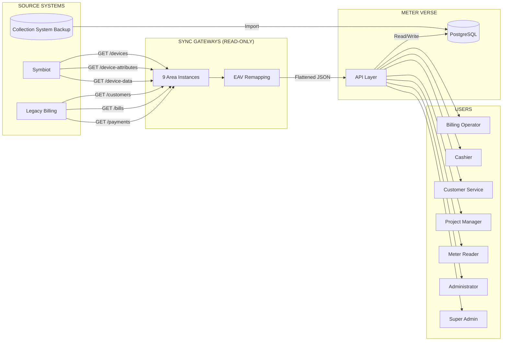

# METER VERSE — DATA FLOW DIAGRAM

**Date:** 2026-06-25

---

## DATA RULES

| Direction | Permitted Methods | Notes |
|-----------|------------------|-------|
| SYMBIOT → GATEWAY | GET only | No POST/PUT/DELETE/PATCH/EXECUTE |
| BILLING → GATEWAY | GET only | No write operations ever |
| GATEWAY → API | HTTP response | Flattened EAV, no SQL passed through |
| API → DB | All CRUD | Meter Verse owns its data |
| COLLECTION → DB | INSERT only | One-time import, no ongoing sync |

## FLOW TYPES

1. **Real-time meter read** — UI → API → Gateway → Symbiot GET → cached response
2. **Customer sync** — Gateway → Billing GET → API → DB upsert
3. **Data import** — Collection backup → SQLite extract → PostgreSQL insert
4. **Billing cycle** — API → DB queries → tariff calculation → invoice generation
