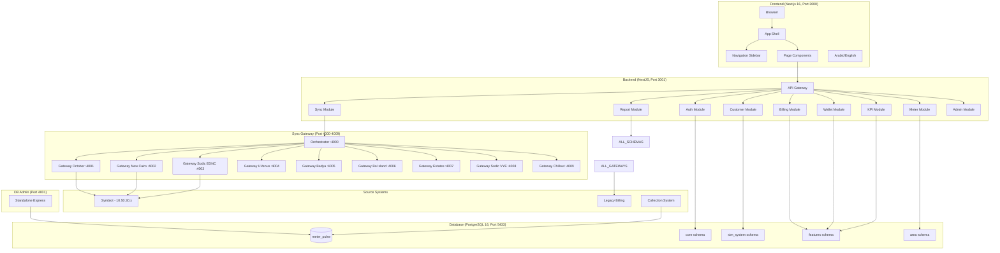

# METER VERSE — SYSTEM ARCHITECTURE DIAGRAM

**Date:** 2026-06-25

---

## COMPONENTS

| Component | Technology | Port | Purpose |
|-----------|-----------|------|---------|
| Frontend | Next.js 16 + Turbopack | 3000 | UI, dashboards, reports |
| Backend | NestJS (Node 20+) | 3001 | API, auth, business logic |
| DB Admin | Standalone Express | 4001 | Direct database management |
| Sync Orchestrator | Express | 4000 | Route requests to area gateways |
| Sync Gateways x9 | Express | 4001-4009 | READ-ONLY proxy to Symbiot |
| Database | PostgreSQL 16 | 5433 | All application data |

## DATA STORES

| Schema | Purpose | Tables |
|--------|---------|--------|
| core | Auth, users, roles, permissions | 19 |
| sim_system | Customers, meters, billing | 31 |
| features | Payments, invoices, wallet, KPI | 36 |
| area | Area-specific meter readings | 42 |
