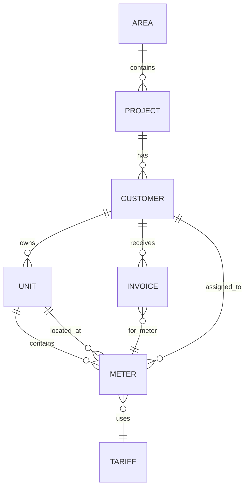
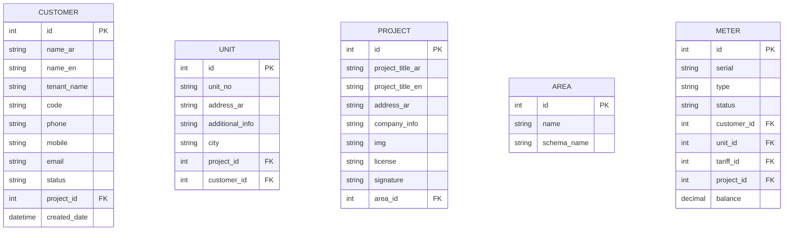

# Customer Data Model — Phase 2 Investigation

> **Status**: INVESTIGATION / PLANNING ONLY — no code changes, no database writes.

## 1. Core Entity Relationships

The SBill JRXML queries reveal the following core relationships:



## 2. Entity Definitions

### Area
- Each project belongs to one area
- In the current SBill model, `project` has `address_ar` and `company_info` fields
- The new Meter Verse model has 15 areas (october, new_cairo, sodic_ednc, etc.)
- Each area gets its own database schema for data isolation

### Project
- `project` table with fields: `id`, `project_title_ar`, `address_ar`, `company_info`, `img` (logo base64), `license`, `signature`
- Referenced in JRXML queries via `(select project_title_ar from project where id = c.project_id)`
- The new model uses `adm_project` with additional fields like `project_title_en`, `address_en`

### Customer
- `customer` table with fields: `id`, `name_ar`, `name_en`, `tenant_name`, `code`, `phone`, `mobile`, `email`, `status`, `project_id`
- **One customer can own MANY units** (a customer may own multiple properties)
- `tenant_name` field exists on customer — invoice display logic: `$F{tenant_name} == null ? $F{name_ar} : $F{tenant_name}`
- **Inactive customers**: handled via a `status` field (ACTIVE/INACTIVE), data preserved
- **Customer code**: displayed as `customer_id` on invoices + a separate `code` field in some templates

### Unit (Location)
- Called `location` in older models, `unit` in newer templates
- Fields: `id`, `unit_no`, `address_ar`, `additional_info`, `city`, `project_id`
- **One unit can have MANY meters** (electricity + water + gas + solar all in same unit)
- Joined via `m.unit_id = u.id` (or `m.location_id = l.id` in older models)

### Invoice-to-Customer Relationship
- From JRXML: `i.customer_id = c.id` and `i.meter_id = m.id`
- Invoice is linked to BOTH a customer AND a meter
- This means an invoice is scoped to one customer-meter pair

## 3. Tenant vs Owner

From `invoice_elec.jrxml` line 323:
```
$F{tenant_name} == null ? $F{name_ar} : $F{tenant_name}
```

- If `customer.tenant_name` is populated → display tenant name
- If `tenant_name` is null → display owner name (`name_ar`)
- This is displayed in the "السيد/" field on the invoice
- Both `name_ar` and `name_en` exist for bilingual support (Arabic/English)

## 4. Meter-to-Customer Assignment Model

From the new template `invoice_elec.jrxml` (invoices/electricity/):
```sql
meter m, customer c
where i.meter_id = m.id
  and m.unit_id = u.id
  and m.customer_id = c.id
```

This shows:
- Meters are directly assigned to customers via `meter.customer_id`
- Meters are located in units via `meter.unit_id`
- **Meters CAN move between customers** — this is handled via reassignment (the assignment_active_view tracks `end_at IS NULL` for active assignments)

From `customers_details.jrxml`:
```sql
FROM meter
INNER JOIN customer ON customer.id = meter.customer_id
INNER JOIN unit ON unit.id = meter.unit_id
```
This 3-way join (meter → customer, meter → unit) confirms:
- A meter belongs to exactly one customer at a time
- A meter is located in exactly one unit
- A customer can have multiple meters across multiple units

## 5. Key Questions Answered

| Question | Answer |
|----------|--------|
| Can a customer own multiple units? | Yes — customer has many meters, each in a unit |
| Can a unit have multiple meters? | Yes — elec + water + gas + solar all in same `unit_id` |
| Can a meter change customers? | Yes — via reassignment (meter.customer_id can change) |
| How are inactive customers handled? | Status field (ACTIVE/INACTIVE), all data preserved |
| How is tenant vs owner displayed? | `tenant_name` if present, else `name_ar` |
| What's the project→area relationship? | Project belongs to area; 15 areas in new model |
| Is customer data in area DB or core DB? | Area-specific data in area DB, auth in core DB |

## 6. Customer Balance Fields

From `customer_current_balance.jrxml`:
```sql
ISNULL(meter.balance, 0) -
  (SELECT ISNULL(SUM(invoice.open_amt), 0) FROM invoice
   WHERE invoice.status != 'DELETED' AND invoice.meter_id = meter.id) -
  (SELECT ISNULL(SUM(monthly_reading.total_amount), 0) FROM monthly_reading
   WHERE monthly_reading.meter_id = meter.id
     AND monthly_reading.invoice_id IS NULL
     AND monthly_reading.status <> 'NEW') AS current_balance
```

Balance is calculated per-meter, not per-customer. A customer's total balance = sum of all their meter balances.

## 7. ERD: Full Customer Domain


