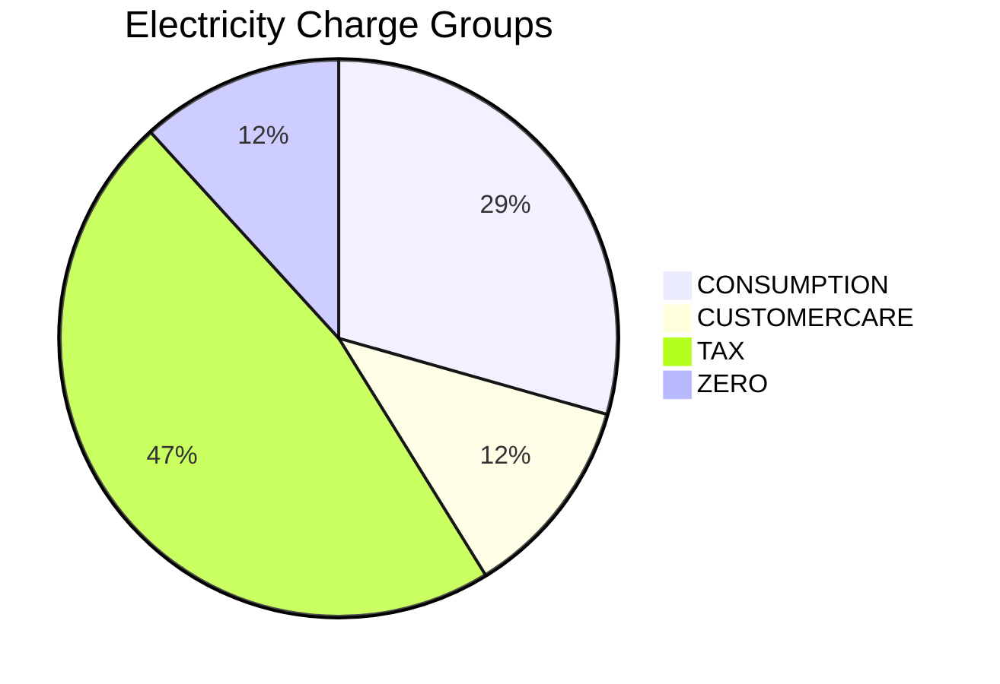

# Electricity Tariffs Report

**Source:** Live SBill API
**Date:** 2026-06-20
**Status:** Investigation / Planning

---

## Overview

5 electricity tariffs discovered. Two pricing modes:

| Mode   | Description                                      | Tariffs          |
|--------|--------------------------------------------------|------------------|
| STEP   | Progressive tiered rates per consumption band    | 1, 3             |
| FLAT   | Single fixed rate per unit for all consumption   | 10054, 10062, 10078 |

---

## Tariff 1 — "منزلي" (Residential) — STEP Mode

**Period:** 2020-07-01 → 2024-01-31

### Charges

| # | Name | Group | Type | Rate/Amount | Frequency |
|---|------|-------|------|-------------|-----------|
| 1 | Consumption | CONSUMPTION | STEPS | Tiered rates (TBD tiers) | MONTHLY |
| 2 | Customer Service Fees | CUSTOMERCARE | STEPS | Tiered rates (TBD tiers) | MONTHLY |
| 3 | المقروء بصفر (Zero Reading) | ZERO | ZERO | flatAmount=9,000 (**9 EGP**) | MONTHLY |
| 4 | Radio Fees | TAX | PER_UNIT | flatRate=90 (**0.09 EGP/unit**), upperLimit=90 | MONTHLY |
| 5 | Governmental | TAX | STATIC | flatAmount=10 (**0.01 EGP**) | MONTHLY |
| 6 | دمغة عقد (Stamp) | TAX | STATIC | flatAmount=3,000 (**3 EGP**) | YEARLY (Jan) |

### STEP Mode Equation (Consumption)

```
For each tier (from_usage, to_usage, rate_value):

    tier_consumption = min(consumption, to_usage - from_usage)
    tier_charge = tier_consumption * rate_value / 1000  // convert to EGP
    
    consumption -= tier_consumption  // remaining for next tier

TotalCharge = sum(tier_charge for all tiers)
```

> **Note:** The above assumes **progressive** tiering (each unit priced at its tier's rate). If SBill uses **block** tiering (entire consumption at highest tier), the formula changes to a single lookup.

### STEP Mode Equation (Customer Service Fees)

Same tier structure as consumption but with a different rate table (stored in the same `tariff_charges_details` table, linked by `charge_id`).

### Radio Fee Capping

```
radioCharge = min(consumption * 90, 90 * upperLimit)
// or: radioCharge = min(consumption, 90) * 90  // 90 units max at 90 milliemes
```

The `upperLimit=90` suggests a cap — either the total fee or the chargeable units is limited to 90. Need to verify interpretation from JRXML.

---

## Tariff 3 — "تجاري" (Commercial) — STEP Mode

**Period:** 2020-07-01 → 2024-01-31

### Charges

| # | Name | Group | Type | Rate/Amount | Frequency |
|---|------|-------|------|-------------|-----------|
| 1 | Consumption | CONSUMPTION | STEPS | Tiered rates (TBD tiers) | MONTHLY |
| 2 | Customer Service Fees | CUSTOMERCARE | STEPS | Tiered rates (TBD tiers) | MONTHLY |
| 3 | المقروء بصفر (Zero Reading) | ZERO | ZERO | flatAmount=9,000 (**9 EGP**) | MONTHLY |
| 4 | Radio Fees | TAX | STATIC | flatAmount=90 (**0.09 EGP**) | MONTHLY |
| 5 | Governmental | TAX | STATIC | flatAmount=10 (**0.01 EGP**) | MONTHLY |
| 6 | تمغة إستهلاك (Consumption Stamp) | TAX | PER_UNIT | flatRate=32 (**0.032 EGP/unit**) | MONTHLY |
| 7 | دمغة عقد (Stamp) | TAX | STATIC | flatAmount=3,000 (**3 EGP**) | YEARLY |

### Key Differences from Residential Tariff 1

| Aspect | Tariff 1 (Residential) | Tariff 3 (Commercial) |
|--------|----------------------|----------------------|
| Radio Fees | PER_UNIT with cap | STATIC fixed 90 |
| Consumption Stamp | Not present | PER_UNIT at 32 milliemes |
| Tier rates | Likely lower | Likely higher |

---

## Tariff 10078 — "Electric Car Charging" — FLAT Mode

**Period:** 2019-01-01 → 2024-10-31

| Property   | Value                              |
|------------|------------------------------------|
| ID         | 10078                              |
| Name       | Electric Car Charging              |
| Type       | ELECTRICITY                        |
| Mode       | FLAT                               |
| flatRate   | 1,890 milliemes (**1.89 EGP/unit**) |

### FLAT Mode Equation

```
Charge = Consumption × flatRate / 1000

Example:
    Consumption = 100 units
    Charge = 100 × 1,890 / 1000 = 189.00 EGP
```

---

## Tariff 10054 — "Chilled Water" — FLAT Mode

**Period:** 2024-07-03 → ongoing (open-ended)

| Property   | Value                              |
|------------|------------------------------------|
| ID         | 10054                              |
| Name       | Chilled Water                      |
| Type       | ELECTRICITY *(misclassified)*      |
| Mode       | FLAT                               |
| flatRate   | 3,000 milliemes (**3.00 EGP/unit**) |

### FLAT Mode Equation

```
Charge = Consumption × 3,000 / 1000 = Consumption × 3.00 EGP
```

---

## Tariff 10062 — "chilled_3" — FLAT Mode

**Period:** 2024-06-01 → ongoing (open-ended)

| Property   | Value                              |
|------------|------------------------------------|
| ID         | 10062                              |
| Name       | chilled_3                          |
| Type       | ELECTRICITY *(misclassified)*      |
| Mode       | FLAT                               |
| flatRate   | 3,000 milliemes (**3.00 EGP/unit**) |

Identical rate to 10054. Likely a different chilled water zone or meter group.

---

## Comparison Table

| Tariff | Name | Mode | Rate (milliemes/unit) | Rate (EGP/unit) | Has Tiers | Has ZERO Charge | Stamp Duty |
|--------|------|------|----------------------|-----------------|-----------|-----------------|------------|
| 1 | Residential | STEP | Variable by tier | Variable | Yes | Yes (9 EGP) | 3,000/year |
| 3 | Commercial | STEP | Variable by tier | Variable | Yes | Yes (9 EGP) | 3,000/year |
| 10078 | EV Charging | FLAT | 1,890 | 1.89 | No | TBD | TBD |
| 10054 | Chilled Water | FLAT | 3,000 | 3.00 | No | TBD | TBD |
| 10062 | chilled_3 | FLAT | 3,000 | 3.00 | No | TBD | TBD |

---

## Charge Group Distribution (Electricity)



*Tax charges dominate the electricity tariff structure (governmental, radio, stamp duties).*

---

## Open Questions

1. **Tier values** for Tariffs 1 and 3 — need to fetch from `tariff_charges_details` table
2. **Rate difference** between Residential and Commercial tiers — expected to be higher for commercial
3. **Chilled water classification** — should tariffs 10054/10062 be reclassified as a separate utility type?
4. **EV charging charges** — are there additional charges beyond the FLAT rate? Need to fetch charges for tariff 10078.
