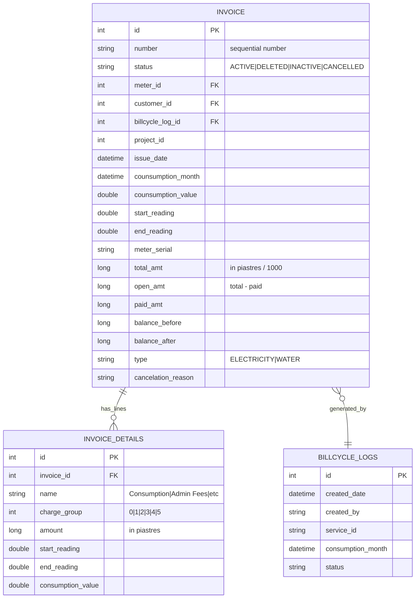
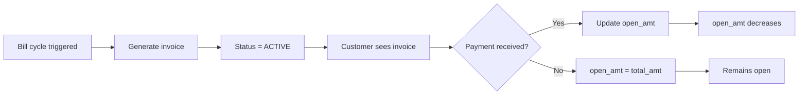

# Invoice Engine — Phase 6 Investigation

> **Status**: INVESTIGATION / PLANNING ONLY — no code changes, no database writes.

## 1. Invoice Data Model



## 2. Invoice Generation (Batch Process)

Invoices are generated via **bill cycle run** (batch):

From `user_audit_log.jrxml`:
```sql
SELECT created_by, created_date, 'Bill Cycle' AS scope,
  'Run billing cycle for ' + lower(service_id) + ' service and month '
  + CAST(MONTH(consumption_month) AS varchar) + '-' + CAST(YEAR(consumption_month) AS varchar) AS action
FROM billcycle_logs
```

Steps:
1. Admin triggers bill cycle for a service type and month
2. System finds all ACTIVE meters with that service type
3. For each meter: reads current/previous reading, calculates consumption
4. Applies tariff to consumption → creates invoice_details lines
5. Creates invoice record with total_amt = SUM of all details
6. Logs to billcycle_logs with created_by tracking

## 3. Invoice Numbering

Invoice numbers are **sequential per project/utility**:
- The `number` field is a string, formatted as a sequential number
- Each project has its own sequence
- Each utility type (electricity, water) may have separate sequences
- Format: appears to be a simple auto-increment number

## 4. Invoice Statuses (from JRXML)

| Status | Meaning | Background Display |
|--------|---------|-------------------|
| ACTIVE | Normal posted invoice | No overlay |
| DELETED | Cancelled/deleted | Red "ملغيــــة" watermark over entire invoice |
| INACTIVE | Cancelled (from `canceled_invoices.jrxml`) | Filtered as `status = 'INACTIVE' OR status = 'DELETED'` |
| CANCELLED | Explicitly cancelled with reason | `cancelation_reason` field populated |

From `invoice_elec.jrxml` background band:
```java
$F{status}.equals("DELETED") ? "ملغيــــة" : ""
```

## 5. Posting Flow



## 6. Invoice Reversal (Cancellation)

From `canceled_invoices.jrxml`:
```sql
WHERE (invoice.status = 'INACTIVE' OR invoice.status = 'DELETED')
```

- Cancelled invoice has `cancelation_reason` populated
- Original invoice is preserved (not deleted from DB)
- Status changed to INACTIVE or DELETED
- Financial impact is reversed via adjustment or separate cancellation entry

## 7. Invoice Regeneration

When regenerating an invoice:
1. Old invoice for the same meter+period is deleted (status = DELETED)
2. New invoice is generated with same consumption month
3. New invoice gets a new `number`
4. The `billcycle_log_id` links to the generation run

## 8. Invoice Details Subqueries

From `invoice_elec.jrxml` (SBill reference):
```sql
SELECT SUM(amount) FROM invoice_details WHERE invoice_id = ? AND charge_group = 0  -- 'Cons'
SELECT SUM(amount) FROM invoice_details WHERE invoice_id = ? AND charge_group = 4  -- 'Admin'
SELECT SUM(amount) FROM invoice_details WHERE invoice_id = ? AND charge_group IN (2,3) -- 'CS'
SELECT SUM(amount) FROM invoice_details WHERE invoice_id = ? AND charge_group = 1  -- 'OTHER'
SELECT SUM(amount) FROM invoice_details WHERE invoice_id = ? AND charge_group = 5  -- 'PERCENTAGE'
```

From `invoice_elec.jrxml` (new template):
```sql
SELECT SUM(amount) FROM invoice_details WHERE invoice_id = ? AND charge_group='CONSUMPTION'
SELECT SUM(amount) FROM invoice_details WHERE invoice_id = ? AND charge_group='CUSTOMER_SERVICE'
SELECT SUM(amount) FROM invoice_details WHERE invoice_id = ? AND charge_group='ISSUE_FEES'
SELECT SUM(amount) FROM invoice_details WHERE invoice_id = ? AND charge_group='FEES'
```

From `monthly_finance.jrxml`, invoice_details named breakdown:
```sql
SELECT SUM(amount) FROM invoice_details WHERE name IN ('Admin Fees')
SELECT SUM(amount) FROM invoice_details WHERE name IN ('رسم إذاعة', 'رسم محافظه')
SELECT SUM(amount) FROM invoice_details WHERE name IN ('تمغة إستهلاك', 'تمغة توريد - تعاقد')
SELECT SUM(amount) FROM invoice_details WHERE name IN ('Customer Service Fees')
```

## 9. Invoice Display Formula

Invoice amounts are stored in **piastres** (1/1000 of currency unit):
```java
$F{total_amt}.doubleValue() / 1000  // Display as EGP
$F{Cons}.doubleValue() / 1000
$F{CS}.doubleValue() / 1000
```

Format pattern: `#,##0.00` (2 decimal places) for monetary values, `#,##0.000` (3 decimal places) for readings.

Arabic amount text conversion:
```java
$F{total_amt} != 0
  ? com.hypercell.shared.utils.NumberToArabic.convertToArabic(($F{total_amt}.doubleValue()/1000), "EGP")
  : "صفر"
```

## 10. Invoice Query Structure

From `invoice_elec.jrxml` (new template):
```sql
FROM invoice i, meter m, customer c, tariff t, unit u
WHERE i.meter_id = m.id
  AND m.unit_id = u.id
  AND m.customer_id = c.id
  AND m.tariff_id = t.id
  AND i.id = $P{invoiceId}
```

This shows the 5-table join pattern for a single invoice retrieval.
