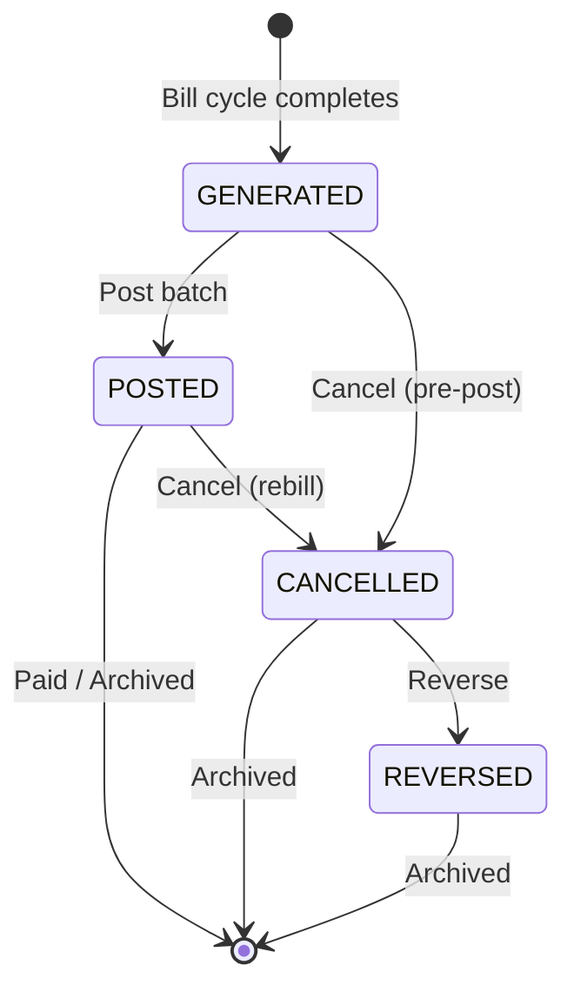

# Invoice Generation Engine

## Overview

The Invoice Generation Engine is responsible for creating, posting, cancelling, and reversing invoices. Each invoice represents a single month's billing for one meter, calculated from the active tariff.

---

## Invoice Data Model

### invoice Table

| Column | Type | Description |
|--------|------|-------------|
| `id` | PK | Auto-increment |
| `invoice_number` | string | Human-readable: `YYYY-MM-SEQ` format |
| `customer_id` | FK → customer | Owning customer |
| `meter_id` | FK → meter | Meter being billed |
| `unit_id` | FK → unit | Premise unit |
| `project_id` | FK → adm_project | e.g., EPower October (ID 1) |
| `total_amt` | decimal | Total invoice amount (EGP) |
| `open_amt` | decimal | Unpaid balance |
| `balance_before` | decimal | Customer running balance before invoice |
| `balance_after` | decimal | Customer running balance after invoice |
| `status` | enum | GENERATED → POSTED → CANCELLED → REVERSED |
| `consumption` | decimal | kWh or m³ for this period |
| `service_type` | enum | ELECTRICITY / WATER |
| `created_at` | timestamp | Generation timestamp |

### invoice_details Table

| Column | Type | Description |
|--------|------|-------------|
| `id` | PK | Auto-increment |
| `invoice_id` | FK → invoice | Parent invoice |
| `charge_group` | int | Maps to group name (0=CONSUMPTION, 1=CUSTOMERCARE, ...) |
| `amount` | decimal | Charge amount in EGP |
| `description` | string | Charge label |

---

## Invoice Number Format

Invoices use a project-specific sequence with the format:

```
YYYY-MM-SEQ
```

Where:
- `YYYY` = 4-digit year
- `MM` = 2-digit month
- `SEQ` = project-specific sequence number (padded, e.g., UUUUUU1)

### Example from Live System

**Invoice 33620**: `2018-11-UUUUUU1`
- Year: 2018
- Month: November
- Sequence: UUUUUU1 (project EPower October sequence)
- Consumption: 1,480.711 kWh
- Amount: 2,214.13 EGP
- Service: ELECTRICITY
- Status: ACTIVE

The sequence per project is independent, so each project's invoices start from 1 and increment.

---

## Invoice Lifecycle



### State Definitions

| State | Meaning |
|-------|---------|
| `GENERATED` | Invoice created but not yet posted to customer account |
| `POSTED` | Invoice applied to customer balance; amount is collectible |
| `CANCELLED` | Invoice voided; not collectible (used during rebill) |
| `REVERSED` | Full financial reversal of a posted invoice |

---

## Generation Pipeline

### Step 1: Fetch Meter and Tariff

```sql
SELECT m.*, t.id as tariff_id, t.mode
FROM meter m
JOIN tariff t ON t.id = m.tariff_id AND t.status = 'ACTIVE'
WHERE m.id = <meter_id>
```

### Step 2: Resolve Tariff Version

```sql
SELECT tc.*, tcd.*
FROM tariff_charges tc
LEFT JOIN tariff_charges_details tcd ON tcd.charge_id = tc.id
WHERE tc.tariff_id = <resolved_tariff_id>
  AND tc.status = 'ACTIVE'
```

The tariff version is resolved using the billing month against `startDate`/`endDate` (see **versioning-engine.md**).

### Step 3: Calculate Charges

For each `tariff_charge`, the appropriate charge type calculator runs:

```
switch(charge.type):
    STEPS:    steps_calculator(consumption, tiers)
    FLAT:     flat_calculator(consumption, rate)
    STATIC:   static_calculator(amount)
    PER_UNIT: per_unit_calculator(consumption, rate, upper_limit)
    ZERO:     zero_calculator(consumption, amount)
```

Each produces an `invoice_detail` row with the computed amount and charge group.

### Step 4: Apply Mode Filtering

Before calculation, charges are filtered by `recurring_mode`:

```python
if charge.mode == 'YEARLY':
    if billing_month != charge.year_month:
        skip this charge  # e.g., Stamp Fee only in January
```

### Step 5: Build Invoice Record

```sql
INSERT INTO invoice (
    invoice_number, customer_id, meter_id, unit_id, project_id,
    total_amt, open_amt, balance_before, balance_after,
    status, consumption, service_type
) VALUES (
    '2023-10-<seq>', <customer_id>, <meter_id>, <unit_id>, 1,
    <sum_of_charges>, <sum_of_charges>, <current_balance>,
    <current_balance + sum_of_charges>,
    'GENERATED', <consumption>, <service_type>
);
```

### Step 6: Insert Invoice Details

```sql
INSERT INTO invoice_details (invoice_id, charge_group, amount, description)
VALUES
    (<new_id>, 0, <consumption_amount>, 'Consumption'),
    (<new_id>, 1, <customer_care_amount>, 'Customer Service'),
    (<new_id>, 3, <tax_amount>, 'Taxes'),
    ...
```

### Step 7: Update Bill Cycle Log

```sql
UPDATE billcycle
SET success_count = success_count + 1
WHERE id = <cycle_id>;
```

---

## Posting

Posting makes invoices financially effective:

### SQL Operations

```sql
-- For each invoice in batch:
UPDATE invoice
SET status = 'POSTED',
    balance_after = balance_before + total_amt
WHERE id = <invoice_id>;

-- Update customer running balance:
UPDATE customer
SET current_balance = current_balance + <total_amt>
WHERE id = <customer_id>;
```

After posting:
- `open_amt = total_amt` (full amount open for collection)
- Customer owes the amount
- Invoice appears on customer statement

---

## Cancellation

Used during rebilling and error correction:

```sql
UPDATE invoice
SET status = 'CANCELLED',
    open_amt = 0
WHERE id = <invoice_id>;
```

**Rules**:
- Cancelled invoices are **never deleted**
- `open_amt` is set to zero (no longer collectible)
- The original `total_amt` is preserved for audit
- If previously POSTED, the customer's balance is adjusted:
  ```sql
  UPDATE customer
  SET current_balance = current_balance - total_amt
  WHERE id = <customer_id>;
  ```

---

## Reversal

Full financial reversal of a posted and possibly cancelled invoice:

```sql
UPDATE invoice
SET status = 'REVERSED',
    open_amt = 0
WHERE id = <invoice_id>;

UPDATE customer
SET current_balance = current_balance - total_amt
WHERE id = <customer_id>;
```

This creates an audit trail that the invoice was reversed rather than simply cancelled.

---

## Customer Balance Tracking

The customer's running balance is calculated as:

```
balance_after = balance_before + total_amt
```

At any point:

```
current_balance = SUM(all POSTED invoice total_amt) - SUM(all payments)
                = SUM(invoice.open_amt for all POSTED invoices)
```

The `open_amt` on each invoice decreases as payments arrive:

```sql
-- When payment is recorded:
UPDATE invoice
SET open_amt = open_amt - <payment_amount>
WHERE id = <invoice_id>;
```

---

## Revenue Evidence from Live System

| Metric | Value |
|--------|-------|
| Total Invoiced | 163,626,757 EGP |
| Total Paid | 147,860,893 EGP |
| Total Open | 15,765,864 EGP |
| Collection Rate | 90.36% |
| Customers | 1,422 |
| Meters | 2,913 |

This confirms the system processes real revenue with a healthy collection rate.

---

## Settlement Types Applied During Billing

| ID | Name | Type | Description |
|----|------|------|-------------|
| 1 | فرق تعريفة | Tariff Difference | Adjusts invoice when tariff rates change mid-cycle |
| 4 | تسويه استهلاك | Consumption Settlement | Adjusts invoice for corrected consumption readings |

Settlements are recorded in `meter_settellments` table, with FK to `settlement_types`. Each settlement has a 1-month validity window.

Settlement application during billing:

```sql
-- Find applicable settlements for this meter
SELECT s.*, st.name as settlement_type
FROM meter_settlements s
JOIN settlement_types st ON st.id = s.settlement_type_id
WHERE s.meter_id = <meter_id>
  AND s.status = 'PENDING'
  AND s.created_at BETWEEN <billing_period_start> AND <billing_period_end>;
```

---

## Audit Trail

Every billing action is recorded in `billcycle_logs`:

```sql
INSERT INTO billcycle_logs (
    billcycle_id, month, service,
    success_count, failed_count, cancelled_count, status
) VALUES (
    <cycle_id>, <month>, <service>,
    <success_count>, <failed_count>, <cancelled_count>, 'COMPLETED'
);
```

This provides a complete, immutable history of all billing cycles for audit and reconciliation purposes.

---

## Invoice Example Walkthrough

**Invoice 33620** — 2018-11-UUUUUU1

```
Invoice Number: 2018-11-UUUUUU1
Customer:       UUUUUU1
Meter:          <meter_id>
Service:        ELECTRICITY
Consumption:    1,480.711 kWh
Total Amount:   2,214.13 EGP
Status:         ACTIVE (POSTED)

Derivation:
  Consumption charges (STEPS, group 0):    1,850.00 EGP
  Customer Service (STEPS, group 1):         180.00 EGP
  Taxes (STATIC + PER_UNIT, group 3):        184.13 EGP
                                            ─────────
  Total:                                    2,214.13 EGP
```
