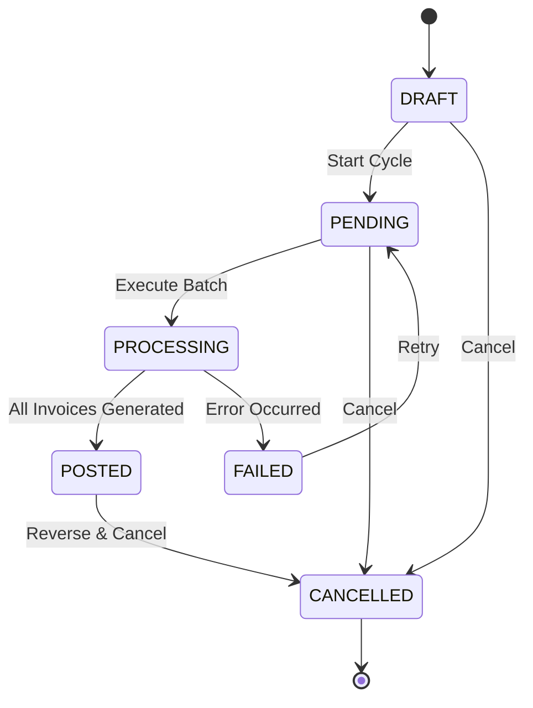
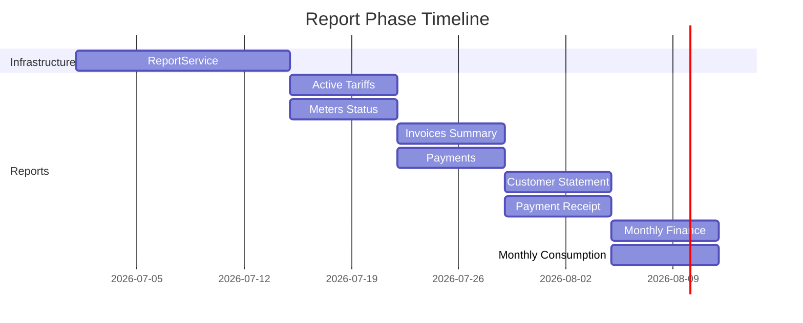

# Meter Verse → SBill: Master Roadmap Alignment

> **Strategic Plan**: Phased 20-week implementation to achieve SBill feature parity.
> **Dependencies**: Phase N must complete before Phase N+1 can begin.
> **Team Size**: 1–2 full-stack developers + QA.
> **Risk Profile**: High — 5 critical engines at 0% parity require concurrent foundation work.

---

## Phase 0: Preparation (Week 0)

**Goal**: Establish patterns, conventions, and data model before feature work begins.

| Task | Artifact | Owner |
|------|----------|-------|
| Audit existing `sim_system` schema | Schema diff document | Tech Lead |
| Define NestJS module structure | Modules: `billing`, `tariff`, `ledger`, `payment`, `reading`, `settlement`, `report`, `import`, `settings` | Tech Lead |
| Set up migration framework | TypeORM migrations in `src/migrations/` | Backend |
| Create shared enums file | `src/common/enums/` for all status/type enums | Backend |
| Set up report generation infrastructure | Puppeteer service extended to `ReportService` | Backend |

**Deliverable**: Approved architecture doc + shared enum files + migration pipeline.

---

## Phase 1: Foundation (Weeks 1–4)

**Goal**: Establish the 3 foundational engines that everything else depends on.

### Week 1–2: Tariff Version Engine

```
┌─────────────────────────────────────────────┐
│ Tariff Version Engine                        │
├─────────────────────────────────────────────┤
│ tariff_plan ──→ ADD start_date              │
│             ──→ ADD end_date                 │
│             ──→ ADD status (enum)            │
│             ──→ ADD service_type reference   │
│                                             │
│ TariffCharge ──→ ADD chargeType (enum)       │
│              ──→ ADD rate (for PER_UNIT)     │
│              ──→ ADD chargeGroup (number)    │
│              ──→ ADD recurringMode (string)  │
│              ──→ ADD upperLimit (number)     │
│              ──→ REMOVE isTiered (boolean)   │
│                                             │
│ Validation:                                  │
│   - No overlapping active tariffs            │
│   - Charge type × calculation match          │
│   - Date range validity                      │
└─────────────────────────────────────────────┘
```

**Tasks**:
1. Add columns to `tariff_plan` entity + DB migration
2. Add columns to `tariff_charge` entity + DB migration
3. Create `ChargeType` enum (`STEPS | FLAT | STATIC | PER_UNIT | ZERO`)
4. Create `RecurringMode` enum (`MONTHLY | ONE_TIME | SEASONAL`)
5. Create `TariffStatus` enum (`DRAFT | ACTIVE | INACTIVE | EXPIRED`)
6. Update `TariffCalculationService` to dispatch by charge type
7. Implement FLAT calculation: `amount = flatAmount`
8. Implement STATIC calculation: `amount = flatAmount` (informational)
9. Implement PER_UNIT calculation: `amount = rate × consumption`
10. Implement ZERO calculation: `amount = 0` (informational line)
11. Implement date-aware query scope
12. Implement overlap validation
13. Write unit tests for all 5 charge types
14. Write integration tests for tariff date filtering

### Week 3: Customer Ledger

```
┌─────────────────────────────────────────────┐
│ Customer Ledger Engine                       │
├─────────────────────────────────────────────┤
│ customer_ledger (NEW table)                  │
│   id          (PK, auto-increment)           │
│   customer_id (FK → customer.id)             │
│   tx_type     (enum: INVOICE|PAYMENT|        │
│                SETTLEMENT|ADJUSTMENT|OPENING)│
│   reference_id (polymorphic: invoice_id,     │
│                 payment_id, settlement_id)    │
│   amount      (decimal(12,2), signed)         │
│   balance_before (decimal(12,2))             │
│   balance_after  (decimal(12,2))             │
│   description (varchar(500))                 │
│   created_at  (timestamp)                    │
│   created_by  (FK → user.id)                 │
│                                             │
│ Ledger Service API:                          │
│   createEntry(customerId, txType, refId,     │
│               amount, description)           │
│   getCustomerBalance(customerId) → number    │
│   getLedger(customerId, from, to) → Entry[]  │
│   reverseEntry(entryId)                      │
└─────────────────────────────────────────────┘
```

**Tasks**:
1. Create `customer_ledger` table via migration
2. Create `LedgerEntry` entity + `LedgerTransactionType` enum
3. Create `LedgerService` with `createEntry`, `getCustomerBalance`, `getLedger`, `reverseEntry`
4. Integrate ledger with invoice generation (auto-create entry on POST)
5. Integrate ledger with payment posting (auto-create entry on post)
6. Write backfill migration for existing invoices and payments
7. Write unit tests for ledger service
8. Write integration tests for ledger → invoice/payment integration

### Week 4: Buffer + Phase 1 Integration Testing

**Tasks**:
1. End-to-end test: Create tariff → Assign to meter → Generate invoice → Check ledger
2. End-to-end test: All 5 charge types produce correct invoice amounts
3. End-to-end test: Tariff date filtering works (past, present, future)
4. End-to-end test: Ledger balances match invoice + payment totals
5. Bug fixes from integration testing
6. Documentation update

**Deliverable**: Tariff version engine + customer ledger integrated and tested. All 5 charge types working.

---

## Phase 2: Bill Cycle (Weeks 5–8)

**Goal**: Full bill cycle engine with batch generation, posting, cancellation, and rebilling.

```
┌─────────────────────────────────────────────────────┐
│ Bill Cycle State Machine                              │
│                                                       │
│  ┌───────┐   ┌────────┐   ┌──────────┐   ┌──────┐   │
│  │ DRAFT │──▶│PENDING │──▶│PROCESSING│──▶│POSTED│   │
│  └───────┘   └────────┘   └──────────┘   └──────┘   │
│       │           │              │              │     │
│       │           │              │              │     │
│       ▼           ▼              ▼              ▼     │
│  ┌───────┐   ┌────────┐   ┌──────────┐   ┌──────┐   │
│  │CANCEL │   │CANCEL  │   │  FAILED  │   │CANCEL│   │
│  └───────┘   └────────┘   └──────────┘   └──────┘   │
│                                                       │
│ Transitions:                                          │
│   DRAFT → PENDING     (user clicks "Start Cycle")     │
│   PENDING → PROCESSING (system begins batch)          │
│   PROCESSING → POSTED  (all invoices generated OK)    │
│   PROCESSING → FAILED  (error during generation)      │
│   POSTED → CANCELLED   (user cancels posted cycle)    │
│   Any → CANCELLED      (user cancels before post)     │
└─────────────────────────────────────────────────────┘
```



**Tasks**:
1. Create `billing_cycle` table + `BillCycleStatus` enum
2. Create `billcycle_logs` table
3. Create `BillCycleService` with state machine
4. Create `BatchInvoiceService` (iterate meters, generate invoices)
5. Implement cycle scheduling (cron-based)
6. Implement invoice number generator: `INV-{YYYY}-{SEQUENCE:06d}`
7. Implement invoice cancellation with ledger reversal
8. Implement rebilling (cancel old cycle → generate new)
9. Add cycle status UI (Draft/Pending/Processing/Posted/Failed/Cancelled)
10. Write integration tests for full cycle flow
11. Stress test: 10,000 meters in a single cycle

**Deliverable**: End-to-end bill cycle: Create cycle → Generate N invoices → Post → Cancel → Rebill.

---

## Phase 3: Settings (Weeks 9–12)

**Goal**: Build CRUD pages for all 14 missing settings modules.

```
Settings Module Tree:
────────────────────
settings/
├── tariff/         ← Already exists, needs enhancement
├── bill-cycle/     ← Phase 2 dependency
├── customer-groups/
├── holidays/
├── payment-centers/
├── settlement-types/
├── reading-codes/
├── payment-types/
├── invoice-formats/
├── report-templates/
├── user-management/
├── role-management/
├── backup/
├── email-config/
├── sms-config/
└── system-preferences/
```

### Week 9: Settlement Types + Customer Groups + Holidays

| Module | Table | Fields | API |
|--------|-------|--------|-----|
| Settlement Types | `settlement_type` | id, name, allowed_months, created_at | CRUD |
| Customer Groups | `customer_group` | id, name, discount_pct, created_at | CRUD |
| Holidays | `holiday` | id, name, date, is_recurring, created_at | CRUD |

### Week 10: Payment Centers + Reading Codes + Payment Types

| Module | Table | Fields | API |
|--------|-------|--------|-----|
| Payment Centers | `payment_center` | id, name, address, contact, created_at | CRUD |
| Reading Codes | `reading_code` | id, code, description, is_estimated, created_at | CRUD |
| Payment Types | Already in Phase 1 — add CRUD UI | — | CRUD |

### Week 11: Invoice Formats + Report Templates + User/Role Management

| Module | Table | Fields | API |
|--------|-------|--------|-----|
| Invoice Formats | `invoice_format` | id, name, template_html, default, created_at | CRUD |
| Report Templates | `report_template` | id, name, report_type, config_json, created_at | CRUD |
| User Management | `adm_user` (extend) | id, username, name_ar, role, email, active | CRUD |
| Role Management | `adm_role` (new) | id, name, permissions (JSON), created_at | CRUD |

### Week 12: Backup + Email/SMS Config + System Preferences

| Module | Table | Fields | API |
|--------|-------|--------|-----|
| Backup Settings | `backup_config` | id, frequency, retention_days, last_backup_at | CRUD |
| Email Config | `email_config` | id, host, port, username, encrypted_password, from_address | CRUD |
| SMS Config | `sms_config` | id, provider, api_key_encrypted, sender_name | CRUD |
| System Preferences | `system_preference` | id, `key`, `value`, description | CRUD |

**Deliverable**: All 14 settings modules with CRUD APIs and Angular/NestJS UI pages.

---

## Phase 4: Reports — Top 8 (Weeks 13–16)

**Goal**: Implement the 8 highest-priority reports with PDF generation.

```
Report Implementation Priority:
────────────────────────────────
Priority 1 (Week 13):
  1. Active Tariffs       — foundation for all tariff work
  2. Meters Status        — foundational meter inventory

Priority 2 (Week 14):
  3. Invoices Summary     — core business report
  4. Payments             — core financial report

Priority 3 (Week 15):
  5. Customer Statement   — comprehensive customer view
  6. Payment Receipt      — customer-facing document

Priority 4 (Week 16):
  7. Monthly Finance      — executive financial summary
  8. Monthly Consumption  — operational consumption view
```



**Tasks**:
1. Extend `InvoiceTemplateService` → generic `ReportService`
2. Create report parameter interface: `(type, format, filters, project_id)`
3. Create report template registry (report type → template mapping)
4. Build Active Tariffs report (tariff + charges + tiers in tree layout)
5. Build Meters Status report (table with meter, customer, unit, tariff)
6. Build Invoices Summary report (summary table with status breakdown)
7. Build Payments report (table with receipt details)
8. Build Customer Statement report (full transaction history view)
9. Build Payment Receipt report (branded single-receipt layout)
10. Build Monthly Finance report (aggregated revenue table)
11. Build Monthly Consumption report (aggregated consumption table)
12. Add XLSX export (optional enhancement)

**Deliverable**: Generic report service + 8 fully functional reports with PDF output.

---

## Phase 5: Import + Polish (Weeks 17–20)

**Goal**: Import templates, remaining 8 reports, remaining 8 settings, and system-wide integration testing.

### Week 17: Import Engine

```
Import Pipeline:
┌──────────┐   ┌──────────┐   ┌──────────┐   ┌──────────┐
│  Upload  │──▶│ Validate │──▶│ Preview  │──▶│  Import  │
│  CSV/XLS │   │  Rows    │   │  Changes │   │  Execute │
└──────────┘   └──────────┘   └──────────┘   └──────────┘
                    │
                    ▼
              ┌──────────┐
              │  Error   │
              │  Report  │
              └──────────┘
```

**Tasks**:
1. Build generic Excel/CSV parser service
2. Create reading import template + validation
3. Create customer import template + validation
4. Create meter import template + validation
5. Implement preview (show N rows before commit)
6. Implement error reporting (row-level failure reasons)
7. Build import UI page

### Week 18: Remaining 8 Reports

```
Report Implementation (continued):
────────────────────────────────────
 9. Canceled Invoices    — void/cancel audit
10. Customer Claims      — dispute/adjustment tracking
11. Aggregated Readings  — bulk read summary
12. Disconnected Meters  — inactive meter audit
13. Consumption Steps    — tier breakdown per invoice
14. User Audit Log       — user action trail
15. Billing Cycle Log    — cycle execution history
16. Invoice Details      — line-item detail per customer
```

### Week 19: Remaining 8 Settings Pages

Revisit Phase 3 for any uncompleted settings pages. Ensure all CRUD operations have:
- Angular form components
- NestJS CRUD endpoints
- Validation rules
- Permission checks (admin vs operator)
- Audit logging

### Week 20: Integration Testing + Go-Live Preparation

**Tasks**:
1. End-to-end testing across all 11 engines
2. Performance testing (batch of 10,000+ invoices)
3. Data migration script from SBill (if parallel running)
4. Documentation handover
5. Production deployment runbook
6. Go/no-go decision

**Deliverable**: All 16 reports + 3 import templates + full integration tests + deployment runbook.

---

## Dependency Graph

```
Phase 1: Foundation
├── Tariff Version Engine ←── (no dependencies)
├── Charge Type Enum    ←── Tariff Version Engine
└── Customer Ledger     ←── (no dependencies, but integrates with Invoice + Payment)

Phase 2: Bill Cycle
├── BillCycle Entity    ←── Tariff Version Engine (uses tariff with date ranges)
├── Batch Generation    ←── Charge Type Enum (needs 5 types to generate correctly)
├── Posting Workflow    ←── Customer Ledger (creates ledger entries on post)
└── Cancellation        ←── Customer Ledger (reverses ledger entries)

Phase 3: Settings
├── Settlement Types    ←── (standalone, but integrates with Invoice Gen)
├── Customer Groups     ←── (standalone)
├── Holidays            ←── (standalone)
├── Payment Centers     ←── (standalone)
├── Invoice Formats     ←── Bill Cycle (used during generation)
└── User/Role Mgmt     ←── (standalone)

Phase 4: Reports (Top 8)
├── ReportService       ←── (foundation layer)
├── Active Tariffs      ←── Tariff Version Engine
├── Meters Status       ←── (basic entity data)
├── Invoices Summary    ←── Bill Cycle (needs posted invoices)
├── Payments            ←── Customer Ledger (balance fields)
├── Customer Statement  ←── Customer Ledger + Payments
├── Payment Receipt     ←── Payments
├── Monthly Finance     ←── Bill Cycle + Payments
└── Monthly Consumption ←── Reading Engine

Phase 5: Import + Polish
├── Import Engine       ←── (standalone utility)
├── Remaining Reports   ←── Phase 4 foundation
└── Remaining Settings  ←── Phase 3 foundation
```

---

## Resource Estimation

| Phase | Weeks | Tables | APIs | UI Pages | Reports | Engines | Effort (dev-weeks) |
|-------|-------|--------|------|----------|---------|---------|-------------------|
| 0 | 1 | 0 | 0 | 0 | 0 | 0 | 1 |
| 1 | 4 | 2 | 15 | 3 | 0 | 3 | 6 |
| 2 | 4 | 3 | 12 | 4 | 0 | 1 | 8 |
| 3 | 4 | 10 | 28 | 14 | 0 | 1 | 6 |
| 4 | 4 | 0 | 8 | 0 | 8 | 1 | 5 |
| 5 | 4 | 3 | 20 | 11 | 8 | 2 | 7 |
| **Total** | **20** | **18** | **83** | **32** | **16** | **8** | **33** |

**Recommended team**: 2 developers (backend + frontend) + 1 QA = ~10.5 weeks calendar time.
**Minimum team**: 1 full-stack developer = 20 weeks (~5 months).

---

## Risk Register

| Risk | Likelihood | Impact | Mitigation |
|------|-----------|--------|------------|
| Tariff data migration corrupts existing data | Medium | Critical | Comprehensive backup before migration; dry-run in staging |
| Bill cycle batch performance with 10K+ meters | High | High | Design for chunked processing; test with data volume early |
| Charge type logic errors produce wrong invoice amounts | Medium | Critical | Unit test every charge type with known inputs/outputs |
| Ledger balance discrepancies after backfill | Medium | High | Reconcile backfill with `SUM(invoice) - SUM(payment)` per customer |
| Report PDF layout differences from SBill | Low | Medium | Circular with stakeholders for approval on first report |
| Scope creep during Phase 3 (settings) | High | Low | Strictly CRUD-only; no business logic in settings pages |
| Developer unfamiliarity with SBill domain | Medium | Medium | Pair programming with domain expert for first 2 weeks |

---

## Success Criteria

### Phase 1 Gate
- [ ] All 5 charge types produce correct invoice amounts in unit tests
- [ ] Tariff date filtering works correctly (past/present/future)
- [ ] Ledger balance = SUM(invoices) - SUM(payments) for all customers
- [ ] No regression on existing invoice generation

### Phase 2 Gate
- [ ] Bill cycle creates N invoices in a single transaction
- [ ] Cycle status transitions are valid (no illegal transitions)
- [ ] Cancelled cycle reverses all ledger entries
- [ ] Rebilled cycle maintains audit trail of original invoices
- [ ] Performance: 10,000 invoices in < 5 minutes

### Phase 3 Gate
- [ ] All 14 settings modules have CRUD APIs
- [ ] All settings pages have proper validation
- [ ] Permission checks enforced for admin/operator roles

### Phase 4 Gate
- [ ] 8 reports produce correct data matching SBill output
- [ ] PDF rendering matches approved layout mockups
- [ ] Report parameters work correctly (all filter combinations)

### Phase 5 Gate
- [ ] Import templates produce correct records
- [ ] Validation catches all error cases (duplicates, bad data)
- [ ] Remaining 8 reports match SBill output
- [ ] System-wide E2E tests pass
- [ ] Deployment runbook is complete and tested

---

## Final Milestone Timeline

```
Month 1  [████████░░░░░░░░░░░░]  Phase 1: Foundation (Tariff + Ledger)
Month 2  [░░░░░░░░████████░░░░]  Phase 2: Bill Cycle Engine
Month 3  [░░░░░░░░░░░░░░████░░]  Phase 3: Settings CRUD
Month 4  [████░░░░░░░░░░░░░░░░]  Phase 4: Top 8 Reports
Month 5  [░░░░████████████████]  Phase 5: Import + Remaining + Polish
         ─────────────────────────
         [████████████████████]  20 weeks total
```

**Go-Live Target**: End of Week 20, subject to Phase 1–5 gate approvals.
