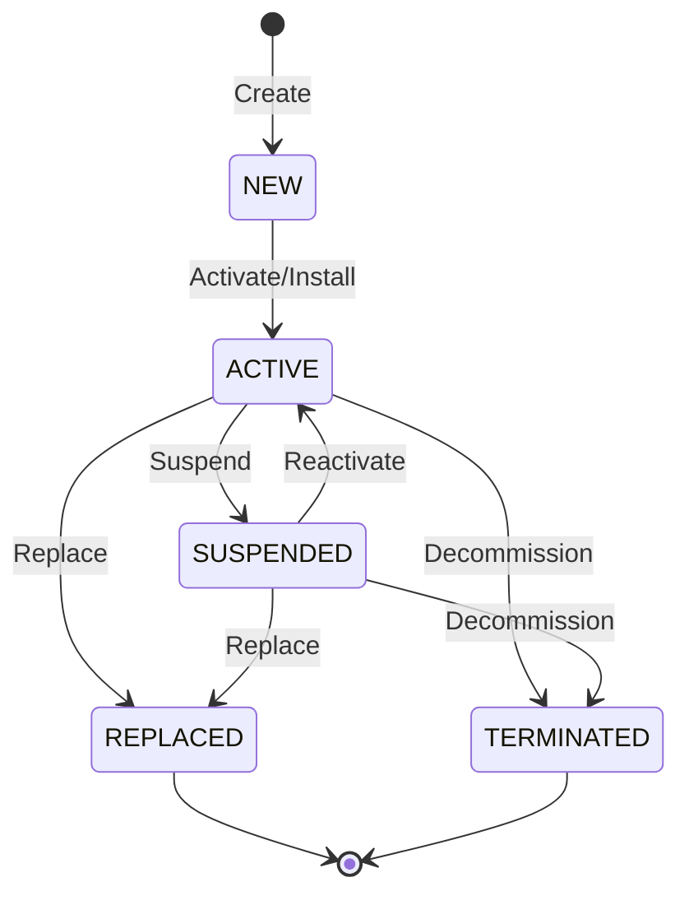
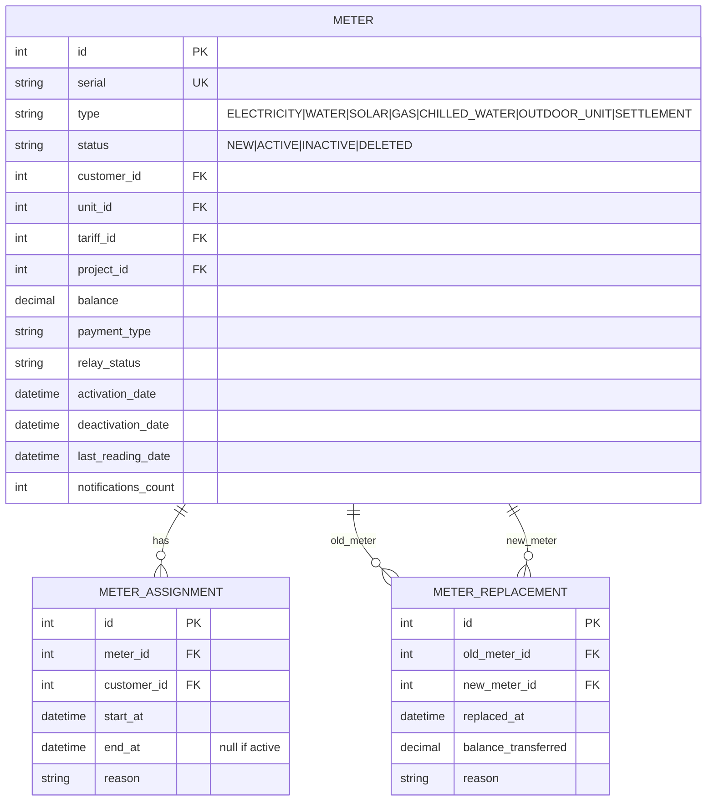

# Meter Data Model — Phase 3 Investigation

> **Status**: INVESTIGATION / PLANNING ONLY — no code changes, no database writes.

## 1. Meter Types (7 types observed from JRXML)

| Type | Service Label | Unit | Invoice Title |
|------|---------------|------|---------------|
| ELECTRICITY | كهرباء | kWh (ك.و.س) | فاتورة كهرباء |
| WATER | مياة | m³ (م³) | فاتورة مياة |
| SOLAR | Solar | kWh | Solar invoice |
| GAS | Gas | m³ | Gas invoice |
| CHILLED_WATER | Chilled Water | kWh | Chilled water invoice |
| OUTDOOR_UNIT | Outdoor Unit | kWh | Outdoor unit invoice |
| SETTLEMENT | Settlement | EGP | Settlement |

From `payment_receipt.jrxml` reading-type unit mapping:
```
ELECTRICITY% → 'kWh' / 'ك.و.س'
WATER%      → 'm³' / 'م³'
SOLAR       → 'kWh' / 'ك.و.س'
```

## 2. Meter Lifecycle States



### Status Values from JRXML

From `unallocated_meters.jrxml`: `meter.status = 'NEW'`
- **NEW** — Meter created in inventory, not yet installed/assigned
- **ACTIVE** — Meter installed, actively collecting readings, generating invoices
- **INACTIVE** — Meter suspended/temporarily out of service (seen in customer queries as filter `status != 'DELETED'`)
- **DELETED** — Meter logically deleted (data preserved, excluded from reports)
- **REPLACED** — Old meter replaced by new meter, kept for history

From `meters_status.jrxml` additional flags:
- `notifications_count` — alert counter for meter issues
- `relay_status` — relay on/off for remote disconnect capability

## 3. Meter Serial Usage

- `meter.serial` is the unique identifier displayed on invoices
- Displayed on invoices in the "رقم العداد" (Meter Number) field
- Used for lookup in customer balance queries
- Serial is user-friendly (unlike numeric `id`)

## 4. Meter Replacement Flow

From `meters_replaced.jrxml`:
- Old meter gets `deactivation_date` set
- New meter assigned to same unit/customer
- Replacement tracked via meter history
- Old meter's balance carried forward
- Query shows: `m.status`, `m.deactivation_date AS date_replaced`, old serial

The replacement formula for credit:
```sql
ISNULL(m.balance, 0) -
  (SELECT ISNULL(SUM(mr2.total_amount), 0) FROM monthly_reading mr2
   WHERE mr2.meter_id = m.id AND mr2.invoice_id IS NULL) -
  (SELECT ISNULL(SUM(i.open_amt), 0) FROM invoice i
   WHERE i.meter_id = m.id AND i.status = 'ACTIVE') AS available_credit
```

## 5. Meter Import Template

Fields needed for meter import (from `unallocated_meters.jrxml`):
- `meter.serial` — serial number
- `meter.name` — meter name/description
- `meter.status` — defaults to 'NEW' on import
- `meter.type` — one of the 7 types above
- `meter.model` — meter model/manufacturer
- `meter.project_id` — project association

## 6. Meter Fields (from `meters_details.jrxml`)

```sql
SELECT
  c.id, c.name_ar, c.name_en, c.status,
  m.payment_type AS customer_type,
  m.relay_status AS relay,
  t.name_en AS tariff,
  m.serial,
  m.type AS meter_type,
  m.activation_date,
  l.unit_no, l.additional_info, l.city,
  m.last_reading_date,
  ISNULL(m.balance, 0) AS balance,
  (SELECT ... not_invoiced),
  (SELECT ... open_invoices)
FROM customer c, meter m, unit l, tariff t
WHERE c.id = m.customer_id
  AND m.unit_id = l.id
  AND m.tariff_id = t.id
```

## 7. Meter ERD


