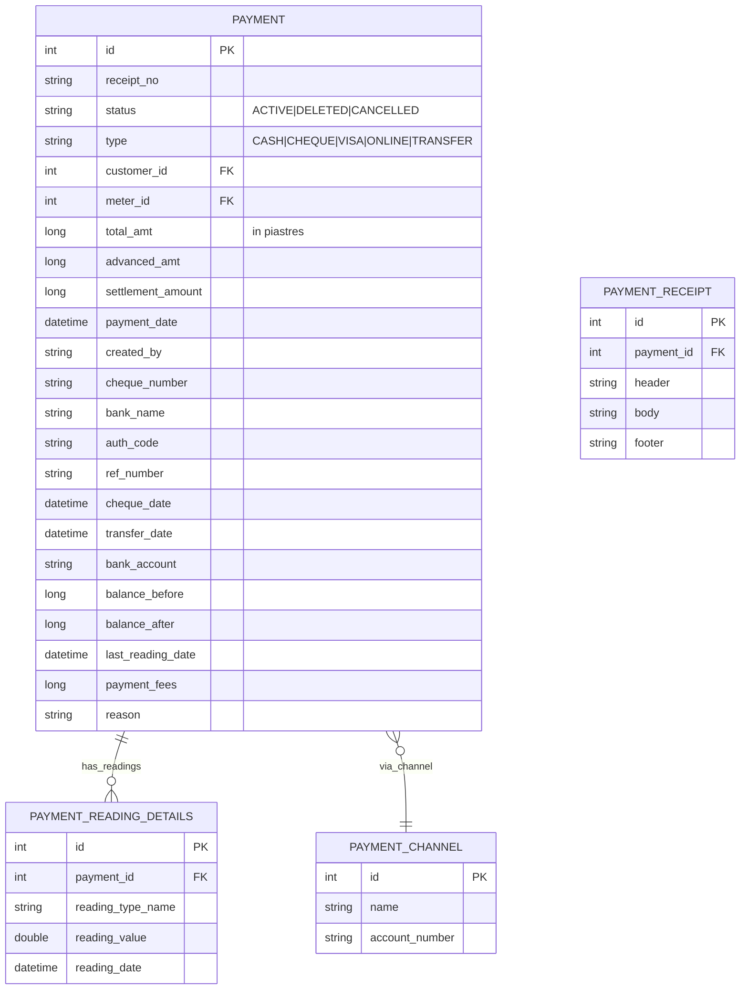

# Payment Engine — Phase 7 Investigation

> **Status**: INVESTIGATION / PLANNING ONLY — no code changes, no database writes.

## 1. Payment Data Model



## 2. Payment Types (from `payment_receipt.jrxml` and `xx_payment_receipt.jrxml`)

| Type | Description | Characteristics |
|------|-------------|-----------------|
| CASH | Cash payment | Instant, no clearing |
| CHEQUE | Cheque payment | Has cheque_number, bank_name, cheque_date |
| VISA | Credit/Debit card | Has auth_code |
| ONLINE | Online payment | Has ref_number, bank_account |
| TRANSFER | Bank transfer | Has transfer_date, bank_name, bank_account |

## 3. Payment Receipt Structure

From `payment_receipt.jrxml` parameters and fields:
- `receipt_no` — unique receipt number
- `payment_date` — date of payment
- `total_amt` — paid amount in piastres
- `type` — payment type enum
- `balance_before` — customer balance before payment
- `balance_after` — customer balance after payment
- `last_reading_date` — meter reading date at payment time
- `cheque_number`, `bank_name` — cheque-specific fields
- `advanced_amt`, `settlement_amount` — advance/settlement tracking

From `payment_receipt_mini.jrxml` (mini receipt, 216×453mm):
- Additional field: `payment_fees` — processing fees
- Customer commercial name field

## 4. Payment Allocation

Payments can be allocated in multiple ways:

**A) Payment applied to specific invoice:**
From `sub_report_payments.jrxml`:
```sql
SELECT payment.receipt_no, payment.payment_date, payment.total_amt, payment.type, payment.status
FROM payment WHERE payment.meter_id = $P{meter_id}
```
Payments are linked to meters, which ties them to invoices for that meter.

**B) Payment applied to customer balance:**
- `payment.balance_before` and `balance_after` track customer-level balance changes
- Payments update `meter.balance` field

**C) Payment reading details:**
From `payment_receipt.jrxml` subdataset:
```sql
SELECT p.reading_type_name, p.reading_value, p.reading_date,
  CASE WHEN r.service_type LIKE 'ELECTRICITY%' THEN 'kWh' ...
FROM payment_reading_details p
JOIN reading_type r ON p.reading_type_name = r.reading_type_name
WHERE p.payment_id = $P{paymentId} AND r.view_in_report = 1
```
Payments can include reading details (for prepaid/postpaid hybrid).

## 5. Partial Payments

The invoice model supports partial payments via `open_amt`:
```
open_amt = total_amt - paid_amt
```

When a partial payment is made:
1. `paid_amt` increases
2. `open_amt` decreases accordingly
3. Invoice remains ACTIVE until `open_amt = 0`

From `invoices.jrxml`:
```sql
CAST(i.total_amt / 1000.00 AS MONEY) AS amount,
CAST(i.paid_amt / 1000.00 AS MONEY) AS paid_amt,
CAST(i.open_amt / 1000.00 AS MONEY) AS open_amt
```

## 6. Advance Payments

From `xx_payment_receipt.jrxml` query:
```sql
SELECT p.advanced_amt, p.settlement_amount
```

- Advance payments are stored as `advanced_amt` on payment record
- Customer pays before invoice is generated
- Amount is recorded as credit on customer balance
- When invoice is generated, advance is applied automatically

## 7. Overpayments

When a payment exceeds the invoice total:
1. `paid_amt > total_amt` → negative `open_amt`
2. Excess amount stays as **credit balance** on the meter/customer
3. Can be:
   - **Refunded** — processed as negative payment
   - **Carried forward** — applied to next invoice
   - **Carried forward** is the default behavior

## 8. Payment Fees

From `payment_receipt_mini.jrxml`:
```sql
SELECT p.payment_fees
```

- Some payment types have processing fees
- `payment_fees` field stores the fee amount
- Fees may be added to the total or deducted from the received amount

## 9. Payment Statuses

| Status | Meaning |
|--------|---------|
| ACTIVE | Normal completed payment |
| DELETED | Payment cancelled/deleted |
| CANCELLED | Explicitly reversed with reason |

From `user_audit_log.jrxml`:
```sql
WHERE payment.status = 'ACTIVE'
```
Only ACTIVE payments are included in financial reports.

## 10. Payment Query Structure (from `payments.jrxml`)

```sql
FROM payment p
JOIN customer c ON c.id = p.customer_id
JOIN meter m ON m.id = p.meter_id
JOIN unit l ON l.id = m.unit_id
LEFT JOIN payment_channel pc ON pc.id = p.payment_channel_id
LEFT JOIN bank_account ba ON ba.id = p.our_bank_account_id
WHERE ...
```
