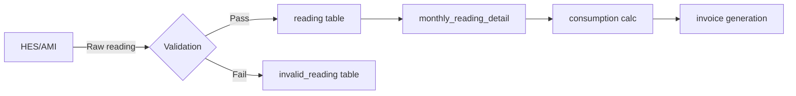

# Reading Engine — Phase 4 Investigation

> **Status**: INVESTIGATION / PLANNING ONLY — no code changes, no database writes.

## 1. Data Model

### Reading Tables (from JRXML analysis)

**Primary reading table:** `monthly_reading`
- Stores per-month aggregated reading for each meter
- Fields: `id`, `meter_id`, `consumption_month`, `total_amount`, `total_cons`, `status`, `invoice_id`, `tariff_charge_name`

**Reading detail table:** `monthly_reading_detail`
- Stores the actual start/end reading values
- Fields: `id`, `monthly_reading_id`, `reading_date`, `start_value`, `current_value`, `charge_id`, `consumption_value`

**Raw reading table:** `reading`
- Stores individual reading events from meters (HES/AMI)
- Fields: `id`, `meter_id`, `reading_value`, `reading_at`, `source`, `status`

**Invalid reading table:** `invalid_reading`
- Holds readings that failed validation
- Fields: `id`, `meter_serial`, `current_reading_at_hes`, `reading_type`, `message`, `reading_date`

**Reading type table:** `reading_type`
- Defines reading types (import, export, etc.)
- Fields: `id`, `reading_type_name`, `service_type`, `is_default`, `view_in_report`, `category`

## 2. Previous Reading Logic

From `monthly_consumption.jrxml`:
```sql
(SELECT TOP 1 monthly_reading_detail.reading_date
 FROM monthly_reading_detail
 WHERE monthly_reading.id = monthly_reading_detail.monthly_reading_id) AS reading_date,
(SELECT TOP 1 monthly_reading_detail.start_value
 FROM monthly_reading_detail
 WHERE monthly_reading.id = monthly_reading_detail.monthly_reading_id) AS start_value,
(SELECT TOP 1 monthly_reading_detail.current_value
 FROM monthly_reading_detail
 WHERE monthly_reading.id = monthly_reading_detail.monthly_reading_id) AS current_value
```

The **previous reading** for a billing period is determined as:
```
previous_reading = MAX(reading_at) WHERE reading_at < current_period_start
```

This becomes `start_value` / `start_reading` on the invoice.

## 3. Current Reading

The **current reading** is the latest reading within the billing period:
```
current_reading = latest reading for period
```
Displayed as `end_reading` or `current_value` on the invoice.

## 4. Consumption Calculation

```
consumption = current_reading - previous_reading
```

Displayed on invoice as `counsumption_value` in units:
- Electricity: kWh (ك.و.س)
- Water: m³ (متر مكعب)
- Format: `#,##0.000` (3 decimal places)

## 5. Estimation Logic

When no reading exists for a period:
- Estimation is based on **historical average**
- The system calculates average daily consumption from previous periods
- Estimated reading = previous_reading + (avg_daily_consumption × days_in_period)
- Estimated readings are flagged for review via `notifications_count` on meter

From `meter_incorrect_readings.jrxml`: tracks validation failures from HES
```sql
SELECT invalid_reading.current_reading_at_hes, invalid_reading.reading_type,
       invalid_reading.message, invalid_reading.reading_date
FROM invalid_reading
WHERE meter_serial = ? AND reading_date BETWEEN ? AND ?
```

## 6. Reading Correction Flow

From the collection system and audit patterns:

1. Admin identifies an incorrect reading
2. Admin enters corrected value
3. **Original reading is preserved** in the audit log
4. Correction record stored with `corrected_by`, `corrected_at`, `reason`
5. Invoice is regenerated with corrected reading if already billed

The review queue (`GET /readings/review-queue` from T048) tracks readings needing approval.

## 7. Reading Validation Rules

| Rule | Description |
|------|-------------|
| Current >= Previous | No negative consumption (enforced) |
| Non-null values | Reading must exist |
| Within bounds | Reading must be within reasonable range for meter type |
| Source verification | HES-sourced readings vs manually entered |
| Duplicate detection | Same meter + same reading_at raises P2002 in Prisma → 422 |

**Exception**: Solar net metering can have negative consumption (export > import).

## 8. Reading Processing Pipeline



## 9. Consumption Steps Analysis

From `monthly_consumption_steps.jrxml`:
```sql
SELECT tcd.from_usage, tcd.to_usage, tcd.rate_value,
       SUM(current_value - start_value) AS cons_kwh,
       SUM(amount) AS cons_egp
FROM tariff_charges_details tcd, monthly_reading mr, meter m, unit l
WHERE mr.meter_id = m.id
  AND mr.status <> 'NEW'
  AND tcd.charge_id IN (
    SELECT id FROM tariff_charges WHERE name = 'Consumption'
      AND tariff_id = (
        SELECT t.id FROM tariff t WHERE (...)
      )
  )
  AND mr.consumption_month = $P{bill_cycle}
```

This shows how consumption is broken into tariff tiers for analysis.
