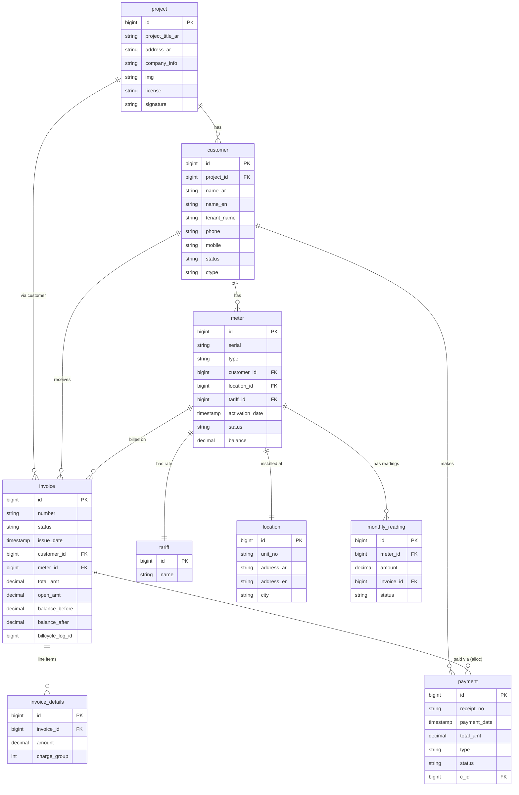

# SBill Reverse Engineering — Phase 0: Table Structure Mapping

## Source: SBill OctoberBilling JRXML Queries

Analyzed 45 JRXML report files from `reference/sbill/OctoberBilling-Complete/04_reports/`.

## SBill Table Structure (Derived from SQL Queries)

### 1. `invoice` — Invoice Header

| Column | Type | Source |
|---|---|---|
| `id` | bigint (PK) | `invoice_elec`, `payments`, `monthly_invoices` |
| `number` | varchar | `invoice_elec` |
| `status` | varchar | `invoice_elec` — values: "ACTIVE", "DELETED", "CANCELED" |
| `issue_date` | timestamp | `invoice_elec` |
| `counsumption_month` | timestamp | `invoice_elec` (sic — misspelled) |
| `counsumption_value` | float | `invoice_elec` |
| `start_reading` | float | `invoice_elec` |
| `end_reading` | float | `invoice_elec` |
| `meter_serial` | varchar | `invoice_elec` |
| `customer_id` | bigint (FK → customer) | `invoice_elec` |
| `meter_id` | bigint (FK → meter) | `invoice_elec` |
| `total_amt` | decimal | `invoice_elec` |
| `open_amt` | decimal | `invoice_elec` |
| `balance_after` | decimal | `invoice_elec` |
| `balance_before` | decimal | `invoice_elec` |
| `billcycle_log_id` | bigint | `invoice_elec` — links to batch generation |
| `receipt_no` | varchar | `payments` |
| `payment_date` | timestamp | `payments` |

### 2. `customer` — Customer Master

| Column | Type | Source |
|---|---|---|
| `id` | bigint (PK) | All reports |
| `project_id` | bigint (FK → project) | `invoice_elec` |
| `name_ar` | varchar | `invoice_elec`, `payments` |
| `name_en` | varchar | `customers_details`, `meters_details` |
| `tenant_name` | varchar | `invoice_elec` |
| `phone` | varchar | `customers_details` |
| `mobile` | varchar | `customers_details` |
| `status` | varchar | `meters_details` |
| `ctype` | varchar | `meters_details` — "customer_type" |
| `created_date` | timestamp | `customers_details` |

### 3. `meter` — Meter Asset

| Column | Type | Source |
|---|---|---|
| `id` | bigint (PK) | All reports |
| `serial` | varchar (unique?) | `invoice_elec` |
| `type` | varchar | `invoice_elec`, `meters_details` — e.g., "Electricity", "Water" |
| `customer_id` | bigint (FK → customer) | `customers_details` |
| `location_id` | bigint (FK → location) | `invoice_elec`, `meters_details` |
| `tariff_id` | bigint (FK → tariff) | `invoice_elec` |
| `activation_date` | timestamp | `customers_details`, `meters_details` |
| `last_reading_date` | timestamp | `meters_details` |
| `relay_status` | varchar | `meters_details` |
| `balance` | decimal | `meters_details` — running balance |
| `status` | varchar | `customers_details` — e.g., "ACTIVE", "INACTIVE" |

### 4. `tariff` — Tariff Rate

| Column | Type | Source |
|---|---|---|
| `id` | bigint (PK) | `invoice_elec` |
| `name` | varchar | `invoice_elec`, `meters_details` |

### 5. `location` — Unit/Location

| Column | Type | Source |
|---|---|---|
| `id` | bigint (PK) | `invoice_elec`, `meters_details` |
| `unit_no` | varchar | `invoice_elec`, `payments`, `meters_details` |
| `address_ar` | varchar | `invoice_elec`, `payments` |
| `address_en` | varchar | `payments`, `meters_details` |
| `city` | varchar | `invoice_elec`, `payments` |

### 6. `project` — Project/Development

| Column | Type | Source |
|---|---|---|
| `id` | bigint (PK) | Subquery in `invoice_elec` |
| `project_title_ar` | varchar | `invoice_elec` |
| `address_ar` | varchar | `invoice_elec` |
| `company_info` | text | `invoice_elec` |
| `img` | varchar (file path) | `invoice_elec` — logo |
| `license` | varchar | `invoice_elec` |
| `signature` | varchar (file path) | `invoice_elec` |

### 7. `invoice_details` — Invoice Line Items

| Column | Type | Source |
|---|---|---|
| `id` | bigint (PK) | `invoice_elec` |
| `invoice_id` | bigint (FK → invoice) | `invoice_elec` |
| `amount` | decimal | `invoice_elec` |
| `charge_group` | int | `invoice_elec` — 0=Consumption, 4=Admin, 2/3=CS, 1=Other |

### 8. `payment` — Payment Records

| Column | Type | Source |
|---|---|---|
| `id` | bigint (PK) | `payments` |
| `receipt_no` | varchar | `payments` |
| `payment_date` | timestamp | `payments` |
| `total_amt` | decimal | `payments` |
| `type` | varchar | `payments` — payment method |
| `status` | varchar | `payments` |
| `created_by` | varchar | `payments` |
| `payment_channel_id` | int | `payments` |
| `auth_code` | varchar | `payments` |
| `ref_number` | varchar | `payments` |
| `cheque_date` | timestamp | `payments` |
| `c_id` | bigint (FK → customer) | `payments` |

### 9. `payment_channel` — Payment Channel

| Column | Type | Source |
|---|---|---|
| `id` | int (PK) | `payments` |
| `name` | varchar | `payments` |

### 10. `monthly_reading` — Reading Records

| Column | Type | Source |
|---|---|---|
| `id` | bigint (PK) | `meters_details` |
| `meter_id` | bigint (FK → meter) | `meters_details` |
| `amount` | decimal | `meters_details` |
| `invoice_id` | bigint? (FK → invoice) | `meters_details` |
| `status` | varchar | `meters_details` — "NEW", "INVOICED" |

### 11. `adm_project` — Admin Project Config (Inferred)

Referenced in subqueries for project-level admin configuration.

### 12. `users` — System Users

| Column | Type | Source |
|---|---|---|
| `id` | int (PK) | `user_audit_log` |
| `username` | varchar | `user_audit_log` |
| `name` | varchar | `user_audit_log` |

---

## Entity Relationship Diagram (SBill Legacy)



## Table Mapping: SBill → Meter Verse

| SBill Table | Meter Verse Schema | Meter Verse Table | Status |
|---|---|---|---|
| `project` | `core` | `CoreProject` (and `sim_system.projects`) | ✅ New schema has both. Need sync/migration. |
| `customer` | `sim_system` | `Customer` | ✅ Exists. Will migrate to `area_N.customers`. |
| `meter` | `sim_system` | `Meter` | ✅ Exists. Will migrate to `area_N.meters`. |
| `location` | `sim_system` | `LocationNode` | ✅ Tree structure (zone/building/floor/unit) supersedes flat location. |
| `tariff` | `features` | `Tariff` | ✅ New schema has versioned tariffs with charge details. |
| `invoice` | `sim_system` | `Invoice` | ✅ Exists. Will migrate to `area_N.invoices`. |
| `invoice_details` | `sim_system` | `InvoiceLine` | ✅ Exists with `chargeGroup` mapping. |
| `payment` | `sim_system` | `Payment` | ✅ Exists with allocation model. |
| `monthly_reading` | `sim_system` | `Reading` | ✅ Exists with review workflow. |
| `payment_channel` | `core` | `CorePaymentCenter` | ✅ Similar concept, needs mapping. |
| `adm_project` | `core` | `CoreSystemConfig` (partial) | ⚠️ No direct equivalent — config fields spread across Project + SystemConfig. |
| `users` | `core` | `CoreUser` | ✅ Exists with expanded profile. |

## Key Differences (SBill → Meter Verse)

| Aspect | SBill (Legacy) | Meter Verse (New) |
|---|---|---|
| **Schema** | Single schema | Multi-schema (core + features + 15 areas) |
| **Project → Area** | No area concept | Areas group projects |
| **Location** | Flat location table | Hierarchical zone/building/floor/unit tree |
| **Customer** | Single table per DB | Per-area customer tables with shared registry |
| **Tariff** | Simple id+name | Versioned, multi-charge, tiered rate plans |
| **Invoice line items** | Charge groups (0–4) | Flexible charge codes with descriptions |
| **Payments** | Single table | Payment + Allocations + Ledger entries |
| **Audit** | `user_audit_log` report only | Full `core.audit_log` with before/after snapshots |
| **Meter-SIM binding** | None (meter only) | Separate SIMCard + SIMAssignment model |
| **Reading workflow** | Single monthly_reading table | Readings + Review queue + Approval workflow |
| **Water balance** | Not tracked | Dedicated water balance model |
| **Solar** | Not tracked | Full solar wallet + invoicing model |
| **Chilled water** | Not tracked | BTU-based chilled water billing model |

## Migration Strategy (Phase 0 — PLANNING ONLY)

```
SBill October DB                    Meter Verse
─────────────────                   ───────────────────
project ──────────────────────────► core.areas + core.projects
customer ──► area_october.customers
meter ─────► area_october.meters
location ──► area_october.location_nodes (flatten to tree)
tariff ────► features.tariffs + features.tariff_charges
invoice ───► area_october.invoices (+ area_october.invoice_lines)
payment ───► area_october.payments (+ area_october.payment_allocations)
monthly_reading ──► area_october.readings
```

**No data migration should be executed until the Meter Verse schema is fully deployed and validated across all environments.**
