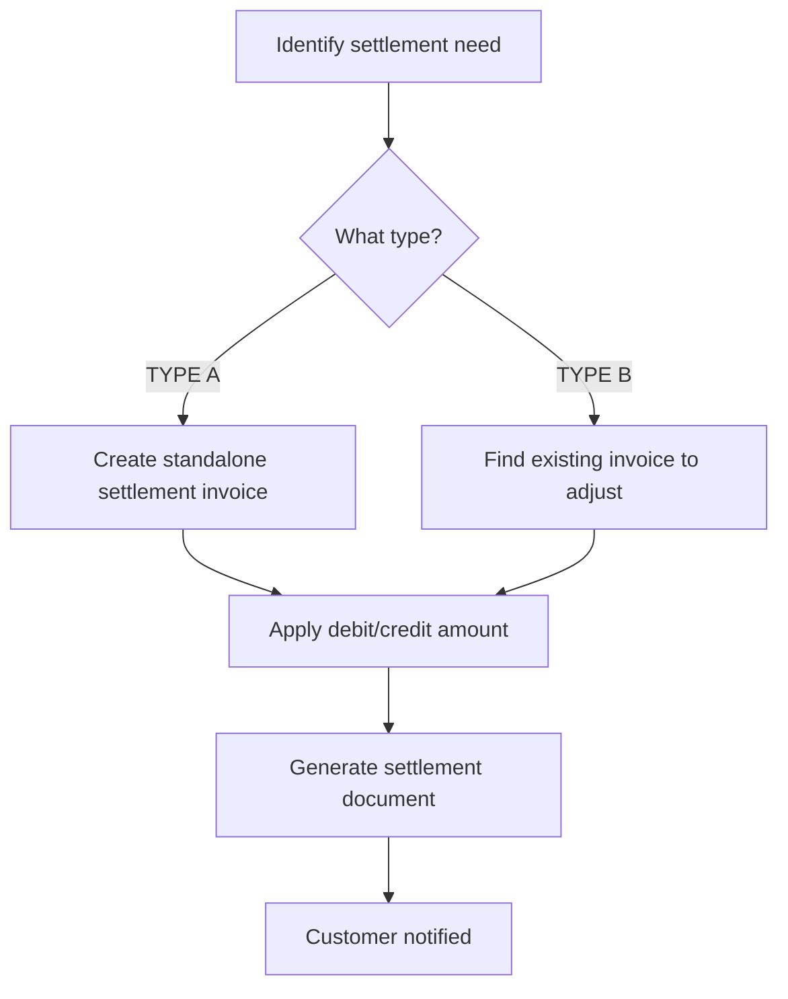
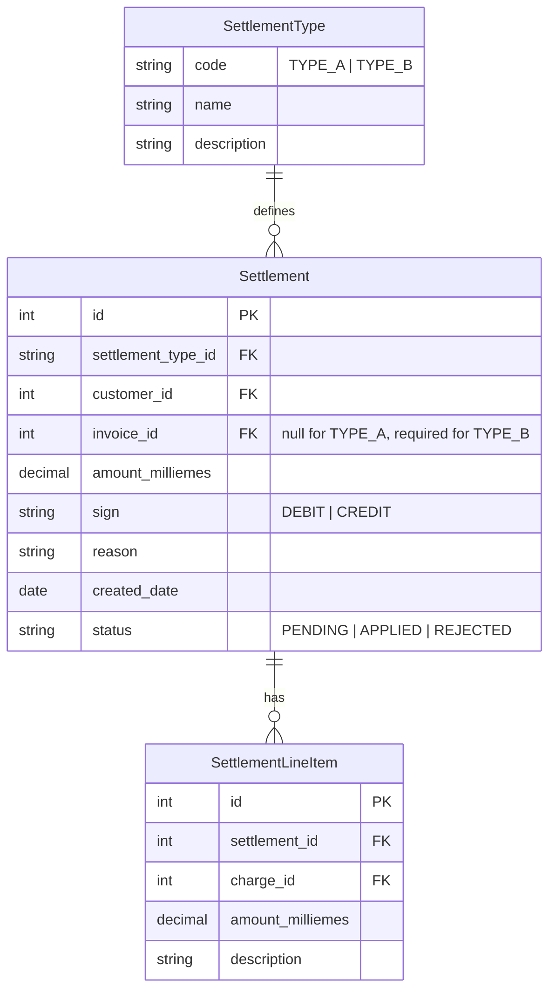

# Settlement Engine Report

**Source:** SBill sidebar UI ("Settlement Types"), SBill JRXML, API observations
**Date:** 2026-06-20
**Status:** Investigation / Planning

---

## Overview

SBill includes a **Settlement Types** feature found in the sidebar navigation. Settlements allow adjustments to be applied to customer invoices — either as standalone correction invoices or as amendments to existing bills.

---

## Settlement Types

| Type | Name | Behavior |
|------|------|----------|
| TYPE A | Standalone Settlement | Creates a separate settlement invoice (independent of original bill) |
| TYPE B | Adjustment on Invoice | Modifies/adjusts an existing invoice directly |

---

## Sign Convention

| Sign | Meaning | Display |
|------|---------|---------|
| Positive (+) | Debit — customer owes money | Shown as positive amount |
| Negative (−) | Credit — customer is owed money | Shown **without minus sign** (absolute value) |

### Key Behavioral Note

> **"Positive = debit, negative = credit (shown without minus sign)"**

This means credits are displayed as positive amounts without a negative prefix. The system may use a separate transaction type or flag to indicate credit vs. debit, rather than relying on sign display.

### Display Examples

| Actual Value | Displayed Amount | Interpretation |
|-------------|------------------|----------------|
| +500.00 | 500.00 | Customer owes 500 EGP (debit) |
| −500.00 | 500.00 | Customer receives 500 EGP credit |

> **Important:** Since credits and debits both display as positive numbers, the UI must use contextual indicators (color, labels, transaction type) to differentiate them.

---

## Settlement Flow



---

## Use Cases

### TYPE A — Standalone Settlement

| Scenario | Example |
|----------|---------|
| Billing error correction | Previous bill was undercharged → debit settlement |
| Manual adjustment | One-time fee adjustment → debit or credit |
| Credit note | Customer overpaid → credit settlement |
| Late fee waiver | Waive a late payment fee → credit settlement |

### TYPE B — Invoice Adjustment

| Scenario | Example |
|----------|---------|
| Tariff change mid-cycle | Apply new rate retroactively on existing bill |
| Meter reading correction | Fix consumption on an already-issued invoice |
| Tax adjustment | Correct tax amount on issued invoice |
| Discount application | Apply promotional discount to existing bill |

---

## Data Model Considerations



---

## Integration with Charge Engine

When a settlement is created:

```
If TYPE_A:
    Generate settlement invoice with:
        - Own invoice number
        - Settlement line items
        - Total = sum of debit/credit amounts
        - Due date (typically immediate)

If TYPE_B:
    Find original invoice
    Create adjustment line items on original invoice
    Recalculate totals
    Flag invoice as "ADJUSTED"
```

---

## Settlement Processing Rules

| Rule | Description |
|------|-------------|
| 1 | Settlement amounts stored in **milliemes** (consistency with tariff amounts) |
| 2 | Sign convention: positive = debit (customer pays), negative = credit (customer receives) |
| 3 | Credits displayed as absolute values (no minus sign) in customer-facing views |
| 4 | TYPE B adjustments should reference the original invoice ID |
| 5 | Settlements should not create circular adjustments (Invoice A adjusts Invoice B which adjusts Invoice A) |
| 6 | Approved settlements should trigger invoice regeneration |

---

## Open Questions

1. **Settlement frequency** — Are settlements only monthly, or can they be created ad-hoc?
2. **Approval workflow** — Does a settlement require approval before application?
3. **Audit trail** — How are settlement actions tracked for audit purposes?
4. **Reversal** — Can a settlement be reversed after application?
5. **API endpoints** — What are the SBill API endpoints for settlement CRUD?
6. **Meter Verse mapping** — Should Meter Verse implement its own settlement engine or wrap SBill's?
7. **Credit display** — If credits show without minus sign, how does the customer know it's a credit vs. debit? (Color coding? Separate section? Transaction type label?)
8. **Expiry** — Do credits expire after a certain period?
