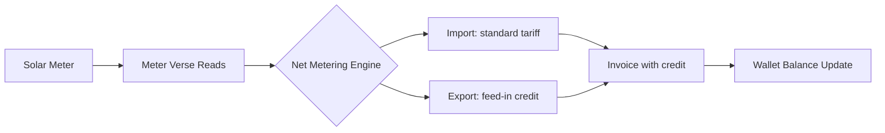

# Solar Tariffs Report

**Source:** Live SBill API (no solar tariffs found)
**Date:** 2026-06-20
**Status:** Investigation / Planning — Gap Analysis

---

## Finding

**No solar tariffs were discovered in the SBill API.** Of the 11 tariffs returned, none relate to solar energy, net metering, or photovoltaic generation.

---

## Current State Assessment

| Aspect | Status |
|--------|--------|
| Solar tariffs in SBill | ❌ Not found |
| Net metering support | ❌ Not confirmed |
| Export/import energy tracking | ❌ Not confirmed |
| Solar-specific charges | ❌ Not found |
| Wallet/credit system | ❌ Not confirmed |

Solar appears to be a **Meter Verse–only feature**, not yet present in the legacy SBill system.

---

## What a Solar Tariff Would Need

### 1. Net Metering Calculation

```
NetConsumption = ImportedEnergy - ExportedEnergy

If NetConsumption > 0:
    Charge = NetConsumption × tariffRate  (customer pays)

If NetConsumption < 0:
    Credit = |NetConsumption| × feedInRate  (customer receives credit/wallet)
```

### 2. Dual Register Requirements

| Register | Direction | Meter Reading |
|----------|-----------|---------------|
| Import | Grid → Customer | IN register |
| Export | Customer → Grid | OUT register |

Solar meters typically have two registers:

```
Consumption = CurrentIN - PreviousIN
Export      = CurrentOUT - PreviousOUT
```

### 3. Wallet / Credit System

For net exporters (customers who produce more than they consume):

```
Monthly Credit = Export × feedInRate
Wallet Balance += Monthly Credit
Credit applied to future bills (or cashed out periodically)
```

### 4. Potential Charge Structure

| Charge | Description |
|--------|-------------|
| Import Consumption | Standard tariff rate for imported energy |
| Export Credit | Feed-in rate for exported energy (credit) |
| Service Fee | Monthly connection fee (STATIC) |
| Meter Fee | Solar meter rental (STATIC) |
| Net Zero Fee | Fee if net consumption = 0 |

---

## What Exists in SBill (Related)

| Feature | Relevance to Solar |
|---------|-------------------|
| ZERO charge (المقروء بصفر) | Could be repurposed for net-zero months |
| Settlement types (TYPE A/B) | Could handle solar credit settlements |
| FLAT mode tariffs | Could be adapted for solar feed-in rates |

---

## Meter Verse Integration Path



### Recommended Approach

1. **Add a new utility type:** `SOLAR` or `NET_METERING` in Meter Verse
2. **Dual-register meters:** Support IN and OUT registers
3. **Net metering engine:** Pre-processing step before charge calculation
4. **Wallet module:** Track credits across billing periods
5. **SBill compatibility:** Map solar charges to existing SBill charge groups where possible

---

## Open Questions

1. **Is net metering regulated?** — Need to confirm local regulatory framework for solar feed-in.
2. **Feed-in rate** — Is it fixed, market-based, or tiered?
3. **Credit expiry** — Do solar credits expire, or roll indefinitely?
4. **Solar + consumption** — Can a customer have both solar and standard electricity tariffs?
5. **Meter Verse timeline** — Is solar a planned feature or future consideration?
