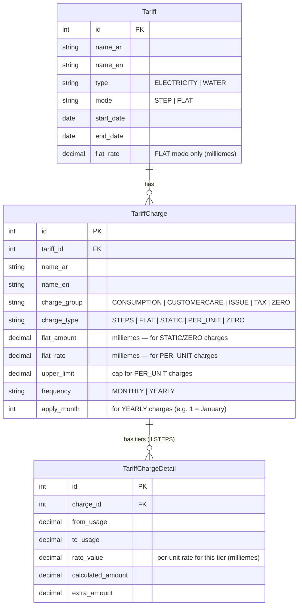
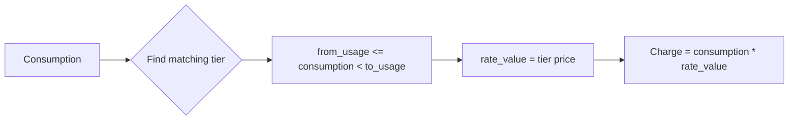
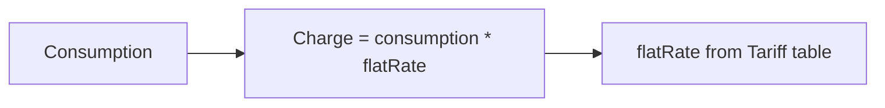

# Tariff Data Model Report

**Source:** SBill JRXML, live API responses, Meter Verse codebase
**Date:** 2026-06-20
**Status:** Investigation / Planning

---

## Entity Relationship Diagram



---

## Core Relationships

```
Tariff (1) ──→ TariffCharge (N) ──→ TariffChargeDetail (N)
```

- A **Tariff** has many **TariffCharges**
- A **TariffCharge** with `charge_type = 'STEPS'` has many **TariffChargeDetails** (tiers/bands)
- A **TariffCharge** with `charge_type = 'STATIC'`, `'PER_UNIT'`, `'FLAT'`, or `'ZERO'` has *no* tier details (rates stored directly on the charge)

---

## Charge Type Enum

| Charge Type  | Description                                          | Has Tiers? | Rate Source          |
|--------------|------------------------------------------------------|------------|----------------------|
| `STEPS`      | Progressive tiered pricing (from_usage → to_usage)   | Yes        | TariffChargeDetail.rate_value |
| `FLAT`       | Single flat rate per unit (whole tariff)             | No         | Tariff.flat_rate     |
| `STATIC`     | Fixed amount charge (no consumption dependence)      | No         | TariffCharge.flat_amount |
| `PER_UNIT`   | Rate per unit consumed, optionally capped            | No         | TariffCharge.flat_rate / upper_limit |
| `ZERO`       | Special charge triggered when consumption = 0       | No         | TariffCharge.flat_amount |

---

## Charge Group Mapping

### SBill DB Strings → JRXML Constants → Meter Verse Numbers

| SBill DB (string)     | JRXML Constant          | Meter Verse | Purpose                           |
|------------------------|-------------------------|-------------|-----------------------------------|
| `CONSUMPTION`          | `CONSUMPTION` (0)       | 0           | Consumption charges (tiered)      |
| `CUSTOMERCARE`         | `CUSTOMER_SERVICE` (2) / `CUSTOMER_SERVICE_3` (3) | 2, 3 | Service fees, sustainability fees |
| `ISSUE`                | `ISSUE_FEES` (4)        | 4           | Issue fees, other fees            |
| `TAX`                  | `TAX` (6)               | 6           | Taxes, stamp duties, radio fees   |
| `ZERO`                 | *(none)*                | *(none)*    | Zero-reading penalty              |
| *(not found in API)*   | `FEES` (1)              | 1           | General fees                      |
| *(not found in API)*   | `PERCENTAGE` (5)        | 5           | Percentage-based charges          |

### Charge Group → Line Item Behavior

```
CONSUMPTION (0)  → Applied on every bill, based on consumption tiers
CUSTOMERCARE (2) → Applied on every bill, separate tier structure
ISSUE (4)        → Applied on every bill (monthly fixed or per-unit)
TAX (6)          → Applied on every bill (governmental levies, stamps)
ZERO             → Applied ONLY when consumption = 0 (penalty charge)
FEES (1)         → General fees (not observed in current tariffs)
PERCENTAGE (5)   → Percentage of consumption charge (not observed in current tariffs)
```

---

## STEP Mode Structure (Progressive Tiers)



Tiers are stored in `tariff_charges_details`:

| Column          | Description                                    |
|-----------------|------------------------------------------------|
| `from_usage`    | Lower bound of tier (inclusive)                |
| `to_usage`      | Upper bound of tier (exclusive)                |
| `rate_value`    | Price per unit for this tier (milliemes)       |
| `calculated_amount` | Pre-calculated reference amount           |
| `extra_amount`  | Additional amount for this tier                |

> **Note:** Not confirmed whether tiers are **progressive** (each unit in its own tier) or **block** (whole consumption at highest tier). JRXML inspection needed.

---

## FLAT Mode Structure



- No tier table needed
- Single rate applied to all consumption units
- Used by: Tariffs 10054, 10062, 10078

---

## Frequency Model

| Frequency | Behavior                                   |
|-----------|--------------------------------------------|
| MONTHLY   | Applied every billing cycle                |
| YEARLY    | Applied once per year (on `apply_month`)   |
| *null*    | Assume MONTHLY (default)                   |

Example: "دمغة عقد" (Stamp) on Tariff 1 is YEARLY charged in January (month 1) at 3,000 milliemes.

---

## Amount Precision

- **Storage:** All monetary values in **milliemes** (integer)
- **Display conversion:** Divide by 1,000 for EGP
- **Rounding:** Determine whether to truncate or round at display time

| Example             | Milliemes | EGP    |
|---------------------|-----------|--------|
| Zero reading charge | 9,000     | 9.00   |
| Other fees (water)  | 27,000    | 27.00  |
| Stamp duty          | 3,000     | 3.00   |
| Chilled water rate  | 3,000     | 3.00   |
| EV charging rate    | 1,890     | 1.89   |
| Regulatory rate     | 10        | 0.01   |
| Governmental fee    | 10        | 0.01   |
| Radio rate          | 90        | 0.09   |

---

## Key Observations

1. **Tariff 10054 & 10062** are classified as `ELECTRICITY` but represent chilled water — may require a utility override or mapping layer.
2. **ZERO charge group** exists in SBill DB but has no JRXML constant or Meter Verse number — needs custom handling.
3. **ISSUE** group (Tariff 2 charges 4 & 5) maps to `ISSUE_FEES(4)` in Meter Verse.
4. **Tier structure** needs clarification on progressive vs. block interpretation.
