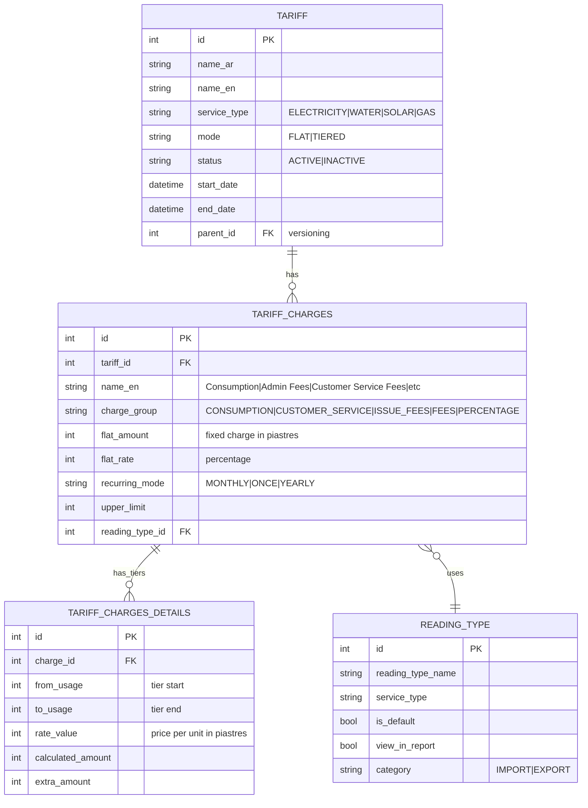
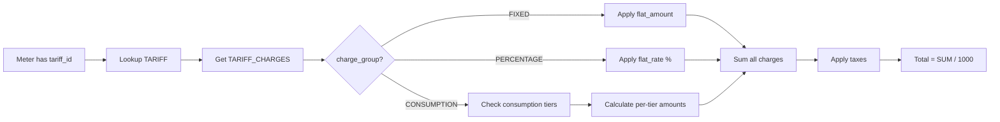

# Tariff Engine — Phase 5 Investigation

> **Status**: INVESTIGATION / PLANNING ONLY — no code changes, no database writes.

## 1. Tariff Data Model



## 2. Charge Groups (from JRXML)

From `invoice_elec.jrxml` (SBill reference) and `invoice_elec.jrxml` (new templates):

| Group ID | Name | Purpose | Invoice Display |
|----------|------|---------|-----------------|
| 0 / CONSUMPTION | Consumption | Usage charges | قيمة الإستهلاك |
| 1 / FEES | Fees | Stamp duties, radio fees | رسوم و دمغات |
| 2,3 / CUSTOMER_SERVICE | Customer Service | Service fees | خدمة عملاء |
| 4 / ISSUE_FEES | Issue Fees | Admin/issue fees | مصاريف إدارية |
| 5 / PERCENTAGE | Percentage | Percentage-based fees | تسويات |

From `invoice_water.jrxml`: charge_group = 5 for PERCENTAGE (water-specific field).
From `invoice_elec.jrxml` new template: named groups like `'CONSUMPTION'`, `'CUSTOMER_SERVICE'`, `'ISSUE_FEES'`, `'FEES'`.

## 3. Tariff Assignment

Tariff is assigned to meter via `meter.tariff_id = t.id`:
```sql
SELECT t.name_en AS tariff_name
FROM meter m, tariff t
WHERE m.tariff_id = t.id AND i.meter_id = m.id
```

## 4. Fixed Charges

From `sub_report_tariff_charge.jrxml`:
```sql
SELECT id, name_en, flat_amount, flat_rate, recurring_mode, charge_group, upper_limit
FROM tariff_charges WHERE tariff_id = $P{tariff_id}
```

- **`flat_amount`**: Fixed charge in piastres (integer). Displayed as `flat_amount / 1000` on invoices.
- **`flat_rate`**: Percentage value (e.g., for VAT or admin fees calculated as % of consumption)
- **`recurring_mode`**: `MONTHLY` (most charges), `ONCE`, `YEARLY`

## 5. Variable Charges (Tiers)

From `sub_report_tariff_charge_detail.jrxml`:
```sql
SELECT from_usage, to_usage, rate_value, calculated_amount, extra_amount
FROM tariff_charges_details WHERE charge_id = $P{charge_id}
```

**Tier calculation**: For each tier where consumption falls within [from_usage, to_usage]:
```
tier_amount = min(consumption, to_usage) - from_usage * rate_value
```

This is visualized in `monthly_consumption_steps.jrxml` which aggregates consumption by tier.

## 6. Minimum Charges

From the business rules documented in `a1-minimum-analysis.py` and `a1-solar-minimum-charge-decision.md`:

- When `consumption = 0`, some tariffs still charge **fixed fees** (flat_amount)
- Customer service fees are always charged regardless of consumption
- Solar minimum charge rules handle net-zero consumption cases
- The invoice details subqueries separate CONSUMPTION from other charge groups

## 7. Taxes (VAT)

VAT is handled in two ways:
1. **Percentage-based**: `flat_rate` in `tariff_charges` (e.g., 14% VAT)
2. **Fixed amount**: Added as a separate charge line in `invoice_details`

From `monthly_finance.jrxml`, specific charge names include:
- `'رسم إذاعة'` (broadcast fee)
- `'رسم محافظه'` (governorate fee)
- `'تمغة إستهلاك'` (consumption stamp)
- `'تمغة توريد - تعاقد'` (supply stamp)
- `'Admin Fees'` (issue/administrative fees)
- `'Customer Service Fees'`

## 8. Tariff Versioning

Tariffs support versioning via `parent_id`:
```sql
(t.id = m.tariff_id AND t.start_date <= $P{bill_cycle} AND (t.end_date IS NULL OR t.end_date > $P{bill_cycle}))
OR (t.parent_id = m.tariff_id AND t.start_date <= $P{bill_cycle} AND (t.end_date IS NULL OR t.end_date > $P{bill_cycle}))
```

This allows:
- A tariff to be updated mid-cycle
- The parent_id chain tracks which tariff version supersedes another
- The correct tariff is selected based on the bill cycle date

## 9. Tariff Engine Flow


