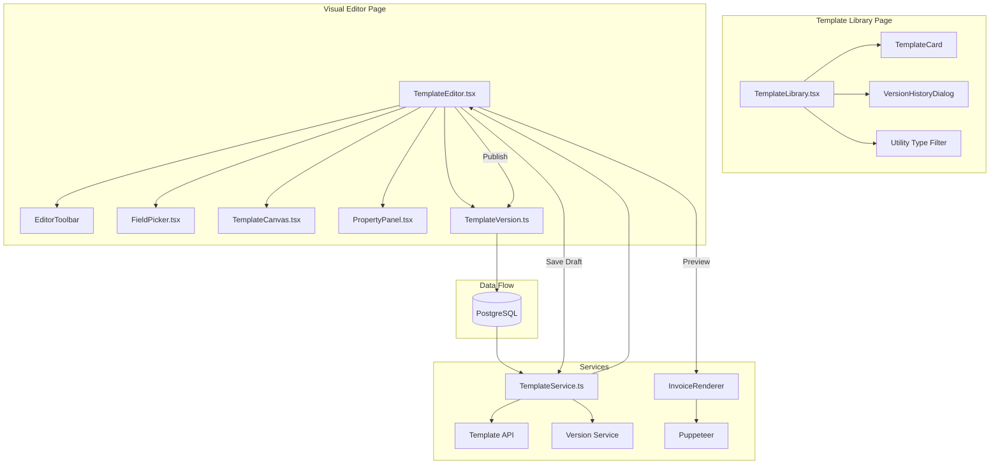
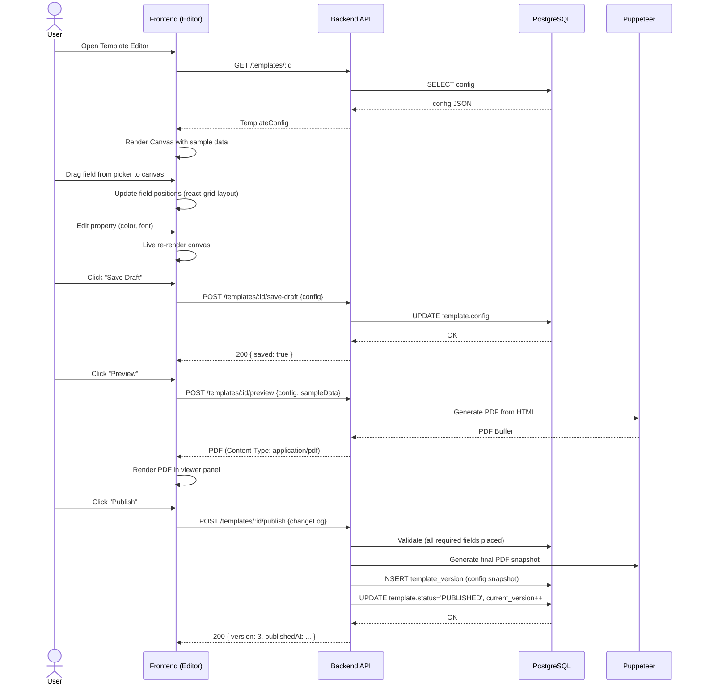
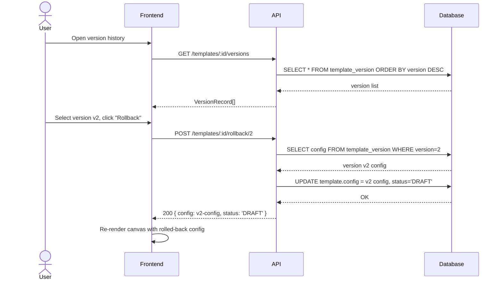
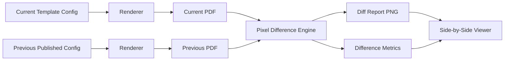

# Template Designer Architecture — Investigation/Planning

**Status**: INVESTIGATION / PLANNING ONLY — no code changes.
**Date**: 2026-06-20
**Reference**: SBill system at http://10.50.30.2:9999

---

## 1. Overview

Visual invoice template designer inside Meter Verse. Users can create, edit, version, and publish invoice templates for 8 utility types via drag-and-drop WYSIWYG editor, inspired by the SBill JRXML-based layout system.

---

## 2. Route Design

| Route | Component | Purpose |
|-------|-----------|---------|
| `/settings/templates` | `TemplateLibrary.tsx` | List all templates |
| `/settings/templates/:id/edit` | `TemplateEditor.tsx` | Visual editor |
| `/settings/templates/:id/history` | `TemplateVersion.ts` | Version history |

Nested under settings or as a standalone top-level section `/templates` depending on access-control decisions.

---

## 3. Component Architecture



---

## 4. TemplateLibrary.tsx — Library Listing

```
┌─────────────────────────────────────────────────────────────┐
│  Template Library                              [+ New Draft] │
│                                                              │
│  [All] [Electricity] [Water] [Solar] [Gas] [Chilled] ...     │
│                                                              │
│  ┌─────────┐ ┌─────────┐ ┌─────────┐ ┌─────────┐          │
│  │⚡Electricity│ │💧Water   │ │☀️Solar   │ │🔥Gas     │          │
│  │v2.3       │ │v1.1     │ │v1.0     │ │v.0.9    │          │
│  │2026-06-15 │ │2026-06-10│ │DRAFT    │ │DRAFT    │          │
│  │PUBLISHED  │ │PUBLISHED │ │         │ │         │          │
│  │[Preview]  │ │[Preview] │ │[Edit]   │ │[Edit]   │          │
│  └─────────┘ └─────────┘ └─────────┘ └─────────┘          │
│                                                              │
│  ┌─────────┐ ┌─────────┐ ┌─────────┐ ┌─────────┐          │
│  │❄️Chilled  │ │🌬️Outdoor │ │📋Settle A│ │📋Settle B│          │
│  │v1.2       │ │v1.0     │ │DRAFT    │ │DRAFT    │          │
│  │DRAFT      │ │DRAFT    │ │         │ │         │          │
│  │[Edit]     │ │[Edit]   │ │[Edit]   │ │[Edit]   │          │
│  └─────────┘ └─────────┘ └─────────┘ └─────────┘          │
└─────────────────────────────────────────────────────────────┘
```

### 4.1 Template Types

| # | Template Key | Invoice Title (Ar) | Status | Source Config |
|---|-------------|--------------------|--------|--------------|
| 1 | `electricity` | فاتورة كهرباء | Active | `template-config.ts` → `TEMPLATE_REGISTRY.electricity` |
| 2 | `water` | فاتورة مياه | Active | `template-config.ts` → `TEMPLATE_REGISTRY.water` |
| 3 | `water_new` | فاتورة مياه (جديد) | Active | `template-config.ts` → `TEMPLATE_REGISTRY.water_new` |
| 4 | `solar` | فاتورة شمسية | Active | `template-config.ts` → `TEMPLATE_REGISTRY.solar` |
| 5 | `chilled_water` | فاتورة مياه مثلجة | Active | `template-config.ts` → `TEMPLATE_REGISTRY.chilled_water` |
| 6 | `gas` | فاتورة غاز | Active | `template-config.ts` → `TEMPLATE_REGISTRY.gas` |
| 7 | `outdoor_unit` | فاتورة وحدة التكييف الخارجية | Planned | New config entry |
| 8 | `settlement` | فاتورة تسوية | Active | `template-config.ts` → `TEMPLATE_REGISTRY.settlement` |

---

## 5. TemplateEditor.tsx — Visual Editor Layout

```
┌──────────────────────────────────────────────────────────────────────────┐
│ [← Back] Template: Electricity Invoice  [Save Draft] [Preview] [Publish] │
├──────────┬─────────────────────────────────────────────┬─────────────────┤
│          │                                             │                 │
│ FIELD    │         WYSIWYG CANVAS                      │  PROPERTIES     │
│ PICKER   │                                             │                 │
│          │  ┌───────────────────────────────────────┐  │  Position       │
│ [Header] │  │ [Banner]                              │  │  X: [___]       │
│  ├─Title │  │ [Title: فاتورة كهرباء]                │  │  Y: [___]       │
│  ├─Number│  │ [Logo] [Company: ...] [License: ...] │  │  Width: [___]   │
│  ├─Date  │  ├───────────────────────────────────────┤  │  Height: [___]  │
│  ├─Status│  │ [Info: Area | Project | Unit]         │  │                 │
│          │  ├───────────────────────────────────────┤  │  Typography     │
│ [Company]│  │ [Readings: prev | current | cons]     │  │  Font: [____▼]  │
│  ├─Name  │  ├───────────────────────────────────────┤  │  Size: [____]   │
│  ├─Logo  │  │ [Charge Grid: 7 columns]              │  │  Color: [■]     │
│  ├─Licens│  │  ┌──┬──┬──┬──┬──┬──┬──┐              │  │  Bold [ ]       │
│          │  │  │DK│Ad│St│Fs│Cv│CS│Co│              │  │                 │
│ [Cust.]  │  │  ├──┼──┼──┼──┼──┼──┼──┤              │  │  Border         │
│  ├─Name  │  │  │0 │4 │6 │1 │0 │2,│0 │              │  │  Style [____▼]  │
│  ├─Code  │  │  └──┴──┴──┴──┴──┴──┴──┘              │  │  Color [■]      │
│  ├─Proj  │  ├───────────────────────────────────────┤  │                 │
│  ├─Area  │  │ [Totals: prev | charges | total]      │  │  Visibility     │
│  ├─Unit  │  ├───────────────────────────────────────┤  │  Show [✔]       │
│  ├─Addr  │  │ [Amount in Words: ...]                │  │  Print [✔]      │
│          │  ├───────────────────────────────────────┤  │                 │
│ [Meter]  │  │ [Signature / Footer]                  │  │                 │
│  ├─Serial│  └───────────────────────────────────────┘  │                 │
│  ├─Type  │                                             │                 │
│  ├─Read..│                                             │                 │
│  ├─Cons..│                                             │                 │
│          │                                             │                 │
│ ...      │                                             │                 │
├──────────┴─────────────────────────────────────────────┴─────────────────┤
│  [Zoom: 100% ▼]  [Snap to Grid]  [Undo] [Redo]  [Reset Layout]          │
└──────────────────────────────────────────────────────────────────────────┘
```

---

## 6. Component Specifications

### 6.1 TemplateEditor.tsx

**Props**: `templateId: string`
**State**:
- `templateConfig: TemplateConfig` — current template state
- `history: VersionRecord[]` — version list
- `previewPdf: string | null` — preview PDF URL
- `isDirty: boolean` — unsaved changes flag

**Responsibilities**:
- Load template config from API on mount
- Orchestrate field drag/drop between FieldPicker and Canvas
- Coordinate property edits from PropertyPanel → Canvas re-render
- Save draft, trigger preview, publish version
- Auto-save draft every 60s if dirty

### 6.2 TemplateCanvas.tsx

**Props**:
- `config: VisualTemplateConfig`
- `fields: PlacedField[]`
- `onFieldMove: (id, x, y) => void`
- `onFieldResize: (id, w, h) => void`
- `onFieldSelect: (id) => void`
- `selectedFieldId: string | null`
- `sampleData: InvoiceDocument` (for live preview)

**Implementation**:
- Uses `react-grid-layout` for grid-based field positioning
- Renders live invoice HTML using the existing `buildHtml()` logic from `invoice-template.service.ts` but in-browser
- Each draggable field is a grid item positioned at config-specified coordinates
- Fields highlight when selected; selection bubbles up to PropertyPanel
- Renders using the existing CSS classes from `invoice-template.css`:
  - `.invoice-page`, `.invoice-banner`, `.invoice-header`, `.invoice-title`
  - `.invoice-grid`, `.invoice-info`, `.info-labels`, `.company-box`
  - `.val-left`, `.val-center`, `.val-bold`, `.settlement-credit`
  - `.totals-highlight`, `.words-cell`, `.total-label`, `.thick-line`
  - `.sig-table`, `.sig-label`, `.sig-img`, `.invoice-footer`
  - `.deleted-watermark`, `.invoice-area-box`

### 6.3 FieldPicker.tsx

**Props**:
- `fields: FieldDefinition[]`
- `onFieldDragStart: (fieldDef) => void`
- `utilityType: string` (to filter conditional fields)

**Sections** (collapsible accordion):
1. Header Fields
2. Company Fields
3. Customer Fields
4. Meter & Reading Fields
5. Charge Fields
6. Financial Fields
7. Conditional Fields (utility-specific)

Each field item shows: icon, name, variable name (e.g. `{{CONS_AMOUNT}}`), and a drag handle.

### 6.4 PropertyPanel.tsx

**Props**:
- `field: PlacedField | null`
- `onPropertyChange: (property, value) => void`
- `templateConfig: VisualTemplateConfig`

**Tabs**:
1. **Position**: X, Y, Width, Height inputs (number type, pt units)
2. **Typography**: Font family dropdown, font size, bold toggle, italic toggle, font color (react-color picker), text align
3. **Border**: Border style dropdown (none, solid, dashed, dotted), border color, border width
4. **Display**: Visibility toggle, print toggle, opacity slider
5. **Data**: Data binding path (read-only, shows the `{{VARIABLE}}`), format override (amount/number/date/abs-amount)

### 6.5 TemplateVersion.ts

```typescript
interface VersionRecord {
  id: string;
  templateId: string;
  version: number;
  config: VisualTemplateConfig;   // snapshot of full config
  publishedAt: string;
  publishedBy: string;
  changeLog: string;              // user-supplied description
  diffSummary: string;            // auto-generated: "Changed font color on field X"
  previewPdfUrl: string;          // S3/local storage path
}

interface VisualTemplateConfig {
  id: string;
  name: string;
  utilityType: string;
  version: number;
  status: 'DRAFT' | 'PUBLISHED';
  config: {
    colors: {
      primary: string;       // #000066
      accent: string;        // #CC0000
      header: string;        // #CCCCFF
      highlight: string;     // #E8E8FF
      text: string;          // #000000
      border: string;        // #999999
    };
    fonts: {
      family: string;        // 'DejaVu Sans', sans-serif
      size: string;          // 7pt
      mono: string;          // 'DejaVu Sans Mono', monospace
    };
    page: {
      width: number;         // 421
      height: number;        // 297
      orientation: 'landscape' | 'portrait';
      margins: { top: number; right: number; bottom: number; left: number };
    };
    fields: PlacedField[];
  };
  publishedAt: string | null;
  createdAt: string;
}

interface PlacedField {
  id: string;
  variable: string;               // e.g. {{INVOICE_TITLE}}
  label: string;                  // Display name
  category: FieldCategory;
  x: number;                      // Position in pt
  y: number;
  width: number;
  height: number;
  fontFamily?: string;
  fontSize?: string;
  fontWeight?: 'normal' | 'bold';
  fontColor?: string;
  textAlign?: 'right' | 'left' | 'center';
  borderStyle?: 'none' | 'solid' | 'dashed' | 'dotted';
  borderColor?: string;
  borderWidth?: number;
  visible: boolean;
  printVisible: boolean;
  format?: 'amount' | 'number' | 'date' | 'abs-amount';
  dataSource: string;             // path to data in InvoiceDocument
  conditional?: string;           // optional condition expression
}
```

### 6.6 TemplateService.ts

```typescript
// API Endpoints (under /api/v1/templates)
GET    /templates                    → list all templates with latest version
GET    /templates/:id                → get template with current config
POST   /templates/:id/save-draft     → save draft config
POST   /templates/:id/preview        → generate preview PDF (returns Buffer)
POST   /templates/:id/publish        → create new version, set status=PUBLISHED
POST   /templates/:id/rollback/:ver  → restore version as new draft
GET    /templates/:id/versions       → list all versions
GET    /templates/:id/diff/:v1/:v2   → diff between two versions
```

---

## 7. Data Storage

### 7.1 Database Schema

```sql
-- core.template (or features.template)
CREATE TABLE core.template (
  id            UUID PRIMARY KEY DEFAULT gen_random_uuid(),
  name          VARCHAR(100) NOT NULL,
  utility_type  VARCHAR(50) NOT NULL,      -- electricity, water, solar, etc.
  description   TEXT,
  status        VARCHAR(20) DEFAULT 'DRAFT', -- DRAFT, PUBLISHED
  current_version INT DEFAULT 0,
  config        JSONB NOT NULL,            -- VisualTemplateConfig.config
  created_at    TIMESTAMPTZ DEFAULT NOW(),
  updated_at    TIMESTAMPTZ DEFAULT NOW(),
  created_by    UUID REFERENCES core.user(id),
  
  UNIQUE(utility_type, status)  -- only one PUBLISHED per utility
);

-- core.template_version
CREATE TABLE core.template_version (
  id            UUID PRIMARY KEY DEFAULT gen_random_uuid(),
  template_id   UUID NOT NULL REFERENCES core.template(id) ON DELETE CASCADE,
  version       INT NOT NULL,
  config        JSONB NOT NULL,            -- full snapshot of config at publish time
  change_log    TEXT,
  diff_summary  TEXT,
  preview_pdf   BYTEA,                     -- optional, stored PDF preview
  published_at  TIMESTAMPTZ DEFAULT NOW(),
  published_by  UUID REFERENCES core.user(id),
  
  UNIQUE(template_id, version)
);

CREATE INDEX idx_template_version_template ON core.template_version(template_id, version DESC);
```

### 7.2 Template JSON Structure (config column)

```json
{
  "colors": {
    "primary": "#000066",
    "accent": "#CC0000",
    "header": "#CCCCFF",
    "highlight": "#E8E8FF",
    "text": "#000000",
    "border": "#999999"
  },
  "fonts": {
    "family": "DejaVu Sans, sans-serif",
    "size": "7pt",
    "mono": "DejaVu Sans Mono, monospace"
  },
  "page": {
    "width": 421,
    "height": 297,
    "orientation": "landscape",
    "margins": { "top": 4, "right": 4, "bottom": 4, "left": 4 }
  },
  "fields": [
    {
      "id": "field-001",
      "variable": "{{INVOICE_TITLE}}",
      "label": "Invoice Title",
      "category": "header",
      "x": 105,
      "y": 12,
      "width": 210,
      "height": 12,
      "fontSize": "8pt",
      "fontWeight": "bold",
      "fontColor": "#000066",
      "textAlign": "center",
      "visible": true,
      "printVisible": true,
      "format": "text",
      "dataSource": "invoiceTitle"
    }
  ],
  "chargeColumns": [
    { "variable": "{{CONS_AMOUNT}}", "label": "قيمة الإستهلاك (جم)", "x": 236, "width": 59, "chargeGroups": [0], "format": "amount" }
  ]
}
```

---

## 8. Field-to-Data Binding

Each field's `dataSource` maps to `InvoiceDocument` interface properties:

| Variable | dataSource path | InvoiceDocument field |
|----------|----------------|----------------------|
| `{{INVOICE_TITLE}}` | `invoiceTitle` | `d.invoiceTitle` |
| `{{LOGO_IMG}}` | `companyLogo` | `d.companyLogo` |
| `{{CUSTOMER_NAME}}` | `customerName` | `d.customerName` |
| `{{CONS_AMOUNT}}` | `chargeLines[groups=0]` | computed from `d.chargeLines` |
| `{{TOTAL_AMOUNT}}` | `totalAmount` | `d.totalAmount` |

Fields with computed values (charge columns, consumption) use special resolvers in the template engine, referencing the `chargeGroupMapping` from `TEMPLATE_REGISTRY`.

---

## 9. Tech Stack & Dependencies

| Dependency | Version | Purpose |
|-----------|---------|---------|
| `react-grid-layout` | ^1.4 | Drag-and-drop grid for field positioning on canvas |
| `react-color` | ^2.19 | Color picker in PropertyPanel |
| `@react-pdf-viewer/core` | ^3.12 | PDF preview in-browser |
| `puppeteer` | existing (^22) | Server-side PDF generation |
| `react-dnd` | ^16 | Drag from field picker to canvas (alternative to grid built-in) |
| `immer` | ^10 | Immutable state updates for template config |

---

## 10. Architecture Flow Diagrams

### 10.1 Edit → Preview → Publish Flow



### 10.2 Version History & Rollback Flow



### 10.3 Side-by-Side Diff Flow



---

## 11. Validation & Guardrails

### 11.1 Required Field Validation (on Publish)

Each template type has mandatory fields that must be placed on the canvas:

| Category | Mandatory Fields |
|----------|-----------------|
| Header | `{{INVOICE_TITLE}}`, `{{INVOICE_NUMBER}}`, `{{ISSUE_DATE}}` |
| Company | `{{COMPANY_NAME}}` |
| Customer | `{{CUSTOMER_NAME}}`, `{{CUSTOMER_CODE}}` |
| Meter | `{{METER_SERIAL}}`, `{{CONSUMPTION}}` |
| Charge | At least one charge column |
| Financial | `{{TOTAL_AMOUNT}}` |

### 11.2 Publish Gate Checklist

1. ✅ All mandatory fields placed on canvas
2. ✅ No overlapping fields (react-grid-layout auto-prevention)
3. ✅ Preview generated successfully (Puppeteer test)
4. ✅ Difference report between current published version and new version
5. ✅ Rollback snapshot saved (previous version archived)
6. ✅ Charge group mapping is complete (every charge group has a column)

---

## 12. Migration from SBill JRXML

The existing `TEMPLATE_REGISTRY` already captures:
- Page dimensions (421×297pt landscape)
- Column positions (x, width)
- Charge group mappings
- Header label arrays

The visual designer should **seed** from `TEMPLATE_REGISTRY`:
- Initial empty template uses the registry config as starting point
- `headerRowLabels`, `row2Labels`, `row3Labels` become preset field positions
- `chargeColumns` become the initial charge grid fields
- Colors default to the CSS values in `invoice-template.css`

---

## 13. File Structure

```
Frontend/src/
├── components/
│   └── templates/
│       ├── TemplateLibrary.tsx       # Library listing page
│       ├── TemplateLibraryCard.tsx    # Individual template card
│       ├── TemplateEditor.tsx         # Main editor orchestrator
│       ├── TemplateCanvas.tsx         # WYSIWYG preview canvas
│       ├── FieldPicker.tsx            # Draggable field list
│       ├── PropertyPanel.tsx          # Property editor
│       ├── EditorToolbar.tsx          # Save/Preview/Publish buttons
│       ├── VersionHistoryDialog.tsx   # Version list + rollback
│       ├── PreviewViewer.tsx          # PDF preview + side-by-side
│       └── PdfDiffOverlay.tsx         # Pixel diff overlay
├── hooks/
│   └── use-template-editor.ts        # Editor state management hook
├── lib/
│   ├── template-field-catalog.ts     # Field definitions (see report 2)
│   ├── template-service.ts            # API client for template endpoints
│   └── template-validators.ts         # Publish validation logic
└── types/
    └── template.ts                    # TypeScript interfaces

backend/src/
├── templates/
│   ├── templates.module.ts
│   ├── templates.controller.ts
│   ├── templates.service.ts
│   ├── template-version.service.ts
│   └── dto/
│       ├── save-draft.dto.ts
│       ├── publish-template.dto.ts
│       └── template-response.dto.ts
├── invoices/
│   └── invoice-preview.service.ts    # Preview PDF gen using Puppeteer
└── prisma/
    └── schema.prisma                  # template + template_version models
```
