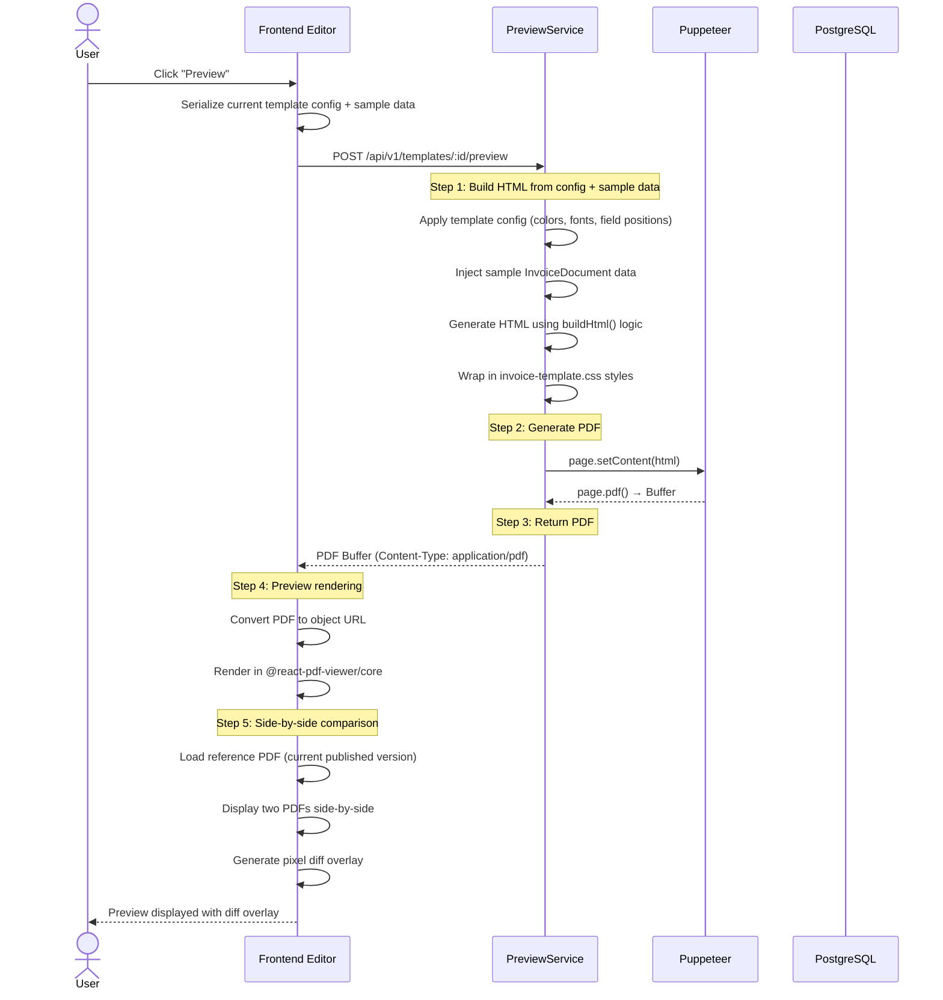
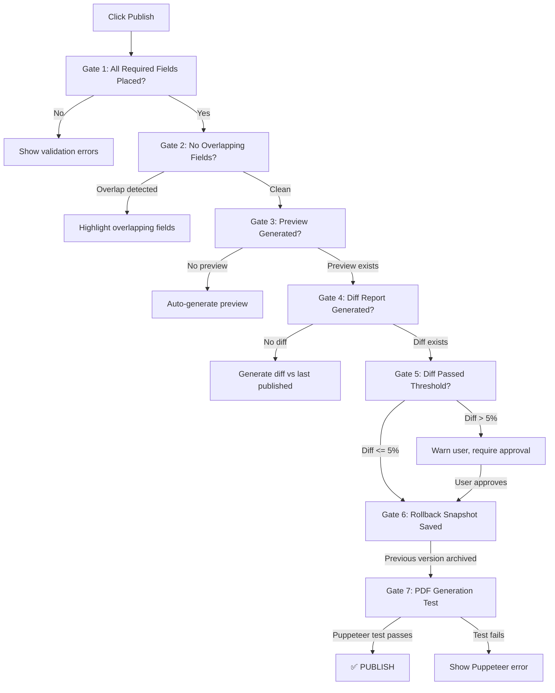
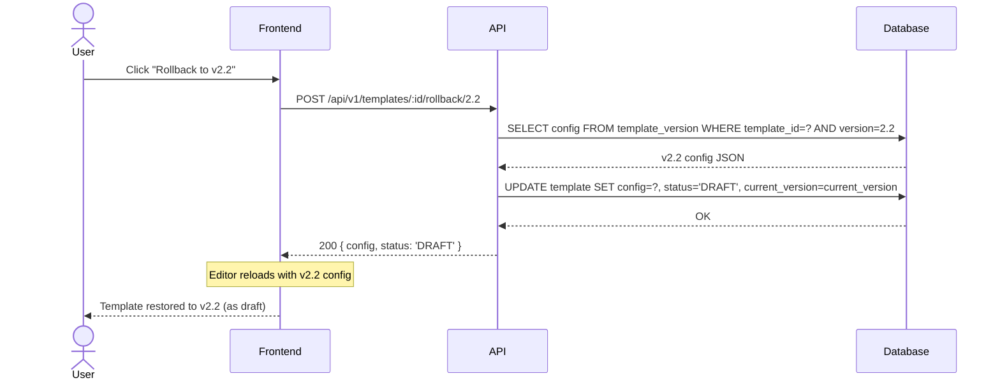
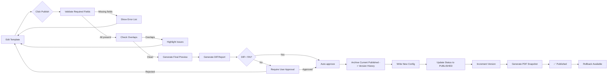
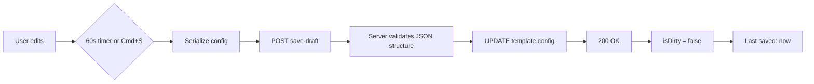

# Template Preview & Deployment Workflow

**Status**: INVESTIGATION / PLANNING ONLY — no code changes.
**Date**: 2026-06-20

---

## 1. Preview Workflow



### 1.1 API Contract: Preview Generation

```
POST /api/v1/templates/:id/preview

Request Body:
{
  "config": { ... },           // Current template config from editor
  "sampleData": { ... }        // InvoiceDocument sample data (optional, uses default if omitted)
}

Response:
200 OK
Content-Type: application/pdf
Body: [binary PDF buffer]

Errors:
400 - Invalid config (missing required fields, overlapping positions)
422 - PDF generation failed (Puppeteer error)
500 - Internal server error
```

### 1.2 Default Sample Data

When no `sampleData` is provided, the backend uses a default `InvoiceDocument` matching the template's `utilityType`. Defaults per template type are seeded from `template-config.ts` and the sample values defined in the field catalog (report 2, section 12).

---

## 2. Side-by-Side Comparison

### 2.1 Comparison Modes

| Mode | Description | Trigger |
|------|-------------|---------|
| **Current vs New** | Compare draft against last PUBLISHED version | Click "Compare with Published" |
| **Version vs Version** | Compare any two historical versions | Select two versions in history dialog |
| **SBill Reference vs Meter Verse** | Compare against uploaded SBill PDF | Click "Import SBill Reference" + upload PDF |

### 2.2 Comparison UI

```
┌─────────────────────────────────────────────────────────────────────┐
│  [← Back]  Preview: Electricity Invoice v2.3 → v2.4 (Draft)        │
├────────────────────────────────┬────────────────────────────────────┤
│  Reference (Published v2.3)    │  New (Draft)                      │
│                                │                                    │
│  ┌────────────────────────┐   │  ┌────────────────────────┐        │
│  │                        │   │  │                        │        │
│  │  [PDF rendered via     │   │  │  [PDF rendered via     │        │
│  │   @react-pdf-viewer]   │   │  │   @react-pdf-viewer]   │        │
│  │                        │   │  │                        │        │
│  └────────────────────────┘   │  └────────────────────────┘        │
│                                │                                    │
│  Version: 2.3                  │  Version: 2.4 (Draft)              │
│  Published: 2026-06-15         │  Last Saved: 2026-06-20            │
├────────────────────────────────┴────────────────────────────────────┤
│  [Toggle Diff Overlay]  [Download Diff Report]  [Approve & Publish] │
│                                │                                    │
│  ┌──────────────────────────────────────────────────────────────┐  │
│  │  Diff Overlay (red/green highlights)                         │  │
│  │  ┌─────────────────────────────────────────────────────┐    │  │
│  │  │  Pixel-difference regions highlighted:              │    │  │
│  │  │  ██ Red = added/modified in new version             │    │  │
│  │  │  ██ Green = removed from new version                │    │  │
│  │  │  ██ Yellow = color difference                       │    │  │
│  │  └─────────────────────────────────────────────────────┘    │  │
│  └──────────────────────────────────────────────────────────────┘  │
└─────────────────────────────────────────────────────────────────────┘
```

### 2.3 Diff Engine (Client-side)

```typescript
interface DiffReport {
  totalPixels: number;
  diffPixels: number;
  diffPercentage: number;
  regions: DiffRegion[];
  passed: boolean;           // true if diffPercentage < threshold (default 5%)
}

interface DiffRegion {
  x: number;
  y: number;
  width: number;
  height: number;
  type: 'added' | 'removed' | 'color-changed';
  fieldId?: string;          // Maps to PlacedField.id if identifiable
}
```

The diff engine uses HTML Canvas pixel comparison:
1. Render both PDFs to off-screen canvases at same resolution
2. Compare pixel-by-pixel
3. Group contiguous differing pixels into regions
4. Map regions to fields by position overlap
5. Return diff report with pass/fail

---

## 3. Deployment Rules & Validation Gates

No template may be published until **ALL** gates pass:



### 3.1 Gate 1 — Required Fields Validation

```typescript
const MANDATORY_FIELDS: Record<string, string[]> = {
  electricity:  ['{{INVOICE_TITLE}}', '{{INVOICE_NUMBER}}', '{{ISSUE_DATE}}',
                 '{{COMPANY_NAME}}', '{{CUSTOMER_NAME}}', '{{CUSTOMER_CODE}}',
                 '{{METER_SERIAL}}', '{{UNIT_LABEL}}', '{{START_READING}}',
                 '{{END_READING}}', '{{CONSUMPTION}}', '{{CONS_AMOUNT}}',
                 '{{BALANCE_BEFORE}}', '{{CURRENT_CHARGES}}', '{{SUBTOTAL}}',
                 '{{TOTAL_AMOUNT}}'],
  water:        /* same as electricity, minus startReading/endReading if sub-meter */,
  water_new:    /* same plus VAT percentage fields */,
  solar:        /* similar to electricity */,
  chilled_water:/* similar */,
  gas:          /* similar */,
  outdoor_unit: /* TBD */,
  settlement:   /* no meter fields required, charge fields different */,
};
```

### 3.2 Gate 2 — No Overlapping Fields

`react-grid-layout` prevents overlaps by design. Additional server-side check:

```typescript
function validateNoOverlaps(fields: PlacedField[]): Overlap[] {
  const overlaps: Overlap[] = [];
  for (let i = 0; i < fields.length; i++) {
    for (let j = i + 1; j < fields.length; j++) {
      const a = fields[i], b = fields[j];
      const overlapX = a.x < b.x + b.width && a.x + a.width > b.x;
      const overlapY = a.y < b.y + b.height && a.y + a.height > b.y;
      if (overlapX && overlapY) {
        overlaps.push({ fieldA: a.id, fieldB: b.id });
      }
    }
  }
  return overlaps;
}
```

### 3.3 Gate 5 — Diff Threshold

| Diff % | Action |
|--------|--------|
| 0-2% | Auto-approve (likely alignment noise) |
| 2-5% | Warning shown, optional confirmation |
| 5-20% | Requires explicit user approval |
| 20%+ | Block with recommendation to review |

### 3.4 Gate 6 — Rollback Snapshot

On publish, before updating the published version:
1. Read current published config from `core.template`
2. Insert it into `core.template_version` with `version = current_version`
3. Increment `current_version` on the template row
4. The new published config becomes the current one

---

## 4. Version History

### 4.1 Version Table Schema

```sql
CREATE TABLE core.template_version (
  id            UUID PRIMARY KEY DEFAULT gen_random_uuid(),
  template_id   UUID NOT NULL REFERENCES core.template(id) ON DELETE CASCADE,
  version       INT NOT NULL,
  config        JSONB NOT NULL,
  change_log    TEXT,                    -- User-provided description
  diff_summary  VARCHAR(500),           -- Auto-generated: "Changed font on field X, moved field Y"
  preview_pdf   BYTEA,                  -- Stored PDF snapshot (max 50 per template)
  published_at  TIMESTAMPTZ DEFAULT NOW(),
  published_by  UUID REFERENCES core.user(id),
  
  UNIQUE(template_id, version)
);

CREATE INDEX idx_tv_template ON core.template_version(template_id, version DESC);
```

### 4.2 Version History UI

```
┌──────────────────────────────────────────────────────────────────────┐
│  Version History — Electricity Invoice                               │
├───────┬──────────┬──────────────────────┬──────────────────┬─────────┤
│ Vers. │ Status   │ Published            │ Change Log       │ Actions │
├───────┼──────────┼──────────────────────┼──────────────────┼─────────┤
│ v2.4  │ DRAFT    │ —                    │ (current edit)   │ [Edit]  │
│ v2.3  │ PUBLISHED│ 2026-06-15 by admin  │ Adjusted charge  │ [View][│
│       │          │                      │ column widths    │ Rollb.]│
│ v2.2  │ PUBLISHED│ 2026-06-10 by admin  │ Changed font     │ [View] │
│       │          │                      │ colors, added    │        │
│       │          │                      │ company license  │        │
│ v2.1  │ PUBLISHED│ 2026-06-05 by admin  │ Initial v2       │ [View] │
│       │          │                      │ design           │        │
│ v1.0  │ PUBLISHED│ 2026-05-01 by system │ Imported from    │ [View] │
│       │          │                      │ SBill JRXML      │        │
├───────┴──────────┴──────────────────────┴──────────────────┴─────────┤
│  Showing 5 of 5 versions (max 50, oldest auto-cleaned)              │
└──────────────────────────────────────────────────────────────────────┘
```

### 4.3 Rollback Flow



### 4.4 Auto-Cleanup

```sql
-- Triggered before insert on template_version
-- Keeps max 50 versions per template, deletes oldest
DELETE FROM core.template_version
WHERE template_id = NEW.template_id
  AND id NOT IN (
    SELECT id FROM core.template_version
    WHERE template_id = NEW.template_id
    ORDER BY version DESC
    LIMIT 49  -- keep newest 49 + the new one = 50
  );
```

---

## 5. Publish Flow (End-to-End)



### 5.1 Publish API

```
POST /api/v1/templates/:id/publish

Request Body:
{
  "changeLog": "Updated colors per client request, added company logo field",
  "approveDiff": true           // Explicit approval if diff > 5%
}

Response 200:
{
  "id": "uuid",
  "version": 3,
  "status": "PUBLISHED",
  "publishedAt": "2026-06-20T10:30:00Z",
  "publishedBy": "admin-uuid",
  "diffSummary": "Changed font color on field 'Invoice Title', moved 'Company Logo' x:10→15",
  "rollbackVersion": 2
}

Errors:
400 - Validation failed (see details array)
409 - Diff > 5% and approveDiff not set or false
422 - PDF generation failed during snapshot
```

---

## 6. Save Draft Flow



```
POST /api/v1/templates/:id/save-draft
Body: { "config": { ... } }
Response: 200 { "saved": true, "updatedAt": "..." }
```

---

## 7. Preview Performance

| Step | Expected Duration | Optimization |
|------|------------------|-------------|
| Build HTML from config | < 50ms | Client-side simulation for instant canvas |
| Puppeteer launch | 1-3s (cold) / 200ms (warm) | Keep browser instance alive (existing pattern in `invoice-template.service.ts:35-50`) |
| PDF generation | 500ms-2s | Page pool of 3 reusable tabs |
| PDF transmission | 100-500ms | Gzip compression, streaming |
| Client-side render | 200-500ms | Lazy-load PDF viewer component |
| Diff computation | 1-5s (depends on PDF size) | Web Worker offload, canvas resolution scaling |
| **Total (warm)** | **~2-4s** | |

---

## 8. Error Handling

| Scenario | Error Code | User Experience |
|----------|-----------|----------------|
| Puppeteer unavailable | `ERR_TEMPLATE_PUPPETEER` | Warn + fallback to pdfkit (existing pattern) |
| Invalid field positions | `ERR_TEMPLATE_OVERLAP` | Highlight overlapping fields on canvas |
| Missing required field | `ERR_TEMPLATE_MISSING_FIELD` | Show list of required fields not placed |
| Diff > threshold | `ERR_TEMPLATE_LARGE_DIFF` | Show diff report, require explicit approval |
| DB write failure | `ERR_TEMPLATE_SAVE` | Retry with exponential backoff, notify user |
| Version limit reached | `ERR_TEMPLATE_VERSION_LIMIT` | Auto-cleanup oldest version, inform user |

---

## 9. Comparison with SBill Workflow

| Aspect | SBill (Current) | Meter Verse (Proposed) |
|--------|----------------|------------------------|
| Template editing | JRXML manual XML editing | Visual WYSIWYG editor |
| Preview | Manual JasperSoft build + export | One-click Puppeteer PDF preview |
| Versioning | File-based backups (`.bak`) | DB-backed version history with rollback |
| Diff | Manual visual comparison | Automated pixel diff overlay |
| Publishing | Copy files to server | API-driven publish with validation gates |
| Fields | Fixed JRXML variables | Dynamic field picker with drag-and-drop |
| Colors | Hardcoded in JRXML | Visual color picker with react-color |
| Deployment | Manual file upload | Automated via API |
