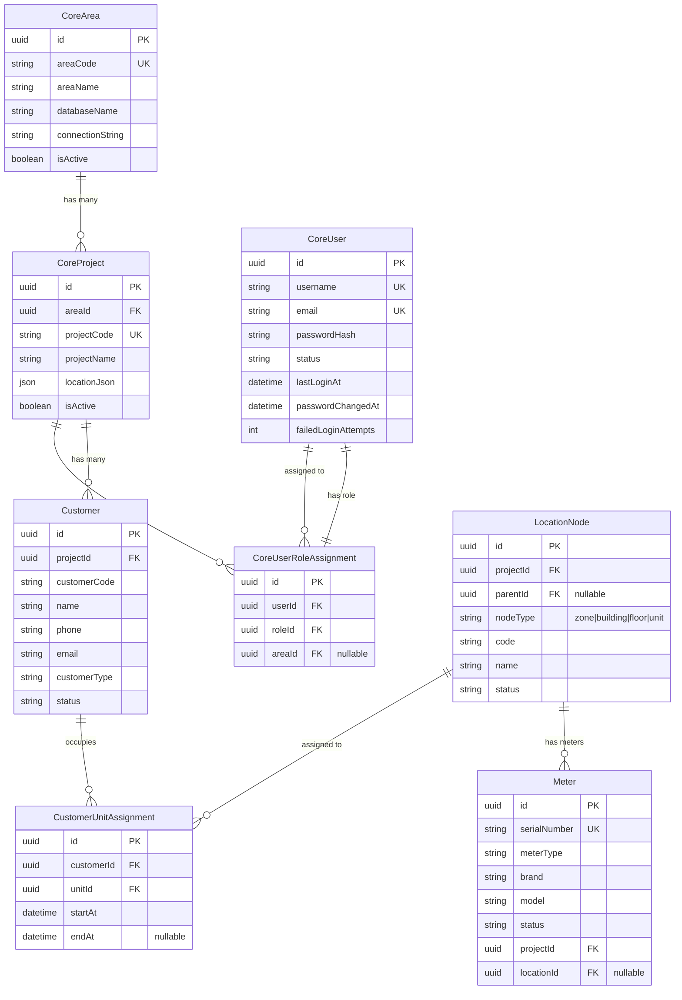

# User → Area → Project → Unit → Meter ERD — LAACRP Phase D

## Business Hierarchy

```
Area (المنطقة)
  │
  ├── Project 1 (مشروع)
  │     ├── Customer A
  │     │     ├── Unit A1
  │     │     │     ├── Meter (Electricity)
  │     │     │     └── Meter (Water)
  │     │     └── Unit A2
  │     ├── Customer B
  │     │     └── Unit B1
  │     │           └── Meter (Electricity)
  │     └── ...
  │
  ├── Project 2
  │     └── ...
  └── ...
```

## Rules

| Rule | Description |
|---|---|
| Area → Project | One Area has **many** Projects. Each Project belongs to **exactly one** Area. |
| Project → User | A Project has **many** Users (operators, technicians, etc.). A User may belong to **many** Projects (cross-project assignment). |
| Project → Customer | A Project has **many** Customers. A Customer belongs to **exactly one** Project (currently). |
| Customer → Unit | A Customer may occupy **one or more** Units. A Unit is occupied by **at most one** Customer at a time. |
| Unit → Meter | A Unit may have **zero or more** Meters (electricity, water, gas, etc.). A Meter is installed in **exactly one** Unit. |

## Mermaid ERD



## Current Schema Mapping (Existing DB Tables)

### `core` Schema (v2.0.0 — exists but sparsely populated)

| Table | Maps To | Status |
|---|---|---|
| `core.areas` | Area | ✅ Created — has `areaCode`, `areaName`, `databaseName`, `connectionString` |
| `core.projects` | Project | ✅ Created — FK to `areas`, has `projectCode`, `projectName` |
| `core.users` | User | ✅ Created — has `username`, `email`, `passwordHash`, MFA fields |
| `core.roles` | Role | ✅ Created — `roleCode`, `roleName`, `isSystem` |
| `core.permissions` | Permission | ✅ Created — `permissionCode`, `displayName`, `module` |
| `core.role_permissions` | Role-Permission M2M | ✅ Created |
| `core.user_role_assignments` | User-Role-Area assignment | ✅ Created — includes `areaId` for scope |
| `core.location_zones` | Geography hierarchy | ✅ Created — country → governorate → city → district → area |

### `sim_system` Schema (current operational data)

| Table | Maps To | Status |
|---|---|---|
| `sim_system.projects` | Project | ✅ Active — has `code`, `name`, `status`, billing config, logo, signature |
| `sim_system.location_nodes` | Unit/Location | ✅ Active — tree structure with zone/building/floor/unit |
| `sim_system.customers` | Customer | ✅ Active — FK to `projects` |
| `sim_system.customer_unit_assignments` | Customer-Unit M2M | ✅ Active — tracks assignment timeline |
| `sim_system.meters` | Meter | ✅ Active — FK to `project`, optional FK to `location` |
| `sim_system.meter_assignments` | Meter-Customer-Unit | ✅ Active — tracks assignment history |
| `sim_system.tariff_plans` | Tariff | ✅ Active |
| `sim_system.readings` | Reading | ✅ Active |
| `sim_system.invoices` | Invoice | ✅ Active |
| `sim_system.payments` | Payment | ✅ Active |
| `sim_system.customer_ledger_entries` | Ledger | ✅ Active |

## Gaps: Current Schema vs Required Structure

| Gap | Impact | Required Change |
|---|---|---|
| **No User-Project direct relationship** | Cannot query "which users work on project X" without traversing through role assignments | Add `CoreUserProjectAssignment` table or add `projectId` to `CoreUserRoleAssignment` |
| **`core.users` lacks `force_password_change`** | Cannot enforce first-login password change | Add boolean column to `CoreUser` |
| **`core.projects` lacks FK to `sim_system.projects`** | Dual tables for projects — need sync mechanism or migration strategy | Add `legacy_project_id` to `CoreProject` for data mapping |
| **`Customer` is in `sim_system` only** | No core-level customer registry for cross-area reporting | Consider `core.customers` as a read-only view union across all areas |
| **No explicit Unit model** | `LocationNode` with `nodeType = 'unit'` serves as unit — works but lacks dedicated unit metadata table | Either add `unit_type`, `unit_area`, `floor_plan` to `LocationNode` or create a dedicated `Unit` model |
| **Area-to-DB mapping is manual** | `CoreArea.connectionString` and `databaseName` exist but no replication mechanism | Build area schema provisioning script (template → 15 copies) |
| **No `user_session` table** | Cannot track active sessions across areas | Add `core.user_sessions` for concurrent session management |
| **`CoreArea` has no `adm_project_id` mapping** | Cannot map legacy SBill projects to new areas | Add `legacy_mapping` JSON field to `CoreProject` |

## Recommended Data Flow

```
User logs in
  → CoreUser verified
  → CoreUserRoleAssignment queried → finds Area(s) + Role(s)
  → CoreArea selected (user picks area)
  → CoreProject filtered by areaId
  → User operates on area_n schema for Customer/Meter/Reading/Invoice data
```
