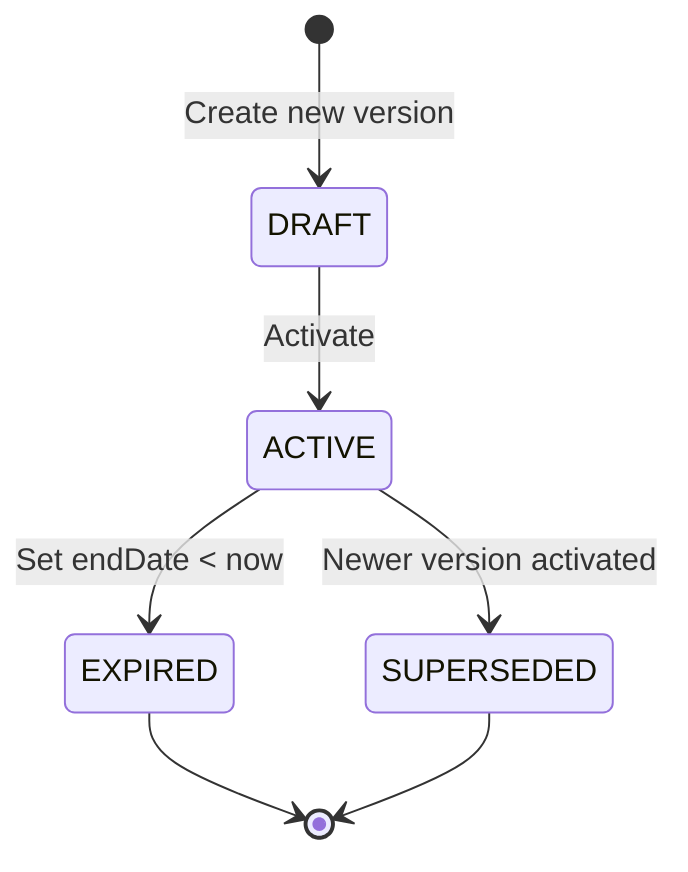

# Tariff Versioning Engine

## Problem Statement

Utility tariffs change over time — governments adjust rates, new fee structures are introduced, and old ones expire. SBill must handle multiple concurrent tariff versions while ensuring that:

1. Historical invoices remain accurate with the rates that were in effect at billing time
2. New invoices use the latest tariff version
3. Auditors can trace which tariff version was used for any invoice

---

## Solution Architecture

Tariff versioning is implemented using **effective date ranges** (`startDate` / `endDate`) on the `tariff` table. Multiple versions of the same conceptual tariff (e.g., Residential Electricity) coexist in the database, differentiated only by their date range.

### Versioning Fields

| Field | Type | Description |
|-------|------|-------------|
| `id` | PK | Logical tariff identifier (same across versions) |
| `name` | string | Tariff display name (e.g., "منزلي" for Residential) |
| `status` | enum | `ACTIVE` or `INACTIVE` |
| `startDate` | date | When this version becomes effective |
| `endDate` | date (nullable) | When this version expires (NULL = currently effective) |
| `mode` | enum | `STEP` (progressive tiers) or other |

### Version Selection Query

When a billing cycle runs for a given month, the system executes:

```sql
SELECT t.*, c.*, d.*
FROM tariff t
LEFT JOIN tariff_charges c ON c.tariff_id = t.id
LEFT JOIN tariff_charges_details d ON d.charge_id = c.id
WHERE t.status = 'ACTIVE'
  AND t.id = <meter_tariff_id>
  AND t.startDate <= <billingMonth_endDate>
  AND (t.endDate IS NULL OR t.endDate >= <billingMonth_startDate>)
```

The `billingMonth` range ensures the tariff version covers the entire billing period. If a tariff changed mid-month, the old version covers the period up to the change, and the new version covers from the change onward.

---

## Version Lifecycle



1. **DRAFT**: New tariff version being configured; charges and tiers being set up
2. **ACTIVE**: Version is currently selectable for billing (status = ACTIVE, endDate IS NULL or in future)
3. **EXPIRED**: Version has an endDate in the past; no longer selectable
4. **SUPERSEDED**: A newer version with a later startDate exists; old version still valid for historical periods

---

## Immutability of Generated Invoices

**Critical rule**: Once an invoice is generated, its amounts are **never recalculated**. The invoice stores the final computed amounts as they were at generation time.

```
invoice
  ├── total_amt       → Frozen at generation time
  ├── open_amt        → Updated as payments arrive
  ├── balance_before  → Customer balance before this invoice
  └── balance_after   → Customer balance after this invoice
```

This means:
- If tariff rates change in November, an October invoice still reflects October's rates
- The tariff version active in October is the one used for that billing run
- No retroactive repricing occurs

---

## Rebilling — The Exception

When a rebill occurs (e.g., consumption was corrected), the system does **not** modify old invoices. Instead:

1. **Old invoices are CANCELLED** (status changed, amounts preserved)
2. **New invoices are generated** using the **current active tariff version**
3. The billcycle record shows `success_count = -N` indicating a rebill
4. `cancelled_count = N` matching the absolute success count

### Why Cancelled Count = Success Count Indicates Full Rebill

```
Before rebill:
  Cycle X: success=100, cancelled=0 → 100 invoices active

Rebill cycle:
  Old invoices cancelled: 100
  New invoices generated: 100
  Cycle Y: success=-100, cancelled=100

Result:
  abs(-100) = 100 = cancelled_count
  ∴ Full rebill confirmed
```

This invariant holds because:
- Every cancelled invoice must be replaced by a new one
- The billable meters for a given period do not change between cycles
- The `billcycle_logs` table records both counts side by side

---

## Evidence from Live System

### Tariff Version Transition

| Tariff ID | Name | startDate | endDate | Status | Notes |
|-----------|------|-----------|---------|--------|-------|
| 1 | Residential Elec (v1) | 2000-01-01 | 2023-09-30 | INACTIVE | Original rates |
| 1 | Residential Elec (v2) | 2023-10-01 | NULL | ACTIVE | Current rates |

**October 2023 billing**: Version v2 is selected because:
- `startDate (2023-10-01) <= Oct 2023 end`
- `endDate IS NULL` (or >= Oct 2023 start)

**January 2000 billing** (Cycle 1): Version v1 was active at that time.

### Invoice Freezing Example

Invoice **33620**: 2018-11-UUUUUU1
- Amount: 2,214.13 EGP
- This amount was computed using the tariff version active in November 2018
- Even if rates changed in 2023, this invoice's total remains 2,214.13 EGP

---

## Backward Compatibility

### Historical Invoices on Old Tariffs

Invoices generated under expired tariff versions remain valid:
- They carry the `tariff_id` FK, which resolves to the version active at billing time
- The `startDate`/`endDate` on that version confirms it covered the billing period
- `invoice_details` records store the individual charge breakdown as it was calculated

### Auditing

To verify an invoice's correctness:

```sql
-- Step 1: Find the tariff version used
SELECT t.*
FROM invoice i
JOIN tariff t ON t.id = i.tariff_id
WHERE i.id = <invoice_id>
  AND i.created_at BETWEEN t.startDate AND COALESCE(t.endDate, '9999-12-31');

-- Step 2: Verify charges match
SELECT id, charge_type, charge_group, amount
FROM invoice_details
WHERE invoice_id = <invoice_id>;
```

---

## Key Architectural Rules

1. **One active tariff version per time range**: No two versions of the same tariff can have overlapping effective date ranges
2. **Invoices are immutable**: Once generated, amounts never change
3. **Cancellation is not deletion**: Old invoices remain with CANCELLED status for audit
4. **Rebilling uses current version**: New invoices always use the tariff version active at rebill time
5. **Date ranges are inclusive**: `startDate <= billingMonth <= endDate` (or endDate IS NULL)
